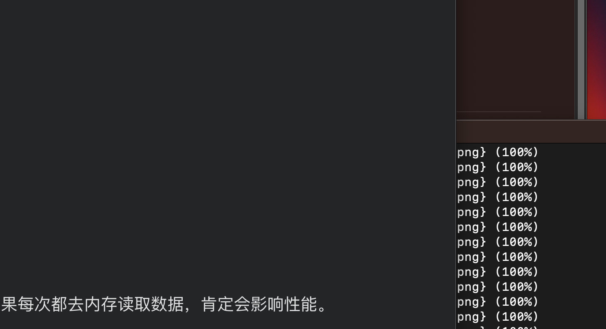
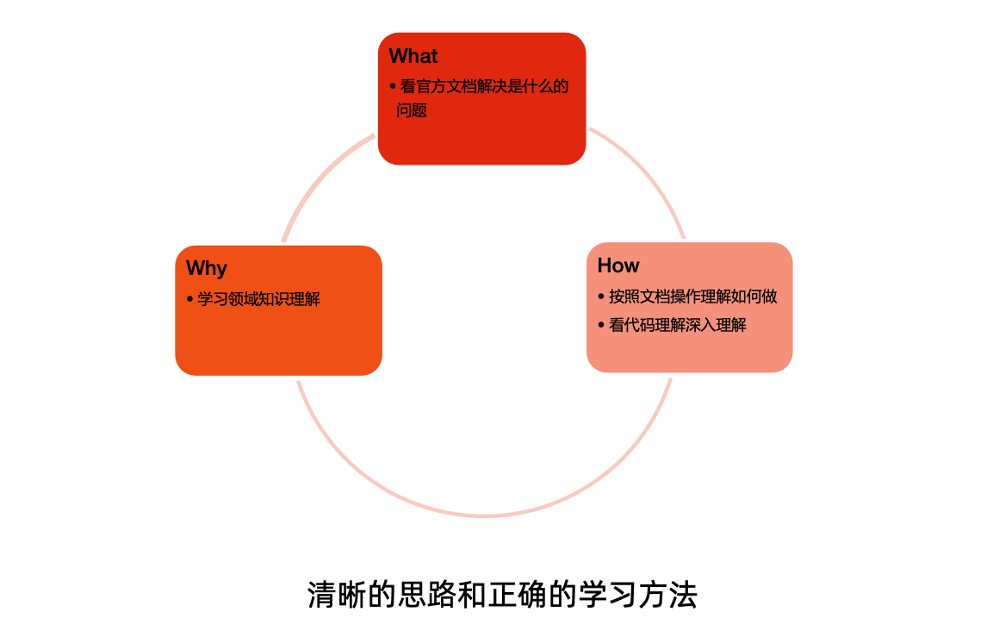

### 什么是云？

用户需要跑应用，用户不需要关心底层硬件的细节。只需要告诉平台起多少实例，需要多少资源。



### 什么是云原生？

- 在包括公有云、私有云、混合云等动态环境中构建和运行规模化应用的能力。
- 云原生是一种思想，是技术、企业管理方法的集合。
  - 技术层面
    - 应用程序从设计之初就为在云上运行而做好准备。
    - 云平台基于自动化体系。

  - 流程层面
    - 基于 DevOps, CI/CD。


- 基于多种手段
  - 应用容器化封装，例如：Docker;
  - 服务网格，例如：Istio;
  - 不可变基础架构，例如：容器的封装;
  - 声明式 API，最重要的部分，以前需要不停的看结果，命令不可追溯，某时刻的状态。例如：K8s，都抽象成了API。

- 云原生的意义
  - 提升系统的适应性、可管理性、可观察性;
  - 使工程师能以最小成本进行频繁和可预测的系统变更。
  - 提升速度和效率，助力业务成长，缩短 I2M(Idea to Market)。

### 云原生核心项目概览


###  训练营开篇词

学习中可能遇到的挑战:

- 大量的概念可能会对认知有比较大的冲击，跟不上课程节奏。
- 有些知识点总感觉没学透。
- 云原生技术栈复杂多变，今天学的东西可能明天不适用了，需要不断学习。


自动化运行的平台，背后隐藏的复杂度越大。

### 学习建议

- 云原生中基础架构的部分是计算机领域最复杂的领域之一， 学习云原生是突破自我的机会!
- 云原生涉及到的知识面很广，不懂的概念不用急于求成，反 复训练可强化理解。
- 实践出真知，多听，多学，多练。

### 端正态度

- 认真对待工作中的每一个问题:
  - 切忌不求甚解，知其然不知所以然; 
  - 打破砂锅问(挖)到底。
- 问问题的技巧和方法。
- 师傅领进门，修行靠个人。
- 我只是个先行者，分享我的所知所想。

### 持续学习是一个不同重复的 Loop



### 学习方法

- 多动手
  - 试试看，怎么用。

- 看理论

  - 读博客，理解背后的技术总结。

  - 看代码，理解真实实现，总结出自己的理解。

- 理思路
  - 不断的总结，把别人的东西变成自己的东西。 
  - 分享是让你快速提升的手段。

- 有取舍

- **自我驱动**

  - 兴趣很重要。

  - 使命感。

### kube-proxy 是干啥用的?

#### 第一步:官方文档

看官方文档，没有太多收获:

```
https://kubernetes.io/docs/concepts/overview/components/

kube-proxy uses the operating system packet filtering layer if there is one and it's available. Otherwise, kube-proxy forwards the traffic itself.
```

#### 第二步:看看前人是怎么解读的?

- 搜中文文档，知乎，CSDN，简书都有比较高质量的文章，可以多看一些文档，并理解不同人的理解差异。

- 随便找了一篇zhihu专栏。 
  - https://zhuanlan.zhihu.com/p/337806843

- PS
  - 中文世界Kubernetes非常活跃，不少文档质量超过英文。 但中文搬运转载问题比较严重，需要自己甄别。

#### 第三步:找关键知识点

- 先对大概的框架有认识
- 负载均衡

- kube-proxy 监听 API server 中 资源对象的变化情况，包括以下三种: 
  - service
  - endpoint/endpointslices 
  - node

- 目前 Kube-proxy 支持4中代理模式: 

  - userspace

  - iptables

  - ipvs 

  - kernelspace(windows)

#### 第四步:由点到面稍稍展开一下

由浅入深的理解，成为专家

- 入门:可以使用，知道怎么用，大概做了什么。
- 初级:粗略理解配置方法。
- 高级:理解不同模式的差异，理解为什么要有多种模式，理解配置细节。 
- 专家级:理解完整的内核协议栈处理数据包的流程，能够举一反三。


### 如何学习云原生技术

- 代码驱动
  - 掌握 Go 语言编程能力

- 从点到面

  - 学习容器技术

    - cgroup、namespace

    - 网络协议栈

    - 文件系统

- 抓住核心掌控全局

  - 深入理解 Kubernetes

    - API 定义

    - 控制器模式

    - 核心组件

- 大规模生产化
  - 多集群
  - 服务网格和多网格

### 云原生训练营设计思路

- 多重视角

  - 管理员角度:

    - 如何构建和运维支持生产化作业的多租户集群。

    - 如何应对规模化所带来的挑战。

  - 研发人员角度:

    - 如何将不同类型应用的接入到容器化平台。

    - 理解如何保证应用的服务可用性。

  - 不同角色如何做好协同，避免出现生产故障。

-  循序渐进的内容深度
  - Go 语言基础。
  - 从容器技术展开，到 Kubernetes 平台以及衍生项目 Istio 等。
  - 理解 Kubernetes 作为开放式平台，如何与企业服务进行整合。 
  - 如何进行多集群管理，构建两地三中心的部署模式。

- 理论与实践结合

  - 编写应用;

  - 容器化;

  - 部署至 Kubernetes 集群; 

  - 生产化运维和服务管控。

### 环境配置

- 本机如果能创建4核CPU 12g内存，30g磁盘的虚拟机就可以， 如果用云主机建议类似配置，如果选择更小的服务器比如4c8g，建议至少两台， 如果更小的2c4g服务器，至少三台，更小的服务器不适合。
- 本地环境可以直接导入老师准备好的镜像，避免云服务器上的各种复杂配置操作。
- 云服务器涉及到多人共用的情况(预计每 5 个人共用一台服务器)，可能会涉及使用时间分配的问题，相比之下用自己的电脑更加方便灵活。
- 训练营的学习服务期结束后，我们将不再为云服务器付费，如想继续使用，需自费 采购服务器，或者将环境转移到本地进行练习。
- 在本地或在云服务器上完成课程的实战项目，所要遵循的步骤是一样的，两者在使 用上没有区别。
