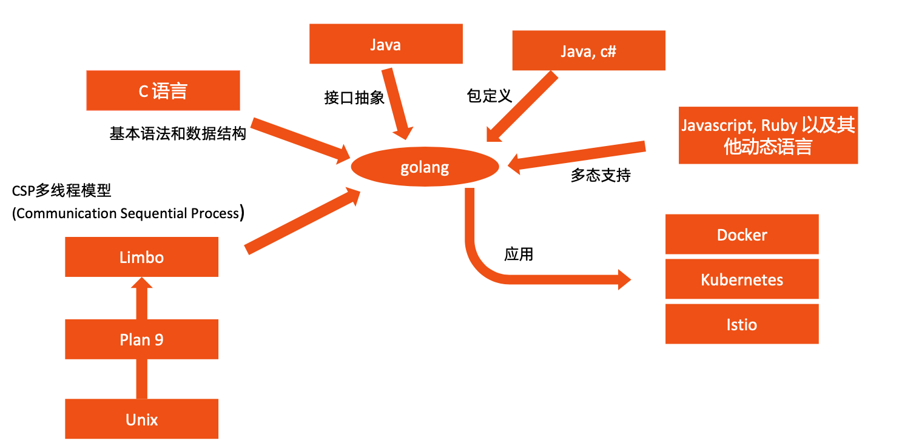

### Go 语言特性

#### 统一思想-12 factors   源自:Martin Fowler <企业应用架构模式>

I. 基准代码    一份基准代码，多份部署

II. 依赖    显式声明依赖关系

III. 配置    在环境中存储配置

IV. 后端服务    把后端服务当作附加资源

V. 构建，发布，运行    严格分离构建和运行

VI. 进程    以一个或多个无状态进程运行应用

VII. 端口绑定    通过端口绑定提供服务

VIII. 并发    通过进程模型进行扩展

IX. 易处理    快速启动和优雅终止可最大化健壮性

X. 开发环境与线上环境等价    尽可能的保持开发，预发布，线上环境相同

XI. 日志    把日志当作事件流

XII. 管理进程    后台管理任务当作一次性进程运行

生产就绪工作：监控，运维，客户支持，Bug修复，功能增强。

### 目录

1. 为什么需要另外一种语言? 
2. Go 语言环境设置
3. 控制结构
4. 常用数据结构
5. 函数调用
6. 常用语法
7. 多线程

- 深入理解 channel
- 基于 channel 编写一个生产者消费者程序

### 为什么需要 Go 语言

#### Go 语言的原则

```
Less is exponentially more
																			– Rob Pike, Go Designer
Do Less, Enable More
																			– Russ Cox, Go Tech Lead
```

- 其他编程语言的弊端。

  - 硬件发展速度远远超过软件。

  - C 语言等原生语言缺乏好的依赖管理 (依赖头文件)。

  - Java 和 C++ 等语言过于笨重。

  - 系统语言对垃圾回收和并行计算等基础功能缺乏支持。

  - 对多核计算机缺乏支持。

- Go 语言是一个可以编译高效，支持高并发的，面向垃圾回收的全新语言。

  - 秒级完成大型程序的单节点编译。

  - 依赖管理清晰。

  - 不支持继承，程序员无需花费精力定义不同类型之间的关系。 

  - 支持垃圾回收，支持并发执行，支持多线程通讯。

  - 对多核计算机支持友好。

#### Go 语言不支持的特性

- 不支持函数重载和操作符重载
- 为了避免在C/C++开发中的一些Bug和混乱，不支持隐式转换 
- 支持接口抽象，不支持继承
- 不支持动态加载代码
- 不支持动态链接库
- 通过recover和panic来替代异常机制
- 不支持断言
- 不支持静态变量

如果你没做过其他语言的开发，那么恭喜，以上大部分复杂的问题，在 Go 语言里不存在，你也无需关心。

#### Go 语言特性衍生来源



### Go 语言环境搭建

#### 下载 Go

- Go 安装文件以及源代码 https://golang.google.cn/dl/
- 下载对应平台的二进制文件并安装
- 环境变量
  - GOROOT
    - go的安装目录
  - GOPATH 设置IDE的目录就好
    - src:存放源代码
    - pkg:存放依赖包
    - bin:存放可执行文件
  - 其他常用变量
    - GOOS，GOARCH，GOPROXY
    - 国内用户建议设置 goproxy:export GOPROXY=https://goproxy.cn

#### IDE 设置(VS Code)

- 下载并安装VisualStudioCode https://code.visualstudio.com/download
- 安装Go语言插件 https://marketplace.visualstudio.com/items?itemName=golang.go
- 其他可选项
  - Intellj goland，收费软件
  - vim，sublime等

#### 一些基本命令

```
bug      start a bug report
build    compile packages and dependencies
clean    remove object files and cached files
doc      show documentation for package or symbol
env      print Go environment information
fix      update packages to use new APIs
fmt      gofmt (reformat) package sources
generate generate Go files by processing source
get      add dependencies to current module and install them
install  compile and install packages and dependencies
list     list packages or modules
mod      module maintenance
run      compile and run Go program
test     test packages
tool     run specified go tool
version  print Go version
vet      report likely mistakes in packages
```

#### Go build

自动测试流水线很重要，单元测试，E2E测试端对端测试。

- Go 语言不支持动态链接，因此编译时会将所有依赖编译进同一个二进制文件。
- 指定输出目录。
  - go build –o bin/mybinary .
- 常用环境变量设置编译操作系统和 CPU 架构。
  - GOOS=linux GOARCH=amd64 go build
- 全支持列表
  - $GOROOT/src/go/build/syslist.go

#### Go test

go test ./... -v 运行测试

go test 命令扫描所有*_test.go为结尾的文件，惯例是将测试代码与正式代码放在同目录， 如 foo.go 的测试代码一般写在 foo_test.go

#### Go vet

代码静态检查，发现可能的 bug 或者可疑的构造

- Print-format 错误，检查类型不匹配的print
- Boolean 错误，检查一直为 true、false 或者冗余的表达式
- Range 循环，比如如下代码主协程会先退出，go routine无法被执行
- Unreachable的代码，如 return 之后的代码
- 其他错误，比如变量自赋值，error 检查滞后等

#### 代码版本控制

- 下载并安装 Git Command Line
  - https://git-scm.com/downloads
- Github
  - 本课程示例代码均上传在 https://github.com/cncamp/golang

- 创建代码目录
  - mkdir –p $GOPATH/src/github.com/cncamp
  - cd $GOPATH/src/github.com/cncamp
- 代码下载
  - git clone https://github.com/cncamp/golang.git

- 修改代码
- 上传代码
  - git add filename
  - git commit –m 'change logs'
  - git push

#### Golang playground

官方 [playground](https://play.golang.org/)

可直接编写和运行`Go`语言程序

国内可直接访问的 [playground]( https://goplay.tools/)

### 控制结构

#### If

#### switch

#### for

Go 只有一种循环结构：for 循环。

- 计入计数器的循环
  - for i := 0; i < 10; i++ 
- 初始化语句和后置语句是可选的，此场景与 while 等价(Go 语言不支持 while)
  - for ; sum < 1000;
- 无限循环

#### for-range

遍历数组，切片，字符串，Map 等

**需要注意:**如果 for range 遍历指针数组，则 value 取出的指针地址为原指针地址的拷贝。

### 常用数据结构 

#### 变量与常量

- 常量  const identifier type
- 变量  var identifier type

#### 变量定义

- 变量

  - var 语句用于声明一个变量列表，跟函数的参数列表一样，类型在最后。

  - var c, python, java bool

- 变量的初始化

  - 变量声明可以包含初始值，每个变量对应一个。

  - 如果初始化值已存在，则可以省略类型;变量会从初始值中获得类型。

  - vari,jint=1,2

- 短变量声明

- - 在函数中，简洁赋值语句 := 可在类型明确的地方代替 var 声明。
  - 函数外的每个语句都必须以关键字开始(var, func 等等)，因此 := 结构不能在函数外使用。
  - c, python, java := true, false, "no!"

#### 类型转换与推导

- 类型转换
  - 表达式 T(v) 将值 v 转换为类型 T。
    - 一些关于数值的转换: 
      - variint=42
      - var f float64 = float64(i)
      - var u uint = uint(f) l 
    - 或者，更加简单的形式:
      - i:=42
      - f := float64(i) 
      -  u := uint(f)

- 类型推导
  - 在声明一个变量而不指定其类型时(即使用不带类型的 := 语法或 var = 表达式语法)，变量的类型由右值推导得出。
    - var i int
    - j:=i//j也是一个int

#### 数组

- 相同类型且长度固定连续内存片段
- 以编号访问每个元素
- 定义方法
  - var identifier [len]type
- 示例
  - myArray:=[3]int{1,2,3}

#### 切片(slice)

- 切片是对数组一个连续片段的引用
- 数组定义中不指定长度即为切片
  - var  identifier  []type
- 切片在未初始化之前默认为nil，长度为0
- 常用方法

#### Make 和 New

- New返回指针地址
- Make返回第一个元素，可预设内存空间，避免未来的内存拷贝

#### 关于切片的常见问题

- 切片是连续内存并且可以动态扩展，由此引发的问题?

- 修改切片的值?
- Go任何时候都是值传递

#### Map

- 声明方法
  - var map1 map[keytype]valuetype

- 示例

  ```go
  myMap := make(map[string]string, 10) 
  myMap["a"] = "b"
  myFuncMap := map[string]func()int{ 
  	"funcA": func() int { return 1 },
  }
  
  fmt.Println(myFuncMap)
  f := myFuncMap["funcA"] 
  fmt.Println(f())
  
  // 按 Key 取值
  value, exists := myMap["a"] if exists {
  	println(value)
  }
  // 遍历 Map
  for k, v := range myMap { 
    println(k, v)
  }
  ```

#### 结构体和指针

- 通过 type ... struct 关键字自定义结构体
- Go 语言支持指针，但不支持指针运算 
  - 指针变量的值为内存地址
  - 未赋值的指针为 nil

#### 结构体标签

- 结构体中的字段除了有名字和类型外，还可以有一个可选的标签(tag)
- 使用场景:Kubernetes APIServer 对所有资源的定义都用 Json tag 和 protoBuff tag

#### 类型别名

```go
type ServiceType string
```

### 函数调用

#### Main 函数

- 每个 Go 语言程序都应该有个 main package
- Main package 里的 main 函数是 Go 语言程序入口

#### 参数解析

- 请注意main函数与其他语言不同，没有类似java的[]stringargs参数

- Go语言如何传入参数呢?

  - 方法1:
    - fmt.Println("osargsis:",os.Args)

  - 方法2:

    - name:=flag.String("name","world","specifythenameyouwanttosayhi") 

    - flag.Parse()	

#### Init 函数

- Init函数:会在包初始化时运行
- 谨慎使用init函数
  - 当多个依赖项目引用统一项目，且被引用项目的初始化在 init 中完成，并且不可重复运行时，会导致启动错误

#### 返回值

- 多值返回

  - 函数可以返回任意数量的返回值 

- 命名返回值

  - Go 的返回值可被命名，它们会被视作定义在函数顶部的变量。

  - 返回值的名称应当具有一定的意义，它可以作为文档使用。

  - 没有参数的 return 语句返回已命名的返回值。也就是直接返回。

- 调用者忽略部分返回值
  -  result, _ = strconv.Atoi(origStr)

#### 传递变长参数

Go 语言中的可变长参数允许调用方传递任意多个相同类型的参数

- 函数定义

```go
 func append(slice []Type, elems ...Type) []Type
```

- 调用方法

```go
myArray := []string{}
myArray = append(myArray, "a","b","c")
```

#### 内置函数

|       函数名        |               作用               |
| :-----------------: | :------------------------------: |
|        close        |             管道关闭             |
|      len, cap       | 返回数组、切片，Map 的长度或容量 |
|      new, make      |             内存分配             |
|    copy, append     |             操作切片             |
|   panic, recover    |             错误处理             |
|   print, println    |               打印               |
| complex, real, imag |             操作复数             |

#### 回调函数(Callback)

- 函数作为参数传入其它函数，并在其他函数内部调用执行

  - strings.IndexFunc(line, unicode.IsSpace)

  - Kubernetes controller的leaderelection

#### 闭包

- 匿名函数
  - 不能独立存在
  - 可以赋值给其他变量 
    - x:=func(){}
  - 可以直接调用
    - func(x,yint){println(x+y)}(1,2)
  - 可作为函数返回值
    - funcAdd()(func(bint)int)

#### 方法

- 方法:作用在接收者上的函数
  - func (recv receiver_type) methodName(parameter_list) (return_value_list) 
- 使用场景
  - 很多场景下，函数需要的上下文可以保存在receiver属性中，通过定义 receiver 的方法，该方法可以直接 访问 receiver 属性，减少参数传递需求

#### 传值还是传指针

- Go语言只有一种规则-传值
- 函数内修改参数的值不会影响函数外原始变量的值
- 可以传递指针参数将变量地址传递给调用函数，Go语言会 复制该指针作为函数内的地址，但指向同一地址
- 思考：当我们写代码的时候，函数的参数传递应该用struct 还是pointer?

#### 接口

- 接口定义一组方法集合 type IF interface { Method1(param_list) return_type }
- 适用场景:Kubernetes中有大量的接口抽象和多种实现
- Struct无需显示声明实现interface，只需直接实现方法
- Struct除实现interface定义的接口外，还可以有额外的方法 
- 一个类型可实现多个接口(Go语言的多重继承)
- Go语言中接口不接受属性定义
- 接口可以嵌套其他接口

注意事项：

- Interface是可能为nil的，所以针对interface的使用一定要预 先判空，否则会引起程序 crash(nil panic)
- Struct初始化意味着空间分配，对struct的引用不会出现空指针

#### 反射机制

- reflect.TypeOf ()返回被检查对象的类型
- reflect.ValueOf()返回被检查对象的值

```go
myMap := make(map[string]string, 10) 
myMap["a"] = "b"
t := reflect.TypeOf(myMap) 
fmt.Println("type:", t)
v := reflect.ValueOf(myMap) 
fmt.Println("value:", v)
```

#### 基于 struct 的反射

```go
myStruct := T{A: "a"}
v1 := reflect.ValueOf(myStruct)
for i := 0; i < v1.NumField(); i++ { 
  fmt.Printf("Field %d: %v\n", i, v1.Field(i))
}
for i := 0; i < v1.NumMethod(); i++ { 
  fmt.Printf("Method %d: %v\n", i, v1.Method(i)) 
}
// 需要注意 receive 是 struct 还是指针
result := v1.Method(0).Call(nil) 
fmt.Println("result:", result)
```

#### Go 语言中的面向对象编程

- 可见性控制

  - public - 常量、变量、类型、接口、结构、函数等的名称大写

  - private - 非大写就只能在包内使用

- 继承
  - 通过组合实现，内嵌一个或多个 struct
- 多态
  - 通过接口实现，通过接口定义方法集，编写多套实现

#### Json 编解码

- Unmarshal:从string转换至struct
- Marshal:从struct转换至string

#### Json 编解码

- json 包使用 map[string]interface{} 和 []interface{} 类型保存任意对象 
- 可通过如下逻辑解析任意 json

```go
var obj interface{}
err := json.Unmarshal([]byte(humanStr), &obj) 
objMap, ok := obj(map[string]interface{})
for k, v := range objMap {
switch value := v.(type) { 
  case string:
		fmt.Printf("type of %s is string, value is %v\n", k, value) 
  case interface{}:
		fmt.Printf("type of %s is interface{}, value is %v\n", k, value) 				default:
		fmt.Printf("type of %s is wrong, value is %v\n", k, value) }
}
```

### 常用语法

#### 错误处理

- Go 语言无内置 exceptio 机制，只提供 error 接口供定义错误  
  - type error interface { Error() string }
- 可通过 errors.New 或 fmt.Errorf 创建新的 error
  -  var errNotFound error = errors.New("NotFound")
- 通常应用程序对 error 的处理大部分是判断 error 是否为 nil
- 如需将 error 归类，通常交给应用程序自定义，比如 kubernetes 自定义了与 apiserver 交互的不同类型错误

#### defer

- 函数返回之前执行某个语句或函数

  - 等同于 Java 和 C# 的 finally

- 常见的defer使用场景:记得关闭你打开的资源

  - defer file.Close()

  - defer mu.Unlock()

  - defer println("")

#### Panic 和 recover

- panic:可在系统出现不可恢复错误时主动调用panic,panic会使当前线程直接crash
- defer:保证执行并把控制权交还给接收到panic的函数调用者
- recover:函数从panic或错误场景中恢复

```go
defer func() {
    fmt.Println("defer func is called")
    if err := recover(); err != nil {
    fmt.Println(err)
  }
}()
panic("a panic is triggered")
```

### 多线程

#### 并发和并行

- 并发(concurrency)
  - 两个或多个事件在同一时间间隔发生
- 并行(parallellism)
  - 两个或者多个事件在同一时刻发生

#### 协程

- 进程:

  - 分配系统资源(CPU 时间、内存等)基本单位 
  - 有独立的内存空间，切换开销大

- 线程:进程的一个执行流，是CPU调度并能独立运行的的基本单位

  - 同一进程中的多线程共享内存空间，线程切换代价小

  - 多线程通信方便

  - 从内核层面来看线程其实也是一种特殊的进程，它跟父进程共享了打开的文件和文件系统信息，共享了地址空间和信号处理函数

- 协程
  - Go 语言中的轻量级线程实现
  - Golang 在 runtime、系统调用等多方面对 goroutine 调度进行了封装和处理，当遇到长时间执行 或者进行系统调用时，会主动把当前 goroutine 的 CPU (P) 转让出去，让其他 goroutine 能被调度 并执行，也就是 Golang 从语言层面支持了协程

#### Communicating Sequential Process

- CSP

  - 描述两个独立的并发实体通过共享的通讯 channel 进行通信的并发模型。

- Go协程goroutine

  - 是一种轻量线程，它不是操作系统的线程，而是将一个操作系统线程分段使用，通过调度器实现协 作式调度。

  - 是一种绿色线程，微线程，它与 Coroutine 协程也有区别，能够在发现堵塞后启动新的微线程。

- 通道channel

  - 类似 Unix 的 Pipe，用于协程之间通讯和同步。

  - 协程之间虽然解耦，但是它们和 Channel 有着耦合。

#### 线程和协程的差异

- 每个goroutine(协程)默认占用内存远比Java、C的线程少
  - goroutine:2KB
  - 线程:8MB
- 线程/goroutine切换开销方面，goroutine远比线程小
  - 线程:涉及模式切换(从用户态切换到内核态)、16个寄存器、PC、SP...等寄存器的刷新 
  - goroutine:只有三个寄存器的值修改 - PC / SP / DX.
- GOMAXPROCS
  - 控制并行线程数量

#### 协程示例

- 启动新协程:gofunctionName()

#### channel - 多线程通信

- Channel 是多个协程之间通讯的管道
  - 一端发送数据，一端接收数据
  - 同一时间只有一个协程可以访问数据，无共享内存模式可能出现的内存竞争 
  - 协调协程的执行顺序
- 声明方式
  - var identifier chan datatype
  - 操作符<-

#### 通道缓冲

- 基于Channel的通信是同步的
- 当缓冲区满时，数据的发送是阻塞的
- 通过make关键字创建通道时可定义缓冲区容量，默认缓冲区容量为0

#### 遍历通道缓冲区

```go
ch := make(chan int, 10) 
go func() {
	for i := 0; i < 10; i++ { 
		rand.Seed(time.Now().UnixNano())
		n := rand.Intn(10) // n will be between 0 and 10 
		fmt.Println("putting: ", n)
		ch <- n
	}
	close(ch) 
}()
fmt.Println("hello from main") 
for v := range ch {
	fmt.Println("receiving: ", v) 
}
```

#### 单向通道

- 只发送通道
  - var sendOnly chan<- int
- 只接收通道
  - var readOnly <-chan int
- Istio webhook controller
  - func (w *WebhookCertPatcher) runWebhookController(stopChan <-chan struct{}) {}
- 如何用: 双向通道转换

```go
var c = make(chan int) 
go prod(c)
go consume(c)
func prod(ch chan<- int){
	for { ch <- 1 } 
}
func consume(ch <-chan int) { 
  for { <-ch }
}
```

#### 关闭通道

- 通道无需每次关闭
- 关闭的作用是告诉接收者该通道再无新数据发送
- 只有发送方需要关闭通道

```go
ch := make(chan int)
defer close(ch)
if v, notClosed := <-ch; notClosed {
	fmt.Println(v) 
}
```

#### select

- 当多个协程同时运行时，可通过 select 轮询多个通道
  - 如果所有通道都阻塞则等待，如定义了 default 则执行 default 
  - 如多个通道就绪则随机选择

#### 定时器 Timer

- time.Ticker以指定的时间间隔重复的向通道C发送时间值
- 使用场景
  - 为协程设定超时时间

```go
timer := time.NewTimer(time.Second) select {
// check normal channel
case <-ch:
fmt.Println("received from ch")
case <-timer.C:
fmt.Println("timeout waiting from channel ch")
}
```

#### 上下文 Context

- 超时、取消操作或者一些异常情况，往往需要进行抢占操作或者中断后续操作
- Context 是设置截止日期、同步信号，传递请求相关值的结构体

```
type Context interface {
 Deadline() (deadline time.Time, ok bool) Done() <-chan struct{}
 Err() error
 Value(key interface{}) interface{}
}
```

- 用法

  - context.Background

  - context.TODO

  - context.WithDeadline 

  - context.WithValue

  - context.WithCancel

#### 如何停止一个子协程

```go 
done := make(chan bool) go func() {
for { select {
case <-done:
fmt.Println("done channel is triggerred, exit child go routine") return
} }
}() close(done)
```

#### 基于 Context 停止子协程

- Context是Go语言对goroutine和timer的封装

```go
ctx, cancel := context.WithTimeout(context.Background(), time.Second) defer cancel()
go process(ctx, 100*time.Millisecond)
<-ctx.Done()
mt.Println("main:", ctx.Err())
```