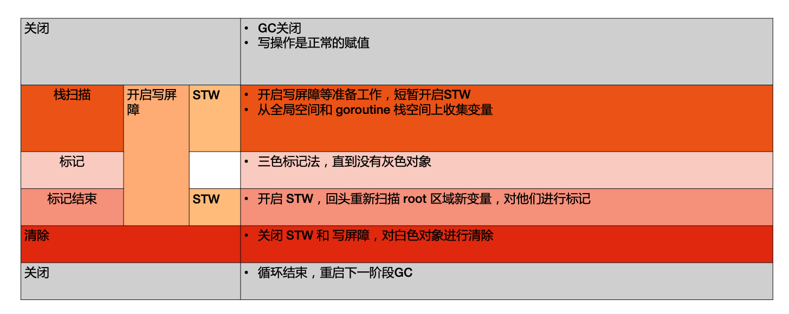
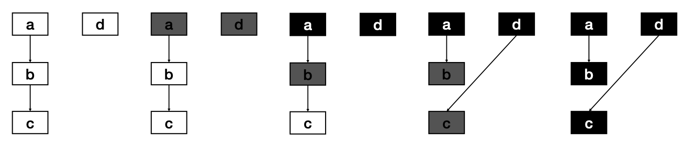
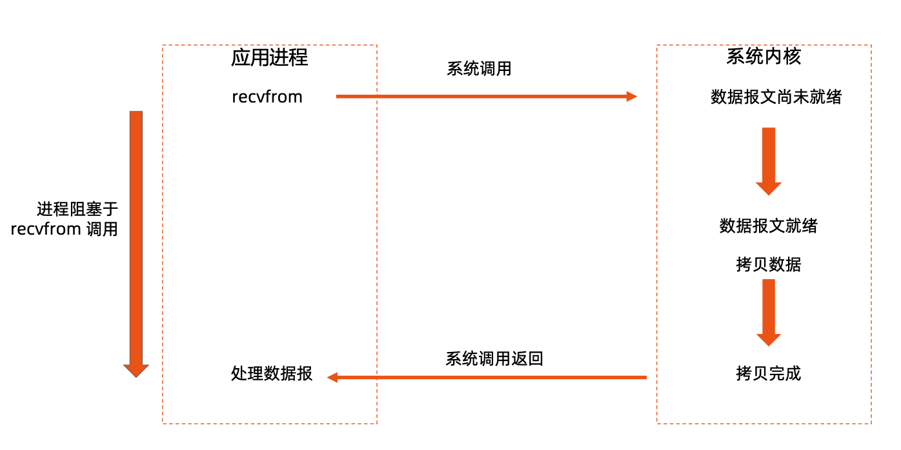
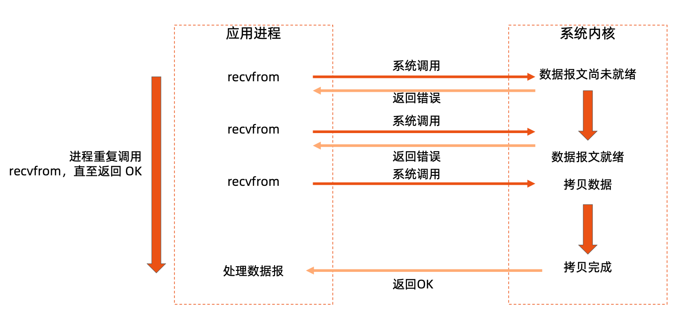
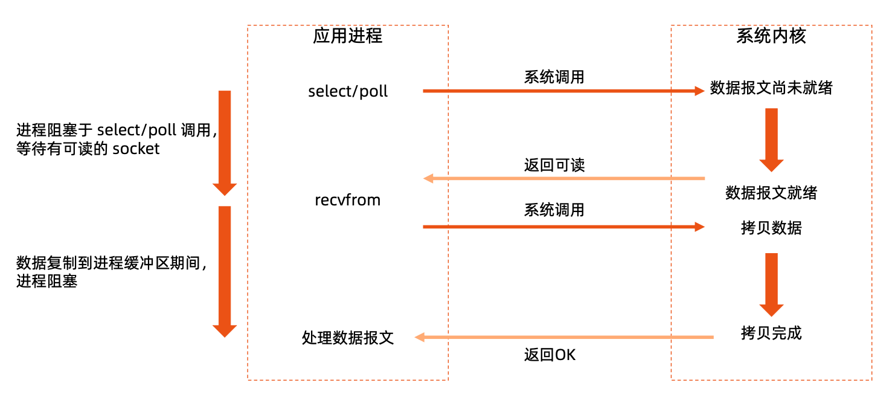
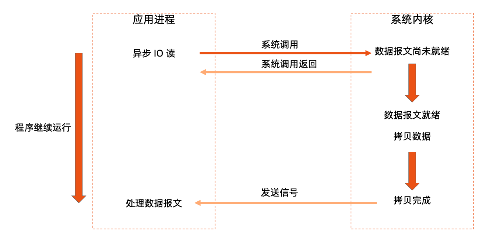
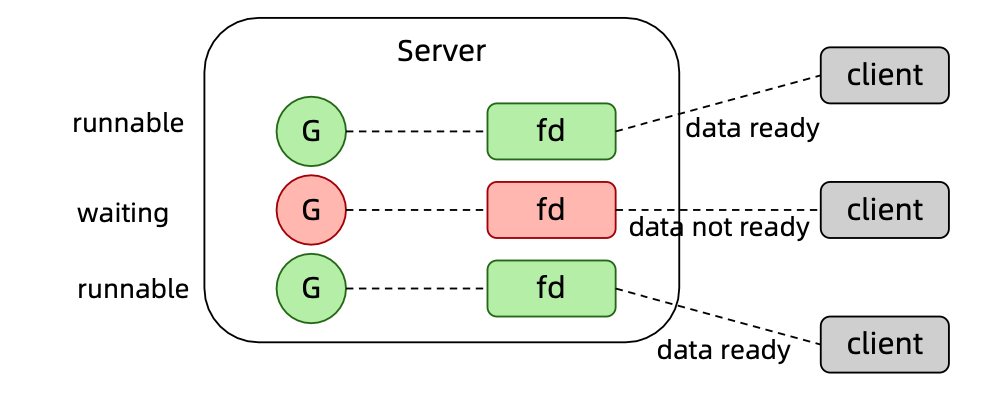

### 目录

- 线程加锁
- 线程调度
- 内存管理
- 包引用与依赖管理

### 线程加锁

#### 理解线程安全

CPU的执行速度肯定时快于内存，如果每次都去内存读取数据，肯定会影响性能。

#### 锁

- Go 语言不仅仅提供基于 CSP 的通讯模型，也支持基于共享内存的多线程数据访问
- Sync 包提供了锁的基本原语
- sync.Mutex 互斥锁
  - Lock()加锁，Unlock 解锁

- sync.RWMutex 读写分离锁
  - 不限制并发读，只限制并发写和并发读写
- sync.WaitGroup
  - 等待一组 goroutine 返回

- sync.Once
  - 保证某段代码只执行一次
- sync.Cond
  - 让一组 goroutine 在满足特定条件时被唤醒

#### Mutex 示例

Kubernetes 中的 informer factory

```go
// Start initializes all requested informers.
func (f *sharedInformerFactory) Start(stopCh <-chan struct{}) {
   f.lock.Lock()
   defer f.lock.Unlock()
   for informerType, informer := range f.informers {
       if !f.startedInformers[informerType] {
          go informer.Run(stopCh)
          f.startedInformers[informerType] = true
		} 
	}
}
```

#### WaitGroup 示例

```go
// CreateBatch create a batch of pods. All pods are created before
waiting.
func (c *PodClient) CreateBatch(pods []*v1.Pod) []*v1.Pod {
   ps := make([]*v1.Pod, len(pods))
   var wg sync.WaitGroup
   for i, pod := range pods {
       wg.Add(1)
       go func(i int, pod *v1.Pod) {
          defer wg.Done()
          defer GinkgoRecover()
          ps[i] = c.CreateSync(pod)
		}(i, pod) 
   }
	wg.Wait()
	return ps 
}
```

#### Cond 示例

Kubernetes 中的队列，标准的生产者消费者模式 

cond: sync.NewCond(&sync.Mutex{}),

```go
// Add marks item as needing processing.
func (q *Type) Add(item interface{}) { 
  q.cond.L.Lock()
	defer q.cond.L.Unlock() 
  if q.shuttingDown {
		return
	}
	if q.dirty.has(item) {
		return
	}
	q.metrics.add(item) 
  q.dirty.insert(item)
	if q.processing.has(item) {
		return
	}
	q.queue = append(q.queue, item) 
  q.cond.Signal()  // 告诉其他协成，我已经有数据了，可以过来取了。线程调度
}
```

#### Cond 示例

```go
// Get blocks until it can return an item to be processed. If shutdown=true,
// the caller should end their goroutine. You must call Done with item 
// when you have finished processing it.
func (q *Type) Get() (item interface{}, shutdown bool) { 
  q.cond.L.Lock()
	defer q.cond.L.Unlock()
	for len(q.queue) == 0 && !q.shuttingDown { 
    q.cond.Wait()
  } 
	if len(q.queue) == 0 {
		// We must be shutting down. 
    return nil, true
	}
	item, q.queue = q.queue[0], q.queue[1:] 
  q.metrics.get(item) 
  q.processing.insert(item) 
  q.dirty.delete(item)
	return item, false
}
```

### 线程调度

#### 深入理解 Go 语言线程调度

- 进程:资源分配的基本单位
- 线程:调度的基本单位
- 无论是线程还是进程，在linux中都以task_struct描述，从内核角度看，与进程无本质区别 
- Glibc中的pthread库提供NPTL(NativePOSIXThreadingLibrary)支持


#### Linux 进程的内存使用


页面：物理内存和虚拟内存的对应关系。


#### CPU 对内存的访问

- CPU上有个Memory Management Unit(MMU)单元
- CPU把虚拟地址给MMU，MMU去物理内存中查询页表，得到实际的物理地址
- CPU维护一份缓存Translation Lookaside Buffer(TLB)，缓存虚拟地址和物理地址的映射关系


#### 进程切换开销

- 直接开销
  - 切换页表全局目录(PGD)
  - 切换内核态堆栈
  - 切换硬件上下文(进程恢复前，必须装入寄存器的数据统称为硬件上下文) 
  - 刷新TLB
  - 系统调度器的代码执行
- 间接开销
  - CPU 缓存失效导致的进程需要到内存直接访问的 IO 操作变多

#### 线程切换开销

- 线程本质上只是一批共享资源的进程，线程切换本质上依然需要内核进行进程切换
- 一组线程因为共享内存资源，因此一个进程的所有线程共享虚拟地址空间，线程切换相比进程 切换，主要节省了虚拟地址空间的切换

#### 用户线程

无需内核帮助，应用程序在用户空间创建的可执行单元，创建销毁完全在用户态完成。


#### Goroutine

Go 语言基于 GMP 模型实现用户态线程

- G:表示goroutine，每个goroutine都有自己的栈空间，定时器， 初始化的栈空间在 2k 左右，空间会随着需求增长。
- M:抽象化代表内核线程，记录内核线程栈信息，当goroutine调度 到线程时，使用该 goroutine 自己的栈信息。
- P:代表调度器，负责调度goroutine，维护一个本地goroutine队 列，M 从 P 上获得 goroutine 并执行，同时还负责部分内存的管理。


#### GMP 模型细节


#### G 所处的位置

- 进程都有一个全局的G队列

- 每个P拥有自己的本地执行队列

- 有不在运行队列中的G

  - 处于 channel 阻塞态的 G 被放在 sudog

  - 脱离 P 绑定在 M 上的 G，如系统调用

  - 为了复用，执行结束进入 P 的 gFree 列表中的 G

#### Goroutine 创建过程

- 获取或者创建新的Goroutine结构体

  - 从处理器的 gFree 列表中查找空闲的 Goroutine

  - 如果不存在空闲的 Goroutine，会通过 runtime.malg 创建一个栈大小足够的新结构体

- 将函数传入的参数移到Goroutine的栈上
- 更新Goroutine调度相关的属性，更新状态为_Grunnable
- 返回的Goroutine会存储到全局变量allgs中

#### 将 Goroutine 放到运行队列上

- Goroutine 设置到处理器的 runnext 作为下一个处理器 执行的任务
- 当处理器的本地运行队列已经没有剩余空间时，就会把 本地队列中的一部分 Goroutine 和待加入的 Goroutine 通过 runtime.runqputslow 添加到调度器持有的全局 运行队列上

#### 调度器行为

- 为了保证公平，当全局运行队列中有待执行的Goroutine时，通过schedtick保证有一定 几率会从全局的运行队列中查找对应的 Goroutine

- 从处理器本地的运行队列中查找待执行的Goroutine

- 如果前两种方法都没有找到Goroutine，会通过runtime.findrunnable进行阻塞地查找

  Goroutine

  - 从本地运行队列、全局运行队列中查找

  - 从网络轮询器中查找是否有 Goroutine 等待运行
  - 通过 runtime.runqsteal 尝试从其他随机的处理器中窃取待运行的 Goroutine

### 内存管理

#### 关于内存管理的争论

- c/c++
  - 内存管理太重要了!所以如果交给机器管理我不能放心!

- Java/golang
  - 内存管理太重要了!手动管理麻烦且容易出错，所以我们应该交给机器去管理! 

#### 堆内存管理


#### 堆内存管理

- 初始化连续内存块作为堆
- 有内存申请的时候，Allocator从堆内存的未分配区域分割小内存块
- 用链表将已分配内存连接起来
- 需要信息描述每个内存块的元数据:大小，是否使用，下一个内存块的地址等


#### TCMalloc 概览


#### TCMalloc

- page:内存页，一块8K大小的内存空间。Go与操作系统之间的内存申请和释放，都是以 page 为单位的

- span:内存块，一个或多个连续的page组成一个span

- sizeclass:空间规格，每个span都带有一个sizeclass，标记着该span中的page应该如何

  使用

- object:对象，用来存储一个变量数据内存空间，一个span在初始化时，会被切割成一堆等大 的 object ;假设 object 的大小是 16B ，span 大小是 8K ，那么就会把 span 中的 page 就会 被初始化 8K / 16B = 512 个 object 。所谓内存分配，就是分配一个 object 出去

- 对象大小定义
  - 小对象大小:0~256KB
  - 中对象大小:256KB~1MB
  - 大对象大小:>1MB
- 小对象的分配流程
  - ThreadCache -> CentralCache -> HeapPage，大部分时候，ThreadCache 缓存都是足够的，不需要去访问CentralCache 和 HeapPage，无系统调用配合无锁分配，分配效率是非常高的 
- 中对象分配流程
  - 直接在 PageHeap 中选择适当的大小即可，128 Page 的 Span 所保存的最大内存就是 1MB 
- 大对象分配流程
  - 从 large span set 选择合适数量的页面组成 span，用来存储数据

#### Go 语言内存分配


- mcache:小对象的内存分配直接走

  - size class 从 1 到 66，每个 class 两个 span

  - Span 大小是 8KB，按 span class 大小切分

- mcentral

  - Span 内的所有内存块都被占用时，没有剩余空间继续分配对象，mcache 会向 mcentral 申请1个span，mcache 拿到 span 后继续分配对象

  - 当 mcentral 向 mcache 提供 span 时，如果没有符合条件的 span，mcentral 会向 mheap 申请 span

- mheap

  - 当 mheap 没有足够的内存时，mheap 会向 OS 申请内存

  - Mheap 把 Span 组织成了树结构，而不是链表

  - 然后把 Span 分配到 heapArena 进行管理，它包含地址映射和 span 是否包含指针等位图
  - 为了更高效的分配、回收和再利用内存

#### 内存回收

- 引用计数(Python，PHP，Swift)

  - 对每一个对象维护一个引用计数，当引用该对象的对象被销毁的时候，引用计数减 1，当引用计数为 0 的时候，回 收该对象

  - 优点:对象可以很快的被回收，不会出现内存耗尽或达到某个阀值时才回收

  - 缺点:不能很好的处理循环引用，而且实时维护引用计数，有也一定的代价

- 标记-清除(Golang)
  - 从根变量开始遍历所有引用的对象，引用的对象标记为"被引用"，没有被标记的进行回收
  - 优点:解决引用计数的缺点
  - 缺点:需要 STW(stop the word)，即要暂停程序运行
- 分代收集(Java)
  - 按照生命周期进行划分不同的代空间，生命周期长的放入老年代，短的放入新生代，新生代的回收频率高于老年代的频率

#### mspan

- allocBits
  - 记录了每块内存分配的情况 
-  gcmarkBits
  - 记录了每块内存的引用情况，标记阶段对每块内存进行标记，有对象引用的内存标记为1，没有的标 记为 0


- 这两个位图的数据结构是完全一致的，标记结束则进行内存回收，回收的时候，将allocBits指 向 gcmarkBits，标记过的则存在，未进行标记的则进行回收


#### GC 工作流程

Golang GC 的大部分处理是和用户代码并行的

- Mark:

  - MarkPrepare:初始化GC任务，包括开启写屏障(writebarrier)和辅助GC(mutatorassist)，统计root对象的任 务数量等。这个过程需要STW

  - GCDrains:扫描所有root对象，包括全局指针和goroutine(G)栈上的指针(扫描对应G栈时需停止该G)，将其 加入标记队列(灰色队列)，并循环处理灰色队列的对象，直到灰色队列为空。该过程后台并行执行

- MarkTermination:完成标记工作，重新扫描(re-scan)全局指针和栈。因为Mark和用户程序是并行的，所以在Mark过 程中可能会有新的对象分配和指针赋值，这个时候就需要通过写屏障(write barrier)记录下来，re-scan 再检查一下，这 个过程也是会 STW 的
- Sweep:按照标记结果回收所有的白色对象，该过程后台并行执行
- SweepTermination:对未清扫的span进行清扫,只有上一轮的GC的清扫工作完成才可以开始新一轮的GC



#### 三色标记

- GC 开始时，认为所有 object 都是 白色，即垃圾。
- 从 root 区开始遍历，被触达的 object 置成 灰色。
- 遍历所有灰色 object，将他们内部的引用变量置成 灰色，自身置成 黑色
- 循环第 3 步，直到没有灰色 object 了，只剩下了黑白两种，白色的都是垃圾。
- 对于黑色 object，如果在标记期间发生了写操作，写屏障会在真正赋值前将新对象标记为灰色。
- 标记过程中，mallocgc 新分配的 object，会先被标记成黑色再返回。



#### 垃圾回收触发机制

- 内存分配量达到阀值触发GC
  - 每次内存分配时都会检查当前内存分配量是否已达到阀值，如果达到阀值则立即启动 GC。
    - 阀值=上次GC内存分配量*内存增长率
    - 内存增长率由环境变量 GOGC 控制，默认为 100，即每当内存扩大一倍时启动 GC。
- 定期触发GC
  - 默认情况下，最长 2 分钟触发一次 GC，这个间隔在 src/runtime/proc.go:forcegcperiod 变量中被声明 
- 手动触发
  - 程序代码中也可以使用 runtime.GC()来手动触发 GC。这主要用于 GC 性能测试和统计。

### 包引用与依赖管理

#### Go 语言依赖管理的演进

- 回顾 GOPATH

  - 通过环境变量设置系统级的 Go 语言类库目录

  - GOPATH 的问题?
    - 不同项目可能依赖不同版本
    - 代码被 clone 以后需要设置 GOPATH 才能编译

- vendor

  - 自 1.6 版本，支持 vendor 目录，在每个 Go 语言项目中，创建一个名叫 vendor 的目录，并将依赖拷贝至该目录。

  - Go 语言项目会自动将 vendor 目录作为自身的项目依赖路径

  - 好处?
    - 每个项目的 vendor目录是独立的，可以灵活的选择版本
    - Vendor 目录与源代码一起 check in 到 github，其他人 checkout 以后可直接编译
    - 无需在编译期间下载依赖包，所有依赖都已经与源代码保存在一起

#### vendor 管理工具

通过声明式配置，实现 vendor 管理的自动化

- 在早期，Go 语言无自带依赖管理工具，社区方案鱼龙混杂比较出名的包括
  - Godeps, Glide

- Go 语言随后发布了自带的依赖管理工具 Gopkg

- 很快用新的工具 gomod 替换掉了 gopkg

  - 切换 mod 开启模式:export GO111MODULE=on/off/auto

  - Go mod 相比之前的工具更灵活易用，以基本统一了 Go 语言依赖管理 

思考:用依赖管理工具的目的?

- 版本管理
- 防篡改

#### Go mod 使用

- 创建项目
- 初始化 Go 模块
  - go mod init

- 下载依赖包
  - go mod download(下载的依赖包在$GOPATH/pkg，如果没有设置 GOPATH，则下载在项目根目录/pkg)
  - 在源代码中使用某个依赖包，如 github.com/emicklei/go-restful
- 添加缺少的依赖并为依赖包瘦身
  - go mod tidy
- 把 Go 依赖模块添加到 vendor 目录
  - go mod vendor

配置细节会被保存在项目根目录的 go.mod 中 可在 require 或者 replacement 中指定版本

#### go.mod sample

#### GOPROXY 和 GOPRIVATE

- GOPROXY

  - 为拉取 Go 依赖设置代理
    - export GOPROXY=https://goproxy.cn

- 在设置GOPROXY以后，默认所有依赖拉取都需要经过proxy连接gitrepo，拉取代码，并做

  checksum 校验

- 某些私有代码仓库是goproxy.cn无法连接的，因此需要设置GOPRIVATE来声明私有代码仓库

  GOPRIVATE=*.corp.example.com 

  GOPROXY=proxy.example.com 

  GONOPROXY=myrepo.corp.example.com

### Makefile

#### Go 语言项目多采用 Makefile 组织项目编译

```makefile
root:
	export ROOT=github.com/cncamp/golang;

.PHONY: root

release:
	echo "building httpserver binary"
	mkdir -p bin/amd64
	CGO_ENABLED=0 GOOS=linux GOARCH=amd64 go build -o bin/amd64 .

.PHONY: release
```

### 动手编写一个 HTTP Server

#### 理解 net.http 包

- 注册handle处理函数

```
http.HandleFunc("/healthz", healthz)
//Use the default DefaultServeMux.
ListenAndService
err := http.ListenAndServe(":80", nil)
if err != nil {
log.Fatal(err)
}
```

- 定义handle处理函数

```
func healthz(w http.ResponseWriter, r
*http.Request) {
io.WriteString(w, "ok")
}
```

#### 阻塞 IO 模型



#### 非阻塞 IO 模型



#### IO 多路复用



#### 异步 IO



#### Linux epoll


#### Go 语言高性能 httpserver 的实现细节

- Go语言将协程与fd资源绑定

  - 一个 socket fd 与一个协程绑定

  - 当 socket fd 未就绪时，将对应协程设置为 Gwaiting 状态，将 CPU 时间片让给其他协程

  - Go 语言 runtime 调度器进行调度唤醒协程时，检查 fd 是否就绪，如果就绪则将协程置为Grunnable 并加入执行队列 

  - 协程被调度后处理 fd 数据



#### 代码实现细节

### 调试

#### debug

- gdb:

  - Gccgo 原生支持 gdb，因此可以用 gdb 调试 Go 语言代码，但 dlv 对 Go 语言 debug 的支持比 gdb 更好

  - Gdb 对 Go 语言的栈管理，多线程支持等方面做的不够好，调试代码时可能有错乱现象

- dlv:
  - Go 语言的专有 debugger

#### dlv 的配置

- 配置

  - 在 vscode 中配置 dlb

  - 菜单:View -> Command Palette

  - 选择 Go : Install/Update Tools，选择安装

  - 安装完后，从改入口列表中可以看到 dlv 和 dlv-dap 已经安装好

- Debug方法
  - 在代码中设置断点
  - 菜单中选择 Run -> Start Debugging 即可进入调试

#### 更多 debug 方法

- 添加日志
  - 在关键代码分支中加入日志
  - 基于fmt包将日志输出到标准输出 stdout 
    - fmt.Println()
  - fmt 无日志重定向，无日志分级
- 即与日志框架将日志输出到对应的 appender
  - 比如可利用 glog 进行日志输出
    - 可配置 appender，将标准输出转至文件 
    - 支持多级日志输出，可修改配置调整日志等级 
    - 自带时间戳和代码行，方便调试

#### Glog 使用方法示例

#### 性能分析(Performance Profiling)

- CPU Profiling: 在代码中添加 CPUProfile 代码，runtime/pprof 包提供支持

```
var cpuprofile = flag.String("cpuprofile", "", "write cpu profile to file")
func main() {
   flag.Parse()
   if *cpuprofile != "" {
       f, err := os.Create(*cpuprofile)
          if err != nil {
              log.Fatal(err)
          }
       pprof.StartCPUProfile(f)
   defer pprof.StopCPUProfile()
   }
}
```

#### 分析 CPU 瓶颈

#### 其他可用 profiling 工具分析的问题

#### 针对 http 服务的 pprof

#### 分析 go profiling 结果

#### 

#### 结果分析示例

• 分析goroutine运行情况

• curl localhost/debug/pprof/goroutine?debug=2

分析堆内存使用情况

• curl localhost/debug/pprof/heap?debug=2

### Kubernetes 中常用代码解读

#### Rate Limit Queue

```
func (r *ItemExponentialFailureRateLimiter) When(item interface{}) time.Duration { r.failuresLock.Lock()
    defer r.failuresLock.Unlock()
    exp := r.failures[item]
    r.failures[item] = r.failures[item] + 1
// The backoff is capped such that ‘calculated’ value never overflows.
backoff := float64(r.baseDelay.Nanoseconds()) * math.Pow(2, float64(exp)) if backoff > math.MaxInt64 {
         return r.maxDelay
    }
    calculated := time.Duration(backoff)
    if calculated > r.maxDelay {
         return r.maxDelay
    }
    return calculated
}
```

### Kubernetes 日常运维中的代码调试场景

#### 案例1:空指针

- 问题描述

 Kubenetes 调度器在调度有外挂存储需求的 pod 的时候，在获取节点信息失败时会异常退出

```
panic: runtime error: invalid memory address or nil pointer dereference
[signal SIGSEGV: segmentation violation code=0x1 addr=0x0 pc=0x105e2 83]
```

- • 根因分析

nil pointe 是 Go 语言中最常出现的一类错误，也最容易判断，通常在 call stack 中就会告诉你哪行代码有问题

在调度器 csi.go 中的如下代码，当 node 为 nil 的时候，对 node 的引用 node.Name 就会 引发空指针

```
node := nodeInfo.Node()
   if node == nil {
   return framework.NewStatus(framework.Error, fmt.Sprintf("node
not found: %s", node.Name))
}
```

- 解决办法

当指针为空时，不要继续引用。 https://github.com/kubernetes/kubernetes/pull/102229

#### 案例2:Map 的读写冲突

• 问题描述:

程序在遍历 Kubernetes 对象的 Annotation 时异常退出

• 根因分析

Kubernetes 对象中 Label 和 Annotation 是 map[string]string

经常有代码需要修改这两个 Map

同时可能有其他线程 for...range 遍历

• 解决方法:

- 用 sync.RWMutex 加锁
- 使用线程安全 Map，比如 sync.Map{}

#### 案例3:kube-proxy 消耗 10 个 CPU

• 问题描述

客户汇报问题，kube-proxy 消耗了主机 10 个 CPU

• 根因分析 •

登录问题机器，执行 top 命令查看 cpu 消耗，可以看到 kube-proxy 的 cpu 消耗和 pid 信息

对 kube-proxy 进程运行 System profiling tool，发现 10 个 CPU 中，超过 60% 的 CPU 都在做垃圾回收，这说明 GC 需要回收的对象太多了， 说明程序创建了大量可回收对象。

perf top –p <pid> Overhead Shared Obj Symbol

26.48% kube-proxy [.] runtime.gcDrain 13.86% kube-proxy [.] runtime.greyobject 10.71% kube-proxy [.] runtime.(*lfstack).pop 10.04% kube-proxy [.] runtime.scanobject

#### 案例4:线程池耗尽