### 目录

- 线程加锁
- 线程调度
- 内存管理
- 包引用与依赖管理

### 线程加锁

#### 理解线程安全

CPU的执行速度肯定时快于内存，如果每次都去内存读取数据，肯定会影响性能。

#### 锁

- Go 语言不仅仅提供基于 CSP 的通讯模型，也支持基于共享内存的多线程数据访问
- Sync 包提供了锁的基本原语
- sync.Mutex 互斥锁
  - Lock()加锁，Unlock 解锁

- sync.RWMutex 读写分离锁
  - 不限制并发读，只限制并发写和并发读写
- sync.WaitGroup
  - 等待一组 goroutine 返回

- sync.Once
  - 保证某段代码只执行一次
- sync.Cond
  - 让一组 goroutine 在满足特定条件时被唤醒

#### Mutex 示例

Kubernetes 中的 informer factory

```go
// Start initializes all requested informers.
func (f *sharedInformerFactory) Start(stopCh <-chan struct{}) {
   f.lock.Lock()
   defer f.lock.Unlock()
   for informerType, informer := range f.informers {
       if !f.startedInformers[informerType] {
          go informer.Run(stopCh)
          f.startedInformers[informerType] = true
		} 
	}
}
```

#### WaitGroup 示例

```go
// CreateBatch create a batch of pods. All pods are created before
waiting.
func (c *PodClient) CreateBatch(pods []*v1.Pod) []*v1.Pod {
   ps := make([]*v1.Pod, len(pods))
   var wg sync.WaitGroup
   for i, pod := range pods {
       wg.Add(1)
       go func(i int, pod *v1.Pod) {
          defer wg.Done()
          defer GinkgoRecover()
          ps[i] = c.CreateSync(pod)
		}(i, pod) 
   }
	wg.Wait()
	return ps 
}
```

#### Cond 示例

Kubernetes 中的队列，标准的生产者消费者模式 

cond: sync.NewCond(&sync.Mutex{}),

```go
// Add marks item as needing processing.
func (q *Type) Add(item interface{}) { 
  q.cond.L.Lock()
	defer q.cond.L.Unlock() 
  if q.shuttingDown {
		return
	}
	if q.dirty.has(item) {
		return
	}
	q.metrics.add(item) 
  q.dirty.insert(item)
	if q.processing.has(item) {
		return
	}
	q.queue = append(q.queue, item) 
  q.cond.Signal()  // 告诉其他协成，我已经有数据了，可以过来取了。线程调度
}
```

#### Cond 示例

```go
// Get blocks until it can return an item to be processed. If shutdown=true,
// the caller should end their goroutine. You must call Done with item 
// when you have finished processing it.
func (q *Type) Get() (item interface{}, shutdown bool) { 
  q.cond.L.Lock()
	defer q.cond.L.Unlock()
	for len(q.queue) == 0 && !q.shuttingDown { 
    q.cond.Wait()
  } 
	if len(q.queue) == 0 {
		// We must be shutting down. 
    return nil, true
	}
	item, q.queue = q.queue[0], q.queue[1:] 
  q.metrics.get(item) 
  q.processing.insert(item) 
  q.dirty.delete(item)
	return item, false
}
```

### 线程调度

#### 深入理解 Go 语言线程调度

- 进程:资源分配的基本单位
- 线程:调度的基本单位
- 无论是线程还是进程，在linux中都以task_struct描述，从内核角度看，与进程无本质区别 
- Glibc中的pthread库提供NPTL(NativePOSIXThreadingLibrary)支持

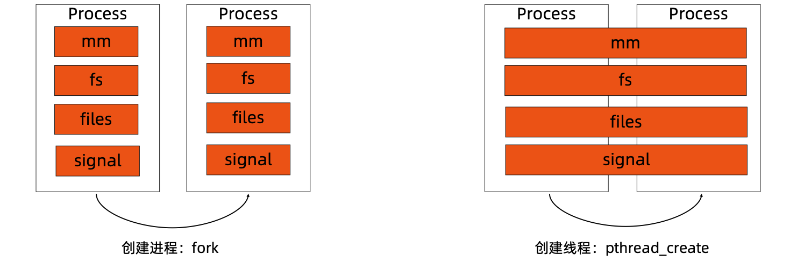

#### Linux 进程的内存使用

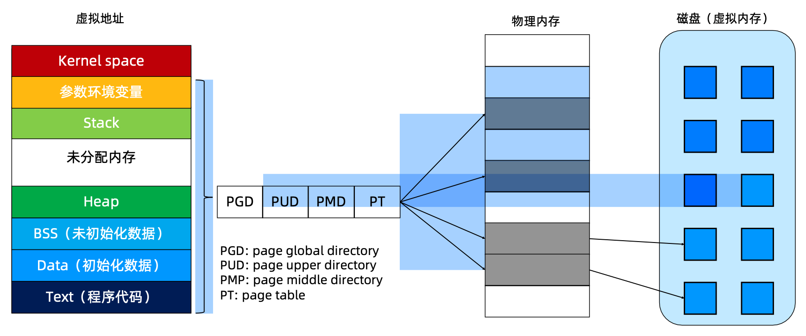

页面：物理内存和虚拟内存的对应关系。


#### CPU 对内存的访问

- CPU上有个Memory Management Unit(MMU)单元
- CPU把虚拟地址给MMU，MMU去物理内存中查询页表，得到实际的物理地址
- CPU维护一份缓存Translation Lookaside Buffer(TLB)，缓存虚拟地址和物理地址的映射关系

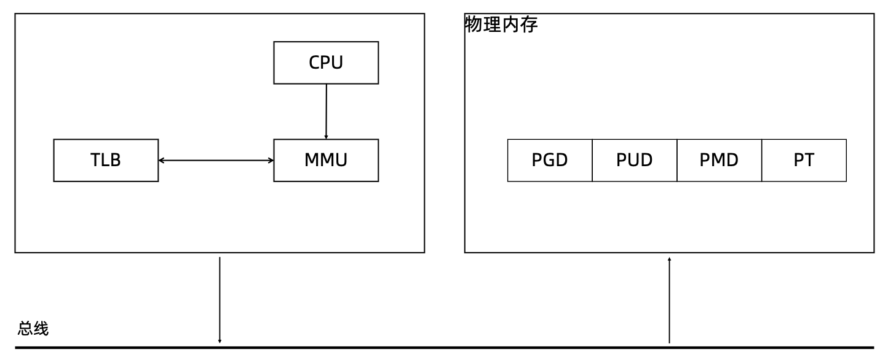

#### 进程切换开销

- 直接开销
  - 切换页表全局目录(PGD)
  - 切换内核态堆栈
  - 切换硬件上下文(进程恢复前，必须装入寄存器的数据统称为硬件上下文) 
  - 刷新TLB
  - 系统调度器的代码执行
- 间接开销
  - CPU 缓存失效导致的进程需要到内存直接访问的 IO 操作变多

#### 线程切换开销

- 线程本质上只是一批共享资源的进程，线程切换本质上依然需要内核进行进程切换
- 一组线程因为共享内存资源，因此一个进程的所有线程共享虚拟地址空间，线程切换相比进程 切换，主要节省了虚拟地址空间的切换

#### 用户线程

无需内核帮助，应用程序在用户空间创建的可执行单元，创建销毁完全在用户态完成。

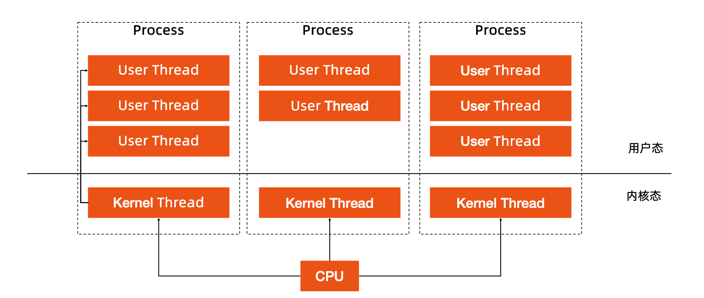

#### Goroutine

Go 语言基于 GMP 模型实现用户态线程

- G:表示goroutine，每个goroutine都有自己的栈空间，定时器， 初始化的栈空间在 2k 左右，空间会随着需求增长。
- M:抽象化代表内核线程，记录内核线程栈信息，当goroutine调度 到线程时，使用该 goroutine 自己的栈信息。
- P:代表调度器，负责调度goroutine，维护一个本地goroutine队 列，M 从 P 上获得 goroutine 并执行，同时还负责部分内存的管理。

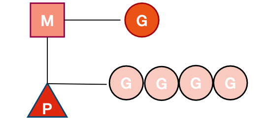

#### GMP 模型细节

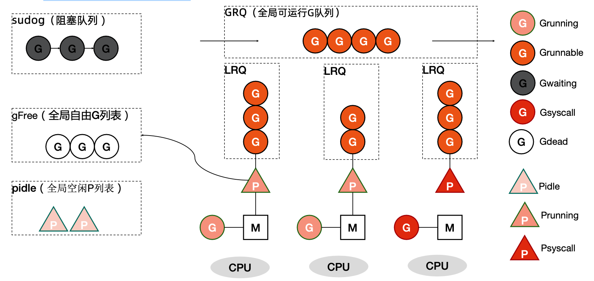

#### G 所处的位置

- 进程都有一个全局的G队列

- 每个P拥有自己的本地执行队列

- 有不在运行队列中的G

  - 处于 channel 阻塞态的 G 被放在 sudog

  - 脱离 P 绑定在 M 上的 G，如系统调用

  - 为了复用，执行结束进入 P 的 gFree 列表中的 G

#### Goroutine 创建过程

- 获取或者创建新的Goroutine结构体

  - 从处理器的 gFree 列表中查找空闲的 Goroutine

  - 如果不存在空闲的 Goroutine，会通过 runtime.malg 创建一个栈大小足够的新结构体

- 将函数传入的参数移到Goroutine的栈上
- 更新Goroutine调度相关的属性，更新状态为_Grunnable
- 返回的Goroutine会存储到全局变量allgs中

#### 将 Goroutine 放到运行队列上

- Goroutine 设置到处理器的 runnext 作为下一个处理器 执行的任务
- 当处理器的本地运行队列已经没有剩余空间时，就会把 本地队列中的一部分 Goroutine 和待加入的 Goroutine 通过 runtime.runqputslow 添加到调度器持有的全局 运行队列上

#### 调度器行为

- 为了保证公平，当全局运行队列中有待执行的Goroutine时，通过schedtick保证有一定 几率会从全局的运行队列中查找对应的 Goroutine

- 从处理器本地的运行队列中查找待执行的Goroutine

- 如果前两种方法都没有找到Goroutine，会通过runtime.findrunnable进行阻塞地查找

  Goroutine

  - 从本地运行队列、全局运行队列中查找

  - 从网络轮询器中查找是否有 Goroutine 等待运行
  - 通过 runtime.runqsteal 尝试从其他随机的处理器中窃取待运行的 Goroutine

### 内存管理

#### 关于内存管理的争论

- c/c++
  - 内存管理太重要了!所以如果交给机器管理我不能放心!

- Java/golang
  - 内存管理太重要了!手动管理麻烦且容易出错，所以我们应该交给机器去管理! 

#### 堆内存管理

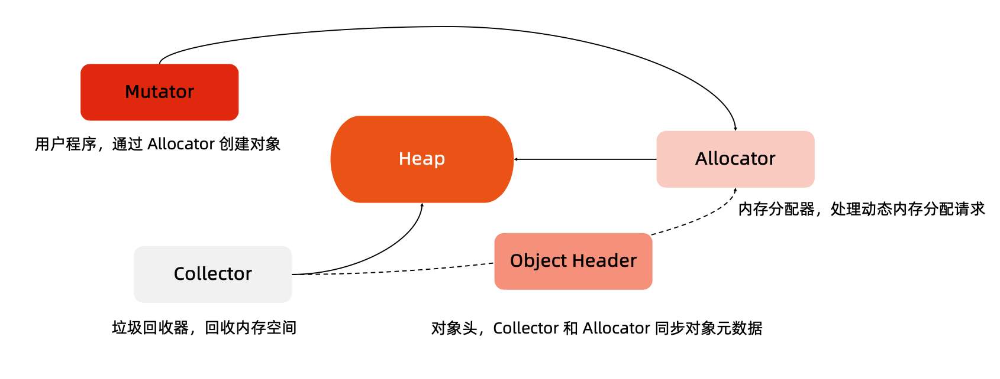

#### 堆内存管理

- 初始化连续内存块作为堆
- 有内存申请的时候，Allocator从堆内存的未分配区域分割小内存块
- 用链表将已分配内存连接起来
- 需要信息描述每个内存块的元数据:大小，是否使用，下一个内存块的地址等

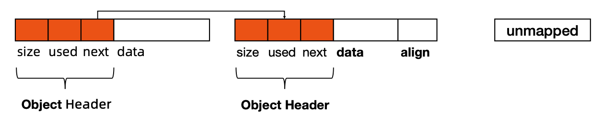

#### TCMalloc 概览

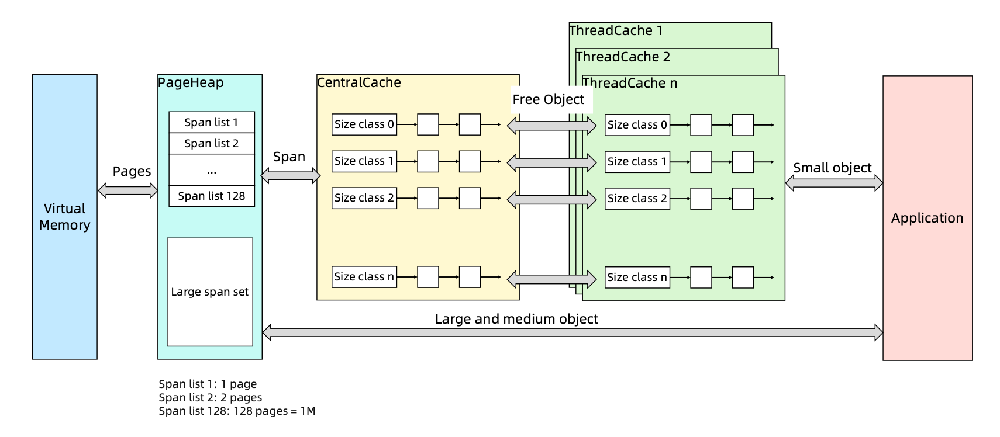

#### TCMalloc

- page:内存页，一块8K大小的内存空间。Go与操作系统之间的内存申请和释放，都是以 page 为单位的

- span:内存块，一个或多个连续的page组成一个span

- sizeclass:空间规格，每个span都带有一个sizeclass，标记着该span中的page应该如何

  使用

- object:对象，用来存储一个变量数据内存空间，一个span在初始化时，会被切割成一堆等大 的 object ;假设 object 的大小是 16B ，span 大小是 8K ，那么就会把 span 中的 page 就会 被初始化 8K / 16B = 512 个 object 。所谓内存分配，就是分配一个 object 出去

- 对象大小定义
  - 小对象大小:0~256KB
  - 中对象大小:256KB~1MB
  - 大对象大小:>1MB
- 小对象的分配流程
  - ThreadCache -> CentralCache -> HeapPage，大部分时候，ThreadCache 缓存都是足够的，不需要去访问CentralCache 和 HeapPage，无系统调用配合无锁分配，分配效率是非常高的 
- 中对象分配流程
  - 直接在 PageHeap 中选择适当的大小即可，128 Page 的 Span 所保存的最大内存就是 1MB 
- 大对象分配流程
  - 从 large span set 选择合适数量的页面组成 span，用来存储数据

#### Go 语言内存分配

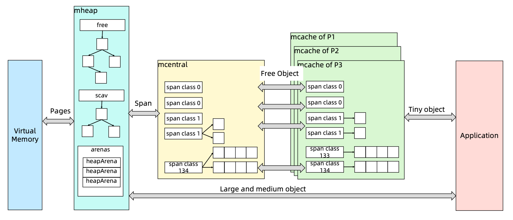

- mcache:小对象的内存分配直接走

  - size class 从 1 到 66，每个 class 两个 span

  - Span 大小是 8KB，按 span class 大小切分

- mcentral

  - Span 内的所有内存块都被占用时，没有剩余空间继续分配对象，mcache 会向 mcentral 申请1个span，mcache 拿到 span 后继续分配对象

  - 当 mcentral 向 mcache 提供 span 时，如果没有符合条件的 span，mcentral 会向 mheap 申请 span

- mheap

  - 当 mheap 没有足够的内存时，mheap 会向 OS 申请内存

  - Mheap 把 Span 组织成了树结构，而不是链表

  - 然后把 Span 分配到 heapArena 进行管理，它包含地址映射和 span 是否包含指针等位图
  - 为了更高效的分配、回收和再利用内存

#### 内存回收

- 引用计数(Python，PHP，Swift)

  - 对每一个对象维护一个引用计数，当引用该对象的对象被销毁的时候，引用计数减 1，当引用计数为 0 的时候，回 收该对象

  - 优点:对象可以很快的被回收，不会出现内存耗尽或达到某个阀值时才回收

  - 缺点:不能很好的处理循环引用，而且实时维护引用计数，有也一定的代价

- 标记-清除(Golang)
  - 从根变量开始遍历所有引用的对象，引用的对象标记为"被引用"，没有被标记的进行回收
  - 优点:解决引用计数的缺点
  - 缺点:需要 STW(stop the word)，即要暂停程序运行
- 分代收集(Java)
  - 按照生命周期进行划分不同的代空间，生命周期长的放入老年代，短的放入新生代，新生代的回收频率高于老年代的频率

#### mspan

- allocBits
  - 记录了每块内存分配的情况 
-  gcmarkBits
  - 记录了每块内存的引用情况，标记阶段对每块内存进行标记，有对象引用的内存标记为1，没有的标 记为 0

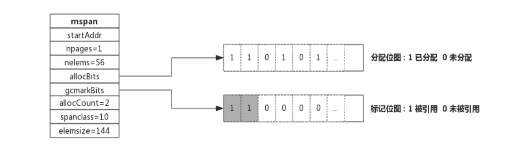

- 这两个位图的数据结构是完全一致的，标记结束则进行内存回收，回收的时候，将allocBits指 向 gcmarkBits，标记过的则存在，未进行标记的则进行回收

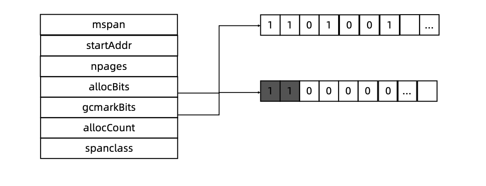

#### GC 工作流程