### 什么是云计算

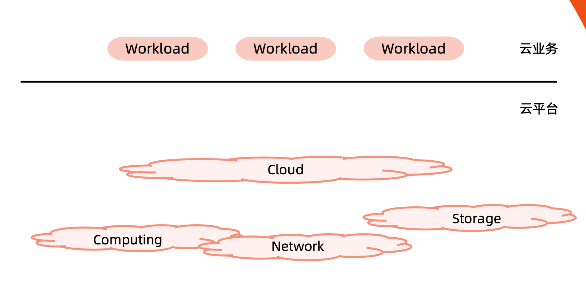

### 云计算平台的分类

以 Openstack 为典型的虚拟化平台

- 虚拟机构建和业务代码部署分离。

- 可变的基础架构使后续维护风险变大。

 以谷歌 borg 为典型的基于进程的作业调度平台

- 技术的迭代引发 borg 的换代需求。
- 早期的隔离依靠 chroot jail 实现，一些不合理的设计需要在新产品中改进。
  - 对象之间的强依赖 job 和 task 是强包含关系，不利于重组。
  - 所有容器共享 IP，会导致端口冲突，隔离困难等问题。 
  - 为超级用户添加复杂逻辑导致系统过于复杂。

### Kubernetes 架构基础

#### Borg


#### Google Borg 简介

去读Borg官方文档

特性

- 物理资源利用率高。
- 服务器共享，在进程级别做隔离。
- 应用高可用，故障恢复时间短。
- 调度策略灵活。
- 应用接入和使用方便，提供了完备的 Job 描述语言，服务发现，实时状态监控和诊断工具。

优势

- 对外隐藏底层资源管理和调度、故障处理等。
- 实现应用的高可靠和高可用。
- 足够弹性，支持应用跑在成千上万的机器上。

#### 基本概念

Workload

- prod:在线任务，长 期运行、对延时敏感、 面向终端用户等，比如 Gmail, Google Docs, Web Search 服务等。
- non-prod:离线任 务，也称为批处理任务 (Batch)，比如一些 分布式计算服务等。

Cell

- 一个 Cell 上跑一个集 群管理系统 Borg。
- 通过定义 Cell 可以让Borg 对服务器资源进 行统一抽象，作为用户就无需知道自己的应用
  跑在哪台机器上，也不用关心资源分配、程序安装、依赖管理、健康检查及故障恢复等。

Job 和 Task

- 用户以 Job 的形式提 交应用部署请求。一个 Job 包含一个或多个相 同的 Task，每个 Task 运行相同的应用程序， Task 数量就是应用的 副本数。
- 每个 Job 可以定义属 性、元信息和优先级， 优先级涉及到抢占式调 度过程。

Naming

- Borg 的服务发现通过 BNS ( Borg Name Service)来实现。
- 50.jfoo.ubar.cc.borg .google.com 可 表 示 在一个名为 cc 的 Cell 中由用户 uBar 部署的 一个名为 jFoo 的 Job 下的第50个 Task。

#### Borg 架构

Borgmaster 主进程:

- 处理客户端 RPC 请求，比如创建 Job，查询 Job 等。
- 维护系统组件和服务的状态，比如服务器、Task 等。
- 负责与 Borglet 通信。

- Scheduler 进程:
- 调度策略
  - Worst Fit
  - Best Fit
  - Hybrid 
- 调度优化
  - Score caching: 当服务器或者任务的状态未发生变更或者变更很少时，直接采用缓存数据，避免重复计算。
  - Equivalence classes: 调度同一 Job 下多个相同的 Task 只需计算一次。
  - Relaxed randomization: 引入一些随机性，即每次随机选择一些机器，只要符合需求的服务器数量达到一定值时，就可 以停止计算，无需每次对 Cell 中所有服务器进行feasibility checking。

Borglet:

​	Borglet 是部署在所有服务器上的 Agent，负责接收 Borgmaster 进程的指令。


#### 应用高可用

- 被抢占的 non-prod 任务放回 pending queue，等待重新调度。
- 多副本应用跨故障域部署。所谓故障域有大有小，比如相同机器、相同机架或相同电源插座等，一挂全挂。
- 对于类似服务器或操作系统升级的维护操作，避免大量服务器同时进行。
- 支持**幂等性**，支持客户端重复操作。
- 当服务器状态变为不可用时，要控制重新调度任务的速率。因为 Borg 无法区分是节点故障还是出现了短暂的 网络分区，如果是后者，静静地等待网络恢复更利于保障服务可用性。
- 当某种“任务 @ 服务器”的组合出现故障时，下次重新调度时需避免这种组合再次出现，因为极大可能会再 次出现相同故障。
- 记录详细的内部信息，便于故障排查和分析。
- 保障应用高可用的关键性设计原则:无论何种原因，即使 Borgmaster 或者 Borglet 挂掉、失联，都不能杀 掉正在运行的服务(Task)。

#### Borg 系统自身高可用

- Borgmaster 组件多副本设计。
- 采用一些简单的和底层(low-level)的工具来部署 Borg 系统实例，避免引入过多的外部依赖。 
- 每个 Cell 的 Borg 均独立部署，避免不同 Borg 系统相互影响。

#### 资源利用率

- 通过将在线任务(prod)和离线任务(non-prod，Batch)混合部署，空闲时，离线任务可以充分利用计 算资源;繁忙时，在线任务通过抢占的方式保证优先得到执行，合理地利用资源。
- 98% 的服务器实现了混部。
- 90% 的服务器中跑了超过 25 个 Task 和 4500 个线程。
- 在一个中等规模的 Cell 里，在线任务和离线任务独立部署比混合部署所需的服务器数量多出约 20%-30%。 可以简单算一笔账，Google 的服务器数量在千万级别，按 20% 算也是百万级别，大概能省下的服务器采 购费用就是百亿级别了，这还不包括省下的机房等基础设施和电费等费用。

#### Brog 调度原理


#### 隔离性

安全性隔离:

- 早期采用 Chroot jail，后期版本基于 Namespace。 

性能隔离:

- 采用基于 Cgroup 的容器技术实现。

- 在线任务(prod)是延时敏感(latency-sensitive)型的，优先级高，而离线任务(non-prod，

  Batch)优先级低。

- Borg 通过不同优先级之间的抢占式调度来优先保障在线任务的性能，牺牲离线任务。

- Borg 将资源类型分成两类:

  - 可压榨的(compressible)，CPU 是可压榨资源，资源耗尽不会终止进程;
  - 不可压榨的(non-compressible)，内存是不可压榨资源，资源耗尽进程会被终止。

#### 什么是 Kubernetes(K8s)

有状态应用（数据库）如果做自动化运维，很需要成本。

 Kubernetes 是谷歌开源的容器集群管理系统，是 Google 多年大规模容器管理技术 Borg 的开源版本，主要功能包括: 

- 基于容器的应用部署、维护和滚动升级;
- 负载均衡和服务发现;
- 跨机器和跨地区的集群调度;
- 自动伸缩;
- 无状态服务和有状态服务; 
- 插件机制保证扩展性。


#### 命令式( Imperative)vs 声明式( Declarative)

命令式系统关注 “如何做”

在软件工程领域，命令式系统是写出解决某个问题、 完成某个任务或者达到某个目标的明确步骤。此方法 明确写出系统应该执行某指令，并且期待系统返回期 望结果。

声明式系统关注“做什么”

在软件工程领域，声明式系统指程序代码描述系统应该 做什么而不是怎么做。仅限于描述要达到什么目的，如 何达到目的交给系统。

#### 声明式(Declaritive)系统规范

命令式:

- 我要你做什么，怎么做，请严格按照我说的做。

声明式:

- 我需要你帮我做点事，但是我只告诉你我需要你做什么，不是你应该怎么做。
- 直接声明:我直接告诉你我需要什么。
- 间接声明:我不直接告诉你我的需求，我会把我的需求放在特定的地方，请在方便的时候拿出来处理。

幂等性:

- 状态固定，每次我要你做事，请给我返回相同结果。

面向对象的:

- 把一切抽象成对象。

#### Kubernetes:声明式系统

Kubernetes 的所有管理能力构建在对象抽象的基础上，核心对象包括:

• Node:计算节点的抽象，用来描述计算节点的资源抽象、健康状态等。

• Namespace:资源隔离的基本单位，可以简单理解为文件系统中的目录结构。

• Pod:用来描述应用实例，包括镜像地址、资源需求等。 Kubernetes 中最核心 的对象，也是打通应用和基础架构的秘密武器。

• Service:服务如何将应用发布成服务，本质上是负载均衡和域名服务的声明。

#### Kubernetes 采用与 Borg 类似的架构


#### 主要组件


#### Kubernetes 的主节点(Master Node)

API服务器 API Server

这是 Kubernetes 控制面板中唯一带有用户可访问 API 以及用户可交互的组件。API 服 务器会暴露一个 RESTful 的 Kubernetes API 并使用 JSON 格式的清单文件(manifest files)。

群的数据存储 Cluster Data Store

Kubernetes 使用“etcd”。这是一个强大的、稳定的、高可用的键值存储，被 Kubernetes 用于长久储存所有的 API 对象。

控制管理器 Controller Manager

被称为“kube-controller manager”，它运行着所有处理集群日常任务的控制器。包 括了节点控制器、副本控制器、端点(endpoint)控制器以及服务账户等。

调度器 Scheduler

调度器会监控新建的 pods(一组或一个容器)并将其分配给节点。

#### Kubernetes 的工作节点(Worker Node)

Kubelet

负责调度到对应节点的 Pod 的生命周期管理，执行任务并将 Pod 状态报告给主节 点的渠道，通过容器运行时(拉取镜像、启动和停止容器等)来运行这些容器。它 还会定期执行被请求的容器的健康探测程序。

Kube-proxy

它负责节点的网络，在主机上维护网络规则并执行连接转发。它还负责对正在服务 的 pods 进行负载平衡。

#### etcd

etcd 是 CoreOS 基于 Raft 开发的分布式 key-value 存储，可用于服务发现、共享配置以及一致性保障(如 数据库选主、分布式锁等)。

- 基本的 key-value 存储; 
- 监听机制;
- key 的过期及续约机制，用于监控和服务发现;
- 原子 CAS 和 CAD，用于分布式锁和 leader 选举。

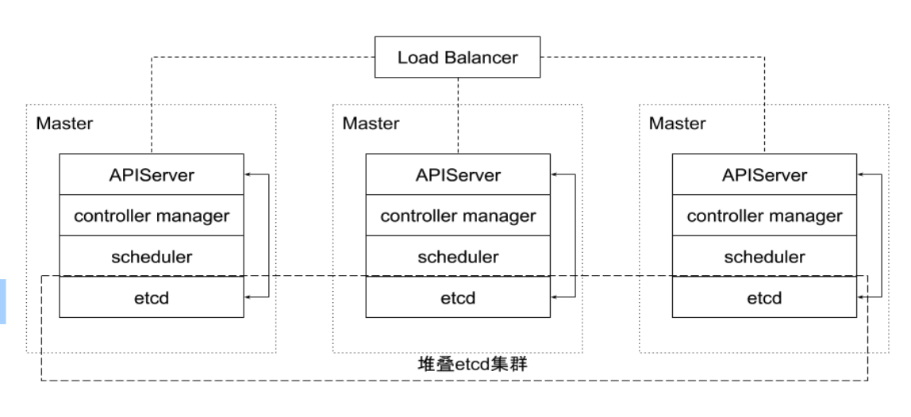

#### 直接访问 etcd 的数据

- 通过 etcd 进程查看启动参数
- 进入容器
  - ps -ef|grep etcd
  - sh: ps: command not found
- 怎么办?到主机 Namespace 查看 cert 信息
- 进入容器查询数据

```
export ETCDCTL_API=3
etcdctl --endpoints https://localhost:2379 --cert /etc/kubernetes/pki/etcd/server.crt --key /etc/kubernetes/pki/etcd/server.key --cacert /etc/kubernetes/pki/etcd/ca.crt get --keys-only --prefix /
```

- 监听对象变化

```
etcdctl --endpoints https://localhost:2379 --cert /etc/kubernetes/pki/etcd/server.crt --key /etc/kubernetes/pki/etcd/server.key --cacert /etc/kubernetes/pki/etcd/ca.crt watch --prefix /registry/services/specs/default/mynginx
```

#### APIServer

Kube-APIServer 是 Kubernetes 最重要的核心组件之一，主要提供以下功能:

- 提供集群管理的 REST API 接口，包括:
  - 认证 Authentication;
  - 授权 Authorization;
  - 准入 Admission(Mutating & Valiating)。
- 提供其他模块之间的数据交互和通信的枢纽(其他模块通过 APIServer 查询或 修改数据，只有 APIServer 才直接操作 etcd)。
- APIServer 提供 etcd 数据缓存以减少集群对 etcd 的访问。

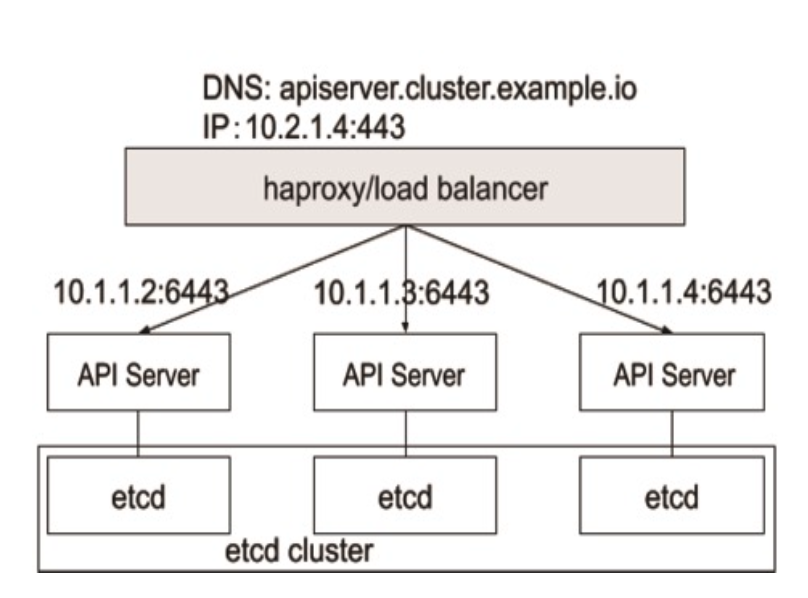

#### APIServer 展开

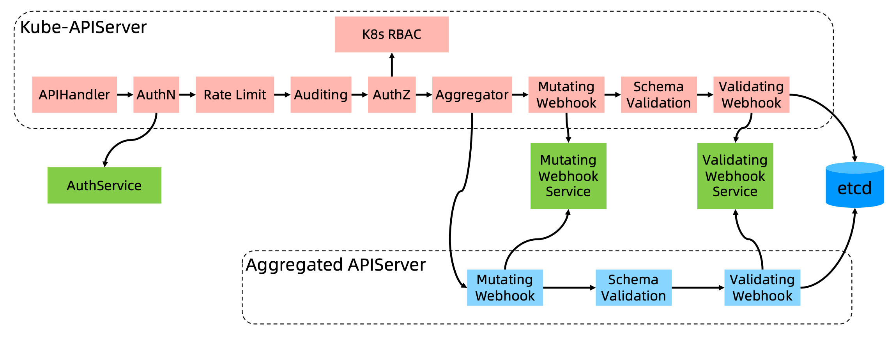

#### Controller Manager

- Controller Manager 是集群的大脑，是确保整个集群动起来的关键;

- 作用是确保 Kubernetes 遵循声明式系统规范，确保系统的真实状态(Actual

  State)与用户定义的期望状态(Desired State)一致;

- Controller Manager 是多个控制器的组合，每个 Controller 事实上都是一个 control loop，负责侦听其管控的对象，当对象发生变更时完成配置;

- Controller 配置失败通常会触发自动重试，整个集群会在控制器不断重试的机 制下确保最终一致性( Eventual Consistency)。

#### 控制器的工作流程

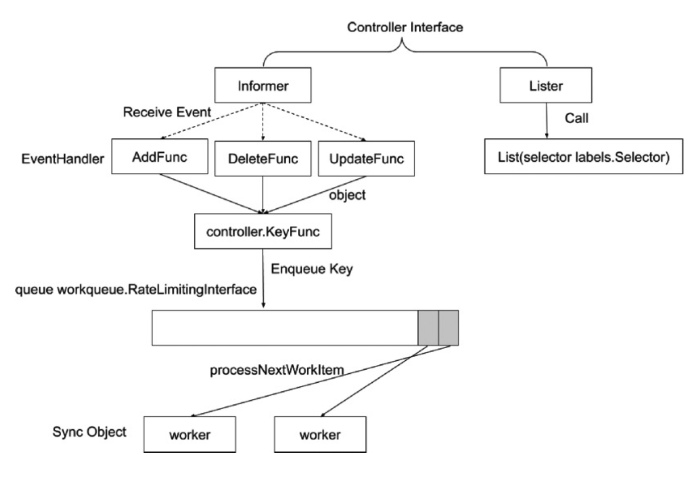

#### Informer 的内部机制

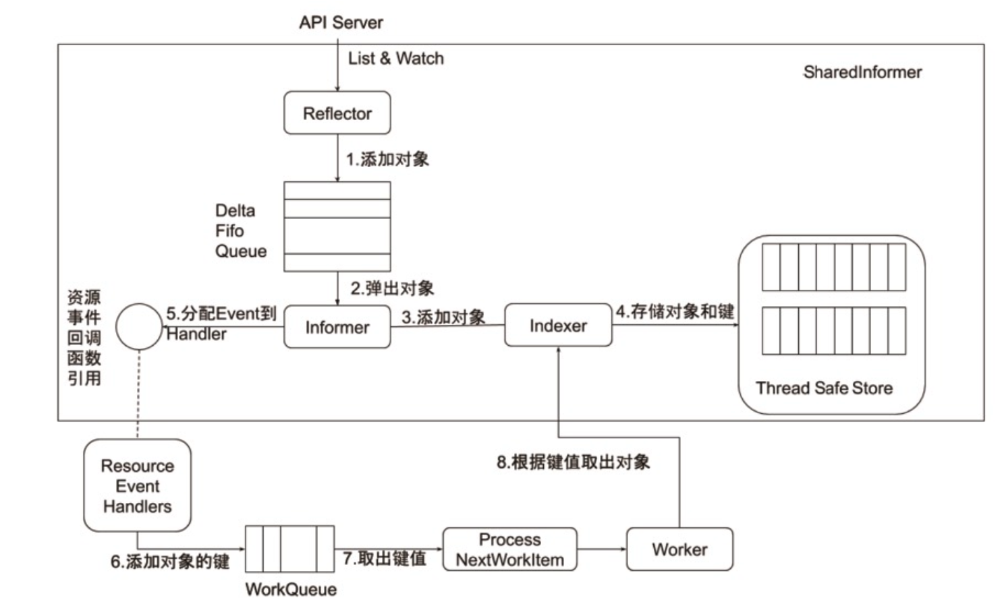

#### 控制器的协同工作原理


#### Scheduler

特殊的 Controller，工作原理与其他控制器无差别。

Scheduler 的特殊职责在于监控当前集群所有未调度的 Pod，并且获取当前集群所有节点的健康状况和资源 使用情况，为待调度 Pod 选择最佳计算节点，完成调度。

调度阶段分为:

- Predict:过滤不能满足业务需求的节点，如资源不足、端口冲突等。 
- Priority:按既定要素将满足调度需求的节点评分，选择最佳节点。
- Bind:将计算节点与 Pod 绑定，完成调度。

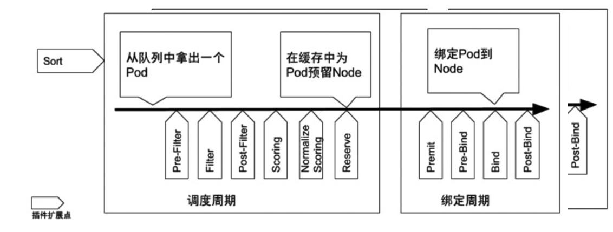

#### Kubelet

Kubernetes 的初始化系统(init system)

- 从不同源获取 Pod 清单，并按需求启停 Pod 的核心组件:

  - Pod 清单可从本地文件目录，给定的 HTTPServer 或 Kube-APIServer 等源头获取;

  - Kubelet 将运行时，网络和存储抽象成了 CRI，CNI，CSI。 

- 负责汇报当前节点的资源信息和健康状态;
- 负责 Pod 的健康检查和状态汇报。


#### Kube-Proxy

- 监控集群中用户发布的服务，并完成负载均衡配置。
- 每个节点的 Kube-Proxy 都会配置相同的负载均衡策略，使得整个集群的服务发现建立在分布式负载 均衡器之上，服务调用无需经过额外的网络跳转(Network Hop)。
- 负载均衡配置基于不同插件实现:
  - userspace。
  - 操作系统网络协议栈不同的 Hooks 点和插件: 
    - iptables;
    - ipvs。


#### 推荐的 Add-ons

- kube-dns:负责为整个集群提供 DNS 服务;
- Ingress Controller:为服务提供外网入口;
- MetricsServer:提供资源监控;
- Dashboard:提供 GUI;
- Fluentd-Elasticsearch:提供集群日志采集、存储与查询。

### 了解 kubectl

#### Kubectl 命令和 kubeconfig

- kubectl是一个Kubernetes的命令行工具，它允许 Kubernetes 用户以命令行的方式与 Kubernetes 交 互，其默认读取配置文件 ~/.kube/config。
- kubectl会将接收到的用户请求转化为rest调用以 rest client 的形式与 apiserver 通讯。
- apiserver的地址，用户信息等配置在kubeconfig。

```
apiVersion: v1 clusters:
- cluster:
certificate-authority-data: REDACTED
server: https://127.0.0.1:54729 name: kind-kind
contexts: - context:
cluster: kind-kind
user: kind-kind name: kind-kind
current-context: kind-kind kind:Config
users:
- name: kind-kind
user:
client-certificate-data: REDACTED client-key-data: REDACTED
```

#### kubectl 常用命令

kubectl get po –oyaml -w

kubectl    可查看对象。

-oyaml     输出详细信息为 yaml 格式。

-w watch   该对象的后续变化。

-owide      以详细列表的格式查看对象。

#### Kubectl describe

kubectl describe 展示资源的详细信息和相关 Event。

#### kubectl exec

kubectl exec 提供进入运行容器的通道，可以进入容器进行 debug 操作。

#### kubectl logs

Kubectl logs 可查看 pod 的标准输入(stdout, stderr)，与 tail 用法类似。

### 深入理解 Kubernetes

#### 云计算的传统分类

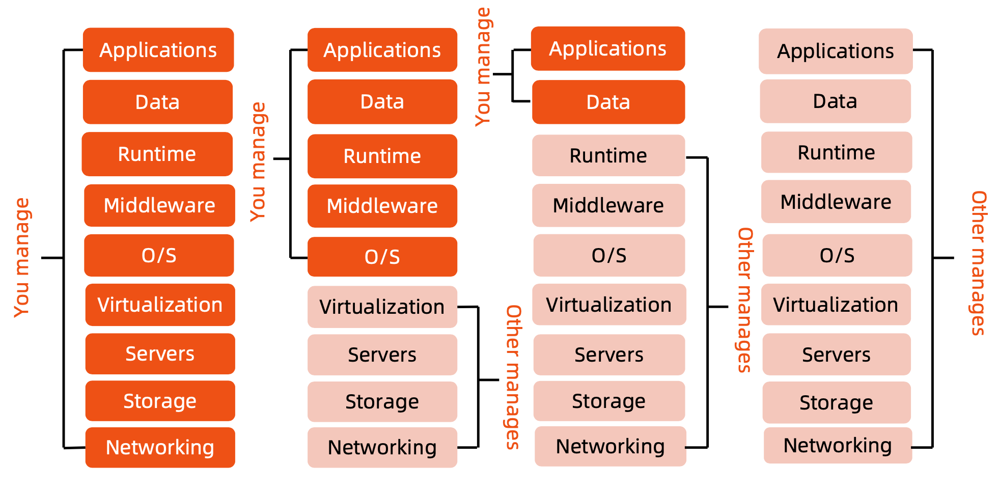

#### Kubernetes 生态系统

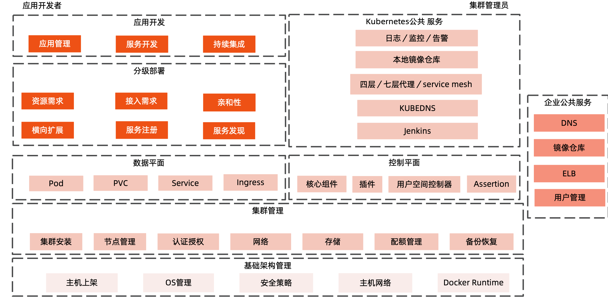

#### Kubernetes 设计理念

可扩展性

- 基于CRD的扩展
- 插件化的生态系统

高可用

- 基于 replicaset，statefulset 的 应用高可用
- Kubernetes 组件本身高可用

可移植性

- 多种 host Os 选择
- 多种基础架构的选择
- 多云和混合云

安全

- 基于 TLS 提供服务
- Serviceaccount 和 user
- 基于 Namespace 的隔离
- secret
- Taints，psp， networkpolicy

#### Kubernetes Master


#### 分层架构

- 核心层:Kubernetes 最核心的功能，对外提供 API 构建高层的应用，对内提供插件式应用执行环境。

- 应用层:部署(无状态应用、有状态应用、批处理任务、集群应用等)和路由(服务发现、DNS 解析

  等)。

- 管理层:系统度量(如基础设施、容器和网络的度量)、自动化(如自动扩展、动态 Provision 等)、 策略管理(RBAC、Quota、PSP、NetworkPolicy 等)。

- 接口层:Kubectl 命令行工具、客户端 SDK 以及集群联邦。

- 生态系统:在接口层之上的庞大容器集群管理调度的生态系统，可以划分为两个范畴:

  - Kubernetes 外部:日志、监控、配置管理、CI、CD、Workflow、FaaS、OTS 应用、 ChatOps 等;
  - Kubernetes 内部:CRI、CNI、CVI、镜像仓库、Cloud Provider、集群自身的配置和管理等。

#### 分层架构

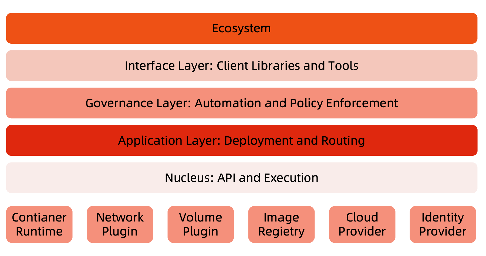

#### 分层架构

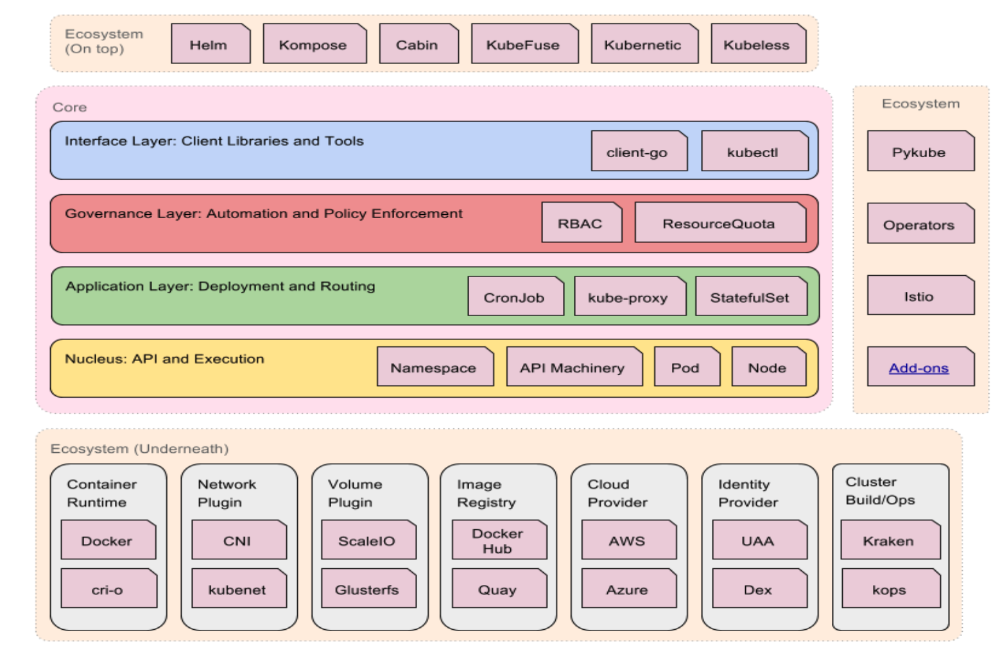

#### API 设计原则

- 所有 API 都应是声明式的

  - 相对于命令式操作，声明式操作对于重复操作的效果是稳定的，这对于容易出现数据丢失或重复的分布式环境来说是很重要的。
  - 声明式操作更易被用户使用，可以使系统向用户隐藏实现的细节，同时也保留了系统未来持续优化的可能性。
  - 此外，声明式的 API 还隐含了所有的 API 对象都是名词性质的，例如 Service、Volume 这些 API 都是名词，这些名词描述了用户所期望得到的一个目标对象。

- API 对象是彼此互补而且可组合的

  - 这实际上鼓励 API 对象尽量实现面向对象设计时的要求，即“高内聚，松耦合”，对业务相关的概念有一个合适的分解，提高分解出来的对象的可重用性。

- 高层 API 以操作意图为基础设计

  - 如何能够设计好 API，跟如何能用面向对象的方法设计好应用系统有相通的地方，高层设计一定是从业务出发，而不是过早的从技术实现出发。

  - 因此，针对 Kubernetes 的高层 API 设计，一定是以 Kubernetes 的业务为基础出发，也就是以系统调度管理容器的操作意图为基础 设计。

- 低层API根据高层API的控制需要设计
  - 设计实现低层 API 的目的，是为了被高层 API 使用，考虑减少冗余、提高重用性的目的，低层 API的设计也要以需求为基础，要尽量抵抗受技术实现影响的诱惑。
- 尽量避免简单封装，不要有在外部API无法显式知道的内部隐藏的机制
- 简单的封装，实际没有提供新的功能，反而增加了对所封装 API 的依赖性。
- 例如 StatefulSet 和 ReplicaSet，本来就是两种 Pod 集合，那么 Kubernetes 就用不同 API 对象 来定义它们，而不会说只用同一个 ReplicaSet，内部通过特殊的算法再来区分这个 ReplicaSet 是 有状态的还是无状态。

- API操作复杂度与对象数量成正比
  - API 的操作复杂度不能超过 O(N)，否则系统就不具备水平伸缩性了。
- API对象状态不能依赖于网络连接状态
  - 由于众所周知，在分布式环境下，网络连接断开是经常发生的事情，因此要保证 API 对象状态能应对网络的不稳定，API 对象的状态就不能依赖于网络连接状态。
- 尽量避免让操作机制依赖于全局状态
  - 因为在分布式系统中要保证全局状态的同步是非常困难的。

#### Kubernetes 如何通过对象的组合完成业务描述

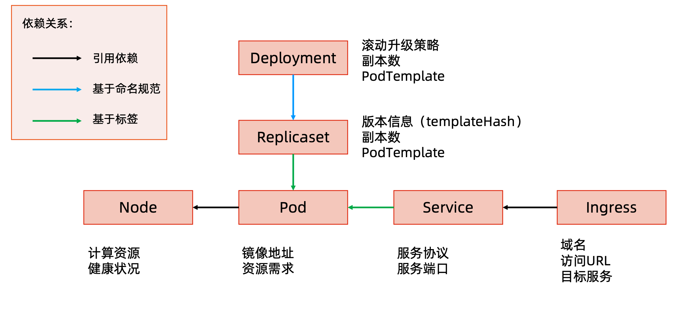

#### 架构设计原则

- 只有 APIServer 可以直接访问 etcd 存储，其他服务必须通过 Kubernetes API 来访问集群状态;

- 单节点故障不应该影响集群的状态;

- 在没有新请求的情况下，所有组件应该在故障恢复后继续执行上次最后收到的请求

  (比如网络分区或服务重启等);

- 所有组件都应该在内存中保持所需要的状态，APIServer 将状态写入 etcd 存储，而其 他组件则通过 APIServer 更新并监听所有的变化;

- 优先使用事件监听而不是轮询。

#### 引导(Bootstrapping)原则

- Self-hosting 是目标。

- 减少依赖，特别是稳态运行的依赖。 

- 通过分层的原则管理依赖。

- 循环依赖问题的原则:

  - 同时还接受其他方式的数据输入(比如本地文件等)，这样在其他服务不可 用时还可以手动配置引导服务;

  - 状态应该是可恢复或可重新发现的;

  - 支持简单的启动临时实例来创建稳态运行所需要的状态，使用分布式锁或文件锁等来协调不同状态的切换(通常称为 pivoting 技术);

  - 自动重启异常退出的服务，比如副本或者进程管理器等。

#### 课后练习 4.1

用 Kubeadm 安装 Kubernetes 集群。

### 核心技术概念和 API 对象

API 对象是 Kubernetes 集群中的管理操作单元。

Kubernetes 集群系统每支持一项新功能，引入一项新技术，一定会新引入对应的 API 对象，支持对该功能的管理操 作。

每个 API 对象都有四大类属性: 

- TypeMeta
- MetaData
- Spec
- Status

#### TypeMeta

Kubernetes对象的最基本定义，它通过引入GKV(Group，Kind，Version)模型定义了一个对象的类型。

1. Group

Kubernetes 定义了非常多的对象，如何将这些对象进行归类是一门学问，将对象依据其功能范围归入不同的分组， 比如把支撑最基本功能的对象归入 core 组，把与应用部署有关的对象归入 apps 组，会使这些对象的可维护性和可 理解性更高。

2. Kind

定义一个对象的基本类型，比如 Node、Pod、Deployment 等。

3. Version

社区每个季度会推出一个 Kubernetes 版本，随着 Kubernetes 版本的演进，对象从创建之初到能够完全生产化就 绪的版本是不断变化的。与软件版本类似，通常社区提出一个模型定义以后，随着该对象不断成熟，其版本可能会 从 v1alpha1 到 v1alpha2，或者到 v1beta1，最终变成生产就绪版本 v1。

#### Metadata

Metadata 中有两个最重要的属性:Namespace和Name，分别定义了对象的Namespace 归属及名字，这两个属性唯一定义了某个对象实例。

1. Label

顾名思义就是给对象打标签，一个对象可以有任意对标签，其存在形式是键值对。 Label 定义了对象的可识别属性，Kubernetes API 支持以 Label 作为过滤条件 查询对象。

2. Annotation

Annotation 与 Label 一样用键值对来定义，但 Annotation 是作为属性扩展， 更多面向于系统管理员和开发人员，因此需要像其他属性一样做合理归类。

#### Label

- Label是识别Kubernetes对象的标签，以key/value的方式附加到对象上。

- key最长不能超过63字节，value可以为空，也可以是不超过253字节的字符串。

- Label不提供唯一性，并且实际上经常是很多对象(如Pods)都使用相同的label来标志具 体的应用。

- Label定义好后其他对象可以使用LabelSelector来选择一组相同label的对象

- LabelSelector支持以下几种方式:

  - 等式，如 app=nginx 和 env!=production;

  - 集合，如 env in (production, qa);

  - 多个 label(它们之间是 AND 关系)，如 app=nginx,env=test。


#### Annotations

• Annotations 是 key/value 形式附加于对象的注解。

• 不同于 Labels 用于标志和选择对象，Annotations 则是用来记录一些附加信息，用来辅助应用部署、安 全策略以及调度策略等。

• 比如 deployment 使用 annotations 来记录 rolling update 的状态。

#### Metadata

3. Finalizer

Finalizer 本质上是一个资源锁，Kubernetes 在接收某对象的删除请求时，会检 查 Finalizer 是否为空，如果不为空则只对其做逻辑删除，即只会更新对象中的 metadata.deletionTimestamp 字段。

4. ResourceVersion

ResourceVersion 可以被看作一种乐观锁，每个对象在任意时刻都有其 ResourceVersion，当 Kubernetes 对象被客户端读取以后，ResourceVersion 信息也被一并读取。此机制确保了分布式系统中任意多线程能够无锁并发访问对 象，极大提升了系统的整体效率。

#### Spec 和 Status

- Spec 和 Status 才是对象的核心。
- Spec 是用户的期望状态，由创建对象的用户端来定义。
- Status 是对象的实际状态，由对应的控制器收集实际状态并更新。
- 与 TypeMeta 和 Metadata 等通用属性不同，Spec 和 Status 是每个对象独有的。

#### 常用 Kubernetes 对象及其分组

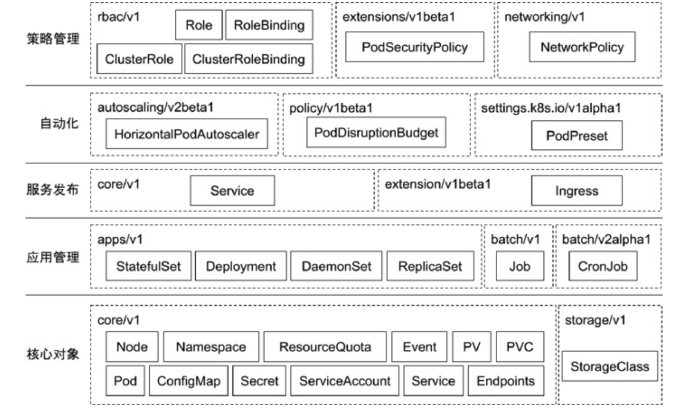

### 核心对象概览

#### Node

- Node 是 Pod 真正运行的主机，可以物理机，也可以是虚拟机。
- 为了管理 Pod，每个 Node 节点上至少要运行 container runtime (比如 Docker 或者 Rkt)、Kubelet 和 Kube-proxy 服务。

#### Namespace

Namespace 是对一组资源和对象的抽象集合，比如可以用来将系统内部的对 象划分为不同的项目组或用户组。

常见的 pods, services, replication controllers 和 deployments 等都是属于 某一个 Namespace 的(默认是 default)，而 Node, persistentVolumes 等则不属于任何 Namespace。

#### 什么是 Pod

- Pod 是一组紧密关联的容器集合，它们共享 PID、IPC、Network 和 UTS namespace，是 Kubernetes 调度的基本单位。
- Pod 的设计理念是支持多个容器在一个 Pod 中共享网络和文件系统，可以通过进程间通信和文件共享这 种简单高效的方式组合完成服务。
- 同一个 Pod 中的不同容器可共享资源:
  - 共享网络 Namespace;
  - 可通过挂载存储卷共享存储; 
  - 共享 Security Context。


#### 如何通过 Pod 对象定义支撑应用运行

- 环境变量:
  - 直接设置值;
  - 读取 Pod Spec 的某些属性;
  - 从 ConfigMap 读取某个值;
  - 从 Secret 读取某个值。

#### 存储卷

- 通过存储卷可以将外挂存储挂载到 Pod 内部使用。
- 存储卷定义包括两个部分: Volume 和 VolumeMounts。
  - Volume:定义 Pod 可以使用的存储卷来源;
  - VolumeMounts:定义存储卷如何 Mount 到容器内部。

```
apiVersion: v1 kind: Pod metadata:
name: hello-volume spec:
containers:
- image: nginx:1.15
name: nginx
volumeMounts: - name: data
mountPath: /data volumes:
- name: data
emptyDir: {}
```

#### Pod 网络

Pod的多个容器是共享网络 Namespace 的，这意味着:

- 同一个 Pod 中的不同容器可以彼此通过 Loopback 地址访问:
  - 在第一个容器中起了一个服务 http://127.0.0.1 。
  - 在第二个容器内，是可以通过 httpGet http://172.0.0.1 访问到该地址的。
- 这种方法常用于不同容器的互相协作。

#### 资源限制

Kubernetes 通过 Cgroups 提供容器资源管理的功能，可以限制每个容器的 CPU 和内存使用，比如对于刚才创建的 deployment，可以通过下面的命令限制 nginx 容器最多只用 50% 的 CPU 和 128MB 的内存:

$ kubectl set resources deployment nginx-app -c=nginx -- limits=cpu=500m,memory=128Mi

deployment "nginx" resource requirements updated

#### 等同于在每个 Pod 中设置 resources limits

```
apiVersion: v1 kind: Pod metadata:
labels: app: nginx
name: nginx spec:
containers:
- image: nginx
name: nginx resources:
limits:
cpu: "500m" 
memory: "128Mi"
```

#### 健康检查

Kubernetes 作为一个面向应用的集群管理工具，需要确保容器在部署后确实处在正常的运行状态。

1. 探针类型:

• LivenessProbe
 • 探测应用是否处于健康状态，如果不健康则删除并重新创建容器。

• ReadinessProbe
 • 探测应用是否就绪并且处于正常服务状态，如果不正常则不会接收来自 Kubernetes Service 的流量。

• StartupProbe
 • 探测应用是否启动完成，如果在 failureThreshold*periodSeconds 周期内未就绪，则会应用进程会被重启。

2. 探活方式:

- Exec
- TCP socket
- HTTP

#### 健康检查 spec

```
apiVersion: extensions/v1beta1 kind: Deployment
metadata:
labels: app: nginx
name: nginx-default spec:
replicas: 3 selector:
matchLabels: app: nginx
template: metadata:
labels: app: nginx
```

```
spec: containers:
- image: nginx imagePullPolicy: Always name: http
resources: {} terminationMessagePath:
/dev/termination-log terminationMessagePolicy: File resources:
limits:
cpu: "500m" memory: "128Mi"
```

```
livenessProbe: httpGet: path: /
port: 80 initialDelaySeconds: 15 timeoutSeconds: 1
readinessProbe: httpGet:
path: /ping
port: 80 initialDelaySeconds: 5 timeoutSeconds: 1
```

#### ConfigMap

- ConfigMap 用来将非机密性的数据保存到键值对中。
- 使用时， Pods 可以将其用作环境变量、命令行参数或者存储卷中的配置文件。
- ConfigMap 将环境配置信息和 容器镜像解耦，便于应用配置的修改。

#### 密钥对象(Secret)

- Secret 是用来保存和传递密码、密钥、认证凭证这些敏感信息的对象。
- 使用 Secret 的好处是可以避免把敏感信息明文写在配置文件里。
- Kubernetes 集群中配置和使用服务不可避免的要用到各种敏感信息实现登录、认 证等功能，例如访问 AWS 存储的用户名密码。
- 为了避免将类似的敏感信息明文写在所有需要使用的配置文件中，可以将这些信息 存入一个 Secret 对象，而在配置文件中通过 Secret 对象引用这些敏感信息。
- 这种方式的好处包括:意图明确，避免重复，减少暴漏机会。

#### 用户(User Account)& 服务帐户(Service Account)

- 顾名思义，用户帐户为人提供账户标识，而服务账户为计算机进程和 Kubernetes 集群中运行的 Pod 提供 账户标识。

- 用户帐户和服务帐户的一个区别是作用范围:

  - 用户帐户对应的是人的身份，人的身份与服务的 Namespace 无关，所以用户账户是跨

    Namespace 的;

  - 而服务帐户对应的是一个运行中程序的身份，与特定 Namespace 是相关的。

#### Service

Service 是应用服务的抽象，通过 labels 为应用提供负载均衡和服务发现。匹 配 labels 的 Pod IP 和端口列表组成 endpoints，由 Kube-proxy 负责将服务 IP 负载均衡到这些 endpoints 上。

每个 Service 都会自动分配一个 cluster IP(仅在集群内部可访问的虚拟地址) 和 DNS 名，其他容器可以通过该地址或 DNS 来访问服务，而不需要了解后端 容器的运行。

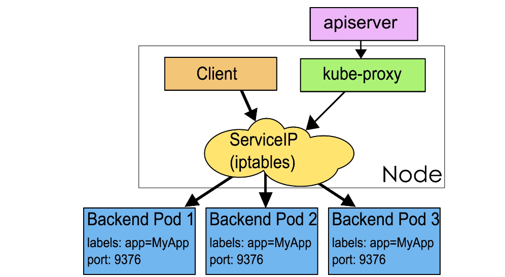

#### Service Spec

```
apiVersion: v1 kind: Service metadata:
name: nginx spec:
ports:
- port: 8078 # the port that this service should serve on
name: http
# the container on each pod to connect to, can be a name # (e.g. 'www') or a number (e.g. 80)
targetPort: 80
protocol: TCP
selector: app: nginx
```

#### 副本集(Replica Set)

- Pod 只是单个应用实例的抽象，要构建高可用应用，通常需要构建多个同样的副本，提供同一个服务。
- Kubernetes 为此抽象出副本集 ReplicaSet，其允许用户定义 Pod 的副本数，每一个 Pod 都会被当作一 个无状态的成员进行管理，Kubernetes 保证总是有用户期望的数量的 Pod 正常运行。
- 当某个副本宕机以后，控制器将会创建一个新的副本。
- 当因业务负载发生变更而需要调整扩缩容时，可以方便地调整副本数量。


#### 部署(Deployment)

- 部署表示用户对 Kubernetes 集群的一次更新操作。
- 部署是一个比 RS 应用模式更广的 API 对象，可以是创建一个新的服务，更新一个新的服务，也可以是滚动升级一个服务。
- 滚动升级一个服务，实际是创建一个新的 RS，然后逐渐将新 RS 中副本数增加到理想状态，将旧 RS 中的副本数减小到 0 的 复合操作。
- 这样一个复合操作用一个 RS 是不太好描述的，所以用一个更通用的 Deployment 来描述。
- 以 Kubernetes 的发展方向，未来对所有长期伺服型的的业务的管理，都会通过 Deployment 来管理。


#### Try it

通过类似 Docker run 的命令在 Kubernetes 运行容器
 kubectl run --image=nginx:alpine nginx-app --port=80 kubectl get deployment
 kubectl describe deployment/rs/pod

kubectl expose deployment nginx-app --port=80 --target-port=80 kubectl describe svc

kubectl describe ep

#### 有状态服务集(StatefulSet)

- 对于 StatefulSet 中的 Pod，每个 Pod 挂载自己独立的存储，如果一个 Pod 出现故障，从其他节点启动一个同样名字的 Pod，要挂载上原来 Pod 的存储继续以它的状态提供服务。
- 适合于 StatefulSet 的业务包括数据库服务 MySQL 和 PostgreSQL，集群化管理服务 ZooKeeper、etcd 等有状态服务。
- 使用 StatefulSet，Pod 仍然可以通过漂移到不同节点提供高可用，而存储也可以通过外挂的存储来提供高可靠性，StatefulSet 做的只是将确定的 Pod 与确定的存储关联起来保证状态的连续性。


#### Statefulset 与 Deployment 的差异

- 身份标识
  - StatefulSet Controller 为每个 Pod 编号，序号从0开始。
- 数据存储
  - StatefulSet 允许用户定义 volumeClaimTemplates，Pod 被创建的同时，Kubernetes 会以volumeClaimTemplates 中定义的模板创建存储卷，并挂载给 Pod。
- StatefulSet 的升级策略不同 
  - onDelete
  - 滚动升级 
  - 分片升级

#### 任务(Job)

- Job 是 Kubernetes 用来控制批处理型任务的 API 对象。
- Job 管理的 Pod 根据用户的设置把任务成功完成后就自动退出。
- 成功完成的标志根据不同的 spec.completions 策略而不同:
  - 单 Pod 型任务有一个 Pod 成功就标志完成;
  - 定数成功型任务保证有 N 个任务全部成功;
  - 工作队列型任务根据应用确认的全局成功而标志成功。

#### 后台支撑服务集(DaemonSet)

- 长期伺服型和批处理型服务的核心在业务应用，可能有些节点运行多个同类业务的 Pod，有些节点上又没有这类 Pod 运行;
- 而后台支撑型服务的核心关注点在 Kubernetes 集群中的节点(物理机或虚拟机)，要保证每个节点上都有一个此类 Pod 运行。
- 节点可能是所有集群节点也可能是通过 nodeSelector 选定的一些特定节点。
- 典型的后台支撑型服务包括存储、日志和监控等在每个节点上支撑 Kubernetes 集群运行的服务。


#### 存储 PV 和 PVC

- PersistentVolume(PV)是集群中的一块存储卷，可以由管理员手动设置， 或当用户创建 PersistentVolumeClaim(PVC)时根据 StorageClass 动 态设置。
- PV 和 PVC 与 Pod 生命周期无关。也就是说，当 Pod 中的容器重新启动、 Pod 重新调度或者删除时，PV 和 PVC 不会受到影响，Pod 存储于 PV 里 的数据得以保留。
- 对于不同的使用场景，用户通常需要不同属性(例如性能、访问模式等) 的 PV。

#### CustomResourceDefinition

- CRD 就像数据库的开放式表结构，允许用户自定义 Schema。
- 有了这种开放式设计，用户可以基于 CRD 定义一切需要的模型，满足不同 业务的需求。
- 社区鼓励基于 CRD 的业务抽象，众多主流的扩展应用都是基于 CRD 构建 的，比如 Istio、Knative。
- 甚至基于 CRD 推出了 Operator Mode 和 Operator SDK，可以以极低的 开发成本定义新对象，并构建新对象的控制器。

#### 课后练习 4.2

- 启动一个 Envoy Deployment。
- 要求 Envoy 的启动配置从外部的配置文件 Mount 进 Pod。
- 进入 Pod 查看 Envoy 进程和配置。
- 更改配置的监听端口并测试访问入口的变化。
- 通过非级联删除的方法逐个删除对象。