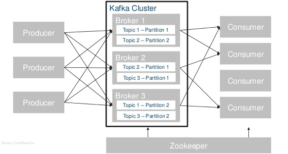

# Kafka

美团技术博客：https://blog.csdn.net/lizhitao/article/details/39499283

---

## 消息系统

### 什么是消息系统

消息系统是专用的中间件，负责在网络中传输数据。通常由专用的机器集群来实现，从发送方接收数据，再将数据转发给相应的接收方。

### 为什么使用消息系统

使用消息系统具有以下优势：

1. 将发送方和接收方解耦，统一使用消息系统提供的接口进行通信，易修改易扩展。
2. 能够持久化保存数据，防止处理数据失败导致数据丢失。
3. 分布式系统能够均衡负载，且能根据负载灵活调整机器数量，能够处理高吞吐量和流量突增的情况。

除此之外，消息系统还可以保障：

4. 一部分组件失效时，不会影响到整个系统。
5. 数据处理的顺序不被打乱。
6. 通过缓冲层控制和优化数据流经过系统的速度。
7. 提供了异步处理机制，允许用户把消息放入队列， 但并不立即处理它。

---

## kafka 

### kafka 是什么

kafka 作为当前最常用的消息系统之一，一般用于日志收集的离线系统。 kafka 使用 scala 开发，由 LinkedIn 开源，目前已捐献给 Apache 基金会。

### kafka 的优劣势

- **优势**：使用 partition 把一个队列的流量均匀分散在多台机器上，IO 吞吐量非常高。

- **劣势**：不进行消息重复性检查，可能导致消费重复数据或者异常情况下的数据丢失。实时性方面也存在少量延迟。

### 生产者/消费者模式



Kafka 有 3 个主要角色，Producer / Consumer / Broker，组件之间通过 Zookeeper 进行协调。Kafka Cluster 由多个 Broker 组成，是 Kafka Cluster 的服务端。

- `Producer`: 数据生产者，向 Kafka 集群生产数据。

- `Consumer`：数据消费者，连接 Broker 读取生产者生产的消息。

- `Broker`: Kafka 的服务节点，负责接收 Producer 生产的数据，在本地磁盘对数据进行备份，并提供数据给 Consumer。

- `Zookeeper`: 保存 Broker 和 Consumer 的元数据信息，并进行数据变更的监控。并负责选举出 Cluster 内的 Controller （其中一个 Broker），管理 Zookeeper 上的元数据信息。


### 数据分片模型


Kafka 消息按照 `Topic` 进行数据的组织和隔离，Producer/Consumer 会向指定的 Topic 收发数据。

Topic 按 `Patition` 进行分区，同一个 Topic 的 Partition 散落在不同的 Broker 上（物理上表现为 Blocking Queue），从而达到了数据分布式存储的目的。Producer 可以指定发送的 Partition 以保证消息有序到达。

每个 `Consumer Group` 都会消费一个 Topic 全量的数据，彼此之间互不干扰。同一个 Consumer Group 下的 Consumer 只能消费到其中一部分 Partition ，通过多个 Consumer 可以达到并行消费的目的。Partition 数量推荐设为 Consumer 数量的整数倍，便于均分。


### 多副本模型


为了提高可用性，避免 Broker 损坏导致的 Partition 不可用或者丢失问题，Kafka 会对每个 Partition 提供多个副本（默认为 3 个），同一个 Partition 的不同副本将存放在不同的 Broker 上。每个 Partition 都会在副本中选出一个唯一的 Leader，所有的读写请求都由 Leader 处理，其他副本从 Leader 处把数据更新同步到本地。

每个 Leader Partition 都有自己独立的 ISR ，记录当前能够 Catch-up 的副本集合。如果副本数据同步的延迟过高(延迟时间或者延迟条数超过阈值)，该副本会被暂时踢出 ISR（表示该 follower 暂时不可用）。Leader 不可用时将从 ISR 中选出另一个副本担任 Leader 。


### 消息定位


- `Offset`

表示 Message 在 Partition 中的偏移量，唯一确定了 Partition 中的一条 Message 。

- `Consumer Lag`

消息发送和消费位置的差值。每个 consumer group 相互独立，反映目前该 Consumer Group 整体消费滞后情况。

- `Log Segment`

partition 的内部分段，包括了一个数据文件和一个索引文件。使得可以在一个较小的数据文件中查找对应 offset 的 Message。


### 导入依赖

```xml
<!-- 导入 0.10.2 版本 kafka -->
<dependency>
    <groupId>org.apache.kafka</groupId>
    <artifactId>kafka-clients</artifactId>
    <version>0.10.2.0</version>
</dependency>
```


---

## Broker

在服务器搭建 Broker 。


**Step 1: 下载 Kafka 并解压**
 
```bash
tar -xzf kafka_2.9.2-0.8.1.1.tgz
cd kafka_2.9.2-0.8.1.1
```

**Step 2: 启动服务**

Zookeeper

```bash
bin/zookeeper-server-start.sh config/zookeeper.properties &
[2013-04-22 15:01:37,495] INFO Reading configuration from: config/zookeeper.properties (org.apache.zookeeper.server.quorum.QuorumPeerConfig)
```

Kafka

```bash
bin/kafka-server-start.sh config/server.properties
[2013-04-22 15:01:47,028] INFO Verifying properties (kafka.utils.VerifiableProperties)
[2013-04-22 15:01:47,051] INFO Property socket.send.buffer.bytes is overridden to 1048576 (kafka.utils.VerifiableProperties)
```


**Step 3: 创建 topic**

创建一个叫做 test 的 topic，它只有一个分区，一个副本。并查看。

```bash
bin/kafka-topics.sh --create --zookeeper localhost:2181 --replication-factor 1 --partitions 1 --topic test

bin/kafka-topics.sh --list --zookeeper localhost:2181 test
```

除了手动创建topic，还可以配置broker让它自动创建topic.


**Step 6: 搭建一个多个broker的集群**

刚才只是启动了单个broker，现在启动有3个broker组成的集群，这些broker节点也都是在本机上的：
首先为每个节点编写配置文件：
 
```bash
cp config/server.properties config/server-1.properties
cp config/server.properties config/server-2.properties
```

---

### 生产者

Producer将消息发布到它指定的topic中,并负责决定发布到哪个分区。通常简单的由负载均衡机制随机选择分区，但也可以通过特定的分区函数选择分区。使用的更多的是第二种。

Kafka只能保证一个分区之内消息的有序性，在不同的分区之间是不可以的，这已经可以满足大部分应用的需求。如果需要topic中所有消息的有序性，那就只能让这个topic只有一个分区，当然也就只有一个consumer组消费它。

Kafka Producer既支持同步发送消息，也支持异步发送消息，相比同步发送消息，从流程上就是多了一个保存消息的Blocking Queue和从Blocking Queue取消息并组装消息的ProuducerSendThread，当然对客户端来说，使用异步方式调用send(message)发送消息会立刻返回。

```java
import java.util.Properties;
import java.util.Random;

import org.apache.kafka.clients.producer.KafkaProducer;
import org.apache.kafka.clients.producer.ProducerConfig;
import org.apache.kafka.clients.producer.ProducerRecord;
import org.apache.kafka.common.serialization.StringSerializer;

public class Producer {
    public static String topic = "test";                                                            

    public static void main(String[] args) throws InterruptedException {
        // 配置 kafka
        Properties p = new Properties();
        p.put(ProducerConfig.BOOTSTRAP_SERVERS_CONFIG, "192.168.23.76:9092,192.168.23.77:9092");          // kafka 地址，多个地址用逗号分割（必备）
        p.put(ProducerConfig.KEY_SERIALIZER_CLASS_CONFIG, StringSerializer.class);                        // key 的序列化类（必备）
        p.put(ProducerConfig.VALUE_SERIALIZER_CLASS_CONFIG, StringSerializer.class);                      // value 的序列化类（必备）
        p.put("request.required.acks", "-1");                                                             // 消息系统向发送者返回 ACK： 0 马上 / 1 主服务器收到 / -1 所有服务器收到后                           
        p.put("producer.type", "async");                                                                  // 异步生产，批量存入缓存后再发到服务器

        // 填充配置,初始化生产者
        KafkaProducer<String, String> kafkaProducer = new KafkaProducer<>(p);

        // 向指定主题发送消息
        try {
            while (true) {
                String msg = "Hello," + new Random().nextInt(100);
                ProducerRecord<String, String> record = new ProducerRecord<String, String>(topic, msg);   // 指定消息和要发送到的主题
                kafkaProducer.send(record);                                                               // 发送消息，可以通过返回的 Future 判断是否已经发送到 kafka
                // kafkaProducer.send(record);                                                               使用 send 的第二个参数来回调，通过回调判断是否发送成功
                System.out.println("消息发送成功:" + msg);
                Thread.sleep(500);
            }
        } finally {
            kafkaProducer.close();
        }

    }
}
```


### 消费者

```java
import java.util.Collections;
import java.util.Properties;

import org.apache.kafka.clients.consumer.ConsumerConfig;
import org.apache.kafka.clients.consumer.ConsumerRecord;
import org.apache.kafka.clients.consumer.ConsumerRecords;
import org.apache.kafka.clients.consumer.KafkaConsumer;
import org.apache.kafka.common.serialization.StringDeserializer;

public class Consumer {
    public static void main(String[] args) {
        // 配置 kafka
        Properties p = new Properties();
        p.put(ConsumerConfig.BOOTSTRAP_SERVERS_CONFIG, "192.168.23.76:9092");                            // zookeeper 地址
        p.put(ConsumerConfig.KEY_DESERIALIZER_CLASS_CONFIG, StringDeserializer.class);                   // key 的反序列化类
        p.put(ProducerConfig.VALUE_SERIALIZER_CLASS_CONFIG, StringSerializer.class);                     // value 的序列化类
        p.put(ConsumerConfig.GROUP_ID_CONFIG, "duanjt_test");                                            // 消费者分组名                                

        // 填充配置,初始化消费者
        KafkaConsumer<String, String> kafkaConsumer = new KafkaConsumer<String, String>(p);
        // 向指定主题订阅消息
        kafkaConsumer.subscribe(Collections.singletonList(Producer.topic));

        while (true) {
            // 从订阅接收消息
            ConsumerRecords<String, String> records = kafkaConsumer.poll(100);
            for (ConsumerRecord<String, String> record : records) {
                System.out.println(String.format("topic:%s,offset:%d,消息:%s", //
                        record.topic(), record.offset(), record.value()));
            }
        }
    }
}
```


https://www.cnblogs.com/itwild/p/12287850.html

https://blog.csdn.net/camel84/article/details/81879118