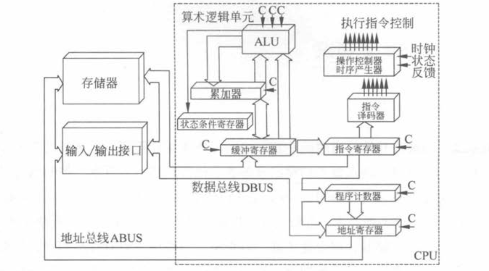
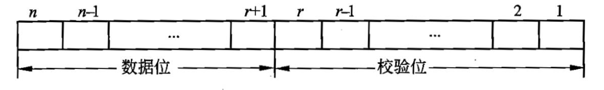

# 第 1 章  计算机系统知识

## 1.1 计算机系统基础知识

### 1.1.1 计算机系统硬件基本组成

计算机系统是由硬件和软件组成的，它们协同工作来运行程序。

计算机的基本硬件系统由运算器、控制器、存储器、输入设备和输出设备5大部件组成。

运算器、控制器等部件被集成在一起统称为中央处理单元(Central Processing Unit, CPU) 。

CPU是硬件系统的核心，用于数据的加工处理，能完成各种算术、逻辑运算及控制功能。

存储器是计算机系统中的记忆设备， 分为内部存储器和外部存储器。前者速度高、 容量小，一般用于临时存放程序、数据及中间结 果。 而后者容量大、速度慢，可以长期保存程序和数据。

输入设备和输出设备合称为外部设备(简称外设)，输入设备用于输入原始数据及各种命令，而输出设备则用于输出计算机运行的结果。

### 1.1.2 中央处理单元

中央处理单元(CPU) 是计算机系统的核心部件，它负责获取程序指令、对指令进行译码 并加以执行。

#### 1. CPU的功能

- 程序控制。CPU通过执行指令来控制程序的执行顺序，这是CPU的重要功能。

- 操作控制。一条指令功能的实现需要若干操作信号配合来完成，CPU产生每条指令的 操作信号将操作信号送往对应的部件，控制相应的部件按指令的功能要求进行操作。

- 时间控制。CPU对各种操作进行时间上的控制，即指令执行过程中操作信号的出现时 间、持续时间及出现的时间顺序都需要进行严格控制。

- 数据处理。CPU通过对数据进行算术运算及逻辑运算等方式进行加工处理，数据加工 处理的结果被人们所利用。所以，对数据的加工处理也是CPU最根本的任务。

此外，CPU还需要对系统内部和外部的中断(异常)做出响应，进行相应的处理。

#### 2. CPU的组成

CPU主要由运算器、控制器、寄存器组和内部总线等部件组成

##### 运算器

运算器由算术逻辑单元(Arithmetic and Logic Unit, ALU)、累加寄存器、数据缓冲寄存器和状态条件寄存器等组成，它是数据加工处理部件，用于完成计算机的各种算术和逻辑运算。相对控制器而言，运算器接受控制器的命令而进行动作，即运算器所进行的全部操作都是由控 制器发出的控制信号来指挥的，所以它是执行部件。运算器有如下两个主要功能。

1. 执行所有的算术运算，例如加、减、乘、除等基本运算及附加运算。

2. 执行所有的逻辑运算并进行逻辑测试，例如与、或、非、零值测试或两个值的比较等。

下面简要介绍运算器中各组成部件的功能。

- 算术逻辑单元(ALU)

ALU是运算器的重要组成部件，负责处理数据，实现对数据的算术运算和逻辑运算。

- 累加寄存器(AC) 

AC通常简称为累加器，它是一个通用寄存器，其功能是当运算器的算术逻辑单元执行算术或逻辑运算时，为 ALU提供一个工作区。例如，在执行一个减法 运算前，先将被减数取出暂存在AC中，再从内存储器中取出减数，然后同AC的内容相减， 将所得的结果送回AC中。运算的结果是放在累加器中的，运算器中至少要有一个累加寄存器。

- 数据缓冲寄存器(DR)

在对内存储器进行读/写操作时，用DR暂时存放由内存储器读/写的一条指令或一个数据字，将不同时间段内读/写的数据隔离开来。DR的主要作用为:

作为CPU和内存、外部设备之间数据传送的中转站;作为CPU和内存、外围设备之间在操作 速度上的缓冲;在单累加器结构的运算器中，数据缓冲寄存器还可兼作为操作数寄存器。

- 状态条件寄存器(PSW)

PSW保存由算术指令和逻辑指令运行或测试的结果建立 的各种条件码内容，主要分为状态标志和控制标志，例如运算结果进位标志(C) 、运算结果 溢出标志(V)、运算结果为0标志(Z)、运算结果为负标志(N)、中断标志(I)、方向标 志 (D)和单步标志等。**这些标志通常分别由1位触发器保存，保存了当前指令执行完成之后的状态。**通常，一个算术操作产生一个运算结果，而一个逻辑操作产生一个判决。

##### 控制器

运算器只能完成运算，而控制器用于控制整个CPU的工作，它决定了计算机运行过程的 自动化。它不仅要保证程序的正确执行，而且要能够处理异常事件。控制器一般包括**指令控制逻辑**、**时序控制逻辑**、**总线控制逻辑**和**中断控制逻辑**等几个部分。

指令控制逻辑要完成取指令、分析指令和执行指令的操作，其过程分为取指令、指令译码、按指令操作码执行、形成下一条指令地址等步骤。

- 指令寄存器(IR)

当CPU执行一条指令时，先把它从内存储器取到缓冲寄存器中，再送入IR暂存，指令译码器根据IR的内容产生各种微操作指令，控制其他的组成部件工作， 完成所需的功能。

- 程序计数器(PC)

**PC具有寄存信息和计数两种功能，又称为指令计数器。**程序的 执行分两种情况，一是顺序执行，二是转移执行。在程序开始执行前，将程序的起始地址送入PC,该地址在程序加载到内存时确定，因此PC的内容即是程序第一条指令的地址。执行指令 时，CPU自动修改PC的内容，以便使其保持的总是将要执行的下一条指令的地址。由于大多数指令都是按顺序来执行的，所以修改的过程通常只是简单地对PC加 1。当遇到转移指令时， 后继指令的地址根据当前指令的地址加上一个向前或向后转移的位移量得到，或者根据转移指 令给出的直接转移的地址得到。

- 地址寄存器(AR)

AR保存当前CPU所访问的内存单元的地址。由于内存和CPU 存在着操作速度上的差异，所以需要使用AR保持地址信息，直到内存的读/写操作完成为止。 

- 指令译码器(ID)

指令包含操作码和地址码两部分，为了能执行任何给定的指令，必须对操作码进行分析，以便识别所完成的操作。指令译码器就是对指令中的操作码字段进行 分析解释，识别该指令规定的操作，向操作控制器发出具体的控制信号，控制各部件工作，完 成所需的功能。

时序控制逻辑要为每条指令按时间顺序提供应有的控制信号。

总线逻辑是为多个功能部件服务的信息通路的控制电路。中断控制逻辑用于控制各种中断请求，并根据优先级的高低对中断请求进行排队，逐个交给CPU处理。

##### 寄存器组

寄存器组可分为**专用寄存器**和**通用寄存器**。运算器和控制器中的寄存器是专用寄存器，其 作用是固定的。通用寄存器用途广泛并可由程序员规定其用途，其数目因处理器不同有所差异。

#### 3.多核**CPU**

核心又称为内核，是 CPU最重要的组成部分。CPU中心那块隆起的芯片就是核心，是由 单晶硅以一定的生产工艺制造出来的，CPU所有的计算、接收/存储命令、处理数据都由核心 执行。各种CPU核心都具有固定的逻辑结构，一级缓存、二级缓存、执行单元、指令级单元和总线接口等逻辑单元都会有合理的布局。

多核即在一个单芯片上面集成两个甚至更多个处理器内核，其中，每个内核都有自己的逻辑单元、控制单元、中断处理器、运算单元，一级Cache、二级Cache共享或独有，其部件的 完整性和单核处理器内核相比完全一致。

CPU的主要厂商AMD和Intel的双核技术在物理结构上有所不同。**AMD将两个内核做在一个Die (晶元)上，通过直连架构连接起来，集成度更高。****Intel则是将放在不同核心上的两 个内核封装在一起**，因此将Intel的方案称为“双芯”，将 AMD的方案称为“双核”。从用户端的角度来看，AMD的方案能够使双核CPU的管脚、功耗等指标跟单核CPU保持一致，从 单核升级到双核，不需要更换电源、芯片组、散热系统和主板，只需要刷新BIOS软件即可。

多核CPU系统最大的优点(也是开发的最主要目的)是可满足用户同时进行多任务处理的要求。

单核多线程CPU是交替地转换执行多个任务，只不过交替转换的时间很短，用户一般感 觉不出来。如果同时执行的任务太多，就会感觉到“慢”或者“卡”。而多核在理论上则是在 任何时间内每个核执行各自的任务，不存在交替问题。因此，单核多线程和多核(一般每核也 是多线程的)虽然都可以执行多任务，但多核的速度更快。

虽然釆用了 Intel 超线程技术的单核可以视为是双核，4核可以视为是8核。然而，视为是 8核一般比不上实际是8核的CPU性能。

要发挥CPU的多核性能，就需要操作系统能够及时、合理地给各个核分配任务和资源(如 缓存、总线、内存等)，也需要应用软件在运行时可以把并行的线程同时交付给多个核心分别处理。

### 1.1.3 数据表示

各种数值在计算机中表示的形式称为机器数，其特点是釆用二进制计数制，数的符号用0和 1表示，小数点则隐含，表示不占位置。机器数对应的实际数值称为数的真值。

**机器数有无符号数和带符号数之分。**无符号数表示正数，在机器数中没有符号位。对于无 符号数，若约定小数点的位置在机器数的最低位之后，则是纯整数;若约定小数点的位置在机 器数的最高位之前，则是纯小数。对于带符号数，机器数的最高位是表示正、负的符号位，其

余位则表示数值。 为了便于运算，带符号的机器数可采用原码、反码和补码等不同的编码方法，机器数的这些编码方法称为码制。

#### 1.原码表示法

在原码表示法中，最g位是符号位，0表示正号，1表示负号，其余的《-1位表示数值的 绝对值。

数值0的原码表示有两种形式:[+0]原=0 0000000，[-0]原=1 0000000。

#### 2.反码表示法

在反码表示中，最高位是符号位，0 表示正号，1 表示负号，正数的反码与原码相同，负 数的反码则是其绝对值按位求反。

[+0]反=o 0000000，[-0]反=1 1111111。

#### 3.补码表示法

在补码表示中，最高位为符号位，0 表示正号，1 表示负号，正数的补码与其原码和反码 相同,负数的补码则等于其反码的末位加1。

在补码表示中，0有唯一的编码:[+0]补=0 0000000，[-0]补=00000000 0

#### 4.移码表示法

移码表示法是在数Z 上增加一个偏移量来定义的，常用于表示浮点数中的阶码。

实际上，在偏移的情况下，只要将补码的符号位取反便可获得相应的移码表示。

#### 5.定点数

所谓定点数，就是小数点的位置固定不变的数。小数点的位置通常有两种约定方式:

定点整数(纯整数，小数点在最低有效数值位之后)。

定点小数(纯小数，小数点在最高有效数值位之前)。

#### 6.浮点数

当机器字长为n时，定点数的补码和移码可表示2^n个数，而其原码和反码只 能表示2^n-1个数(0的表示占用了两个编码)，因此，定点数所能表示的数值范围比较小，在运算中很容易因结果超出范围而溢出。

浮点数是小数点位置不固定的数，它能表示更大范围的数。

例如，二进制数1011.10101 可以写成24X0.101110101、25X0.0101110101 或26X0.00101110101 等。

由此可知，一个二进制数N可以表示为更一般的形式N=2^ExF，其中E称为阶码，F称为尾数。用阶码和尾数表示的数称为浮点数，这种表示数的方法称为浮点表示法。

#### 7.浮点数的运算

### 1.1.4 校验码

计算机系统运行时，为了确保数据在传送过程中正确无误，一是提高硬件电路的可靠性， 二是提高代码的校验能力，包括查错和纠错。

通常使用校验码的方法来检测传送的数据是否出错。

其基本思想是把数据可能出现的编码分为两类:合法编码和错误编码。

合法编码用于传送 数据，错误编码是不允许在数据中出现的编码。合理地设计错误编码以及编码规则，使得数据 在传送中出现某种错误时会变成错误编码，这样就可以检测出接收到的数据是否有错。

#### 1.奇偶校验码

奇偶校验(Parity Codes)是一种简单有效的校验方法。

这种方法通过在编码中增加一位 校验位来使编码中1的个数为奇数(奇校验)或者为偶数(偶校验)，从而使码距变为2。

对 于奇校验，它可以检测代码中奇数位出错的编码，但不能发现偶数位出错的情况，即当合法编 码中的奇数位发生了错误时，即编码中的1变成0或0变成1，则该编码中1的个数的奇偶性 就发生了变化，从而可以发现错误。

常用的奇偶校验码有3种:水平奇偶校验码、垂直奇偶校验码和水平垂直校验码。

#### 2.海明码

海明码(Hamming Code)是由贝尔实验室的Richard Hamming设计的，是一种利用奇偶 性来检错和纠错的校验方法。海明码的构成方法是在数据位之间的特定位置上插入免个校验 位，通过扩大码距来实现检错和纠错。

#### 3.循环冗余校验码

循环冗余校验码(Cyclic Redundancy Check, CRC)广泛应用于数据通信领域和磁介质 存储系统中。

它利用生成多项式为k个数据位产生r个校验位来进行编码，其编码长度为k+r。 CRC的代码格式为:

由此可知，循环冗余校验码是由两部分组成的，左边为信息码(数据)，右边为校验码。

若信息码占k位，则校验码就占n-k位。其中，n为CRC码的字长，所以又称为(n,k)码。

校验码是由信息码产生的，校验码位数越多，该代码的校验能力就越强。在求CRC编码时， 釆用的是模2运算。模2加减运算的规则是按位运算，不发生借位和进位。

## 1.2 计算机体系结构

### 1.2.1 计算机体系结构的发展

#### 1.计算机系统结构概述

计算机体系结构、计算机组织和计算机实现三者的关系如下。

- 计算机体系结构(Computer Architecture)是指计算机的概念性结构和功能属性。
- 计算机组织(Computer Organization)是指计算机体系结构的逻辑实现，包括机器内的 数据流和控制流的组成以及逻辑设计等(常称为计算机组成原理)。
- 计算机实现(Computer Implementation)是指计算机组织的物理实现。

#### 2.计算机体系结构分类

(1) 从宏观上按处理机的数量进行分类，分为单处理系统、并行处理与多处理系统和分布 式处理系统。

- 单处理系统(Uni-processing System)。利用一个处理单元与其他外部设备结合起来， 实现存储、计算、通信、输入与输出等功能的系统。
- 并行处理与多处理系统(Parallel Processing and Multiprocessing System)。为了充分发 挥问题求解过程中处理的并行性，将两个以上的处理机互连起来，彼此进行通信协调，以便共同求解一个大问题的计算机系统。
- 分布式处理系统(Distributed Processing System)。指物理上远距离而松親合的多计算机系统。其中，.物理上的远距离意味着通信时间与处理时间相比己不可忽略，在通信线路上的数据传输速率要比在处理机内部总线上传输慢得多，这也正是松耦合的含义。

(2) 从微观上按并行程度分类，有Flynn分类法、冯泽云分类法、Handler分类法和Kuck 分类法。

- Flynn分类法。1966年，MJ.Flynn提出按指令流和数据流的多少进行分类。指令流为 机器执行的指令序列，数据流是由指令调用的数据序列。
- 冯泽云分类法。1972年，美籍华人冯泽云(Tse-yun Feng) 提出按并行度对各种计算 机系统进行结构分类。所谓最大并行度Pm是指计算机系统在单位时间内能够处理的 最大二进制位数。
- Handler分类法。1977年，德国的汉德勒(Wolfgang Handler)提出一个基于硬件并行 程度计算并行度的方法，把计算机的硬件结构分为3个层次:处理机级、每个处理机 中的算逻单元级、每个算逻单元中的逻辑门电路级。分别计算这三级中可以并行或流 水处理的程序，即可算出某系统的并行度。
- Kuck分类法。1978年，美国的库克(David J.Kuck)提出与Flynn分类法类似的方法, 用指令流和执行流(Execution Stream)及其多重性来描述计算机系统控制结构的特征。 Kuck把系统结构分为单指令流单执行流(SISE)、单指令流多执行流(SIME)、多 指令流单执行流(MISE)和多指令流多执行流(MIME) 4类。

#### 3.指令系统

一个处理器支持的指令和指令的字节级编码称为其指令集体系结构(Instruction Set Architecture, ISA)，不同的处理器族支持不同的指令集体系结构，因此，一个程序被编译在 一种机器上运行，往往不能在另一种机器上运行。

##### 1.指令集体系结构的分类

从体系结构的观点对指令集进行分类，可以根据下述5个方面。

(1)操作数在CPU中的存储方式，即操作数从主存中取出后保存在什么地方。 

(2)显式操作数的数量，即在典型的指令中有多少个显式命名的操作数。 

(3)操作数的位置，即任一个ALU指令的操作数能否放在主存中，如何定位。

(4)指令的操作，即在指令集中提供哪些操作。

(5)操作数的类型与大小。

##### 2.CISC 和 RISC

(1) CISC (Complex Instruction Set Computer,复杂指令集计算机)的基本思想是进一步增强原有指令的功能，用更为复杂的新指令取代原先由软件子程序完成的功能，实现软件功能的 硬化，导致机器的指令系统越来越庞大、复杂。事实上，目前使用的绝大多数计算机都属于CISC 类型。

CISC的主要弊端如下。

1. 指令集过分庞杂。
2. 微程序技术是CISC的重要支柱,每条复杂指令都要通过执行一段解释性微程序才能完成，这就需要多个CPU周期，从而降低了机器的处理速度。
3. 由于指令系统过分庞大，使高级语言编译程序选择目标指令的范围很大，并使编译程序本身冗长、复杂，从而难以优化编译使之生成真正高效的目标代码。
4. CISC强调完善的中断控制，势必导致动作繁多、设计复杂、研制周期长。
5. CISC给芯片设计带来很多困难，使芯片种类增多，出错几率增大，成本提高而成品降低。

(2) RISC (Reduced Instruction Set Computer,精简指令集计算机)的基本思想是通过减少指令总数和简化指令功能降低硬件设计的复杂度，使指令能单周期执行，并通过优化编译提高指令的执行速度，采用硬布线控制逻辑优化编译程序。

RISC的关键技术如下。

1. 重叠寄存器窗口技术。
2. 优化编译技术。RISC使用了大量的寄存器，如何合理地分配寄存器、提高寄存器的使 用效率及减少访存次数等，都应通过编译技术的优化来实现。
3. 超流水及超标量技术。为了进一步提高流水线速度而采用的技术。
4. 硬布线逻辑与微程序相结合在微程序技术中。

(3)优化。

##### 3.指令的流水处理

###### (1)指令控制方式。

- 顺序方式。
- 重叠方式。
- 流水方式。

###### (2)流水线的种类。

1. 从流水的级别上，可分为部件级、处理机级以及系统级的流水。
2. 从流水的功能上，可分为单功能流水线和多功能流水线。
3. 从流水的连接上，可分为静态流水线和动态流水线。
4. 从流水是否有反馈回路，可分为线性流水线和非线性流水线。
5. 从流水的流动顺序上，可分为同步流水线和异步流水线。
6. 从流水线的数据表示上，可分为标量流水线和向量流水线。

###### (3)流水的相关处理。

###### (4)吞吐率和流水建立时间。

#### 4.阵列处理机、并行处理机和多处理机

### 1.2.2 储存系统

### 1.2.3 输入/输出技术

### 1.2.4 总线结构

## 1.3 安全性、可靠性与系统性能评测

### 1.3.1 计算机安全概述

### 1.3.2 解密技术和认证技术

### 1.3.3 计算机可靠性

### 1.3.4 计算机系统的性能评价

