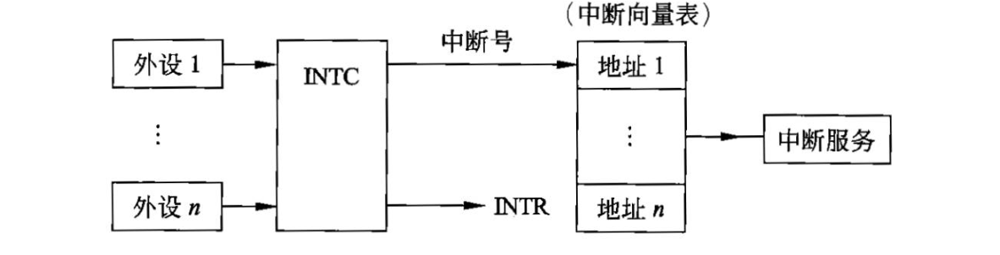

# 第 1 章  计算机系统知识

## 1.1 计算机系统基础知识

### 1.1.1 计算机系统硬件基本组成

计算机系统是由硬件和软件组成的，它们协同工作来运行程序。

计算机的基本硬件系统由运算器、控制器、存储器、输入设备和输出设备5大部件组成。

运算器、控制器等部件被集成在一起统称为中央处理单元(Central Processing Unit, CPU) 。

CPU是硬件系统的核心，用于数据的加工处理，能完成各种算术、逻辑运算及控制功能。

存储器是计算机系统中的记忆设备， 分为内部存储器和外部存储器。前者速度高、 容量小，一般用于临时存放程序、数据及中间结 果。 而后者容量大、速度慢，可以长期保存程序和数据。

输入设备和输出设备合称为外部设备(简称外设)，输入设备用于输入原始数据及各种命令，而输出设备则用于输出计算机运行的结果。

### 1.1.2 中央处理单元

中央处理单元(CPU) 是计算机系统的核心部件，它负责获取程序指令、对指令进行译码 并加以执行。

#### 1. CPU的功能

- 程序控制。CPU通过执行指令来控制程序的执行顺序，这是CPU的重要功能。

- 操作控制。一条指令功能的实现需要若干操作信号配合来完成，CPU产生每条指令的 操作信号将操作信号送往对应的部件，控制相应的部件按指令的功能要求进行操作。

- 时间控制。CPU对各种操作进行时间上的控制，即指令执行过程中操作信号的出现时 间、持续时间及出现的时间顺序都需要进行严格控制。

- 数据处理。CPU通过对数据进行算术运算及逻辑运算等方式进行加工处理，数据加工 处理的结果被人们所利用。所以，对数据的加工处理也是CPU最根本的任务。

此外，CPU还需要对系统内部和外部的中断(异常)做出响应，进行相应的处理。

#### 2. CPU的组成

CPU主要由运算器、控制器、寄存器组和内部总线等部件组成

##### 运算器

运算器由算术逻辑单元(Arithmetic and Logic Unit, ALU)、累加寄存器、数据缓冲寄存器和状态条件寄存器等组成，它是数据加工处理部件，用于完成计算机的各种算术和逻辑运算。相对控制器而言，运算器接受控制器的命令而进行动作，即运算器所进行的全部操作都是由控 制器发出的控制信号来指挥的，所以它是执行部件。运算器有如下两个主要功能。

1. 执行所有的算术运算，例如加、减、乘、除等基本运算及附加运算。

2. 执行所有的逻辑运算并进行逻辑测试，例如与、或、非、零值测试或两个值的比较等。

下面简要介绍运算器中各组成部件的功能。

- 算术逻辑单元(ALU)

ALU是运算器的重要组成部件，负责处理数据，实现对数据的算术运算和逻辑运算。

- 累加寄存器(AC) 

AC通常简称为累加器，它是一个通用寄存器，其功能是当运算器的算术逻辑单元执行算术或逻辑运算时，为 ALU提供一个工作区。例如，在执行一个减法 运算前，先将被减数取出暂存在AC中，再从内存储器中取出减数，然后同AC的内容相减， 将所得的结果送回AC中。运算的结果是放在累加器中的，运算器中至少要有一个累加寄存器。

- 数据缓冲寄存器(DR)

在对内存储器进行读/写操作时，用DR暂时存放由内存储器读/写的一条指令或一个数据字，将不同时间段内读/写的数据隔离开来。DR的主要作用为:

作为CPU和内存、外部设备之间数据传送的中转站;作为CPU和内存、外围设备之间在操作 速度上的缓冲;在单累加器结构的运算器中，数据缓冲寄存器还可兼作为操作数寄存器。

- 状态条件寄存器(PSW)

PSW保存由算术指令和逻辑指令运行或测试的结果建立 的各种条件码内容，主要分为状态标志和控制标志，例如运算结果进位标志(C) 、运算结果 溢出标志(V)、运算结果为0标志(Z)、运算结果为负标志(N)、中断标志(I)、方向标 志 (D)和单步标志等。**这些标志通常分别由1位触发器保存，保存了当前指令执行完成之后的状态。**通常，一个算术操作产生一个运算结果，而一个逻辑操作产生一个判决。

##### 控制器

运算器只能完成运算，而控制器用于控制整个CPU的工作，它决定了计算机运行过程的 自动化。它不仅要保证程序的正确执行，而且要能够处理异常事件。控制器一般包括**指令控制逻辑**、**时序控制逻辑**、**总线控制逻辑**和**中断控制逻辑**等几个部分。

指令控制逻辑要完成取指令、分析指令和执行指令的操作，其过程分为取指令、指令译码、按指令操作码执行、形成下一条指令地址等步骤。

- 指令寄存器(IR)

当CPU执行一条指令时，先把它从内存储器取到缓冲寄存器中，再送入IR暂存，指令译码器根据IR的内容产生各种微操作指令，控制其他的组成部件工作， 完成所需的功能。

- 程序计数器(PC)

**PC具有寄存信息和计数两种功能，又称为指令计数器。**程序的 执行分两种情况，一是顺序执行，二是转移执行。在程序开始执行前，将程序的起始地址送入PC,该地址在程序加载到内存时确定，因此PC的内容即是程序第一条指令的地址。执行指令 时，CPU自动修改PC的内容，以便使其保持的总是将要执行的下一条指令的地址。由于大多数指令都是按顺序来执行的，所以修改的过程通常只是简单地对PC加 1。当遇到转移指令时， 后继指令的地址根据当前指令的地址加上一个向前或向后转移的位移量得到，或者根据转移指 令给出的直接转移的地址得到。

- 地址寄存器(AR)

AR保存当前CPU所访问的内存单元的地址。由于内存和CPU 存在着操作速度上的差异，所以需要使用AR保持地址信息，直到内存的读/写操作完成为止。 

- 指令译码器(ID)

指令包含操作码和地址码两部分，为了能执行任何给定的指令，必须对操作码进行分析，以便识别所完成的操作。指令译码器就是对指令中的操作码字段进行 分析解释，识别该指令规定的操作，向操作控制器发出具体的控制信号，控制各部件工作，完 成所需的功能。

时序控制逻辑要为每条指令按时间顺序提供应有的控制信号。

总线逻辑是为多个功能部件服务的信息通路的控制电路。中断控制逻辑用于控制各种中断请求，并根据优先级的高低对中断请求进行排队，逐个交给CPU处理。

##### 寄存器组

寄存器组可分为**专用寄存器**和**通用寄存器**。运算器和控制器中的寄存器是专用寄存器，其 作用是固定的。通用寄存器用途广泛并可由程序员规定其用途，其数目因处理器不同有所差异。

#### 3.多核**CPU**

核心又称为内核，是 CPU最重要的组成部分。CPU中心那块隆起的芯片就是核心，是由 单晶硅以一定的生产工艺制造出来的，CPU所有的计算、接收/存储命令、处理数据都由核心 执行。各种CPU核心都具有固定的逻辑结构，一级缓存、二级缓存、执行单元、指令级单元和总线接口等逻辑单元都会有合理的布局。

多核即在一个单芯片上面集成两个甚至更多个处理器内核，其中，每个内核都有自己的逻辑单元、控制单元、中断处理器、运算单元，一级Cache、二级Cache共享或独有，其部件的 完整性和单核处理器内核相比完全一致。

CPU的主要厂商AMD和Intel的双核技术在物理结构上有所不同。**AMD将两个内核做在一个Die (晶元)上，通过直连架构连接起来，集成度更高。****Intel则是将放在不同核心上的两 个内核封装在一起**，因此将Intel的方案称为“双芯”，将 AMD的方案称为“双核”。从用户端的角度来看，AMD的方案能够使双核CPU的管脚、功耗等指标跟单核CPU保持一致，从 单核升级到双核，不需要更换电源、芯片组、散热系统和主板，只需要刷新BIOS软件即可。

多核CPU系统最大的优点(也是开发的最主要目的)是可满足用户同时进行多任务处理的要求。

单核多线程CPU是交替地转换执行多个任务，只不过交替转换的时间很短，用户一般感 觉不出来。如果同时执行的任务太多，就会感觉到“慢”或者“卡”。而多核在理论上则是在 任何时间内每个核执行各自的任务，不存在交替问题。因此，单核多线程和多核(一般每核也 是多线程的)虽然都可以执行多任务，但多核的速度更快。

虽然釆用了 Intel 超线程技术的单核可以视为是双核，4核可以视为是8核。然而，视为是 8核一般比不上实际是8核的CPU性能。

要发挥CPU的多核性能，就需要操作系统能够及时、合理地给各个核分配任务和资源(如 缓存、总线、内存等)，也需要应用软件在运行时可以把并行的线程同时交付给多个核心分别处理。

### 1.1.3 数据表示

各种数值在计算机中表示的形式称为机器数，其特点是釆用二进制计数制，数的符号用0和 1表示，小数点则隐含，表示不占位置。机器数对应的实际数值称为数的真值。

**机器数有无符号数和带符号数之分。**无符号数表示正数，在机器数中没有符号位。对于无 符号数，若约定小数点的位置在机器数的最低位之后，则是纯整数;若约定小数点的位置在机 器数的最高位之前，则是纯小数。对于带符号数，机器数的最高位是表示正、负的符号位，其

余位则表示数值。 为了便于运算，带符号的机器数可采用原码、反码和补码等不同的编码方法，机器数的这些编码方法称为码制。

#### 1.原码表示法

在原码表示法中，最g位是符号位，0表示正号，1表示负号，其余的《-1位表示数值的 绝对值。

数值0的原码表示有两种形式:[+0]原=0 0000000，[-0]原=1 0000000。

#### 2.反码表示法

在反码表示中，最高位是符号位，0 表示正号，1 表示负号，正数的反码与原码相同，负 数的反码则是其绝对值按位求反。

[+0]反=o 0000000，[-0]反=1 1111111。

#### 3.补码表示法

在补码表示中，最高位为符号位，0 表示正号，1 表示负号，正数的补码与其原码和反码 相同,负数的补码则等于其反码的末位加1。

在补码表示中，0有唯一的编码:[+0]补=0 0000000，[-0]补=00000000 0

#### 4.移码表示法

移码表示法是在数Z 上增加一个偏移量来定义的，常用于表示浮点数中的阶码。

实际上，在偏移的情况下，只要将补码的符号位取反便可获得相应的移码表示。

#### 5.定点数

所谓定点数，就是小数点的位置固定不变的数。小数点的位置通常有两种约定方式:

定点整数(纯整数，小数点在最低有效数值位之后)。

定点小数(纯小数，小数点在最高有效数值位之前)。

#### 6.浮点数

当机器字长为n时，定点数的补码和移码可表示2^n个数，而其原码和反码只 能表示2^n-1个数(0的表示占用了两个编码)，因此，定点数所能表示的数值范围比较小，在运算中很容易因结果超出范围而溢出。

浮点数是小数点位置不固定的数，它能表示更大范围的数。

例如，二进制数1011.10101 可以写成24X0.101110101、25X0.0101110101 或26X0.00101110101 等。

由此可知，一个二进制数N可以表示为更一般的形式N=2^ExF，其中E称为阶码，F称为尾数。用阶码和尾数表示的数称为浮点数，这种表示数的方法称为浮点表示法。

#### 7.浮点数的运算

### 1.1.4 校验码

计算机系统运行时，为了确保数据在传送过程中正确无误，一是提高硬件电路的可靠性， 二是提高代码的校验能力，包括查错和纠错。

通常使用校验码的方法来检测传送的数据是否出错。

其基本思想是把数据可能出现的编码分为两类:合法编码和错误编码。

合法编码用于传送 数据，错误编码是不允许在数据中出现的编码。合理地设计错误编码以及编码规则，使得数据 在传送中出现某种错误时会变成错误编码，这样就可以检测出接收到的数据是否有错。

#### 1.奇偶校验码

奇偶校验(Parity Codes)是一种简单有效的校验方法。

这种方法通过在编码中增加一位 校验位来使编码中1的个数为奇数(奇校验)或者为偶数(偶校验)，从而使码距变为2。

对 于奇校验，它可以检测代码中奇数位出错的编码，但不能发现偶数位出错的情况，即当合法编 码中的奇数位发生了错误时，即编码中的1变成0或0变成1，则该编码中1的个数的奇偶性 就发生了变化，从而可以发现错误。

常用的奇偶校验码有3种:水平奇偶校验码、垂直奇偶校验码和水平垂直校验码。

#### 2.海明码

海明码(Hamming Code)是由贝尔实验室的Richard Hamming设计的，是一种利用奇偶 性来检错和纠错的校验方法。海明码的构成方法是在数据位之间的特定位置上插入免个校验 位，通过扩大码距来实现检错和纠错。

#### 3.循环冗余校验码

循环冗余校验码(Cyclic Redundancy Check, CRC)广泛应用于数据通信领域和磁介质 存储系统中。

它利用生成多项式为k个数据位产生r个校验位来进行编码，其编码长度为k+r。 CRC的代码格式为:

由此可知，循环冗余校验码是由两部分组成的，左边为信息码(数据)，右边为校验码。

若信息码占k位，则校验码就占n-k位。其中，n为CRC码的字长，所以又称为(n,k)码。

校验码是由信息码产生的，校验码位数越多，该代码的校验能力就越强。在求CRC编码时， 釆用的是模2运算。模2加减运算的规则是按位运算，不发生借位和进位。

## 1.2 计算机体系结构

### 1.2.1 计算机体系结构的发展

#### 1.计算机系统结构概述

计算机体系结构、计算机组织和计算机实现三者的关系如下。

- 计算机体系结构(Computer Architecture)是指计算机的概念性结构和功能属性。
- 计算机组织(Computer Organization)是指计算机体系结构的逻辑实现，包括机器内的 数据流和控制流的组成以及逻辑设计等(常称为计算机组成原理)。
- 计算机实现(Computer Implementation)是指计算机组织的物理实现。

#### 2.计算机体系结构分类

(1) 从宏观上按处理机的数量进行分类，分为单处理系统、并行处理与多处理系统和分布 式处理系统。

- 单处理系统(Uni-processing System)。利用一个处理单元与其他外部设备结合起来， 实现存储、计算、通信、输入与输出等功能的系统。
- 并行处理与多处理系统(Parallel Processing and Multiprocessing System)。为了充分发 挥问题求解过程中处理的并行性，将两个以上的处理机互连起来，彼此进行通信协调，以便共同求解一个大问题的计算机系统。
- 分布式处理系统(Distributed Processing System)。指物理上远距离而松親合的多计算机系统。其中，.物理上的远距离意味着通信时间与处理时间相比己不可忽略，在通信线路上的数据传输速率要比在处理机内部总线上传输慢得多，这也正是松耦合的含义。

(2) 从微观上按并行程度分类，有Flynn分类法、冯泽云分类法、Handler分类法和Kuck 分类法。

- Flynn分类法。1966年，MJ.Flynn提出按指令流和数据流的多少进行分类。指令流为 机器执行的指令序列，数据流是由指令调用的数据序列。
- 冯泽云分类法。1972年，美籍华人冯泽云(Tse-yun Feng) 提出按并行度对各种计算 机系统进行结构分类。所谓最大并行度Pm是指计算机系统在单位时间内能够处理的 最大二进制位数。
- Handler分类法。1977年，德国的汉德勒(Wolfgang Handler)提出一个基于硬件并行 程度计算并行度的方法，把计算机的硬件结构分为3个层次:处理机级、每个处理机 中的算逻单元级、每个算逻单元中的逻辑门电路级。分别计算这三级中可以并行或流 水处理的程序，即可算出某系统的并行度。
- Kuck分类法。1978年，美国的库克(David J.Kuck)提出与Flynn分类法类似的方法, 用指令流和执行流(Execution Stream)及其多重性来描述计算机系统控制结构的特征。 Kuck把系统结构分为单指令流单执行流(SISE)、单指令流多执行流(SIME)、多 指令流单执行流(MISE)和多指令流多执行流(MIME) 4类。

#### 3.指令系统

一个处理器支持的指令和指令的字节级编码称为其指令集体系结构(Instruction Set Architecture, ISA)，不同的处理器族支持不同的指令集体系结构，因此，一个程序被编译在 一种机器上运行，往往不能在另一种机器上运行。

##### 1.指令集体系结构的分类

从体系结构的观点对指令集进行分类，可以根据下述5个方面。

(1)操作数在CPU中的存储方式，即操作数从主存中取出后保存在什么地方。 

(2)显式操作数的数量，即在典型的指令中有多少个显式命名的操作数。 

(3)操作数的位置，即任一个ALU指令的操作数能否放在主存中，如何定位。

(4)指令的操作，即在指令集中提供哪些操作。

(5)操作数的类型与大小。

##### 2.CISC 和 RISC

(1) CISC (Complex Instruction Set Computer,复杂指令集计算机)的基本思想是进一步增强原有指令的功能，用更为复杂的新指令取代原先由软件子程序完成的功能，实现软件功能的 硬化，导致机器的指令系统越来越庞大、复杂。事实上，目前使用的绝大多数计算机都属于CISC 类型。

CISC的主要弊端如下。

1. 指令集过分庞杂。
2. 微程序技术是CISC的重要支柱,每条复杂指令都要通过执行一段解释性微程序才能完成，这就需要多个CPU周期，从而降低了机器的处理速度。
3. 由于指令系统过分庞大，使高级语言编译程序选择目标指令的范围很大，并使编译程序本身冗长、复杂，从而难以优化编译使之生成真正高效的目标代码。
4. CISC强调完善的中断控制，势必导致动作繁多、设计复杂、研制周期长。
5. CISC给芯片设计带来很多困难，使芯片种类增多，出错几率增大，成本提高而成品降低。

(2) RISC (Reduced Instruction Set Computer,精简指令集计算机)的基本思想是通过减少指令总数和简化指令功能降低硬件设计的复杂度，使指令能单周期执行，并通过优化编译提高指令的执行速度，采用硬布线控制逻辑优化编译程序。

RISC的关键技术如下。

1. 重叠寄存器窗口技术。
2. 优化编译技术。RISC使用了大量的寄存器，如何合理地分配寄存器、提高寄存器的使 用效率及减少访存次数等，都应通过编译技术的优化来实现。
3. 超流水及超标量技术。为了进一步提高流水线速度而采用的技术。
4. 硬布线逻辑与微程序相结合在微程序技术中。

(3)优化。

##### 3.指令的流水处理

###### (1)指令控制方式。

- 顺序方式。
- 重叠方式。
- 流水方式。

###### (2)流水线的种类。

1. 从流水的级别上，可分为部件级、处理机级以及系统级的流水。
2. 从流水的功能上，可分为单功能流水线和多功能流水线。
3. 从流水的连接上，可分为静态流水线和动态流水线。
4. 从流水是否有反馈回路，可分为线性流水线和非线性流水线。
5. 从流水的流动顺序上，可分为同步流水线和异步流水线。
6. 从流水线的数据表示上，可分为标量流水线和向量流水线。

###### (3)流水的相关处理。

###### (4)吞吐率和流水建立时间。

#### 4.阵列处理机、并行处理机和多处理机

并行性包括同时性和并发性。其中，同时性是指两个或两个以上的事件在同一时刻发生， 并发性是指两个或两个以上的事件在同一时间间隔内连续发生。

从计算机信息处理的步骤和阶段的角度看，并行处理可分为如下几类。

(1)存储器操作并行。

(2)处理器操作步骤并行(流水线处理机)。

(3)处理器操作并行(阵列处理机)。 

(4)指令、任务、作业并行(多处理机、分布处理系统、计算机网络)。

##### 阵列处理机

##### 并行处理机

##### 多处理机

##### 其他计算机

### 1.2.2 储存系统

#### 1.存储器的层次结构

计算机系统中可能包括各种存储器，如CPU内部的通用寄存器组、CPU内的Cache (高 速缓存)、CPU外部的Cache、主板上的主存储器、主板外的联机(在线)磁盘存储器以及脱 机 (离线)的磁带存储器和光盘存储器等。

不同特点的存储器通过适当的硬件、软件有机地组 合在一起形成计算机的存储体系结构，如图1-6所示。其中，Cache和主存之间的交互功能全 部由硬件实现，而主存与辅存之间的交互功能可由硬件和软件结合起来实现。

#### 2.存储器的分类

##### 1)按存储器所处的位置分类

按存储器所处的位置可分为内存和外存。

(1) 内存。也称为主存，设在主机内或主机板上，用来存放机器当前运行所需要的程序和 数据，以便向CPU提供信息。相对于外存，其特点是容量小、速度快。

(2) 外存。也称为辅存，如磁盘、磁带和光盘等，用来存放当前不参加运行的大量信息， 而在需要时调入内存。

##### 2)按存储器的构成材料分类

按构成存储器的材料可分为磁存储器、半导体存储器和光存储器。

(1) 磁存储器。磁存储器是用磁性介质做成的，如磁芯、磁泡、磁膜、磁鼓、磁带及磁盘等。

(2)半导体存储器。根据所用元件又可分为双极型和MOS型;根据数据是否需要刷新又可分为静态(StaticMemory)和动态(DynamicMemory)两类。

(3)光存储器。利用光学方法读/写数据的存储器，如光盘(OpticalDisk)。

##### 3)按存储器的工作方式分类

按存储器的工作方式可分为读/写存储器和只读存储器。

(1)读/写存储器(RandomAccessMemory, RAM)。它指既能读取数据也能存入数据的存储器。

(2) 只读存储器。工作过程中仅能读取的存储器，根据数据的写入方式，这种存储器又可细分为ROM、PROM、EPROM和EEPROM等类型。

- 固定只读存储器(Read Only Memory, ROM)。一般用于存放系统程序BIOS和用于微程序控制。
- 可编程的只读存储器(Programmable Read Only Memory, PROM)
- 可擦除可编程的只读存储器(Erasable Programmable Read Only Memory，EPROM) 
- 电擦除可编程的只读存储器(Electrically Erasable Programmable Read Only Memory, EEPROM)
- 闪速存储器(Flash Memory)。

##### 4)按访问方式分类

按访问方式可分为按地址访问的存储器和按内容访问的存储器。

##### 5)按寻址方式分类

按寻址方式可分为随机存储器、顺序存储器和直接存储器。

(1)随机存储器(Random Access Memory，RAM)。这种存储器可对任何存储单元存入或读取数据，访问任何一个存停单元所需的时间是相同的。

(2)顺序存储器(Sequentially Addressed Memory，SAM)。访问数据所需要的时间与数据所在的存储位置相关，磁带是典型的顺序存储器。

(3)直接存储器(DirectAddressedMemory, DAM)。介于随机存取和顺序存取之间的一种寻址方式。磁盘是一种直接存取存储器，它对磁道的寻址是随机的，而在一个磁道内则是顺序寻址。

#### 3.相联存储器

相联存储器是一种按内容访问的存储器。其工作原理就是把数据或数据的某一部分作为关键字，按顺序写入信息，读出时并行地将该关键字与存储器中的每一单元进行比较，找出存储 器中所有与关键字相同的数据字，特别适合于信息的检索和更新。

相联存储器可用在高速缓冲存储器中，在虚拟存储器中用来作为段表、页表或快表存储器，用在数据库和知识库中。

#### 4.高速缓存

高速缓存用来存放当前最活跃的程序和数据，其特点是:位于CPU与主存之间;容量一 般在几千字节到几兆字节之间;速度一般比主存快5〜 10倍，由快速半导体存储器构成;其内容是主存局部域的副本，对程序员来说是透明的。

##### 1)高速缓存的组成

高速缓存(Cache)、主存(MainMemory)与CPU的关系如图1-8所示。

Cache存储器部分用来存放主存的部分拷贝(副本)信息。控制部分的功能是判断CPU要 访问的信息是否在Cache存储器中，若在即为命中，若不在则没有命中。命中时直接对Cache 存储器寻址;未命中时，要按照替换原则决定主存的一块信息放到Cache存储器的哪一块里。

##### 2)高速缓存中的地址映像方法

在CPU工作时，送出的是主存单元的地址，而应从Cache存储器中读/写信息。这就需要 将主存地址转换成Cache存储器的地址，这种地址的转换称为地址映像。Cache的地址映像有如下3种方法。

###### (1)直接映像。

直接映像是指主存的块与Cache块的对应关系是固定的

###### (2)全相联映像。

主存与Cache存储器均分成大小相同 的块。这种映像方式允许主存的任一块可以调入Cache存储器的任何一个块的空间中。

###### (3)组相联映像。

这种方式是前面两种方式的折中。具体方法是将Cache中的块再分成组。

组相联映像就是规定组釆用直接映像方式而块采用全相联映像方式。

也就是说，主存任何区的0组只能存到Cache的0组中，1组只能存到Cache的1组中，依此类推。组内的块则采 用全相联映像方式，即一组内的块可以任意存放。也就是说，主存一组中的任一块可以存入Cache相应组的任一块中。 在这种方式下，通过直接映像方式来决定组号,在一组内再用全相联映像方式来决定Cache

中的块号。由主存地址高位决定的主存区号与Cache中区号比较可决定是否命中。主存后面的 地址即为组号。

##### 3)替换算法

替换算法的目标就是使Cache获得尽可能高的命中率。常用算法有如下几种。

(1)随机替换算法。就是用随机数发生器产生一个要替换的块号，将该块替换出去。

(2)先进先出算法。就是将最先进入Cache的信息块替换出去。 

(3)近期最少使用算法。这种方法是将近期最少使用的Cache中的信息块替换出去。

(4) 优化替换算法。这种方法必须先执行一次程序，统计Cache的替换情况。有了这样的先验信息，在第二次执行该程序时便可以用最有效的方式来替换。

##### 4)Cache的性能分析

Cache的性能是计算机系统性能的重要方面。命中率是Cache的一个重要指标，但不是最主要的指标。Cache设计的目标是在成本允许的条件下达到较高的命中率，使存储系统具有最 短的平均访问时间。

##### 5)多级 Cache

在多级Cache的计算机中，Cache分为一级(LI Cache)、二级(L2 Cache)、三级(L3 Cache) 等，CPU访存时首先查找LI Cache,如果不命中，则访问L2 Cache,直到所有级别的Cache 都不命中，才访问主存。

#### 5.虚拟存储器

在概念上，可以将主存存储器看作一个由若干个字节构成的存储空间，每个字节(称为一 个存储单元)有一个地址编号，主存单元的该地址称为物理地址(Physical Address)。当需要 访问主存中的数据时，由CPU给出要访问数据所在的存储单元地址，然后由主存的读写控制部 件定位对应的存储单元，对其进行读(或写)操作来完成访问操作。

现代系统提供了一种对主存的抽象，称为虚拟存储(Virtual Memory)，使用虚拟地址(Virtual Address,由CPU生成)的概念来访问主存，使用专门的MMU (Memory Management Unit)将 虚拟地址转换为物理地址后访问主存。

虚拟存储器实际上是一种逻辑存储器，实质是对物理存储设备进行逻辑化的处理，并将统 一的逻辑视图呈现给用户。因此，用户在使用时，操作的是虚拟设备，无需关心底层的物理环境，从而可以充分利用基于异构平台的存储空间，达到最优化的使用效率。

#### 6.外存储器

外存储器用来存放暂时不用的程序和数据，并且以文件的形式存储。CPU不能直接访问外 存中的程序和数据，只有将其以文件为单位调入主存才可访问。外存储器主要由磁表面存储器 (如磁盘、磁带)、光盘存储器及固态硬盘(釆用Flash芯片或DRAM作为存储介质的存储器) 构成。

##### 1)磁表面存储器

在磁表面存储器中，磁盘的存取速度较快，且具有较大的存储容量，是目前广泛使用的外存储器。

磁盘存储器由盘片、驱动器、控制器和接口组成。

盘片用来存储信息。驱动器用于驱 动磁头沿盘面径向运动以寻找目标磁道位置，驱动盘片以额定速率稳定旋转，并且控制数据的 写入和读出。控制器接收主机发来的命令，将它转换成磁盘驱动器的控制命令，并实现主机和 驱动器之间数据格式的转换及数据传送，以控制驱动器的读/写操作。一个控制器可以控制一台 或多台驱动器。接口是主机和磁盘存储器之间的连接逻辑。

##### 2)光盘存储器

光盘存储器是一种采用聚焦激光束在盘式介质上非接触地记录高密度信息的新型存储 装置。

根据性能和用途，光盘存储器可分为只读型光盘(CD-ROM)、只写一次型光盘(WORM) 和可擦除型光盘。

只写一次型光盘是指由用户一次写.入、可多次读出但不能檫除的 光盘，写入方法是利用聚焦激光束的热能，使光盘表面发生永久性变化而实现的。可擦除型光 盘是读/写型光盘，它是利用激光照射引起介质的可逆性物理变化来记录信息。

##### 3)固态硬盘

固态硬盘的存储介质分为两种，一种是釆用闪存(FLASH芯片)作为存储介质，另外一 种是釆用DRAM作为存储介质。

基于闪存的固态硬盘是固态硬盘的主要类别，其主体是一块PCB板，板上最基本的配件 就是控制芯片、缓存芯片和用于存储数据的闪存芯片。

主控芯片是固态硬盘的大脑，其作用有 两个:一是合理调配数据在各个闪存芯片上的负荷，二则是承担数据中转的作用，连接闪存芯 片和外部SATA接口。不同主控芯片的能力相差非常大，在数据处理能力、算法，对闪存芯片 的读取写入控制上会有非常大的不同，直接会导致固态硬盘产品在性能上差距很大。

固态硬盘具有传统机械硬盘不具备的读写快速、质量轻、能耗低以及体积小等特点，但其 价格仍较为昂贵，容量较低，一旦硬件损坏，数据较难恢复。

#### 7.磁盘阵列技术

磁盘阵列是由多台磁盘存储器组成的一个快速、大容量、高可靠的外存子系统。

现在常见 的磁盘阵列称为廉价冗余磁盘阵列(RedundantArrayofIndependentDisk, RAID)。

除此之外，上述各种类型的RAID还可以组合起来，构成复合型的RAID,此处不再赘述。

#### 8.存储域网络

在大型服务器系统的背后都有一个网络，把一个或多个服务器与多个存储设备连接起来，每个存储设备可以是RAID、磁带备份系统、磁 带库和CD-ROM库等，构成了存储域网络 (Storage Area Network, SAN)。

### 1.2.3 输入/输出技术

#### 1.微型计算机中最常用的内存与接口的编址方法

计算机系统中存在多种内存与接口地址的编址方法，常见的是下面两种:内存与接口地址 独立编址和内存与接口地址统一编址。

##### 1)内存与接口地址独立编址方法

这种编址方法的缺点是用于接口的指令太少、功能太弱。

##### 2)内存与接口地址统一编址方法

在这些地址空间里划分出一部分地址分配给接口使用，其余地址归内存单元 使用。分配给内存的地址区间只能用于内存单元，接口绝不允许使用。同样，分配给接口的地 址区间内存单元也绝不能使用。

这种编址方法的优点是原则上用于内存的指令全都可以用于接口，这就大大地增强了对接 口的操作功能，而且在指令上也不再区分内存或接口指令。

该编址方法的缺点就在于整个地址空间被分成两部分，其中一部分分配给接口使用，剩余 的为内存所用，这经常会导致内存地址不连续。由于用于内存的指令和用于接口的指令是完全一样的，维护程序时就需要根据参数定义表仔细加以辨认。

#### 2.直接程序控制

直接程序控制是指外设数据的输入/输出过程是在CPU执行程序的控制下完成的。这种方式 分为无条件传送和程序查询方式两种情况。

##### 1)无条件传送

在此情况下，外设总是准备好的，它可以无条件地随时接收CPU发来的输出数据，也能够 无条件地随时向CPU提供需要输入的数据。

##### 2)程序查询方式

在这种方式下，利用查询方式进行输入/输出，就是通过CPU执行程序来查询外设的状态, 判断外设是否准备好接收数据或准备好了向CPU输入的数据。根据这种状态，CPU有针对性 地为外设的输入/输出服务。

通常，一个计算机系统中可以存在着多种不同的外设，如果这些外设是用査询方式工作， 则 CPU应对这些外设逐一进行查询，发现哪个外设准备就绪就对该外设服务。这种工作方式有 如下两大缺点。

(1) 降低了CPU的效率。在这种工作方式下，CPU不做别的事，只是不停地对外设的状态进 行查询。在实际的工程应用中，对于那些慢速的外设，在不影响外设工作的情况下，CPU应可以执行其他任务。

(2)对外部的突发事件无法做出实时响应。

#### 3.中断方式

由程序控制I/O的方法，其主要缺点在于CPU必须等待I/O系统完成数据的传输任务，在 此期间CPU需定期地查询I/O系统的状态，以确认传输是否完成。因此，整个系统的性能严重 下降。

利用中断方式完成数据的输入/输出过程为:当I/O系统与外设交换数据时，CPU无须等待 也不必去查询I/O的状态，而可以抽身出来处理其他任务。当I/O系统准备好以后，则发出中 断请求信号通知CPU, CPU接到中断请求信号后，保存正在执行程序的现场，转入I/O中断服 务程序的执行，完成与I/O系统的数据交换，然后再返回被打断的程序继续执行。与程序控制 方式相比，中断方式因为CPU无须等待而提高了效率。

##### 1)中断处理方法

在系统中具有多个中断源的情况下，常用的处理方法有多中断信号线法(MultipleInterrupt Lines)、中断软件查询法(Software Poll)、菊花链法(Daisy Chain)、总线仲裁法和中断向量表法。

- 多中断信号线法

每个中断源都有属于自己的一根中断请求信号线向CPU提出中断 请求。

- 中断软件查询法

当 CPU检测到一个中断请求信号以后，即转入到中断服务程序去 轮询每个中断源以确定是谁发出了中断请求信号。对各个设备的响应优先级由软件设定。

- 菊花链法

软件查询的缺陷在于花费的时间太多。菊花链法实际上是一种硬件查询法。

所有的I/O模块共享一根共同的中断请求线,而中断确认信号则以链式在各模块间相连。当CPU 检测到中断请求信号时，则发出中断确认信号。中断确认信号依次在I/O 模块间传递，直到发 出请求的模块，该模块则把它的ID送往数据线由CPU读取。

- 总线仲裁法

一个I/O设备在发出中断请求之前，必须先获得总线控制权，所以可由总线仲裁机制来裁定谁可以发出中断请求信号。当CPU发出中断响应信号后，该设备即把自己的ID发往数据线。

- 中断向量表法

中断向量表用来保存各个中断源的中断服务程序的入口地址。当外设发出中断请求信号ONTR)以后，由中断控制器(INTC)确定其中断号，并根据中断号查找 中断向量表来取得其中断服务程序的入口地址，同时INTC把中断请求信号提交给CPU

##### 2)中断优先级控制

在具有多个中断源的计算机系统中，各中断源对服务的要求紧迫程度可能不同。在这样的 计算机系统中，就需要按中断源的轻重缓急来安排对它们的服务。

在中断优先级控制系统中，给最紧迫的中断源分配高的优先级，而给那些要求相对不紧迫 (例如几百微秒到几毫秒)的中断源分配低一些的优先级。在进行优先级控制时解决以下两种 情况。

(1)当不同优先级的多个中断源同时提出中断请求时，CPU应优先响应优先级最高的中 断源。

(2) 当 CPU正在对某一个中断源服务时，又有比它优先级更高的中断源提出中断请求， CPU应能暂时中断正在执行的中断服务程序而转去对优先级更高的中断源服务，服务结束后再回到原先被中断的优先级较低的中断服务程序继续执行，这种情况称为中断嵌套，即一个中断 服务程序中嵌套着另一个中断服务程序。

#### 4.直接存储器存取方式

在计算机与外设交换数据的过程中，无论是无条件传送、利用查询方式传送还是利用中断 方式传送，都需要由CPU通过执行程序来实现，这就限制了数据的传送速度。

直接内存存取(Direct Memory Access, DMA)是指数据在内存与I/O设备间的直接成块 传送，即在内存与I/O设备间传送一个数据块的过程中，不需要CPU的任何千涉，只需要CPU 在过程开始启动(即向设备发出“传送一块数据”的命令)与过程结束(CPU通过轮询或中断 得知过程是否结束和下次操作是否准备就绪)时的处理，实际操作由DMA硬件直接执行完成， CPU在此传送过程中可做别的事情。

(1)外设向DMA控制器(DMAC)提出DMA传送的请求。

(2) DMA控制器向CPU提出请求，其请求信号通常加到CPU的保持请求输入端HOLD上。

(3) CPU在完成当前的总线周期后立即对此请求作出响应，CPU的响应包括两个方面的内容:一方面，CPU将有效的保持响应信号HLDA输出加到DMAC上，告诉DMAC它的请 求已得到响应;另一方面，CPU将其输出的总线信号置为高阻，这就意味着CPU放弃了对总 线的控制权。

(4) 此时，DMAC获得了对系统总线的控制权，开始实施对系统总线的控制。同时向提出 请求的外设送出DMAC的响应信号，告诉外设其请求已得到响应，现在准备开始进行数据的 传送。

(5) DMAC送出地址信号和控制信号，实现数据的高速传送。 

(6)当DMAC将规定的字节数传送完时，它就将HOLD信号变为无效并加到CPU上，撤销对CPU的请求。CPU检测到无效的HOLD就知道DMAC已传送结束，CPU就送出无效的 HLDA响应信号，同时重新获得系统总线的控制权，接着DMA前的总线周期继续执行下面的 总线周期。

在此再强调说明，在DMA传送过程中无须CPU的干预，整个系统总线完全交给了 DMAC, 由它控制系统总线完成数据传送。在 DMA传送数据时要占用系统总线，根据占用总线方法的 不同，DMA可以分为中央处理器停止法、总线周期分时法和总线周期挪用法等。无论釆用哪种方法，在 DMA传送数据期间，CPU不能使用总线。

#### 5.输入/输出处理机(**IOP**)

DMA方式的出现减轻了 CPU对I/O操作的控制，使得CPU的效率显著提高，而通道的出 现则进一步提高了 CPU的效率。

通道是一个具有特殊功能的处理器，又称为输入输出处理器(Input/OutputProcessor, IOP), 它分担了 CPU的一部分功能，可以实现对外围设备的统一管理，完成外围设备与主存之间的数 据传送。

通道方式大大提高了 CPU的工作效率，然而这种效率的提高是以增加更多的硬件为代 价的。

外围处理机(PeripheralProcessorUnit, PPU)方式是通道方式的进一步发展。PPU是专用 处理机，它根据主机的I/O命令，完成对外设数据的输入输出。在一些系统中，设置了多台PPU, 分别承担I/O控制、通信、维护诊断等任务。从某种意义上说，这种系统已变成分布式的多机 系统。

### 1.2.4 总线结构

所谓总线(Bus),是指计算机设备和设备之间传输信息的公共数据通道。总线是连接计 算机硬件系统内多种设备的通信线路，它的一个重要特征是由总线上的所有设备共享，因此可 以将计算机系统内的多种设备连接到总线上。

#### 1.总线的分类

微机中的总线分为数据总线、地址总线和控制总线3类。不同型号的CPU芯片，其数据总线、地址总线和控制总线的条数可能不同。

数据总线(DataBus, DB)用来传送数据信息，是双向的。CPU既可通过DB从内存或 输入设备读入数据，也可通过DB将内部数据送至内存或输出设备。DB的宽度决定了 CPU和计算机其他设备之间每次交换数据的位数。

地址总线(Address Bus，AB)用于传送CPU发出的地址信息，是单向的。传送地址信息的目的是指明与CPU交换信息的内存单元或I/O设备。存储器是按地址访问的，所以每个 存储单元都有一个固定地址，要访问1MB存储器中的任一单元，需要给出2^20个地址，即 需要20位地址(2^20=1M)。因此，地址总线的宽度决定了 CPU的最大寻址能力。

控制总线(ControlBus, CB)用来传送控制信号、时序信号和状态信息等。其中有的信 号是CPU向内存或外部设备发出的信息，有的是内存或外部设备向CPU发出的信息。显然， CB中的每一条线的信息传送方向是单方向且确定的，但CB作为一个整体则是双向的。所以， 在各种结构框图中，凡涉及到控制总线CB, 均是以双向线表示。

总线的性能直接影响到整机系统的性能，而且任何系统的研制和外围模块的开发都必须 依从所釆用的总线规范。总线技术随着微机结构的改进而不断发展与完善。

#### 2.常见总线

- ISA总线

- EISA总线

- PCI总线

- PCI Express总线

- 前端总线

- RS-232C

- SCSI总线

- SATA

- USB

- IEEE-1394

- IEEE-488总线

## 1.3 安全性、可靠性与系统性能评测

### 1.3.1 计算机安全概述

计算机安全是一个涵盖非常广的课题，既包括硬件、软件和技术，又包括安全规划、安全 管理和安全监督。计算机安全可包括安全管理、通信与网络安全、密码学、安全体系及模型、 容错与容灾、涉及安全的应用程序及系统开发、法律、犯罪及道德规范等领域。

其中安全管理是非常重要的，作为信息系统的管理部门应根据管理原则和该系统处理数据 的保密性，制定相应的管理制度或规范。例如，根据工作的重要程度确定系统的安全等级，根 据确定的安全等级确定安全管理的范围，制定相应的机房管理制度、操作规程、系统维护措施 以及应急措施等。

#### 1.计算机的安全等级

计算机系统中的三类安全性是指技术安全性、管理安全性和政策法律安全性。但是，一个 安全产品的购买者如何知道产品的设计是否符合规范，是否能解决计算机网络的安全问题，不 同的组织机构各自制定了 一套安全评估准则。一些重要的安全评估准则如下。

(1)美国国防部和国家标准局推出的《可信计算机系统评估准则》 (TCSEC) 。

(2)加拿大的《可信计算机产品评估准则》 (CTCPEC) 。 

(3)美国制定的《联邦(最低安全要求)评估准则》(FC)。

(4) 欧洲英、法、德、荷四国国防部门信息安全机构联合制定的《信息技术安全评估准则》 (ITSEC) ，该准则事实上已成为欧盟各国使用的共同评估标准。

(5)美国制定的《信息技术安全通用评估准则》(简称CC标准)，国际标准组织(ISO) 于1996年批准CC标准以IS0/IEC 15408—1999名称正式列入国际标准系列。

其中，美国国防部和国家标准局的《可信计算机系统评测标准》TCSEC/TDI将系统划分为4组7个等级，如表1-5所示。

#### 2.安全威胁

随着信息交换的激增，安全威胁所造成的危害越来越被受到重视，因此对信息保密的需求 也从军事、政治和外交等领域迅速扩展到民用和商用领域。所谓安全威胁，是指某个人、物、 事件对某一资源的机密性、完整性、可用性或合法性所造成的危害。某种攻击就是威胁的具体 实现。安全威胁分为两类:故意(如黑客渗透)和偶然(如信息发往错误的地址)。

典型的安全威胁举例如表1-6所示。

#### 3.影响数据安全的因素

影响数据安全的因素有内部和外部两类。

(1)内部因素。可采用多种技术対数据加密;制定数据安全规划;建立安全存储体系，包 括容量、容错数据保护和数据备份等;建立事故应急计划和容灾措施;重视安全管理，制定数 据安全管理规范。

(2) 外部因素。可将数据分成不同的密级，规定外部使用人员的权限;设置身份认证、密 码、设置口令、设置指纹和声纹笔迹等多种认证;设置防火墙，为计算机建立一道屏障，防止 外部入侵破坏数据;建立入侵检测、审计和追踪，对计算机进行防卫。同时，也包括计算机物 理环境的保障、防辐射、防水和防火等外部防灾措施。

### 1.3.2 解密技术和认证技术

#### 1.加密技术

加密技术是最常用的安全保密手段，数据加密技术的关键在于加密/解密算法和密钥管理。 数据加密的基本过程就是对原来为明文的文件或数据按某种加密算法进行处理，使其成为不可 读的一段代码，通常称为“密文”。 “密文”只能在输入相应的密钥之后才能显示出原来的内 容，通过这样的途径使数据不被窃取。

在安全保密中，可通过适当的密钥加密技术和管理机制来保证网络信息的通信安全。密钥 加密技术的密码体制分为对称密钥体制和非对称密钥体制两种。相应地，对数据加密的技术分 为两类，即对称加密(私人密钥加密)和非对称加密(公开密钥加密)。

##### 1)对称加密技术

对称加密采用了对称密码编码技术，其特点是文件加密和解密使用相同的密钥，这种方法 在密码学中称为对称加密算法。

常用的对称加密算法有如下几种。

(1)数据加密标准(Digital Encryption Standard, DES)算法。DES主要采用替换和移位的 方法加密。

(2)三重DES (3DES,或称TDEA)。

(3) RC-5 (Rivest Cipher 5)。

(4)国际数据加密算法(International Data Encryption Adieman，IDEA)。

(5)高级加密标准(Advanced Encryption Standard，AES)算法。

##### 2)非对称加密技术

与对称加密算法不同，非对称加密算法需要两个密钥:公开密钥(Publickey)和私有密钥 (Privatekey) 。公开密钥与私有密钥是一对，如果用公开密钥对数据进行加密，只有用对应的私 有密钥才能解密;如果用私有密钥对数据进行加密，那么只有用对应的公开密钥才能解密。因为 加密和解密使用的是两个不同的密钥，所以这种算法称为非对称加密算法。

非对称加密算法的保密性比较好，它消除了最终用户交换密钥的需要，但加密和解密花费 的时间长、速度慢，不适合于对文件加密，而只适用于对少量数据进行加密。

RSA (Rivest, Shamir and Adleman) 算法是一种公钥加密算法，它按照下面的要求选择公 钥和密钥。

##### 3)密钥管理

密钥是有生命周期的，它包括密钥和证书的有效时间，以及已撤销密钥和证书的维护时间 等。密钥既然要求保密，这就涉及密钥的管理问题，管理不好，密钥同样可能被无意识地泄露，并不是有了密钥就可以高枕无忧，任何保密也只是相对的，是有时效的。密钥管理主要是指密 钥对的安全管理，包括密钥产生、密钥备份、密钥备份和恢复、密钥更新等。

(1)密钥产生。

(2)密钥备份和恢复。

(3)密钥更新。

(4)多密钥的管理。

#### 2.认证技术

认证技术主要解决网络通信过程中通信双方的身份认可。认证的过程涉及加密和密钥交 换。通常，加密可使用对称加密、不对称加密及两种加密方法的混合方法。认证方一般有账户 名/口令认证、使用摘要算法认证和基于PKI的认证。

(1)认证机构。即数字证书的申请及签发机关，CA必须具备权威性的特征。 

(2)数字证书库。用于存储已签发的数字证书及公钥，用户可由此获得所需的其他用户的证书及公钥。 

(3)密钥备份及恢复系统。如果用户丢失了用于解密数据的密钥，则数据将无法被解密，这将造成合法数据丢失。为了避免这种情况，PKI提供了备份与恢复密钥的机制。但须注意， 密钥的备份与恢复必须由可信的机构来完成。并且，密钥备份与恢复只能针对解密密钥，签名 私钥为确保其唯一性而不能够作备份。

(4)证书作废系统。证书作废处理系统是PKI的一个必备组件。与日常生活中的各种身份证件一样，证书在有效期以内也可能需要作废，原因可能是密钥介质丢失或用户身份变更等。 为实现这一点，PKI必须提供作废证书的一系列机制。

(5)应用接口。PKI的价值在于使用户能够方便地使用加密、数字签名等安全服务，因此 一个完整的PKI必须提供良好的应用接口系统，使得各种各样的应用能够以安全、一致、可信 的方式与PKI交互，确保安全网络环境的完整性和易用性。

###### 1)Hash函数与信息摘要(Message Digest)

Hash (哈希)函数提供了这样一种计算过程:输入一个长度不固定的字符串，返回一串固定长度的字符串，又称Hash值。单向Hash函数用于产生信息摘要。Hash函数主要可以解决以 下两个问题:在某一特定的时间内，无法查找经Hash操作后生成特定Hash值的原报文;也无 法查找两个经Hash操作后生成相同Hash值的不同报文。这样，在数字签名中就可以解决验证 签名和用户身份验证、不可抵赖性的问题。

MD5算法具有以下特点:

###### 2)数字签名

数字签名主要经过以下几个过程。 

(1)信息发送者使用一个单向散列函数(Hash函数)对信息生成信息摘要。

(2)信息发送者使用自己的私钥签名信息摘要。 

(3)信息发送者把信息本身和已签名的信息摘要一起发送出去。

(4)信息接收者通过使用与信息发送者使用的同一个单向散列函数(Hash函数)对接收的 信息本身生成新的信息摘要，再使用信息发送者的公钥对信息摘要进行验证，以确认信息发送 者的身份和信息是否被修改过。

数字加密主要经过以下几个过程。

(1)当信息发送者需要发送信息时，首先生成一个对称密钥，用该对称密钥加密要发送的 报文。

(2)信息发送者用信息接收者的公钥加密上述对称密钥。

(3)信息发送者将第(1)步和第(2)步的结果结合在一起传给信息接收者，称为数字信封。 

(4)信息接收者使用自己的私钥解密被加密的对称密钥，再用此对称密钥解密被发送方加密的密文，得到真正的原文。

###### 3)SSL协议

SSL (Secure Sockets Layer,安全套接层)协议最初是由Netscape Communication公司设计 开发的，主要用于提高应用程序之间数据的安全系数。SSL协议的整个概念可以被总结为:一 个保证任何安装了安全套接字的客户和服务器间事务安全的协议，它涉及所有TC/IP应用程序。 SSL协议主要提供如下三方面的服务。

(1)用户和服务器的合法性认证。

(2) 加密数据以隐藏被传送的数据。

(3)保护数据的完整性。

安全套接层协议是一个保证计算机通信安全的协议，对通信对话过程进行安全保护，其实 现过程主要经过如下几个阶段。

(1)接通阶段。客户端通过网络向服务器打招呼，服务器回应。 

(2)密码交换阶段。客户端与服务器之间交换双方认可的密码，一般选用RSA密码算法，也有的选用Diffie-Hellmanf和Fortezza-KEA密码算法。 

(3)会谈密码阶段。客户端与服务器间产生彼此交谈的会谈密码。 

(4)检验阶段。客户端检验服务器取得的密码。 

(5)客户认证阶段。服务器验证客户端的可信度。 

(6)结束阶段。客户端与服务器之间相互交换结束的信息。

###### 4)数字时间戳技术

时间戳是一个经加密后形成的凭证文档，包括如下3个部分。 

(1)需加时间戳的文件的摘要(Digest) 。

(2) DTS收到文件的日期和时间。

(3) DTS的数字签名。

### 1.3.3 计算机可靠性

#### 1.计算机可靠性概述

计算机系统的硬件故障通常是由元器件的失效引起的。对元器件进行寿命试验并根据实际 资料统计得知，元器件的可靠性可分成3个阶段，在开始阶段，元器件的工作处于不稳定期， 失效率较高;在第二阶段，元器件进入正常工作期，失效率最低，基本保持常数;在第三阶段, 元器件开始老化，失效率又重新提高，这就是所谓的“浴盆曲线”。因此，应保证在计算机中 使用的元器件处于第二阶段。在第一阶段应对元器件进行老化筛选，而到了第三个阶段，则淘 汰该计算机。

#### 2.计算机可靠性模型

计算机系统是一个复杂的系统，而且影响其可靠性的因素非常复杂，很难直接对其进行可 靠性分析。但通过建立适当的数学模型，把大系统分割成若干子系统，可以简化其分析过程。 常见的系统可靠性数学模型有以下3种。

(1)串联系统。假设一个系统由#个子系统组成，当且仅当所有的子系统都能正常工作时 系统才能正常工作，这种系统称为串联系统，如图1-19所示。

(2)并联系统。假如一个系统由#个子系统组成，只要有一个子系统正常工作，系统就能正常工作，这样的系统称为并联系统

(3) #模冗余系统。#模冗余系统由AT个 (AT=2n+l )相同的子系统和一个表决器组成，表 决器把AT个子系统中占多数相同结果的输出作为 系统的输出

### 1.3.4 计算机系统的性能评价

无论是生产计算机的厂商还是使用计算机的用户，都需要有某种方法来衡量计算机的性 能，作为设计、生产、购买和使用的依据。但是，由于计算机系统是一个极复杂的系统，其体 系结构、组成和实现都有若干种策略，而且其应用领域也千差万别，所以很难找到统一的规则 或标准去评测所有的计算机。

#### 1.性能评测的常用方法

(1) 时钟频率。计算机的时钟频率在一定程度上反映了机器速度，一般来讲，主频越高， 速度越快。但是，相同频率、不同体系结构的机器，其速度可能会相差很多，因此还需要用其 他方法来测定机器性能。

(2) 指令执行速度。在计算机发展初期，曾用加法指令的运算速度来衡量计算机的速度， 速度是计算机的主要性能指标之一。

(3) 等效指令速度法。随着计算机指令系统的发展，指令的种类大大增加，用单种指令的 MIPS值来表征机器的运算速度的局限性日益暴露，因此出现了吉普森(Gibson)混合法或等 效指令速度法等改进的办法。

(4)数据处理速率(Processing Data Rate, PDR)法。因为在不同程序中，各类指令的使用频率是不同的，所以固定比例方法存在着很大的局限性，而且数据长度与指令功能的强弱对 解题的速度影响极大。同时，这种方法也不能反映现代计算机中高速缓冲存储器、流水线和交 叉存储等结构的影响。具有这种结构的计算机的性能不仅与指令的执行频率有关，而且与指令 的执行顺序与地址分布有关。

(5)核心程序法。上述性能评价方法主要是针对CPU (有时包括主存)，它没有考虑诸如 I/O 结构、操作系统、编译程序的效率等系统性能的影响，因此难以准确评价计算机的实际工 作能力。

#### 2.基准测试程序

基准程序法(Benchmark) 是目前被用户一致承认的测试性能的较好方法，有多种多样的 基准程序，例如主要测试整数性能的基准程序、测试浮点性能的基准程序等。

(1) 整数测试程序。Dhrystone是一个综合性的基准测试程序，它是为了测试编译器及CPU 处理整数指令和控制功能的有效性，人为地选择一些“典型指令”综合起来形成的测试 程序。

(2)浮点测试程序。在科学计算和工程应用领域内，浮点计算工作量占很大比例，因此机器的浮点性能对系统的应用有很大的影响。有些机器只标出单个浮点操作性能，如浮点加法、 浮点乘法时间，而大部分工作站则标出用Unpack和 Whetstone基准程序测得的浮点性能。 Linpack主要测试向量性能和高速缓存性能。Whetstone是一个综合性测试程序，除测试浮点操 作外，还测试整数计算和功能调用等性能。

(3) SPEC 基准程序(SPEC Benchmark)。 SPEC (System Performance Evaluation Cooperation) 是由几十家世界知名的计算机厂商所支持的非盈利的合作组织，旨在开发共同认可的标准基准 程序，目前已更名为 Standard Performance Evaluation Cooperation。

(4) TPC基准程序。 TPC (Transaction Processing Council,事务处理委员会)基准程序是 由TPC开发的评价计算机事务处理性能的测试程序,用于评测计算机在事务处理、数据库处理、 企业管理与决策支持系统等方面的性能。其中，TPC-C是在线事务处理(On-line TransactionProcessing, OLTP)的基准程序，TPC-D是决策支持的基准程序。TPC-E作为大型企业信息服 务的基准程序。与TPC-C 一样，TPC-E的测试结果也主要有两个指标:性能指标(tpsE, transactions per second E)和性价比(美元/tpsE)。其中，前者是指系统在执行多种交易时，每 秒钟可以处理多少交易，其指标值越大越好;后者则是指系统价格与前一指标的比值，数值越 小越好。

