## 1.1. 数据的表示

### 1.1.1. 数据的表示概述

数据的表示

考点1：进制转换（主从编址计算，IP地址计算）

考点2：码制（原码/反码/补码/移码）

考点3：浮点数的表示

考点4：逻辑运算

### 1.1.2. 进制转换

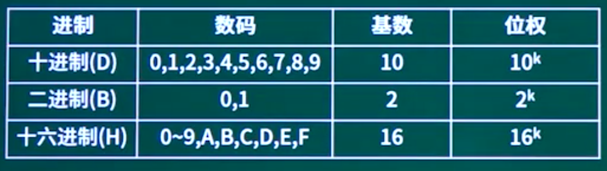

#### 其他进制转换为十进制

##### 按权展开法

R进制转十进制使用按权展开法，其具体操作方式为：将R进制数的每一位数值用R“形式表示，即幂的底数是R，指数为k，k与该位和小数点之间的距离有关。当该位位于小数点左边，k值是该位和小数点之间数码的个数，而当该位位于小数点右边，k值是负值，其绝对值是该位和小数点之间数码的个数加1。

#### 

#### 十进制转换为其他进制

##### 短除法

除到0截止。0111101

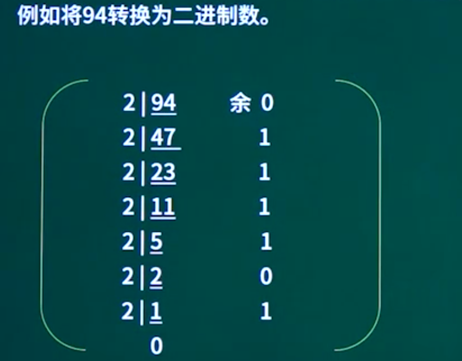

##### 减法

十进制转二进制使用减法。例如将94转换为二进制数。

小于且离94最近的乘幂为64

94-64=30（26=64）

小于且离30最近的乘幂为16

30-16=14（29=16）

小于且离14最近的乘幂为8

14-8=6（23=8）

小于且离6最近的乘幂为4

6-4=2（22=4）

小于且离2最近的乘幂为2

2-2=0 （21=2）

结束

| 位号 | 6    | 5    | 4    | 3    | 2    | 1    | 0    |
| ---- | ---- | ---- | ---- | ---- | ---- | ---- | ---- |
| 取值 | 1    | 0    | 1    | 1    | 1    | 1    | 0    |

20=1  21=2  22=4   23=8   24=16   25=32

26-64  27=128   28=256    29=512   210=1024

#### 二进制转八进制

010  001 110   取三位对应一个八进制数

#### 八进制转二进制

126    一位对应三位二进制

### 1.1.3. 码制

最高位默认0表示正数，1表示负数。

原码：最高位是符号位，其余低位表示数值的绝对值

反码：正数的反码与原码相同，负数的反码是其绝对值按位取反符号位不变

补码：正数的补码与原码相同，负数的补码是其反码末位加1（符号位不变）

移码：补码的符号位按位取反

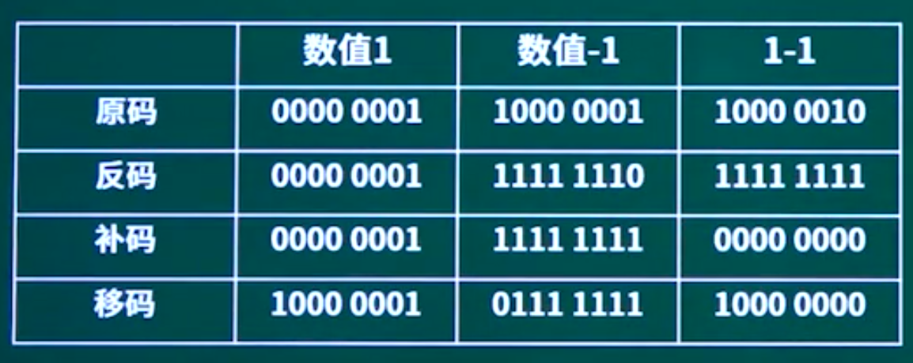

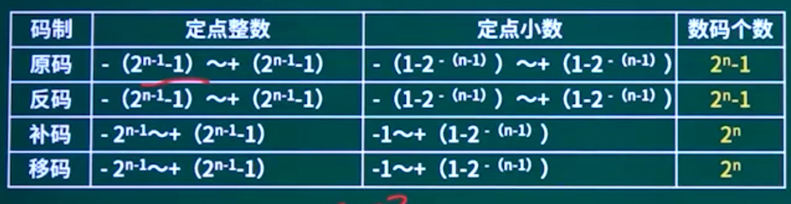

采用n位补码（包含一个符号位）表示数据，可以直接表示数值（）。

```
А.2"
B.-2"
C.2n-1
D.-2n-1
```

如果“2X"的补码是 “90H”，那么X的真值是（）。

A. 72

B. -56

C. 56

D. 111

补码转换为原码，

### 1.1.4. 浮点数表示

#### 浮点数表示

掌握格式，组成部分的意义， 浮点数运算逻辑过程。实际运算没有出现过。

浮点数表示

N = 尾数 * 基数 指数次幂   尾数一般小数点前面保留一位就可以了  1.23 x 10

尾数可以表示精度，指数可以表述数字大小。

#### 运算过程

对阶(取最大)  尾数计算  结果格式化  

#### 特点

1. 一般尾数用补码，阶码用移码
2. 阶码的位数决定数的表示范围，位数越多范围越大
3. 尾数的位数决定数的有效精度，位数越多精度越高
4. 对阶时，小数向大数看齐
5. 对阶是通过较小数的尾数右移实现的

```
浮点数能够表示的数的范围是由其（B）的位数决定的。
A、尾数
B、阶码
C、数符   尾数的符号位
D、阶符   阶码的符号位
```

```
以下关于两个浮点数相加运算的叙述中，正确的是（B）
A、首先进行对阶，阶码大的向阶码小的对齐
B、首先进行对阶，阶码小的向阶码大的对齐
C、不需要对阶，直接将尾数相加
D、不需要对阶，直接将阶码相加
```

```
设16位浮点数，其中阶符1位、阶码值6位、数符1位、尾数8位。若阶码用移码表示，尾数用补码表示，则该浮点数所能表示的数值范围是 。
A. -264~ (1-28) 264
C. -（1-2-3） 264～ （1-2:8） 264
B. -263~(1-2-8) 263
D. -（1-28） 263～ （1-2-8） 263
```

### 1.1.5. 逻辑运算

#### 关系运算符

小于 小于等于 大于 大于等于  等于 不等于

说明：

关系运算符的优先级低千算术运算符

关系运算符的优先级高于赋值运算符

#### 逻辑运算

与 或 非 异或（同0，不同1）

#### 短路原则

如果与只要有一个为假都为假

如果或只要有一个为真都为真

```
要判断字长为16位的整数a 的低四位是否全为0，则（A）。
A、将a与0x000F进行"逻辑与”运算，然后判断运算结果是否等于0
B、将a与Ox000F进行"逻辑或”运算，然后判断运算结果是否等于F
C.将a与Ox000F进行"逻辑异或"运算，然后判断运算结果是否等于0
D、将a与Ox000F进行"逻辑与”运算，然后判断运算结果是否等于F
```

```
对布尔表达式进行短路求值是指：无须对表达式中所有操作数或运算符进行计算就可确定表达式的值。对于表达式"a or （（c≤d）and b）”，（B）时可进行短路计算。
A. d为true
B. a为true
C. b为true
D. c为true
```

## 1.2. 校验码

### 1.2.1. 校验码概述

校验码

考点1：奇偶校验码（编码方式，）

考点2：CRC循环冗余校验码（）

考点3：海明校验码（）


### 1.2.2. 奇偶校验

#### 校验码基础知识

在以往的信息增加冗余数据进行校验。

码距：任何一种编码都由许多码字构成，任意两个码字之间最少变化的二进制位数就称为数据校验码的码距。

0，1最小码距就是1，00,01,10,11最小码距也是1。

#### 奇偶校验

奇偶校验码的编码方法是：由若干位有效信息（如一个字节），再加上一个二进制位（校验位）组成校验码。

奇校验：整个校验码（有效信息位和校验位）中“1”的个数为奇数。

偶校验：整个校验码（有效信息位和校验位）中“1”的个数为偶数。

只能检查奇数的错误，偶数不能检查，有一定的局限性。

总结：可检查1位（奇数位）的错误，不可纠错。

```
以下关于采用一位奇校验方法的叙述中，正确的是（）。
A、若所有奇数位出错，则可以检测出该错误但无法纠正错误
B、若所有偶数位出错，则可以检测出该错误并加以纠正
C、若有奇数个数据位出错，则可以检测出该错误但无法纠正错误
D、若有偶数个数据位出错，则可以检测出该错误并加以纠正
```

### 1.2.3. CRC循环冗余校验码

CRC的编码方法是：在k位信息码之后拼接r位校验码。应用CRC码的关键是如何从k 位信息位简便地得到r位校验位（编码），以及如何从k+r位信息码判断是否出错。

把接收到的CRC码用约定的生成多项式G（X）去除（**模二除法**），如果正确，则余数为0；如果某一位出错，则余数不为0。不同的位数出错其余数不同，余数和出错位序号之间有惟一的对应关系。

总结：CRC校验可检错，不可纠错。

```
在（）校验方法中，采用模2运算来构造校验位。
A、水平奇偶   
B、垂直奇偶
C、海明码
D、循环冗余
```

### 1.2.4. 海明校验码

海明校验码的原理是：在有效信息位中加入几个校验位形成海明码，使码距比较均匀地拉大，并把海明码的每个二进制位分配到几个奇偶校验组中。当某一位出错后，就会引起有关的几个校验位的值发生变化，这不但可以发现错误，还能指出错误的位置，为自动纠错提供了依据

2r >= m + r + 1

总结：可检错，也可纠错

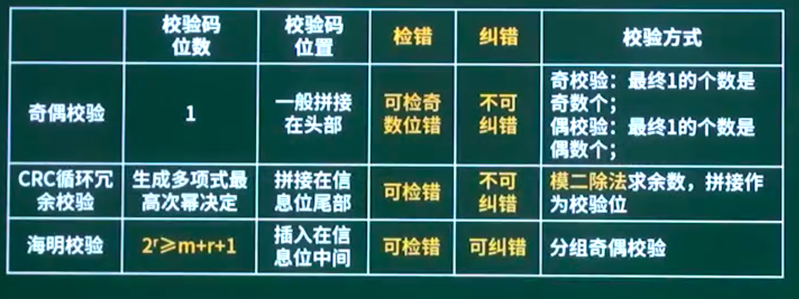

```
以下关于海明码的叙述中，正确的是（A）。
A、海明码利用奇偶性进行检错和纠错
B、海明码的码距为1
C、海明码可以检错但不能纠错
D、海明码中数据位的长度与校验位的长度必须相同
```

## 1.3. CPU组成（运算器与控制器）

#### 计算机结构

存储器=辅助存储器+主存储器

CPU=运算器+控制器

#### 运算器

1. 算术逻辑单元ALU：数据的算术运算和逻辑运算
2. 累加寄存器AC：通用寄存器，为ALU提供一个工作区，用在暂存
3. 数据缓冲寄存器DR：写内存时，暂存指令或数据
4. 状态条件寄存器PSW：存状态标志与控制标志（争议：也有将其归为控制器的）

#### 控制器

1. 程序计数器PC：存储**下一条**要执行指令的**地址**
2. 指令寄存器IR：存储即将执行的指令
3. 指令译码器ID：对指令中的操作码字段进行分析解释
4. 时序部件：提供时序控制信号

```
计算机中提供指令地址的程序计数器PC在（A）中。
A、控制器
B、运算器
C、存储器
D、1/O设备
```

```
CPU执行算术运算或者逻辑运算时，常将源操作数和结果暂存在（B）
中
A、程序计数器（PC）
B、累加器 （AC）
C、指令寄存器（IR）
D、地址寄存器（AR）
```

## 1.4. 寻址方式

一条指令就是机器语言的一个语句，它是一组有意义的二进制代码，指令的基本格式如下：

操作码字段+地址码字段

- 立即寻址方式

特点：操作数直接在指令中，速度快，灵活性差

- 直接寻址方式，一次寻址

特点：指令中存放的是操作数的地址

- 间接寻址方式，二次寻址

特点：指令中存放了一个地址，这个地址对应的内容是操作数的地址。

- 寄存器寻址方式

特点：寄存器存放操作数

- 寄存器间接寻址方式

特点：寄存器内存放的是操作数的地址

```
在机器指令的地址字段中，直接指出操作数本身的寻址方式称为（C）。
A、隐含寻址
B、寄存器寻
C、立即寻址
D、直接寻址
```

## 1.5. CISC与RISC

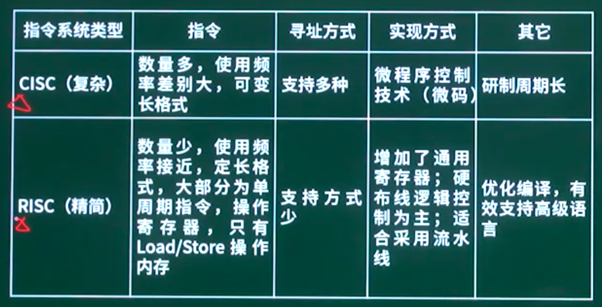

指令数量、指令使用频率，寻址方式，寄存器，流水线支持，高级语言支持

CISC：复杂，指令数量多，频率差别大，多寻址

RISC：精简，指令数量少，操作寄存器，单周期，少寻址，多通用寄存器，流水线

```
以下关于RISC（精简指令系统计算机）技术的叙述中，错误的是（B）
A、指令长度固定、指令种类尽量少
B、指令功能强大、.寻址方式复杂多样
C、增加寄存器数目以减少访存次数
D、用硬布线电路实现指令解码，快速完成指令译码
```

## 1.6. 流水线技术

相关参数计算：**流水线执行时间计算、流水线吞吐率**、流水线加速比、流水线效率

流水线是指在程序执行时**多条指令重叠进行操作**的一种准并行处理实现技术。各种部件同时处理是针对不同指令而言的，它们可同时为多条指令的不同部分进行工作，以提高各部件的利用率和指令的平均执行速度

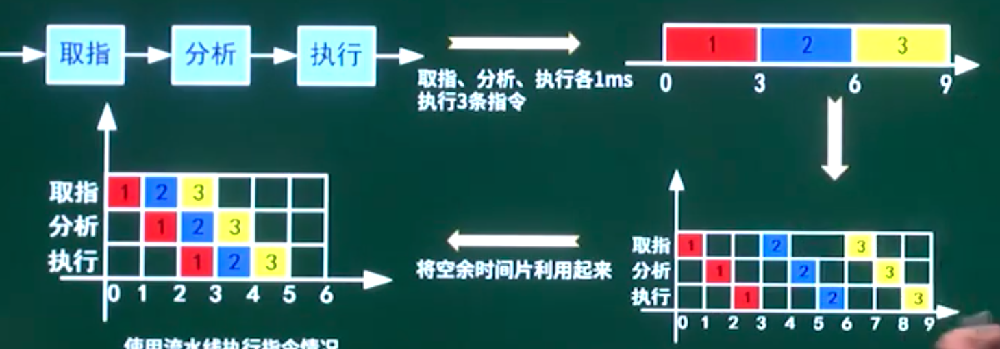

流水线建立时间：

流水线周期：执行时间最长的一段

理论公式：建立时间+(n-1)xt   默认使用理论公式

实践公式：k*t + (n-1) x t        

#### 流水线的吞吐率（Though Put rate,TP）

是指在单位时间内流水线所完成的任务数量或输出的结果数量。计算流水线吞吐率的最基本的公式如下：


#### 流水线最大吞吐率：

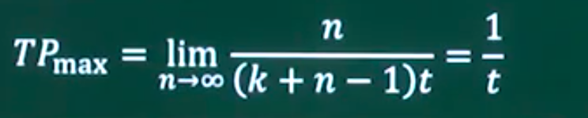

```
下列关于流水线方式执行指令的叙述中，不正确的是（A）。
A、流水线方式可提高单条指令的执行速度
B、流水线方式下可同时执行多条指令
C、流水线方式提高了各部件的利用率
D、流水线方式提高了系统的吞吐率
```

```
将一条指令的执行过程分解为取指、分析和执行三步，按照流水方式执行，若取指时间t取指=4 、分析时间t分析=2 、执行时间t执行=3 。则执行完100条指令，需要的时间为（D）At。
А. 200
B. 300
C. 400
D. 405
```

## 1.7. 存储系统

### 1.7.1. 存储系统概述

考点1：层次化存储体系

考点2：Cache

考点3：主存编址计算

### 1.7.2. 层次化存储

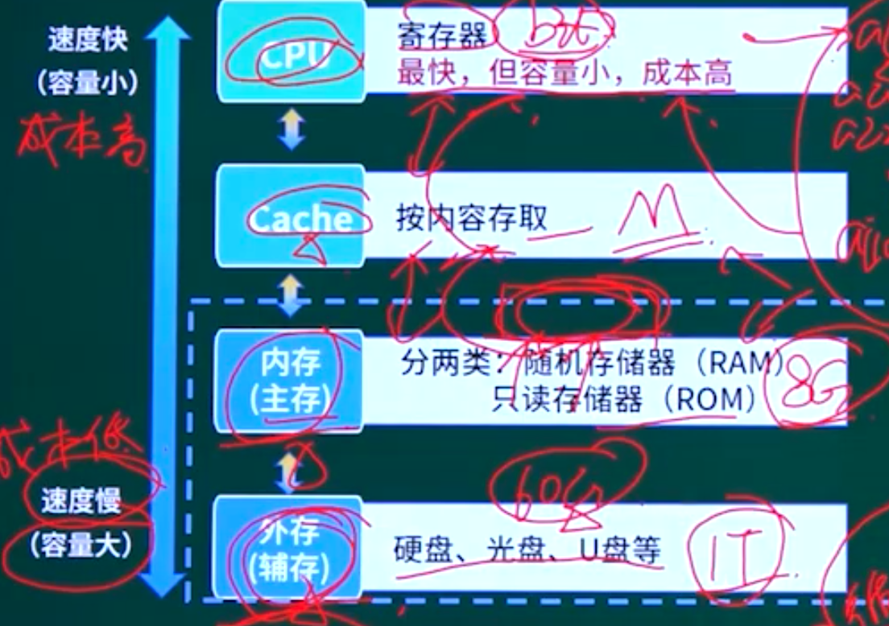

局部性原理是层次化存储结构的支撑

时间局部件：刚被访问的内容，立即又被访问。循环体。

空间局部性：刚被访问的内容，临近的空间很快被访问。顺序结构。

#### 分类

1、存储器位置

内存&外存

2、存取方式

（1） 按内容存取：

相联存储器（如Cache）

（2） 按地址存取

随机存取存储器（如内存）

顺序存取存储器（如磁带）

直接存取存储器（如磁盘）

3、工作方式

（1） 随机存取存储器RAM （如内存DRAN）

（2） 只读存储器ROM （如BIOS）

DRAM：动态随机存取存储器

SRAM：静态随机存取存储器

Cache： 高速缓存

EEPROM： 电可擦可编程只读存储器

```
CPU访问存储器时，被访问数据一般聚集在一个较小的连续存储区域中。若一个存储单元已被访问，则其邻近的存储单元有可能还要被访问，该特性被称为（C）。
A、数据局部性
B、指令局部性
C、空间局部性   顺序
D、时间局部性   循环
```

```
虚拟存储体系由（）两级存储器构成。
A、主存-辅存
B、寄存器-Cache
C、寄存器-主存
D、Cache-主存
```

```
在微机系统中，BIOS（基本输入输出系统）保存在（A）中。
A、主板上的ROM
B、CPU的寄存器
C、主板上的RAM
D、虚拟存储器
```

### 1.7.3. Cache

#### 概念

在计算机的存储系统体系中，Cache是访问速度最快的层次（若有寄存器，则寄存器最快）。

使用Cache改善系统性能的依据是程序的局部性原理。

时间局部性

空间局部性

如果以h代表对Cache的访问命中率，t」表示Cache的周期时间， t表示主存储器周期时间，以读操作为例，使用“Cache+主存储器”的系统的平均周期为t，则：

t=hxt+（1-h）xtz

其中，（1-h）又称为失效率（未命中率）。


地址映像是将主存与Cache的存储空间划分为若干大小相同的页（或称为块）。

例如，某机的主存容量为1GB划分为2048页，每页512KB；Cache容量为8MB，划分为16页，每页512KB。

#### **直接相联映像**

硬件电路较简单，但冲突率很高。

#### 全相联映像

电路难于设计和实现，只适用于小容量的cache，冲突率较低。

主存可以放到Cache中。

#### 组相联映像

直接相联与全相联的折中。

注：主存与Cache之间的地址映射由硬件直接完成。

```
以下关于Cache（高速缓冲存储器）的叙述中，不正确的是（）。
A.Cache 的设置扩大了主存的容量
B、Cache 的内容是主存部分内容的拷贝
C、Cache 的命中率井不随其容量增大线性地提高
D、Cache 位于主存与CPU之间
```

```
在程序执行过程中，高速缓存（Cache） 与主存间的地址映射由（）
A、操作系统进行管理
B、存储管理软件进行管理
C、程序员自行安排
D、硬件自动完成
```

```
主存与Cache的地址映射方式中，（）方式可以实现主存任意一块装入Cache中任意位置，只有装满才需要替换。
A、全相联
B、直接映射
C、组相联
D、串并联
```

### 1.7.4. 主存编址计算

#### 主存编址

存储单元

存储单元个数=最大地址-最小地址+1

编址内容

按字编址：存储体的存储单元是字存储单元，即最小寻址单位是一个字

按字节编址：存储体的存储单元是字节存储单元，即最小寻址单位是一个字节。

总容量=存储单元个数*编址内容

根据存储器所要求的容量和选定的存储芯片的容量，就可以计算出所需芯片的总数，即：

总片数二总容量/每片的容量

```
内存按字节编址，地址从A0000H到CFFFFH的内存，共有（D）字节，若用存储容量为64K×8bit的存储器芯片构成该内存空间，至少需要（B）片。
A. 80KB  В. 96КВ  C. 160KB  D. 192KB
A. 2     В. 3     C. 5      D. 8
```

## 1.8. 输入输出技术

CPU控制主存和外设的交互，CPU速度比较快。

#### 数据传输控制方式

程序控制（查询）方式：

分为无条件传送和程序查询方式两种。方法简单，硬件开销小，但1/0能力不高，严重影响CPU的利用率。

程序中断方式：

与程序控制方式相比，中断方式因为CPU无需等待而提高了传输请求的响应速度。CPU与数据传输并行。

DMA方式：

DMA方式是为了在主存与外设之间实现高速、批量数据交换而设置的。DMA方式比程序控制方式与中断方式都高效。

（DMAC向总线裁决逻辑提出总线请求；CPU执行完当前总线周期即可释放总线控制权。此时DMA响应，通过DMAC通知I/0接口开始DMA传输。）

通道方式：

I/O处理机：


#### 中断处理过程：

- CPU无需等待也不必查询1/0状态。
- 当/0系统准备好以后，发出中断请求信号通知CPU；
- CPU接到中断请求后，保存正在执行程序的现场（**保存现场**），打断的程序当前位置即为**断点**；
- （通过**中断向量表**）转入I/0中的服务程序的执行，完成1/0系统的数据交换；
- 返回被打断的程序继续执行（恢复现场）。

```
计算机系统中常用的输入/输出控制方式有无条件传送、中断、程序查询和DMA 方式等。当采用（D）方式时，不需要CPU执行程序指令来传送数据。
A. 中断
B.程序查询
C. 无条件传送
D. DMA
```

```
计算机运行过程中，遇到突发事件，要求CPU暂时停止正在运行的程序，转去为突发事件服务，服务完毕，再自动返回原程序继续执行，这个过程称为（B），其处理过程中保存现场的目的是（C）。
A阻塞  B中断   C 动态绑定  D静态绑定

A 防止丢失数据
B防止对其他部件造成影响
C返回去继续执行原程序
D为中断处理程序提供数据。

```

```
CPU是在（D）结束时响应DMA请求的。
A一条指令执行
B一段程序
C一个时钟周期
D一个总线周期
```

## 1.9. 总线

分时双工

一条总线**同一时刻仅允许一个设备发送，但允许多个设备接收。**

数据总线（Data Bus）：在CPU与RAM之间来回传送需要处理或是需要储存的数据。

地址总线（Address Bus）：用来指定在RAM（Random AccessMemory）之中储存的数据的地址。

控制总线 （Control Bus）：将微处理器控制单元(Control Unit)的信号，传送到周边设备。

```
以下关于总线的叙述中，不正确的是（C）。
A、并行总线适合近距离高速数据传输
B、串行总线适合长距离数据传输
C、单总线结构在一个总线上适应不同种类的设备，设计简单且性能很高
D、专用总线在设计上可以与连接设备实现最佳匹配
```

## 1.10. 可靠性

#### 可靠性指标

平均无故障时间 一（MTTF）MTTF=1/入，入为失效率

平均故障修复时间 一（MTTR） MTTR=1/K， 为修复率

平均故障间隔时间 一（MTBF） MTBF =MTTR+ MTTF

#### 串联系统

R = R1 x R2 ... x Rn

#### 并联系统

R = 1 - (1 - R1) x (1 - R2) x .... (1 - Rn) 

```
软件可靠性是指系统在给定的时间间隔内、在给定条件下无失效运行的概率。若MTTF和MTTR分别表示平均无故障时间和平均修复时间，则公式（A）可用于计算软件可靠性。
A.MTTF/（1+MTTF）
B. 1/(1+MTTF)
C. MTTR/(1+MTTR)
D. 1/(1+MTTR
```

```
某系统由3个部件构成，每个部件的千小时可靠度都为R，该系统的千小时可靠度为（1-（1-R）2）R，则该系统的构成方式是（C）。
A、3个部件串联
B、3个部件并联
C、前两个部件并联后与第三个部件串联
D、第一个部件与后两个部件并联构成的子系统串联
```

## 1.11. 性能指标

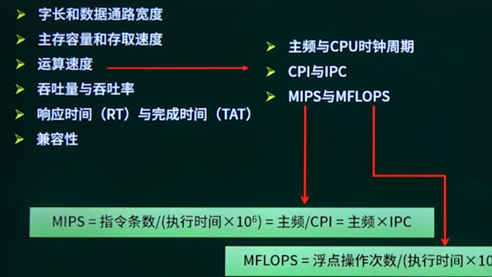

```
软件质量属性中，（B）是指软件每分钟可以处理多少个请求。
A、响应时间
B、吞吐量
C、负载
D、容量
```

```
某计算机系统的CPU主频为2.8GHz。某应用程序包括3类指令，各
类指令的CPI（执行每条指令所需要的时钟周期数）及指令比例如下表所示。执行该应用程序时的平均CPI为（）；运算速度用MIPS表示，约为

```

## 1.12. 概述

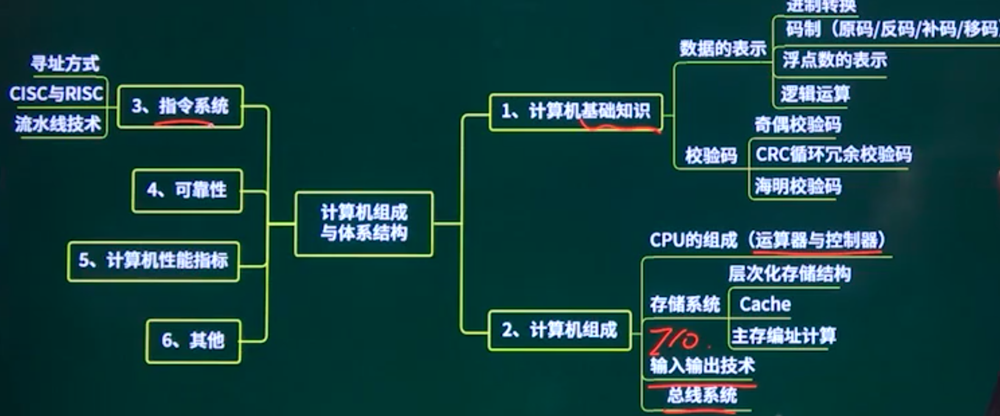


