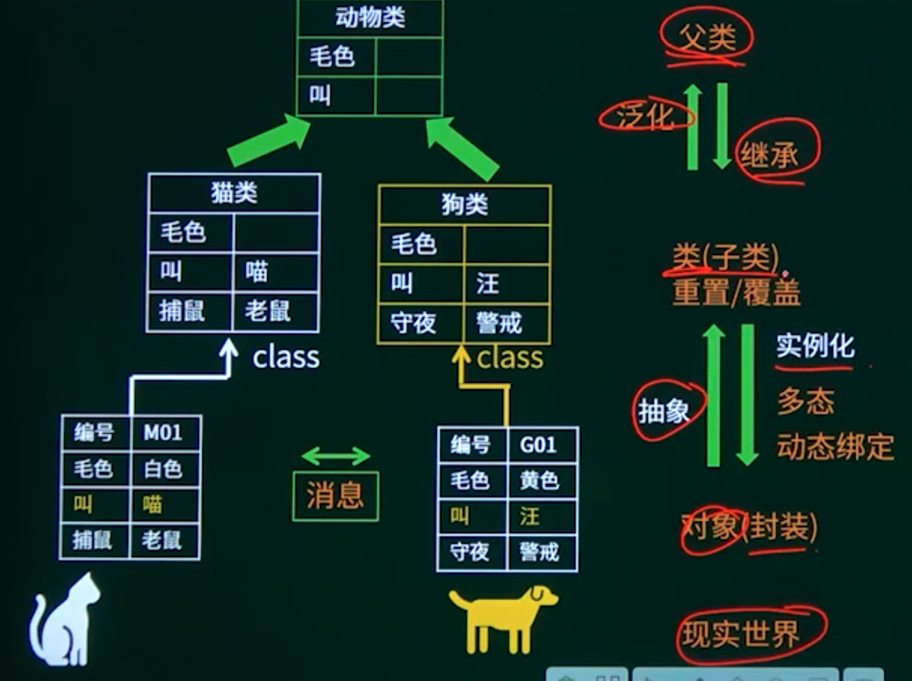
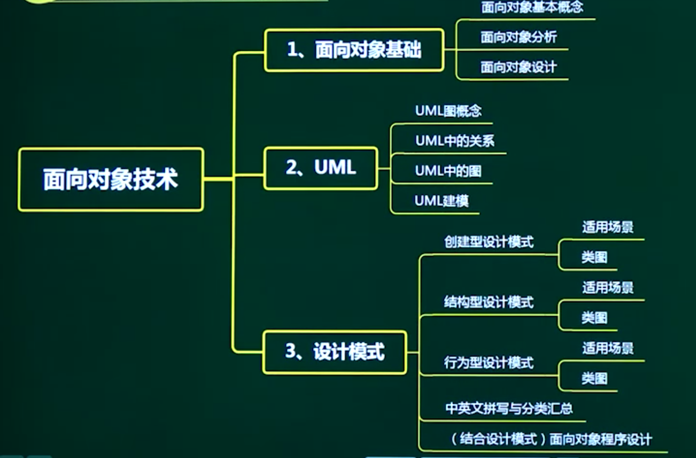
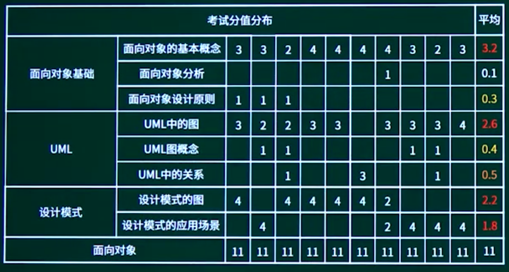

## 10.1. 面向对象基本概念

### 10.1.1. 面向对象基本概念介绍

### 10.1.2. 对象与类相关概念

```
在面向对象的系统中，对象是运行时实体，其组成部分不包括（A）；一个类定义了一组大体相似的对象，这些对象共享（D）。
A 消息
B 行为（操作）
C 对象名
D 状态
A 属性和状态
B 对象名和状态
C 行为和多重度
D 属性和行为
```

```
在面向对象方法中，将逻辑上相关的数据以及行为绑定在一起，使信息对使用者隐蔽称为（）。当类中的属性或方法被设计为private时，（）可以对其进行访问。
A 抽象
B 继承
C 封装
D 多态
A 应用程序中所有方法
B 只有此类中定义的方法
C 只有此类中定义的public方法
D 同一个包中的类中定义的方法
```


### 10.1.3. 继承与泛化的基本概念

```
在面向对象方法中，（B）是父类和子类之间共享数据和方法的机制。子类在原有父类接口的基础上，用适合于自己要求的实现去置换父类中的相应实现称为（C）。
A 封装
B 继承
C 覆盖
D 多态
```

### 10.1.4. 多态与动态绑定的基本概念

多态：

动态绑定：运行时决定是狗叫还是猫叫

静态绑定：编译是决定

```
在面向对象方法中，不同对象收到同一消息可以产生完全不同的结果，这一现象称为（）。在使用时，用户可以发送一个通用的消息，而实现的细节则由接收对象自行决定。
A 接口
B 继承
C 覆盖
D 多态
```

```
在下列机制中，（）是指过程调用和响应调用所需执行的代码在运行时加以结合；而（）是过程调用和响应调用所需执行的代码在编译时加以结合。
A 消息传递
B 类型检查
C 静态绑定
D 动态绑定
```


### 10.1.5. 面向对象基本概念汇总



```
在某销售系统中，客户采用扫描二维码进行支付。若采用面向对象方法开发该销售系统，则客户类属于（B）类，二维码类属于（A）类。
A 接口
B 实体
C 控制
D 状态
```

实体类的对象表示现实世界中真实的实体，如人、物等。

接口类（边界类）的对象为用户提供一种与系统合作交互的方式，分为人和系统两大中人的接口可以是显示屏、窗口、Web窗体、对话框、菜单、列表框、其他显示控朱形码、二维码或者用户与系统交互的其他方法。系统接口涉及到把数据发送到其他者从其他系统接收数据。

控制类的对象用来控制活动流，充当协调者。

```
在面向对象方法中，继承用于（）。
A 在已存在的类的基础上创建新类
B 在已存在的类中添加新的方法
C 在已存在的类中添加新的属性
D 在已存在的状态中添加新的状态
```

```
（）多态是指操作（方法）具有相同的名称、且在不同的上下文中所代表的含义不同。
A 参数
B 包含
C 过载
D 强制

参数多态：应用广泛、最纯的多态。
包含多态：同样的操作可用于一个类型及其子类型。包含多态一般需要进行运行时的类型检查。
强制多态：编译程序通过语义操作，把操作对象的类型强行加以变换，以符合函数或操作符的要求。
过载多态：同一个名（操作符、函数名）在不同的上下文中有所代表的含义不同。
```


## 10.2. 面向对象分析

## 10.3. 面向对象设计

## 10.4. UML

10.4.1. UML知识点概述

10.4.2. UML概念

10.4.3. UML中的关系

10.4.4. UML类图与对象图

10.4.5. 用例图

10.4.6. 顺序图与通信图

10.4.7. 活动图

10.4.8. 状态图

10.4.9. 构件图

10.4.10. 部署图

## 10.5. 设计模式

10.5.1. 设计模式知识点概述

10.5.2. 创建型设计模式

10.5.3. 结构型设计模式

10.5.4. 行为型设计模式-01

10.5.5. 行为型设计模式-02

10.5.6. 设计模式拼写及分类汇总

## 10.6. 面向对象技术章节概述





## 10.7. 面向对象技术章节回顾