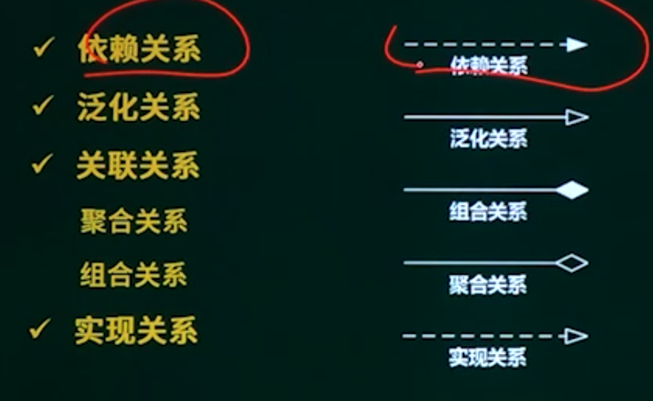
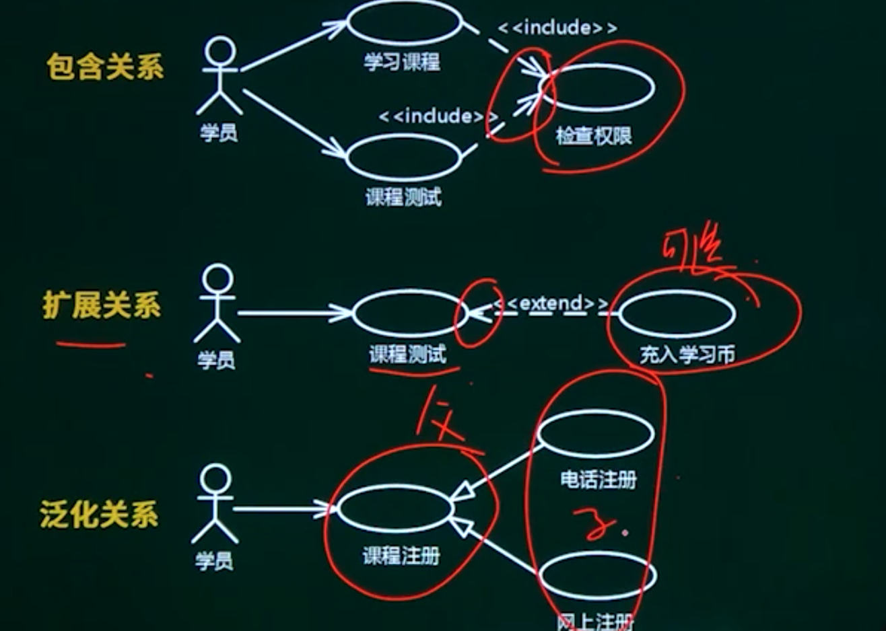
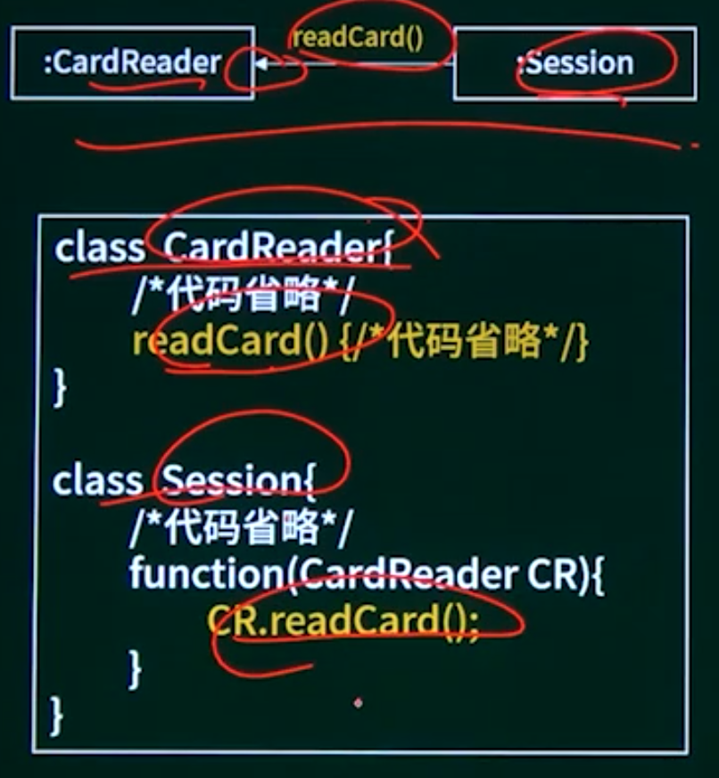
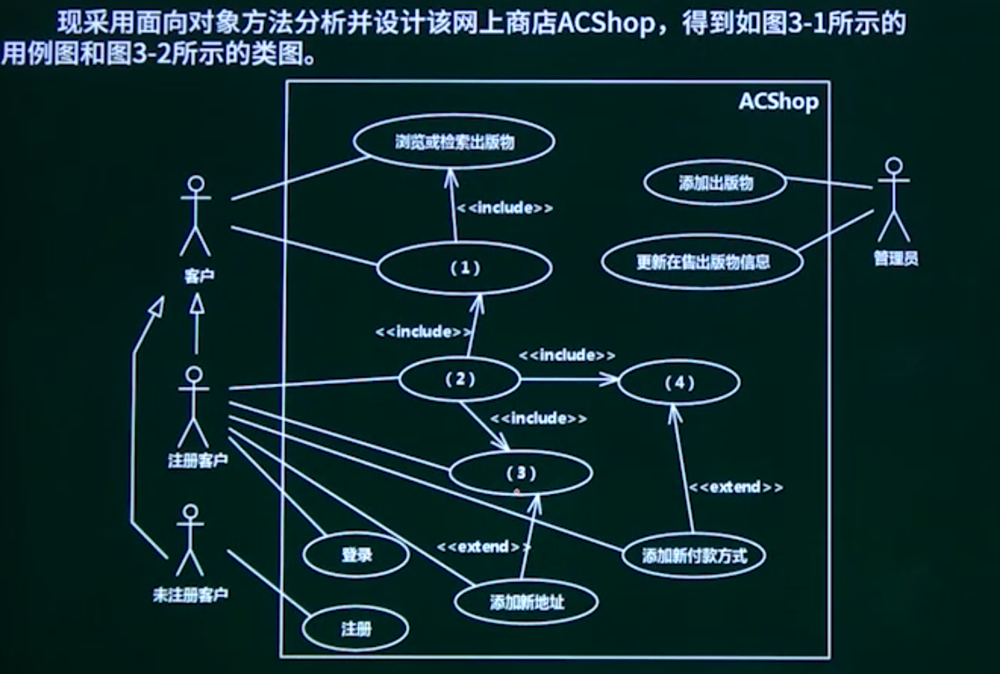

## 11.1. UML建模概述

- 类图与对象图
- 用例图

- 通信图
- 状态图
- 活动图
- 顺序图


## 11.2. UML考查形式介绍

#### 类图

填类名(英文，名词)，方法名，属性名

填多重度

填关系



#### 用例图

参与者  人+组织机构  系统

用例名   名词+动词

关系    扩展 包含 泛化

细化用例描述



#### 通信图

对象名

消息



#### 顺序图

对象名

消息

生命周期

#### 状态图

## 11.3. 例题

### 11.3.1. 例题1用例图与类图

```
阅读下列说明和图，回答问题1至问题3，将解答填入答题纸的对应栏内。
【说明
某出版社拟开发一个在线销售各种学术出版物的网上商店（ACShop），其主要的功能需求描述如下：
（1）ACShop在线销售的学术出版物包括论文、学术报告或讲座资料等。
（2）ACShop的客户分为两种：未注册客户和注册客户。
（3）未注册客户可以浏览或检索出版物，将出版物添加到购物车中。未注册客户进行注册操作之后，成为ACShop注册客户。
（4）注册客户登录之后，可将待购买的出版物添加到购物车中，并进行结账操作。结账操作的具体流程描述如下：
①从预先填写的地址列表中选择一个作为本次交易的收货地址。如果没有地址信息，则可以添加新地址。
②选择付款方式。ACShop支持信用卡付款和银行转账两种方式。注册客户可以从预先填写的信用卡或银行账号中选择一个付款。若没有付款方式信息，则可以添加新付款方式。
③确认提交购物车中待购买的出版物后，ACShop会自动生成与之相对应的订单。
（5）管理员负责维护在线销售的出版物目录，包括添加新出版物或者更新在售出版物信息等操作。
```




### 11.3.2. 例题2状态图与类图

```
阅读下列说明，回答问题1至问题3，将解答填入答题纸的对应栏内。
【说明】
某种出售罐装饮料的自动售货机。
（Vending Machine）的工作过
程描述如：
（1）顾客选择所需购买的饮料及数量。
（2） 顾客从投币口向自动售货机中投入硬币（该自动售货机只接收硬币）。硬币器收集投入的硬币并计算其对应的价值。如果所投入的硬币足够购买所需数量的这种饮料且饮料数量足够，则推出饮料，计算找零，顾客取走饮料和找回的硬币；如果投入的硬币不够或者所选购的饮料数量不足，则提示用户继续投入硬币或重新选择饮料及数量。
（3） 一次购买结束之后，将硬币器中的硬币移走（清空硬币器），等待下一次交易。自动售货机还设有一个退币按钮，用于退还顾客所投入的硬币。已经成功购买饮料的钱是不会被退回的。
```


### 11.3.3. 例题3通信图与类图

```
阅读下列说明和图，回答问题1至问题3，将解答填入答题纸的对应栏内。
【说明】
某高校图书馆欲建设一个图书馆管理系统，目前已经完成了需求分析阶段的工作。功能需求均使用用例进行描述，其中用例 “借书（Check Out Books）”的详细描述如下。
参与者：读者（Patron）。
典型事件流：
1. 输入读者ID；
2．确认该读者能够借阅图书，并记录读者ID；
3. 输入所要借阅的图书ID；
4.根据图书目录中的图书ID确认该书可以借阅，计算归还时间，生成借阅记录；
5．通知读者图书归还时间。
重复步骤3~5，直到读者结束借阅图书。
备选事件流：
2a.若读者不能借阅图书，说明读者违反了图书馆的借书制度（例如，没有支付借书费用等）
①告知读者不能借阅，并说明拒绝借阅的原因；
②本用例结束。
4a. 读者要借阅的书无法外借
①告知读者本书无法借阅；
②回到步骤3。
说明：图书的归还时间与读者的身份有关。如果读者是教师，图书可以借阅一年；
如果是学生，则只能借阅3个月。读者ID中包含读者身份信息。
```

