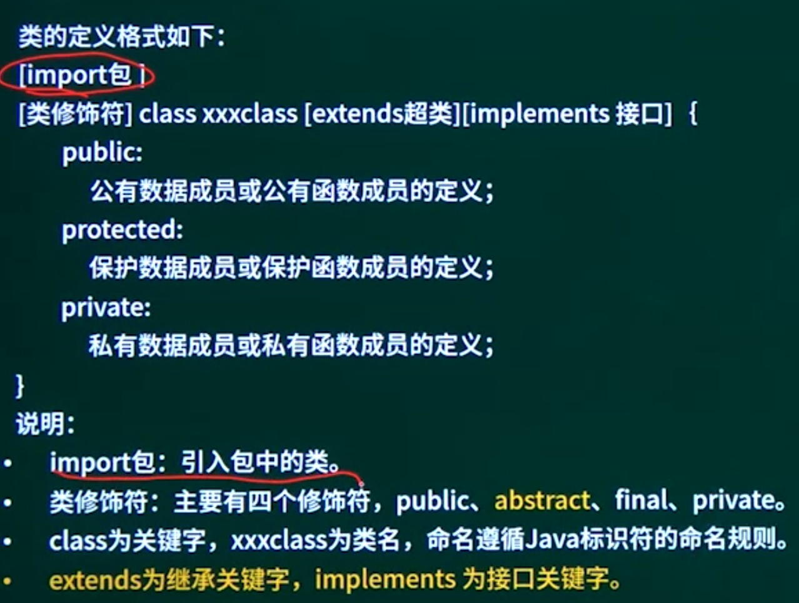

## 12.1. 面向对象程序设计概述


## 12.2. C++语法要点

```
class类名
public:
公有数据成员或公有函数成员的定义；
protected:
保护数据成员或保护函数成员的定义；
private:
私有数据成员或私有函数成员的定义；
```


## 12.3. JAVA语法要点



Implements 接口   extends 超类就是类了

如果方法存在一个abstract 方法，类必须是abstract 。

如果类是abstract 方法必须是abstract.

```
接口的定义格式如下：
［修饰符］ interface 接口名［extends 父接口名列表］｛Jeublel lstatc/ Mimnel 带畫，所个有多法
[public] [abstract] 方法;
｝
```

**都是抽象**   implements


## 12.4. 注意事项及代码填空技巧

一、大小写问题

Java语言大小写敏感，如：定义接口关键字为interface，写成Interface，则算错。

C++也如此。

二、什么时候要加this

1.Set方法

2.带参数的构造函数

三、父类与子类（接口与实现类）之间方法的统一

1. 对于方法填空，主要依据父类与子类（接口与实现类）之间方法的统一；
2. 注意对于接口抽象方法，JAVA没有方法体（无花括号），C++纯虚函数写法。

四、注意函数调用

1. 代码中可能出现方法体的缺失，这一类填空可以根据函数传参，从而判断该参数类型、该类型对象能够调用的方法，从而填空；
2. 代码中可能出现方法形参的缺失，这一类填空需要根据方法体判断该方法需要使用的参数名，根据调用的过程判断该参数的类型。

一、关键字填空

经常出现关键字填空，比如abstract、extends、implements等，注意不要出现拼写错误。

二、缺失方法填空

1、注意父类与子类、接口与实现类之间的统一，经常出现对应方法的缺失，可以根据上下文进行填写，注意接口方法无方法体，其他返回值类型。参数列表应该保持一致；

2、注意构造函数的写法，get和set方法的应用；

3、如果JAVA自带的一些类型的方法，需要靠平常的积累，建议多做真题进行

三、实例化填写

类名   对象名 = new 类名（）

父类名 对象名 = new 子类名（）

四、注意函数调用（参数列表、参数类型、对应参数能够调用的方法）

五、在软件设计师考试中，程序设计题最难的地方在于与设计模式的结合，建议多做真题进行积累。

## 12.5. 例题（Java）

### 12.5.1. 例题1访问者模式

阅读下列说明和Java代码，将应填入（n）处的字句写在答题纸的对应栏内。

【说明】

某图书管理系统中管理着两种类型的文献：图书和论文。现在要求统计所有馆藏文献的总页码（假设图书馆中有一本540页的图书和两篇各25页的论文，那么馆藏文献的总页码就是590页）。采用Visitor（访问者）模式实现该要求，得到如图6-1所示的类图。


### 12.5.2. 例题2生成器模式

披萨


### 12.5.3. 例题3适配器模式

阅读下列说明和Java代码，将应填入（n）处的字句写在答题纸的对应栏内【说明（如图6-某软件系统中，已设计并实现了用于显示地址信息的类Address（如图6-1所示），现要求提供基于Dutch语言的地址信息显示接口。为了实现该要求并考虑到以后可能还会出现新的语言的接口，决定采用适配器（Adapter）模式实现该要求，得到如图6-1所示的类图。

### 12.5.4. 例题4桥接模式

阅读下列说明和JAVA代码，将应填入空（n）处的字句写在答题纸的对应栏内。【说明】欲开发一个绘图软件，要求使用不同的绘图程序绘制不同的图形。以绘制直线和圆形为例，对应的绘图程序如表6-1所示。
