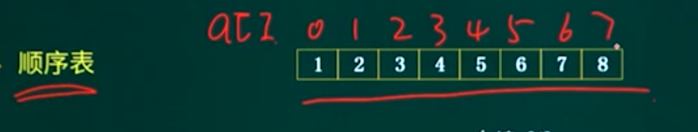
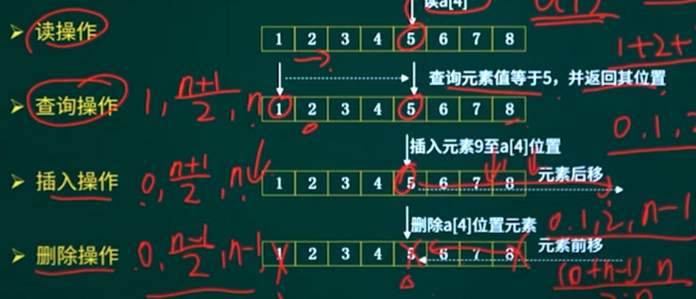
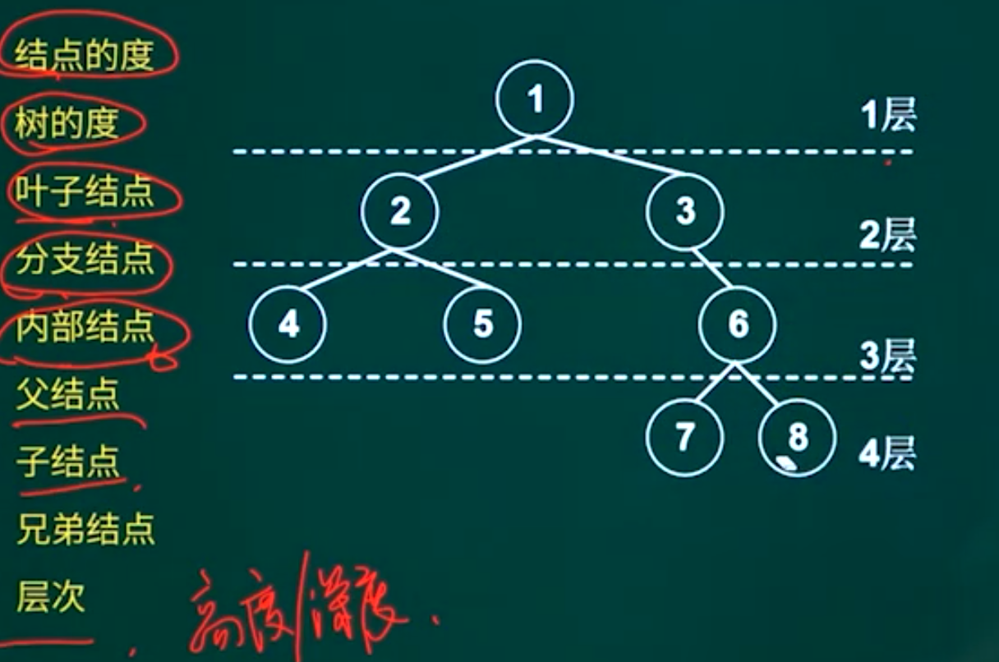
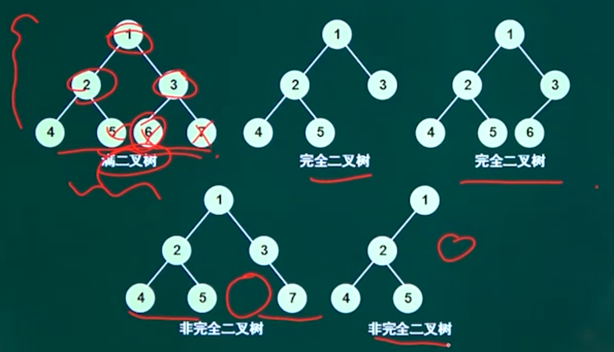
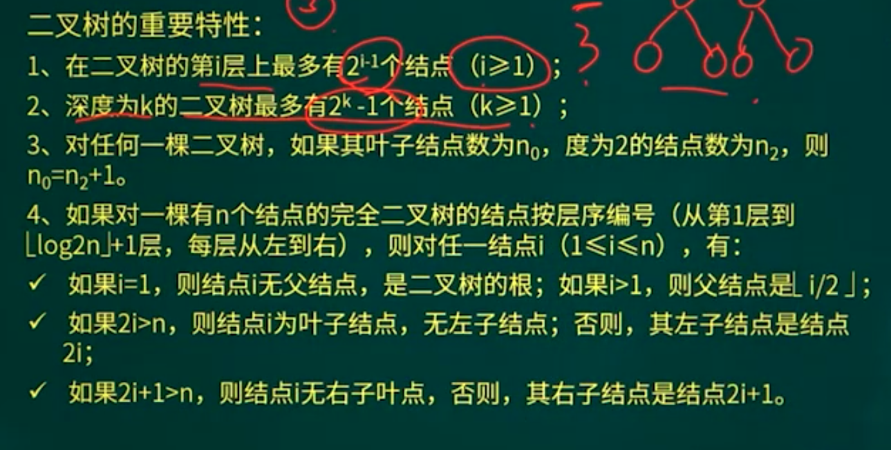
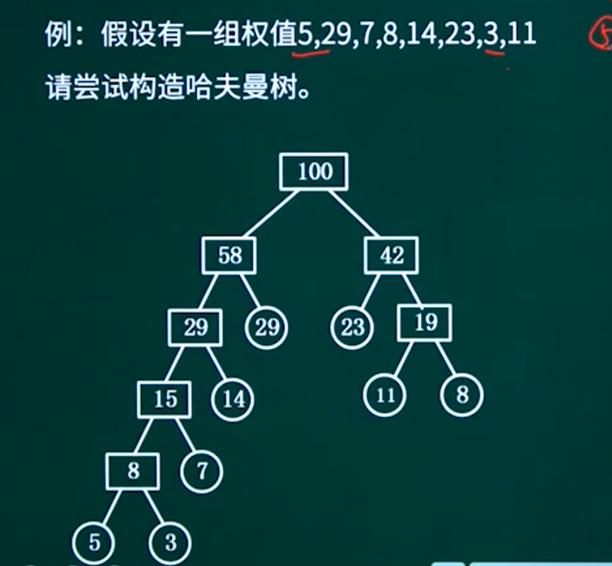
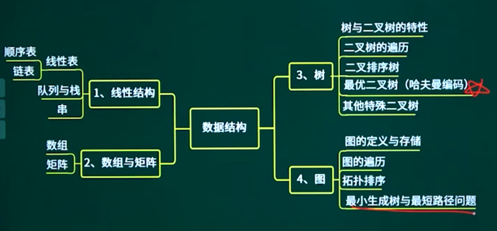
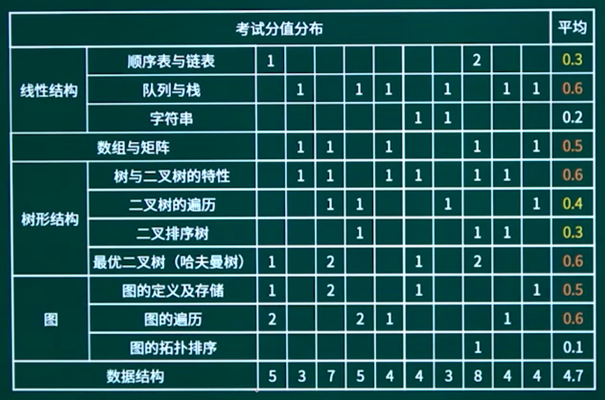

## 13.1. 线性结构

### 13.1.1. 线性结构知识点概述

### 13.1.2. 顺序表与链表





顺序存储方式：数组的内存是连续分配的，并且是静态分配的，即在使用数组之前需要分配固定大小的空间。

链表（linked-list）存储方式：链表的内存是不连续的，前一个元素存储地址的下一个地址中存储的不一定是下一个元素。链表通过一个指向下一个元素地址的引用将链表中的所有元素串起来。

尾结点：最后一个有效结点。

首结点：第一个有效结点。

头结点：第一个有效结点之前的那个结点，存放链表首地址。

头指针：指向头结点的指针变量。

#### 链表

单链表

循环链表

双向链表

#### 链表的基本操作

单链表删除结点

单链表插入结点

双向链表删除结点

双向链表插入结点


### 13.1.3. 队列与栈

#### 队列

先进先出

#### 循环队列

队空条件：head-tail.

队满条件：（tall+1）%size=head

队列长度：（tail-head+size）%size


#### 栈

先进先出

```
队列的特点是先进先出，若用循环单链表表示队列，则（）。
A 入队列和出队列操作都不需要遍历链表
B 入队列和出队列操作都需要遍历链表
C 入队列操作需要遍历链表而出队列操作不需要
D 入队列操作不需要遍历链表而出队列操作需要
```

### 13.1.4. 串

1. 串的定义：串是仅由字符构成的有限序列，是一种线性表。一般记为S=“ajapaga”，其中，S是串名，单引号括起来的字符序列是串值。
2. 串的几个基本概念

（1） 空串与空格串

空串：长度为零，不包含任何字符。

空格串，由一个或多个空格组成的串。虽然空格是一个空白字符，但它也是一个字符，在计算串长度时要将其计算在内。

（2） 子串与子序列

子串：由串中任意长度的连续字符构成的序列称为子串。含有子串的串称为主串。

子串在主串中的位置是指子串首次出现时，该子串的第一个字符在主串中的位置。

空串是任意串的子串。

子序列：一个串的“子序列”（subsequence）是将这个串中的一些字符提取出来得到一个新串，并且不改变它们的相对位置关系。

（3） 串比较与串相等

串比较：两个串比较大小时以字符的ASCII码值（或其他字符编码集合）作为依据。实质上，比较操作从两个的第一个字符开始进行，字符的码值大者所在的串为大；若其中一个串先结束，则以串长较大者为大。

串相等：指两个串长度相等且对应序号的字符也相同。

3、串的基本操作：

（1） 赋值操作StrAssigr（s.t）；将串s的值赋给串t。

（2） 连接操作Concat（S，！）：将串t接续在串s的尾部，形成一个新的串。

（3） 求串长StrLength（s）：返回串s的长度。

（4）串比较StrCompare（s.t）：比较两个串的大小。返回值-1、0和1分别表示Sst、s=t和s>t三种情况。

（5） 求子串SubString（s,start,len）：返回串S中从start开的、长度为len的字符序列。

4、串的存储（1） 顺序存储（2）链式存储

#### 模式匹配

模式匹配：子串的定位操作通常称为串的模式匹配。（子串也称为模式串）

朴素的模式匹配算法（布魯特-福斯算法）：

其基本思想是从主串的第一个字符起与模式串的第一个字符比较，若相等，则继续逐一对字符进行后续的比较，否则从主串第二个字符起与模式串的第一个字符重新比较，直到模式串中每个字符依次与主串中一个连续的字符序列相等时为止，此时称为匹配成功。如果不能在主串中找到与模式串相同的子串，则匹配失败。

改进的模式匹配算法（KMP算法）：

其改进之处在于-每当匹配过程中出现相比较的字符不相等时，不需要回退到主串的字符位置指针，而是利用已经得到的 “部分匹配”结果将模式串向右“滑动”尽可能远的距离，再继续进行比较。

在KMP算法中，依据模式串的next函数值实现子串的滑动。若令next［j］=k，则next［j］表示当模式串中的p，与主串中相应字符不相等时，令模式串的Pnextj）与主串的相应字符进行比较。（j=next［i］）

next函数的定义如下：


## 13.2. 数组与矩阵

### 13.2.1. 数组与矩阵知识点概述

### 13.2.2. 数组


### 13.2.3. 矩阵


## 13.3. 树  必考

### 13.3.1. 树知识点概述

### 13.3.2. 树与二叉树的特性-01





#### 二叉树的重要特性：




### 13.3.3. 树与二叉树的特性-02


### 13.3.4. 二叉树的遍历

#### 前序遍历

根  左子树  右子树

#### 中序遍历

左子树  根  右子树

#### 后序遍历

根  右子树  左子树

#### 层次遍历


```
由前序序列为ABHFDECG；中序序列为HBEDFAGC构造二叉树。
```


### 13.3.5. 二叉排序树

#### 特点

1. 二叉排序树
2. 左孩子小于根
3. 右孩子大于根

只有中序可以得到有序序列


### 13.3.6. 最优二叉树

#### 哈夫曼树

需要了解的基本概念：

- 树的路径长度
- 权
- 带权路径长度
- 树的带权路径长度（树的代价）

就是所有叶子节点 * 路径 

权值较大放在叶子旁边




### 13.3.7. 其他特殊的二叉树

## 13.4. 图

### 13.4.1. 图知识点概述

### 13.4.2. 图的定义与存储

#### 完全图


在无向图中，若每对顶点之间都有一条边相连，则称该图为完全图 （complete graph）。

在有向图中，若每对顶点之间都有二条有向边相互连接，则称该图为完全图。

#### 连通图

连通图：指任意两个顶点之间都有一个路径相连。


### 13.4.3. 图的遍历


### 13.4.4. 拓扑排序

### 13.4.5. 最小生成树与最短路径问题

## 13.5. 章节概述





## 13.6. 章节回顾

