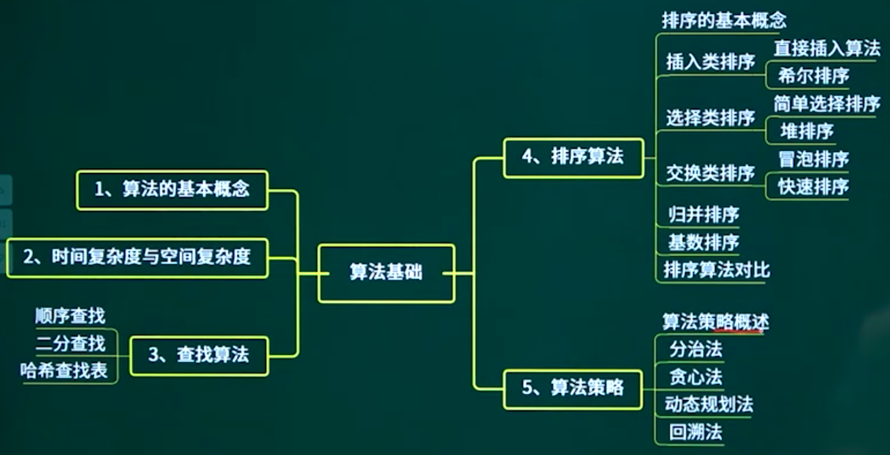
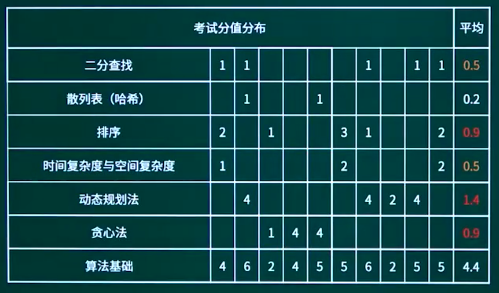

## 14.1. 算法的特性

## 14.2. 时间复杂度与空间复杂度

14.2.1. 时间复杂度与空间复杂度-01

14.2.2. 时间复杂度与空间复杂度-02

## 14.3. 常见算法策略

14.3.1. 算法策略知识点概述

14.3.2. 算法策略概述

14.3.3. 分治法

14.3.4. 贪心法

14.3.5. 动态规划法

14.3.6. 回溯法

## 14.4. 查找算法

### 14.4.1. 查找算法知识点概述

14.4.2. 顺序查找

14.4.3. 二分查找

14.4.4. 哈希散列表

## 14.5. 排序算法

14.5.1. 排序算法知识点概述

14.5.2. 排序的基本概念

14.5.3. 插入类排序

14.5.4. 选择类排序

14.5.5. 交换类排序

14.5.6. 归并排序

14.5.7. 基数排序

14.5.8. 排序算法对

## 14.6. 章节概述

## 14.7. 章节回顾

