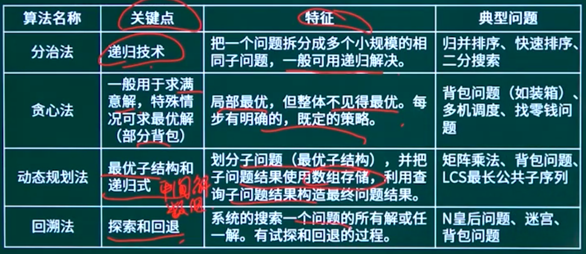
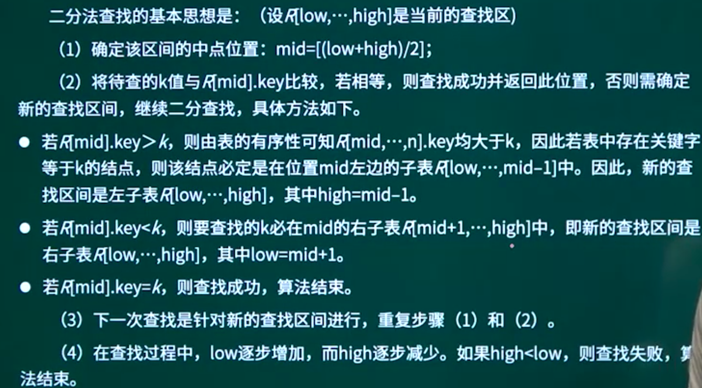
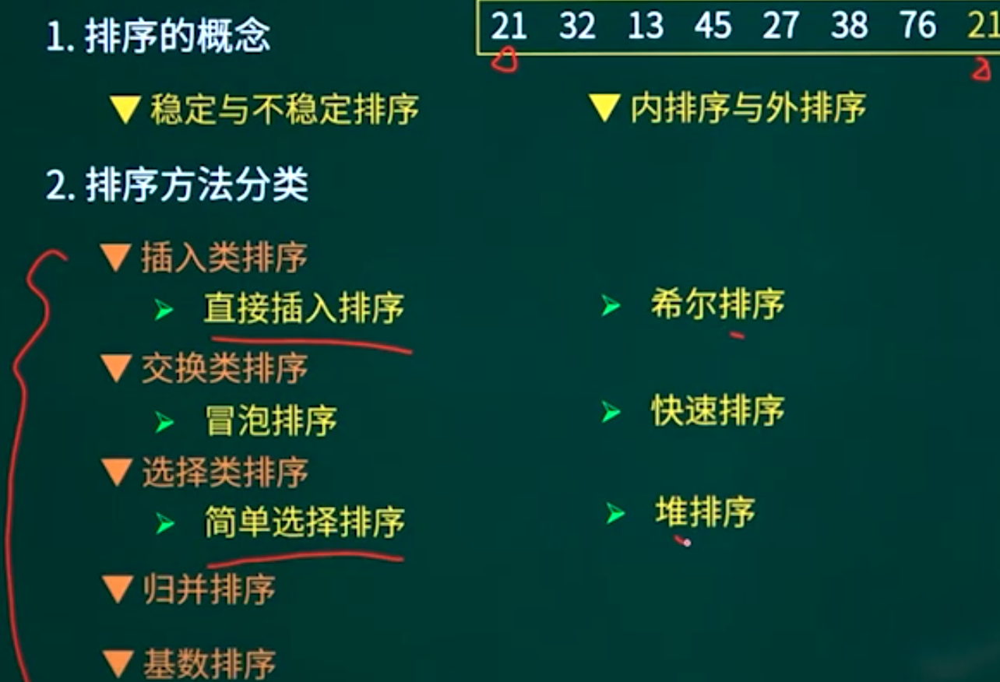
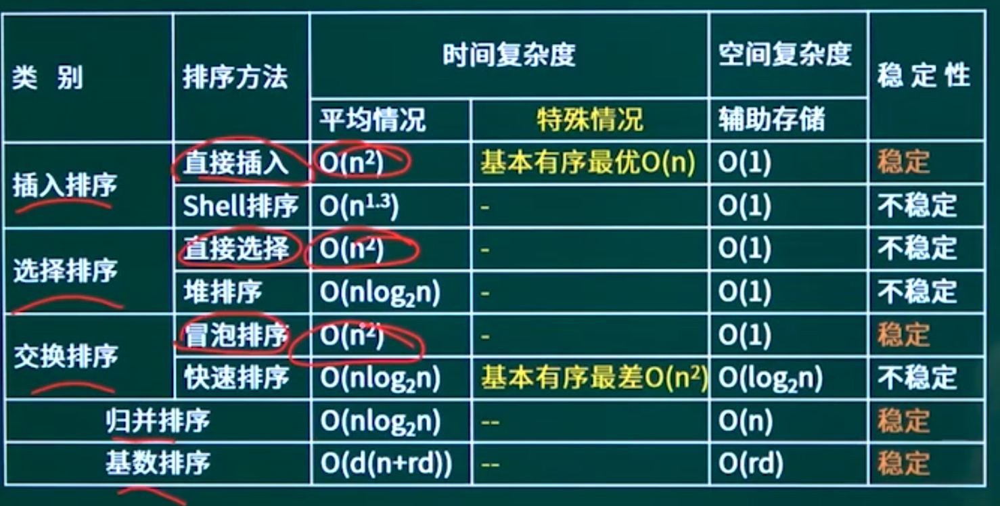

## 14.1. 算法的特性

有穷性：执行有穷步之后结束，且每一步都可在有穷时间内完成。

确定性：算法中每一条指令都必须有确切的含义，不能含糊不清。

输入（>=0）

输出（>=1）

有效性（可行性）：算法的每个步骤都能有效执行并能在执行有限次后得到确定的结果。例如a=0，b/a就无效

## 14.2. 时间复杂度与空间复杂度

### 14.2.1. 时间复杂度与空间复杂度-01

### 14.2.2. 时间复杂度与空间复杂度-02

## 14.3. 常见算法策略

### 14.3.1. 算法策略知识点概述

### 14.3.2. 算法策略概述

一、分治法

特征：把一个问题拆分成多个小规模的相同子问题，一般可用递归解决。

经典问题：

斐波那契数列、归并排序、快速排序、矩阵乘法、二分搜索、大整数乘法、汉诺塔

二、贪心法（一般用于求满意解）

特征：局部最优，但整体不见得最优。每步有明确的，既定的策略。

经典问题：

背包问题（如装箱）、多机调度、找零钱问题

三、动态规划法（用于求最优解）-“最优子结构”和递归式特征：划分子问题，并把子问题结果使用数组存储，利用查询子问题结果构造最终问题结果。（一般自顶向下时间复杂度为0（27），自底向上时间复杂度为O（n？）

效率更高）

经典问题：

斐波那契数列、矩阵乘法、背包问题、LCS最长公共子序列

四、回溯法

特征：系统的搜索一个问题的所有解或任一解。

经典问题：

N皇后问题、迷宫、背包问题

### 14.3.3. 分治法

对于一个规模为n的问题，若该问题可以容易地解决（比如说规模n较小）则直接解决；否则将其分解为k个规模较小的子问题，这些子问题互相独立且与原问题形式相同，递归地解这些子问题，然后将各子问题的解合并得到原问题的解。

- 该问题的规模缩小到一定的程度就可以容易地解决  分解
- 该问题可以分解为若干个规模较小的相同问题   解决
- 利用该问题分解出的子问题的解可以合并为该问题的解  合并
- 该问题所分解出的各个子问题是相互独立的

### 14.3.4. 贪心法

总是做出在当前来说是最好的选择，而并不从整体上加以考虑，它所做的每步选择只是当前步骤的局部最优选择，但从整体来说不一定是最优的选择。由于它不必为了寻找最优解而穷尽所有可能解，因此其耗费时间少，一般可以快速得到满意的解，但可能得不到最优解。

【贪心法解决部分背包问题可得最优解】

### 14.3.5. 动态规划法

在求解问题中，对于每一步决策，列出各种可能的局部解，再依据某种判定条件，舍弃那些肯定不能得到最优解的局部解，在每一步都经过筛选，以每一步都是最优解来保证全局是最优解。（问题中如果出现“最优子结构”这类描述，并且结果用递归式表示，一般为动态规划法）

### 14.3.6. 回溯法

回溯法是一种选优搜索法，按选优条件向前搜索，以达到目标。但当搜索到某一步时，发现原先选择并不优或达不到目标，就退回一步重新选择。这种走不通就退回再走的技术就是回溯法。

## 14.4. 查找算法

### 14.4.1. 查找算法知识点概述

### 14.4.2. 顺序查找

顺序查找的思想：将待查找的关键字为kev的元素从头到尾与表中元素进行比较，如果中间存在关键字为key的元素，则返回成功；否则，则查找失败。

查找成功时，顺序查找的平均查找长度为（等概率情况下）：

n+1/2

### 14.4.3. 二分查找

1.前提必须有序

2.mid向下取整

3.mid +1 = low   mid -1 = high

### 14.4.4. 哈希散列表

开放定址法是指当构造散列表发生冲突时，使用某种探测手段，产生一个探测的散列地址序列，并且逐个查找此地址中是否存储了数据元素，如果没有，则称该散列地址开放，并将关键字存入，否则继续查找下一个地址。只要散列表足够大，总能找到空的散列地址将数据元素存入。

拉链法

## 14.5. 排序算法

### 14.5.1. 排序算法知识点概述

### 14.5.2. 排序的基本概念

### 14.5.3. 插入类排序

直接插入排序：即当插入第1个记录时，R」，Rz，⋯，Rmj均已排好序，因此，将第i个记录R依次与R-1，“，Rz，R，进行比较，找到合适的位置插入。它简单明了，但速度很慢。

直接插入排序是一种**稳定**的排序方法，时间复杂度为O（n2）。在排序过程中仅需要一个元素的辅助空间，空间复杂度为O（1）。

适用于基本有序的情况，此时时间复杂度近乎线性，即O（n）。

希尔（Shell） 排序：先取一个小于n的整数d作为第一个增量，把文件的全部记录分成d个组。所有距离为d的倍数的记录放在同一个组中。

先在各组内进行直接插入排序；然后，取第二个增量<d重复上述的分组和排序，直至所取的增量d=1（d d- ＜O< o），即所有记录放在同一组中进行直接插入排序为止。该方法实质上是一种分组插入方法。

希尔排序是一种不稳定的排序方法，据统计分析其时间复杂度约为0（n_3。在排序过程中仅需要一个元素的辅助空间用于数组元素的交互，空间复杂度为O（1）。

### 14.5.4. 选择类排序

直接选择排序的过程是，首先在所有记录中选出排序码最小的记录，把它与第1个记录交换，然后在其余的记录内选出排序码最小的记录，与第2个记录交换⋯•依次类推，直到所有记录排完为止。

直接选择排序是一种**不稳定**的排序方法，其时间复杂度约为O（n2）。在排序过程中仅需要一个元素的辅助空间用于数组元素的交互，空间复杂度为O（1）。

#### 堆排序

就是根节点的大小，最小为小顶堆，最大为大顶堆。

### 14.5.5. 交换类排序

#### 冒泡排序

冒泡排序的基本思想是，通过相邻元素之间的比较和交换，将排序码较小的元素逐渐从底部移向顶部。由于整个排序的过程就像水底下的气泡一样逐渐向上冒，因此称为冒泡算法。

冒泡排序是一种**稳定**的排序方法，其时间复杂度约为O（n2）。在排序过程中仅需要一个元素的辅助空间用于数组元素的交互，空间复杂度为O（1）。

#### 快速排序

快速排序采用的是分治法，其基本思想是将原问题分解成若干个规模更小但结构与原问题相似的子问题。通过递归地解决这些子问题，然后再将这些子问题的解组合成原问题的解。

在0（nlogzn）时间量级上，平均性能最好。

快速排序通常包括两个步骤：

第一步，在待排序的n个记录中任取一个记录，以该记录的排序码为准，将所有记录都分成两组，第1组都小于该数，第2组都大于该数，如图所示。

第二步，采用相同的方法对左、右两组分别进行排序，直到所有记录都排到相应的位置为止。

### 14.5.6. 归并排序    *

归并也称为合并，是将两个或两个以上的有序子表合并成一个新的有序表。若将两个有序表合并成一个有序表，则称为二路合并。合并的过程是：比较A［i和AGj］的排序码大小，若A［的排序码小于等于AGj的排序码，则将第一个有序表中的元素A［i复制到R［k］中，并令i和k分别加1；

如此循环下去，直到其中一个有序表比较和复制完，然后再将另一个有序表的剩余元素复制到R中。

归并排序是一种**稳定**的排序方法，其时间复杂度约为O（nlogzn）。在排序过程中仅需要一个元素的辅助空间用于数组元素的交互，空间复杂度为0（n）。

### 14.5.7. 基数排序

基数排序是一种借助多关键字排序思想对单逻辑关键字进行排序的方法。基数排序不是基于关键字比较的排序方法，它适合于元素很多而关键字较少的序列。基数的选择和关键字的分解是根据关键字的类型来决定的，例如关键字是十进制数，则按个位、十位来分解。

基数排序是一种**稳定**的排序方法，其时间复杂度约为O（d（n+rd））。在排序过程中仅需要一个元素的辅助空间用于数组元素的交互，空间复杂度为O（rd）。

### 14.5.8. 排序算法对比

## 14.6. 章节概述

## 14.7. 章节回顾

