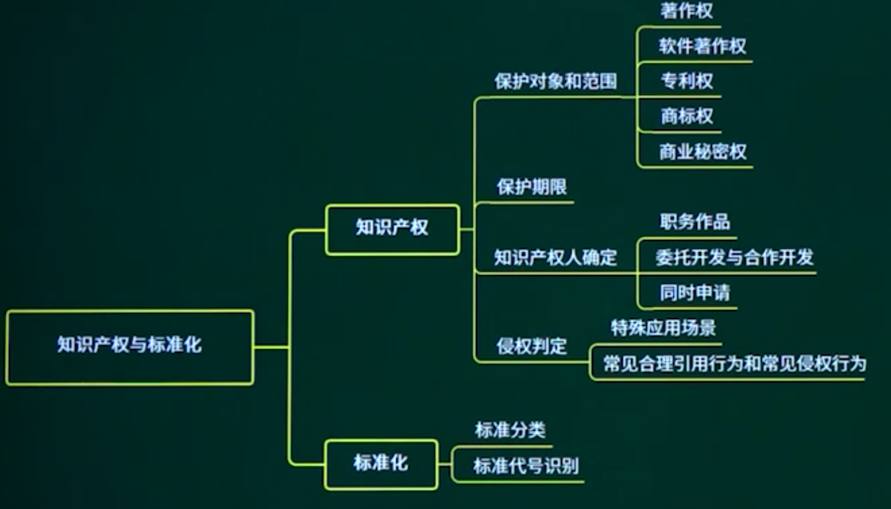
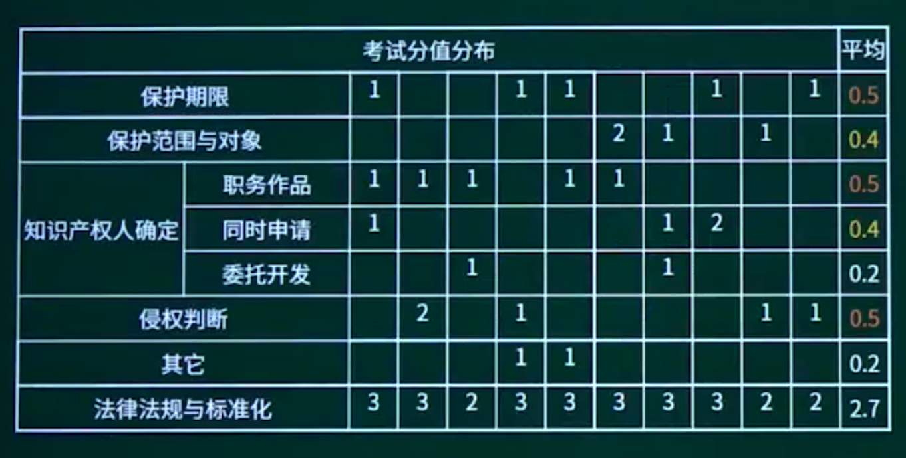

## 16.1. 保护范围和对象

## 16.2. 保护期限

## 16.3. 知识产权人确定

### 16.3.1. 知识产权人确定

16.3.2. 职务作品

16.3.3. 合作开发、委托开发与同时申请

## 16.4. 侵权判定

## 16.5. 标准化

16.5.1. 标准化知识点概述

16.5.2. 标准化分类

16.5.3. 标准化代号

## 16.6. 章节概述

## 16.7. 章节回顾

