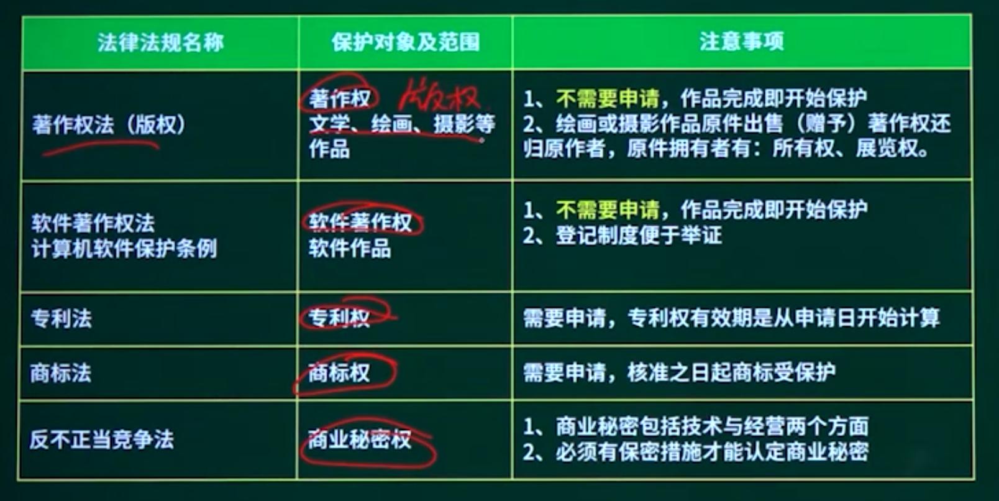
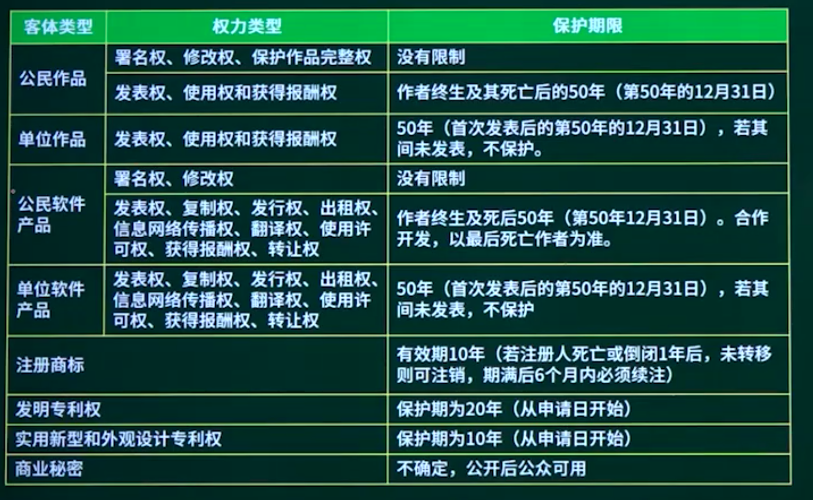
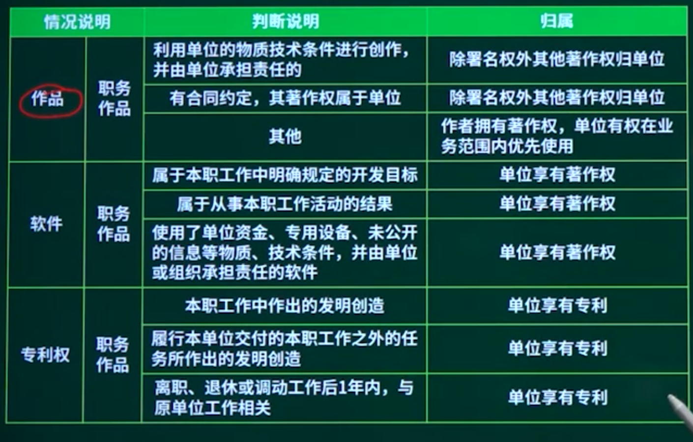
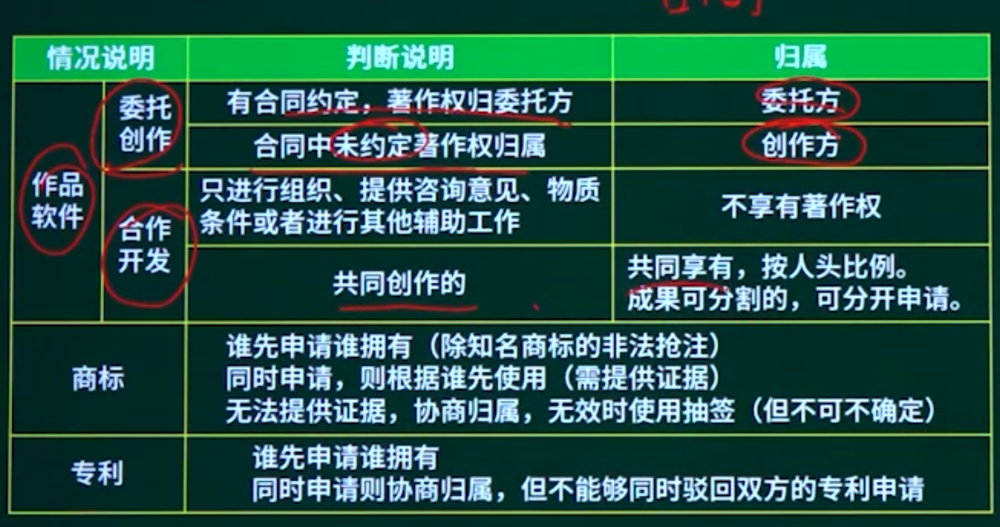
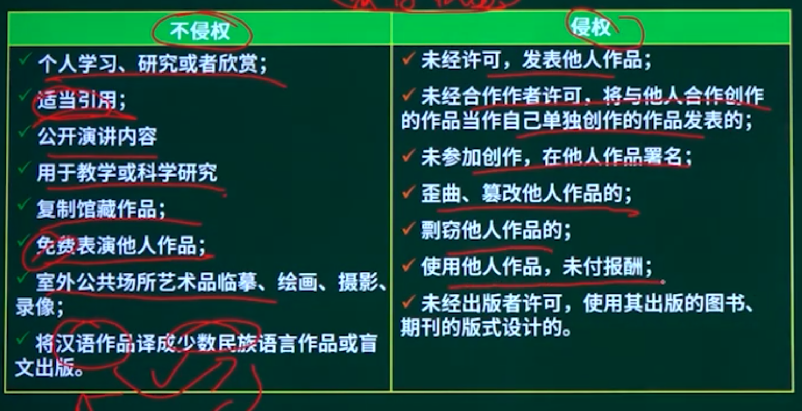
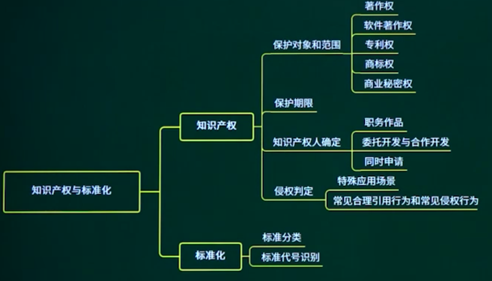
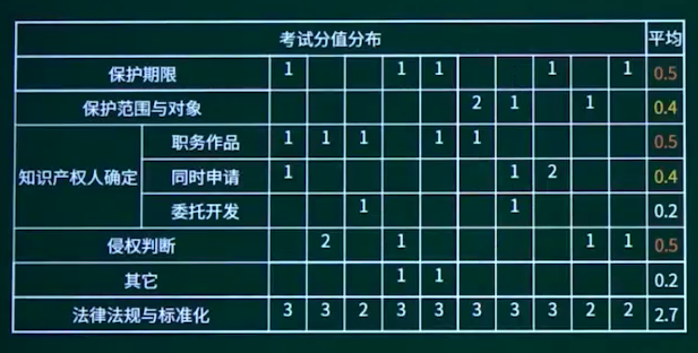

## 16.1. 保护范围和对象



```
李某购买了一张有注册商标的应用软件光盘，则李某享有（）。
A 注册商标专用权
B 该光盘的所有权
C 该软件的著作权
D 该软件的所有权
```

## 16.2. 保护期限



```
以下著作权权利中，（）的保护期受时间限制。
A 署名权
B 修改权
C 发表权
D 保护作品完整权
```

```
（）的保护期限是可以延长的。
A专利权
B商标权
C 著作权
D 商业秘密权
```


## 16.3. 知识产权人确定

### 16.3.1. 知识产权人确定

### 16.3.2. 职务作品



### 16.3.3. 合作开发、委托开发与同时申请



## 16.4. 侵权判定  *

第二十五条 对下列各项，不授予专利权：

（一）科学发展；

（二）智力活动的规则和方法；

（三）疾病的诊断和治疗方法；

（四）动物和植物品种；

（五）用原子核变换方法获得的物质；

（六）对平面印刷品的图案、色彩或者二者的结合作出的主要起标识作用的设计。对前款第（四）项所列产品的生产方法，可以依照本法规定授予专利权。


中国公民、法人或者其他组织的作品，不论是否发表，都享有著作权。

开发软件所用的思想、处理过程、操作方法或者数学概念不受保护。

具体程序（代码+业务逻辑等）受保护

著作权法不适用于下列情形：

法律、法规，国家机关的决议、决定、命令和其他具有立法、行政、司法性质的文件，及其官方正式译文；

时事新闻；

历法、通用数表、通用表格和公式。



## 16.5. 标准化

### 16.5.1. 标准化知识点概述

### 16.5.2. 标准化分类

国际标准：ISO、IEC等国际标准化组织国家标准：

GB-中国、ANSI-美国、BS一英国、JIS-日本

区域标准：又称为地区标准，如PASC一太平洋地区标准会议、CEN一欧洲标准委员会、ASAC-亚洲标准咨询委员会、ARSO一非洲地区标准化组织

行业标准：GJB一中国军用标准、MIT-S一美国军用标准、IEEE—美国电气电子工程师协会

地方标准：国家的地方一级行政机构制订的标准

企业标准

项目规范

### 16.5.3. 标准化代号

国际、国外标准代号：标准代号+专业类号+顺序号+年代号我国国家标准代号：强制性标准代号为GB、推荐性标准代号为GB/T指导性标准代号为GB/Z、实物标准代号GSB

行业标准代号：由汉语拼音大写字母组成（如电子行业为SJ）

地方标准代号：由DB加上省级行政区代码的前两位企业标准代号：由Q加上企业代号组成


## 16.6. 章节概述





## 16.7. 章节回顾

