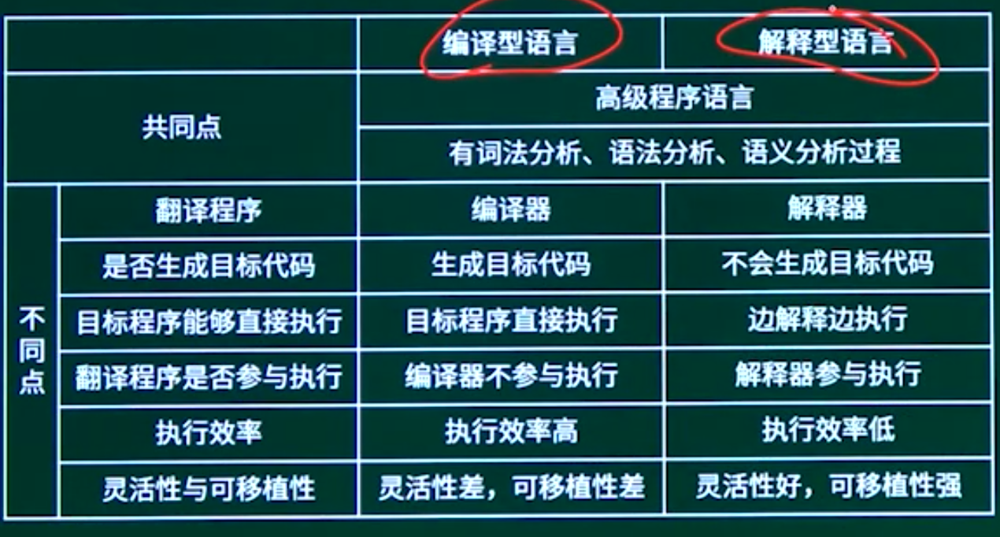
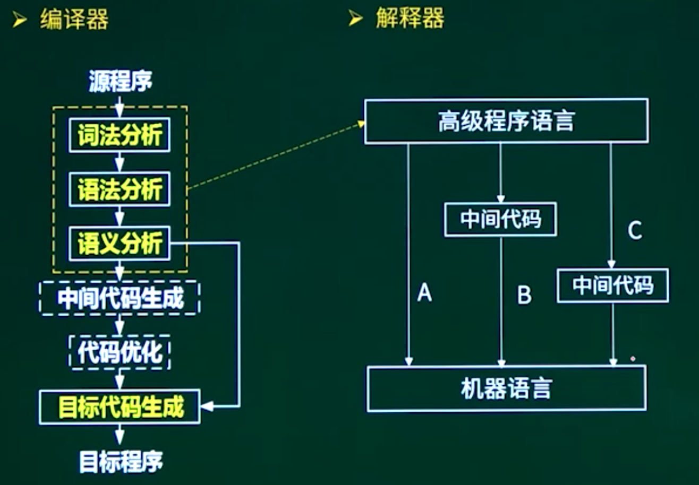
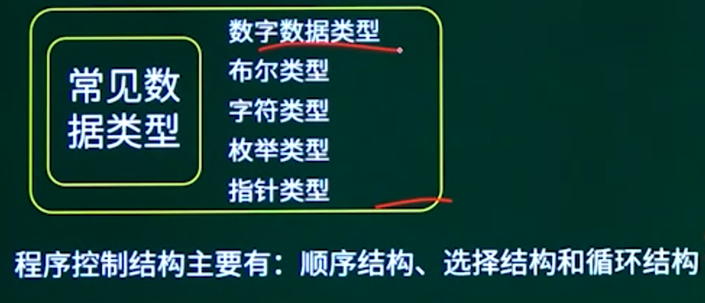
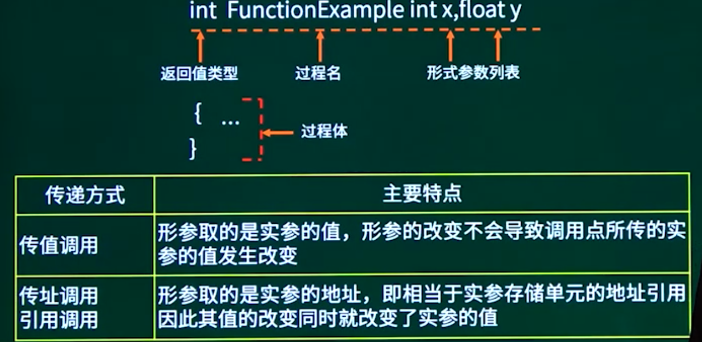
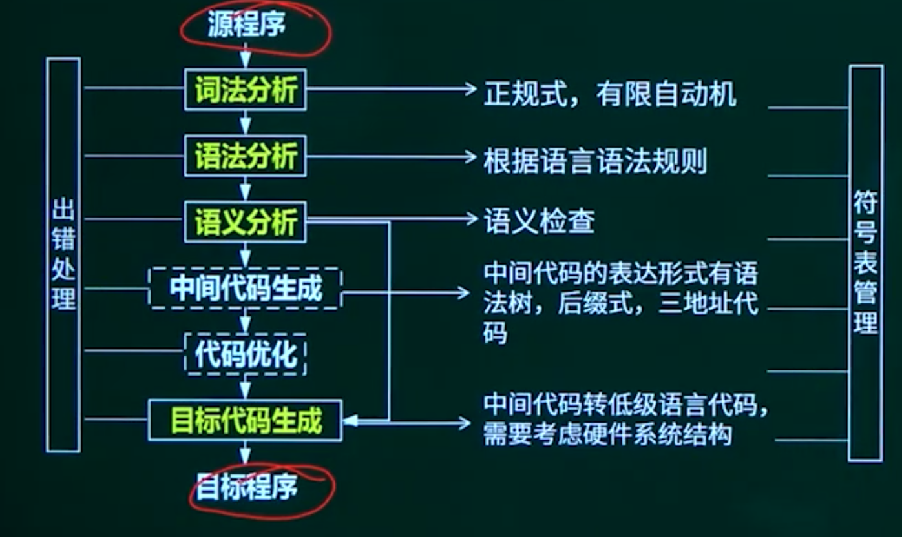
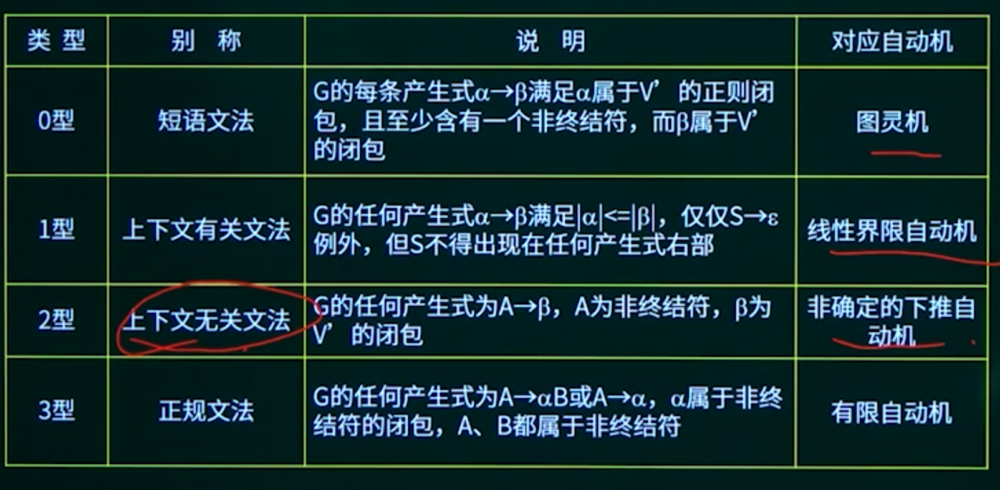
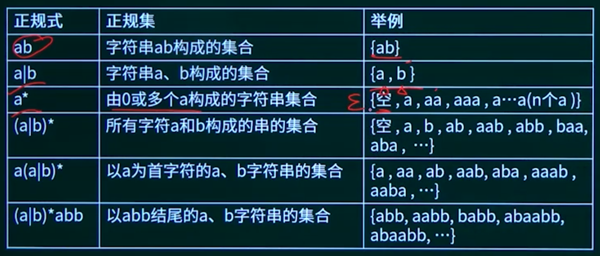
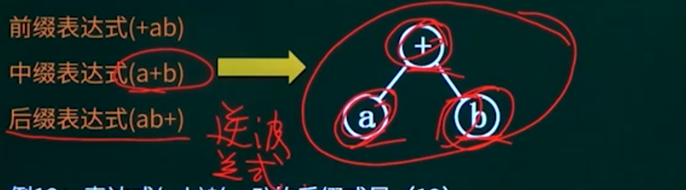

## 17.1. 程序设计语言概述

### 17.1.1. 程序设计语言概述知识点概述


### 17.1.2. 编译程序与解释程序






### 17.1.3. 多种程序设计语言特点

1. Fortran语言（科学计算，执行效率高）
2. Pascal语言，（为教学而开发的，表达能力强，Delphi）

3.C语言（指针操作能力强，高效）

4. Lisp语言（函数式程序语言，符号处理，人工智能）

5.C++语言（面向对象，高效）

6. Java语言（面向对象，中间代码，跨平台）

7.C#语言（面向对象，中间代码，.Net）

8.Prolog语言（逻辑推理，简洁性，表达能力，数据库和专家系统）

9.Python语言（解释型，面向对象，胶水语言）


### 17.1.4. 程序设计语言的基本成分




### 17.1.5. 函数调用方式 *



## 17.2. 编译程序基本原理

### 17.2.1. 编译程序基本原理知识点概述

### 17.2.2. 编译过程概述



词法分析：从左到右逐个扫描源程序中的字符，识别其中如关键字（或称保留宇）、标识符、常数、运算符以及分隔符（标点符号和括号）等。

源程序 到 记号流


语法分析：根据语法规则将单词符号分解成各类语法单位，并分析源程序是否存在语法上的错误。包括：语言结构出错、if•rend if不匹配，缺少分号、括号不匹配、表达式缺少操作数等。

语义分析：进行类型分析和检查，主要检测源程序是否存在静态语义错误。

包括：运算符和运算类型不符合，如取余时用浮点数。

##### 动态错误

- 发生在程序运行时
- 也叫动态语义错误
- 陷入死循环、变量取零时做除数、引用数组元素下标越界等错误

##### 静态错误

- 编译时所发现的程序错误
- 分为语法错误和静态语义错误
- 语法错误包含：单词拼写错误、标点符号错误、表达式中缺少操作数、括号不匹配等有关语言结构上的错误
- 静态语义分析：运算符与运算对象类型不合法等错误

```
语法指导翻译是一种（）方法。
A 动态语义分析
B 中间代码优化
C 静态语义分析
D 目标代码优化
```

```
将高级语言源程序先转化为一种中间代码是现代编译器的常见处理方式。
常用的中间代码有后缀式、（）、树等。
A 前缀码
B 三地址码
C 符号表
D 补码和移码
```

```
某程序运行时陷入死循环，则可能的原因是程序中存在（）。
A 词法错误
B 语法错误
C 动态的语义错误
D 静态的语义错误
```

```
在对高级语言源程序进行编译或解释处理的过程中，需要不断收集、记录和使用源程序中一些相关符号的类型和特征等信息，并将其存入（）中。
A 哈希表
B 符号表
C 堆栈
D 队列
```


### 17.2.3. 文法

一个形式文法是一个有序四元组G=（V，T，S,P），其中：

1） V：非终结符。不是语言组成部分，不是最终结果，可理解为占位符。

2） T：终结符。是语言的组成部分，是最终结果。V~T=0

3） S：起始符。是语言的开始符号。

4） P：产生式。用终结符替代非终结符的形如a-B

正则闭包：A=AOUA*（在正则闭包的基础上，加上A=｛）。


例如a=（a, aa, aaa, 8，而（ab）'=｛ab,abab,ababab，"｝




一棵语法树应具有以下特征：

1. 每个结点都有一个标记，此标记是V的一个符号；
2. 根的标记是S；
3. 若一结点n至少有一个它自己除外的子孙，并且有标记A，则A肯定在Vw中；
4. 如果结点n的直接子孙，从左到右的次序是结点n」，D2，.Dk，其标记分别是：

ALAzAw那么A->ALAzAk一定是P中的一个产生式。


### 17.2.4. 正规式与正规集 *

正规式是描述程序语言单词的表达式，对于字母乏，其上的正规式及其表示的正规集可以递归定义如下。

1. e是一个正规式，它表示集合L（E）=｛e｝。
2. 若a是工上的字符，则a是一个正则式，它所表示的正规L（a）=｛a｝。
3. 若正规式r和s分别表示正规集L（r）=L（S），则（a）rs是正规式，表示集合L（r）UL（S）；

（b）r•s是正规式，表示集合L（r）L（S）；

（c）r*是正规式，表示集合（L（r））*；

（d）（r）是正规式，表示集合L（r）。




### 17.2.5. 有限自动机 * 


### 17.2.6. 后缀表达式 *




## 17.3. 章节概述


## 17.4. 章节回顾

