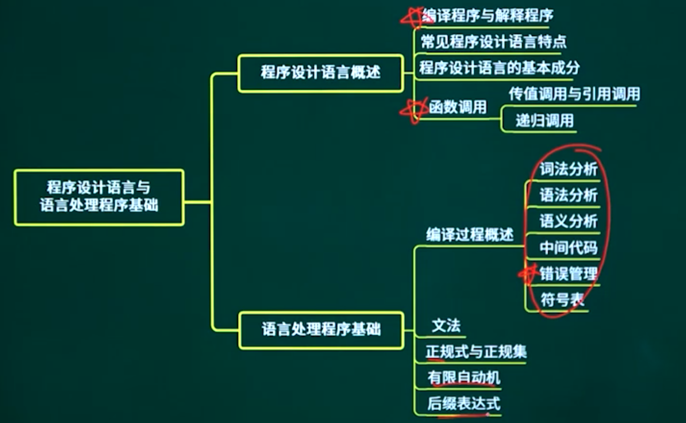
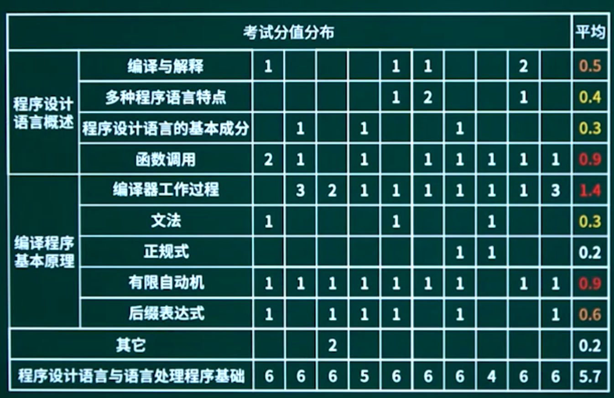

## 17.1. 程序设计语言概述

17.1.1. 程序设计语言概述知识点概述

17.1.2. 编译程序与解释程序

17.1.3. 多种程序设计语言特点

17.1.4. 程序设计语言的基本成分

17.1.5. 函数调用方式

## 17.2. 编译程序基本原理

### 17.2.1. 编译程序基本原理知识点概述

17.2.2. 编译过程概述

17.2.3. 文法

17.2.4. 正规式与正规集

17.2.5. 有限自动机

17.2.6. 后缀表达式

## 17.3. 章节概述

## 17.4. 章节回顾

