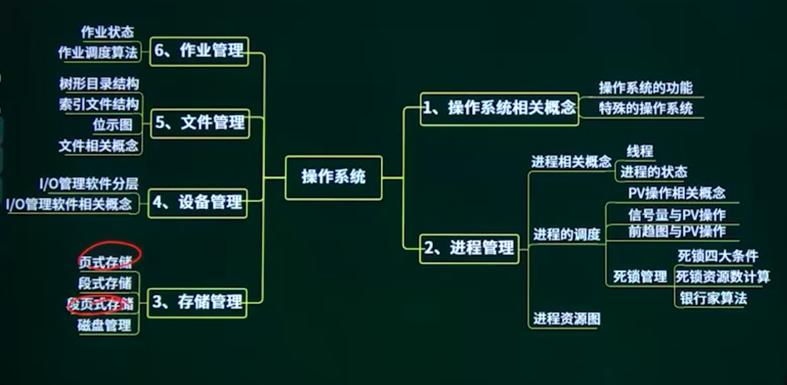
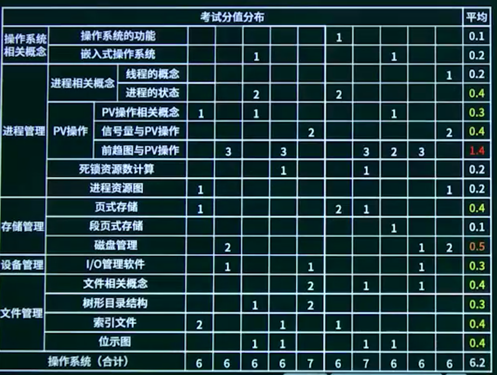

## 2.1. 操作系统概念

2.1.1. 操作系统概念概述

2.1.2. 操作系统的作用

2.1.3. 特殊的操作系统

## 2.2. 进程的概念

2.2.1. 进程的概念概述

2.2.2. 线程的概念

2.2.3. 进程的状态

## 2.3. 进程调度

2.3.1. 进程调度概述

2.3.2. PV的概念

2.3.3. 信号量与PV操作

2.3.4. 前趋图与PV操作

## 2.4. 死锁资源数计算

## 2.5. 进程资源图

## 2.6. 段页式存储(从这开始)

### 2.6.1. 段页式存储概述

2.6.2. 页式存储

2.6.3. 段式存储

2.6.4. 段页式存储

## 2.7. 磁盘管理

2.7.1. 磁盘管理-01

2.7.2. 磁盘管理-02

## 2.8. IO管理软件

## 2.9. 文件管理

2.9.1. 文件管理概述

2.9.2. 文件相关概念

2.9.3. 树形目录结构

2.9.4. 位示图

2.9.5. 索引文件

## 2.10. 作业管理

## 2.11. 操作系统章节概述

## 2.12. 操作系统章节回顾
