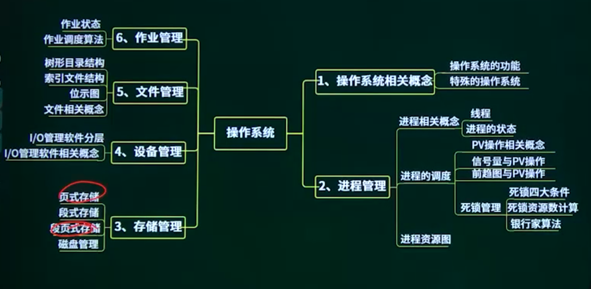

## 2.1. 操作系统概念

### 2.1.1. 操作系统概念概述

### 2.1.2. 操作系统的作用


### 2.1.3. 特殊的操作系统


## 2.2. 进程的概念

### 2.2.1. 进程的概念概述

### 2.2.2. 线程的概念

进程是程序在一个数据集合上运行的过程，它是系统进行资源分配和调度的一个独立单位。它由程序块、进程控制块（PCB）和数据块三部分组成。

PCB:PCB是进程存在的唯一标志。内容包含进程标识符、状态、位置信息、控制信息、队列指针（链接同一状态的进程）、优先级、现场保护区等。

进程与程序的区别：进程是程序的一次执行过程，没有程序就没有进程。

程序是一个静态的概念，而进程是一个动态的概念，它由创建而产生，完成任务后因撤销而消亡；进程是系统进行资源分配和调度的独立单位，而程序不是。

进程的2个基本属性：可拥有资源的独立单位；可独立调度和分配资源的基本单位。


```
在支持多线程的操作系统中，假设进程P创建了若干个线程，那么（）是不能被这些线程共享的。
A 该进程中打开的文件
B 该进程的代码段
C 该进程中某线程的栈指针
D 该进程的全局变量
```

### 2.2.3. 进程的状态


运行：当一个进程在CPU上运行时。（单处理机处于运行态的进程只有一个）

就绪：一个进程获得了除CPU外的一切所需资源，一旦得到处理机即可运行。

阻塞：阻塞也称等待或睡眠状态，一个进程正在等待某一事件发生（例如请求/0等待1/0完成等）而暂时停止运行，此时即使把CPU分配给进程也无法运行，故称进程处于阻塞状态。


## 2.3. 进程调度 *

### 2.3.1. 进程调度概述

### 2.3.2. PV的概念 *

临界资源：诸进程间需要互斥方式对其进行共享的资源。

（进程中访问临界资源的那段代码称为临界区）


信号量：是一种特殊的变量。

信号量可以表示资源数量；

信号量为负数时还可以表示排队进程数。

P是荷兰语的Passeren，加锁。

V是荷兰语的Verhoog，解锁。


```

PV操作是操作系统提供的具有特定功能的原语。利用PV操作可以（）。
A 保证系统不发生死锁
B 实现资源的互斥使用
C 提高资源利用率
D 推迟进程使用共享资源的时间
```

```
假设系统中有n个进程共享3台扫描仪，并采用PV操怍实现进程同步与互斥。若系统信号量S的当前值为-1，进程P1、P2又分別执行了1次P（S）操作，那么信号量S的值应为（B）。
А 3
B -3
C 1
D-1
```

### 2.3.3. 信号量与PV操作

#### 同步模型

 生产者    缓存区   消费者


### 2.3.4. 前趋图与PV操作 * 3'


## 2.4. 死锁资源数计算

#### 死锁四大条件

互斥

保持和等待

不剥夺

环路等待

#### 死锁的预防

打破四大条件

有序资源分配法

静态资源分配

#### 死锁的避免

银行家算法

#### 死锁的检测与解除

#### 鸵鸟策略

进程管理是操作系统的核心，但如果设计不当，就会出现死锁的问题。如果进程在等待一件不可能发生的事，则进程就死锁了。而如果多个进程产生死锁，就会造成系统死锁。


```
某计算机系统中互斥资源R的可用数为8，系统中有3个进程P1、P2和P3竞争R，且每个进程都需要i个R，该系统可能会发生死锁的最小值为（）。
A l
B 2
C 3
D 4
```

不可能死锁

(w - 1) * m + 1 <= n 

w：每个进程需要的资源数

m：进程数量

n：资源数

最悲观的情况，就是每个进程都缺少一个资源等待。

## 2.5. 进程资源图

节点的情况，是否会产生死锁，考点。


先分析资源分配情况，列出剩余可用资源：此时已分配1个R1给进程P，剩余1个R1可用。

再判断申请后进程是否能够执行：P进程申请1个R1，系统有1

个R1可用，P进程可成功执行，执行后释放占用的2个R1

阻塞：没有资源分配

非阻塞：有字段分配


## 2.6. 段页式存储(从这开始)

### 2.6.1. 段页式存储概述

### 2.6.2. 页式存储

页式存储：将程序与内存均划分为同样大小的块，以页为单位将程序调入内存。

总容量=存储个数*编址内容


优点  利用率高，碎片小，分配及管理简单

缺点  增加了系统开销；可能产生抖动现象


### 2.6.3. 段式存储

段式存储：按用户作业中的自然段来划分逻辑空间，然后调入内存，段的长度可以不一样。


优点：多道程序共享内存，各段程序修改互不影响

缺点：内存利用率低，内存碎片浪费大


### 2.6.4. 段页式存储

段页式存储：段式与页式的综合体。先分段，再分页。1个程序有若干个段，每个段中可以有若干页，每个页的大小相同，但每个段的大小不同。


## 2.7. 磁盘管理

### 2.7.1. 磁盘管理-01


​	存取时间=寻道时间+等待时间，寻道时间是指磁头移动到磁道所需的时间；

等待时间为等待读写的扇区转到磁头下方所用的时间。

#### 读取磁盘数据的时间应包括以下三个部分：

（1）找磁道的时间。

（2） 找块（扇区）的时间，即旋转延迟时间。

（3）传输时间。

#### 移臂算法先

来先服务（FCFS）

最短寻道时间优先(SSTF）

扫描算法（SCAN），电梯算法，双向

循环扫描算法，单向

```
假设磁盘块与缓冲区大小相同，每个盘块读入缓冲区的时间为15uS，由缓冲区送至用户区的时间是5uS，在用户区内系统对每块数据的处理时间为1us，若用户需要将大小为10个磁盘块的DoC1文件逐块从磁盘读入缓冲区，并送至用户区进行处理，那么采用单缓冲区需要花费的时间为（201）us；采用双缓冲区需要花费的时间为（156）us。
A 150
B 151
C 156
D 201
A 150
B 151
C 156
D 201
```


### 2.7.2. 磁盘管理-02

## 2.8. IO管理软件


## 2.9. 文件管理

### 2.9.1. 文件管理概述

### 2.9.2. 文件相关概念

文件：具有符号名的、在逻辑上具有完整意义的一组相关信息项的集合。

逻辑结构：有结构的记录式文件、无结构的流式文件。

物理结构：连续结构、链接结构、索引结构、多个物理块的索引表。

文件目录：

#### 文件目录项/文件的说明/文件控制块FCB

基本信息类：文件名、文件的物理地址、文件长度和文件块数等

存储控制信息类：文件的存储权限：读写、执行权限等（文件属性：只执行、隐含、只读、读/写、共享、系统）

使用信息类：文件建立日期、最后一次修改/访问日期、当前使用的信息、打开文件的进程数以及在文件上的等待队列等

#### 目录结构

一级目录结构：线性结构，查找速度慢，不允许重名和实现文件共享等

二级目录结构：主文件目录 （MFD）+用户目录 （UFD）

三级目录结构：树型目录结构（多级目录结构）

```
若系统在将（A）文件修改的结果写回磁盘时发生崩溃，则对系统的影响相对较大。
A 目录
B 空闲块
C 用户程序
D 用户数据
```

### 2.9.3. 树形目录结构

绝对路径：是从盘符开始的路径。

相对路径：是从当前目录开始的路径。

若当前目录为：

D1， 要求写出F2路径，则：

绝对路径： /D1/W2/F2

相对路径： W2/F2

全文件名：绝对路径+文件名


### 2.9.4. 位示图

那些磁盘可用和不可用

默认位1开始，字节0开始

```
某字长为32位的计算机的文件管理系统采用位示图盘的使用情况。若磁盘的容量为300GB记录磁物理块的大小为1MB，那么位示图的大小为（）个字。(bitmap)
A 1200
B 3200
C 6400
D 9600
300G/ 1M  / 32 = 300 * 32
```

### 2.9.5. 索引文件 *


## 2.10. 作业管理


#### 调度算法

先来先服务法

时间片轮转法

短作业优先法

最高优先权优先法

高响应比优先法

## 2.11. 操作系统章节概述




## 2.12. 操作系统章节回顾
