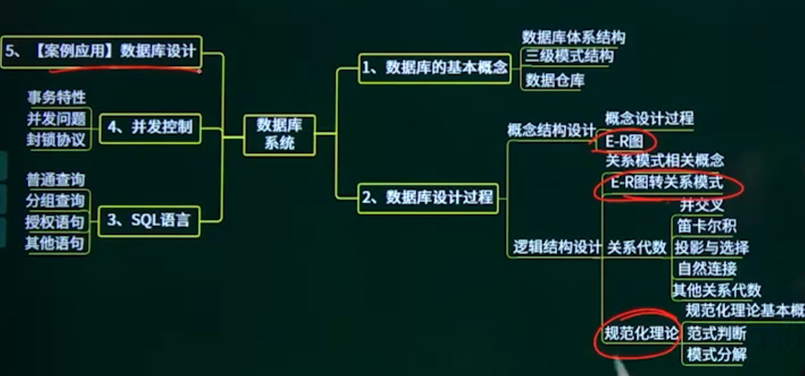
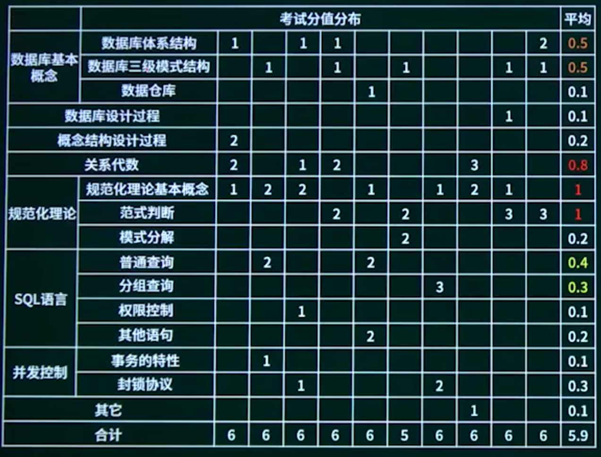

## 3.1. 数据库的基本概念

3.1.1. 数据库的基本概念

3.1.2. 数据库体系结构

3.1.3. 三级模式结构

3.1.4. 数据仓库

## 3.2. 数据库设计过程

## 3.3. 概念设计阶段

3.3.1. 概念设计阶段概述

3.3.2. 概念设计过程

3.3.3. E-R图

## 3.4. 逻辑结构设计

3.4.1. 逻辑结构设计概述

3.4.2. 关系模式相关概念

3.4.3. E-R图转关系模式

## 3.5. 关系代数

## 3.6. 规范化理论

3.6.1. 规范化理论概述

3.6.2. 规范化理论基本概念-01

3.6.3. 规范化理论基本概念-02

3.6.4. 范式判断-01

3.6.5. 范式判断-02

3.6.6. 模式分解-01

3.6.7. 模式分解-02

## 3.7. SQL语言

3.7.1. SQL语言概述

3.7.2. 普通查询

3.7.3. 分组查询

3.7.4. 权限控制

## 3.8. 并发控制

3.8.1. 并发控制概述

3.8.2. 事务的特性

3.8.3. 并发问题

3.8.4. 封锁协议

## 3.9. 数据库系统章节概述

## 3.10. 数据库系统章节回顾
