## 3.1. 数据库的基本概念

### 3.1.1. 数据库的基本概念

### 3.1.2. 数据库体系结构

集中式数据库系统

- 数据是集中的
- 数据管理是集中的
- 数据库系统的素有功能（从形式的用户接口到DBMS核心）都集中在DBMS所在的计算机。

C/S结构

- 客户端负责数据表示服务
- 服务器主要负责数据库服务
- 数据库系统分为前端和后端
- ODBC. JDBC

分布式数据库

- 物理上分布、逻辑上集中

- 物理上分布、逻辑上分布
- 特点
- 透明性

#### 分布式数据库特点

数据独立性。除了数据的逻辑独立性与物理独立性外，还有数据分布独立性（分布透明性）。

集中与自治共享结合的控制结构。各局部的DBMS可以独立地管理局部数据库，具有自治的功能。同时，系统又设有集中控制机制，协调各局部DBMS的工作，执行全局应用。

适当增加数据冗余度。在不同的场地存储同一数据的多个副本，可以提高系统的可靠性和可用性，同时也能提高系统性能。

（提高系统的可用性，即当系统中某个节点发生故障时，因为数据有其他副本在非故障场地上，对其他所有场地来说，数据仍然是可用的，从而保证数据的完备性。）

全局的一致性、可串行性和可恢复性。

#### 分布式数据库透明性

分片透明：是指用户不必关心数据是如何分片的，它们对数据的操作在全局关系上进行，即如何分片对用户是透明的。

复制透明：用户不用关心数据库在网络中各个节点的复制情况，被复制的数据的更新都由系统自动完成。

位置透明：是指用户不必知道所操作的数据放在何处，即数据分配到哪个或哪些站点存储对用户是透明的

局部映像透明性（逻辑透明）：是最低层次的透明性，该透明性提供数据到局部数据库的映像，即用户不必关心局部DBMS支持哪种数据模型、使用哪种数据操纵语言，数据模型和操纵语言的转换是由系统完成的。

因此，局部映像透明性对异构型和同构异质的分布式数据库系统是非常重要的。

```
当某一场地故障时，系统可以使用其他场地上的副本而不至于使整个系统瘫痪。这称为分布式数据库的（）。
A 共享性
B 自治性
C 可用性
D 分布性
```


### 3.1.3. 三级模式结构

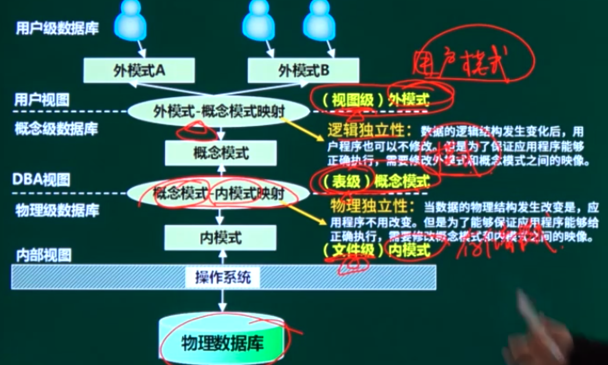

```
数据库系统通常采用三级模式结构：外模式、模式和内模式。这三级模式分别对应数据库的（B）。
A基本表、存储文件和视图
B视图、基本表和存储文件
C基本表、视图和存儲文件
D视图、存储文件和基本表
```

```
以下关于数据库两级映像的叙述中正确的是（）。
A 模式/内模式映像实现了外模式到内模式之间的相互转换
B 模式/內模式映像实现了概念模式到内模式之间的相互转换
C 外模式/模式的映像实现了概念模式到內模式之间的相互转换
D 外模式/内模式的映像实现了外模式到内模式之间的相互转换
```

```
数据的物理独立性和逻辑独立性分别是通过修改（）来完成的。
A 外模式与内模式之间的映像、模式与内模式之间的映像
B 外模式与内模式之间的映像、外模式与模式之间的映像
C 外模式与模式之间的映像、模式与内模式之间的映像
D 模式与内模式之间的映像、外模式与模式之间的映像
```

### 3.1.4. 数据仓库

面向主题：数据按主题组织。

集成的：消除了源数据中的不一致性，提供整个企业的一致性全局信息。

相对稳定的（非易失的）：主要进行查询操作，只有少量的修改和删除操作（或是不删除）。

反映历史变化（随着时间变化）：记录了企业从过去某一时刻到当前各个阶段的信息，可对发展历程和未来趋势做定量分析和预测。

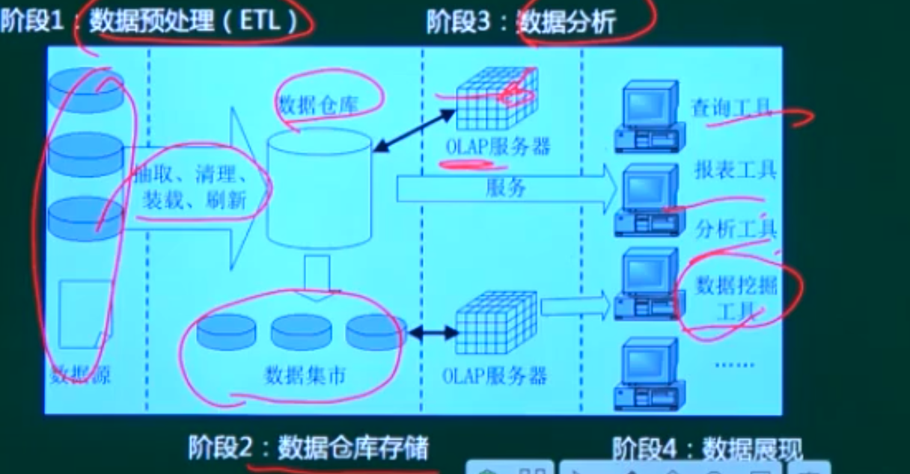

## 3.2. 数据库设计过程

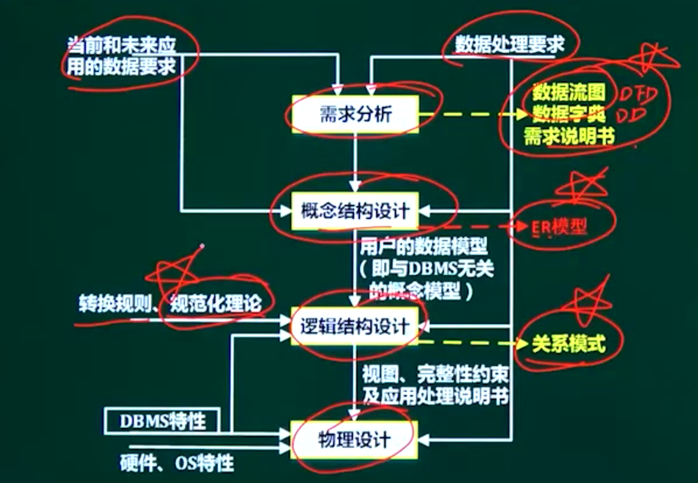

## 3.3. 概念设计阶段

### 3.3.1. 概念设计阶段概述

### 3.3.2. 概念设计过程

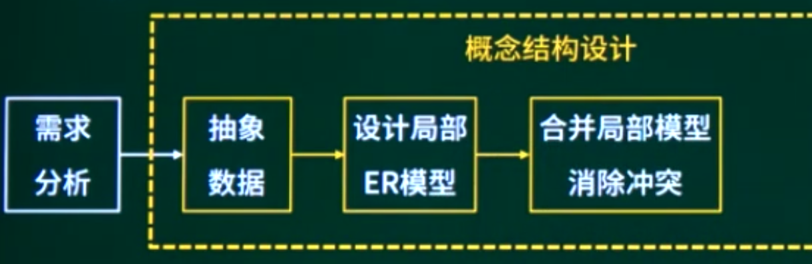

集成的方法：

- 多个局部E-R图一次集成。
- 逐步集成，用累加的方式一次集成两个局部E-R。

集成产生的冲突及解決办法：（针对同一 象）

- 属性冲突：包括属性域冲突和属性取值冲突。
- 命名冲突：包括同名异义和异名同义。
- 结构冲突：包括同一对象在不同应用中具有不同的抽象，以及同一不同局部E-R图中所包含的属性个数和属性排列次序不完全相同。

### 3.3.3. E-R图

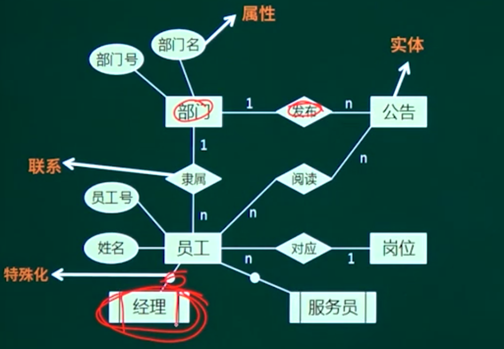

实体：实体是现实世界中可以区别于其他对象的事件或事物。

（实体集一实体的集合）

属性：属性是实体某方面的特性。

联系：实体的联系分为实体内部的联系和实体与实体间的联系。实体间联系类型：1:1，1：，

#### 简单属性和复合属性

简单属性是原子的，不可再分的；

复合属性可以细分为更小的部分（即划分为别的属性）。

#### 单值属性和多值属性：

定义的属性对于一个特定的实体都只有单独的一个值，称为单值属性；

在某些特定情况下，一个属性可能对应一组值，称为多值属性。

NULL属性：表示无意义或不知道。

派生属性：可以从其他属性得来。

#### 联系


弱实体：在现实世界中有一种特殊的依赖联系，该联系是指某实体是否存在对于另一些实体具有很强的依赖关系，即一个实体的存在必须以另一个实体为前提，而将这类实体称为弱实体，如家属与职工的联系，附件与邮件。

特化：在现实世界中，某些实体一方面具有一些共性，另一方面还具有各自的特性，一个实体集可以按照某些特征区分为几个子实体。

聚集：一个联系作为另一个联系的一端。

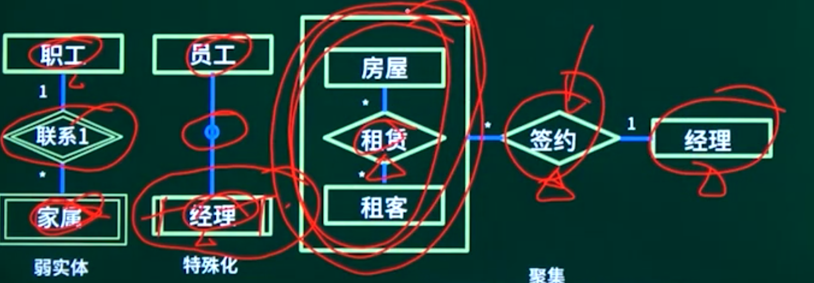

## 3.4. 逻辑结构设计

### 3.4.1. 逻辑结构设计概述

### 3.4.2. 关系模式相关概念

层次模型

网状模型

关系模型

面向对象模型

注：数据模型三要素：数据结构、数据操作、数据的约束条件


目或度：关系模式中属性的个数。

候选码（候选键）

主码（主键）

愿供与非主属性》組成候选码的属性就是主属性，其它的就魂非主篇位。

外码｛外键）

全码 （ALL-Key）关系模式的所有属性组是这个关系的候选码。

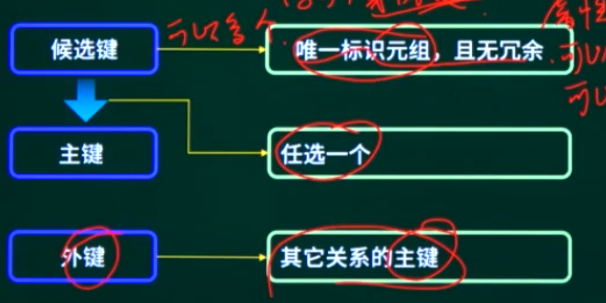

#### 关系的3种类型

基本关系

查询表

视图表

#### 完整性约束

实体完整性约束   外键

参照完整性约束   外键    其他表的主键，或者为空

用户自定义完整性约束   

触发器

 

### 3.4.3. E-R图转关系模式   2‘

一个实体型必须转换为一个关系模式

联系转关系模式：

（1）一对一联系的转换有两种方式。

独立的关系模式：并入两端主键及联系自身属性。（主键：任一端主键

归并（任意一端）：并入另一端主键及联系自身属性。（主键：保持不变）

（2） 一对多联系的转换有两种方式。

独立的关系模式：并入两端主键及联系自身属性。（主键：多端主键）

归并（多端）：并入另一端主键及联系自身属性。（主键：保持不变）

（3） 多对多联系的转换只有一种方式

独立的关系模式：并入两端主键及联系自身属性。（主键：两端主键的组合键）

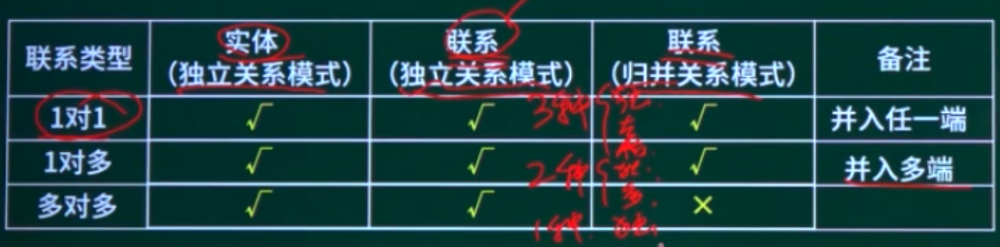

## 3.5. 关系代数  2~4‘

并交差 集合运算

笛卡尔积 *

投影   垂直方向

选择   水平方向

自然连接    减去重复数据

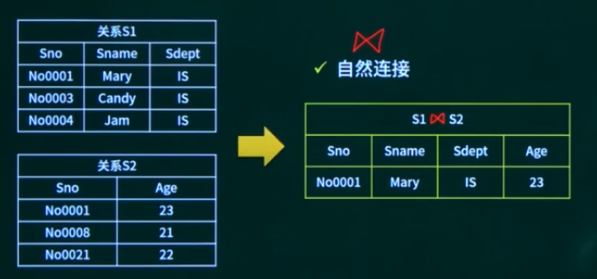

## 3.6. 规范化理论

### 3.6.1. 规范化理论概述

### 3.6.2. 规范化理论基本概念-01


### 3.6.3. 规范化理论基本概念-02

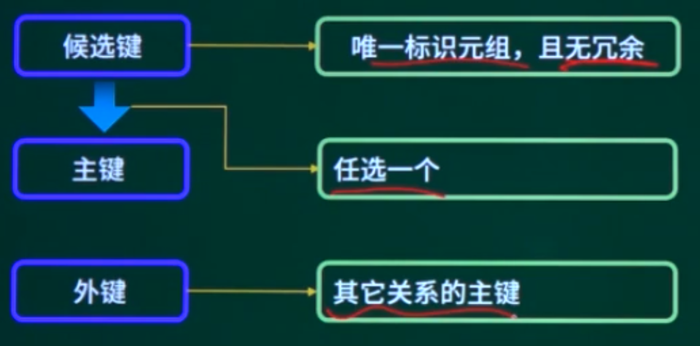

大图示法求候选键

1. 将关系的函数依赖关系，用“有向图”的方式表示。
2. 找出入度为0的属性，并以该属性集合为起点，尝试遍历有向图，若能正常遍历图中所有结点，则该属性集即为关系模式的候选键。
3. 若入度为0的属性集不能遍历图中所有结点，则需要尝试性的将一些中间结点（既有入度，也有出度的结点）并入入度为0的属性集中，直至该集合能遍历所有结点，集合为候选键。

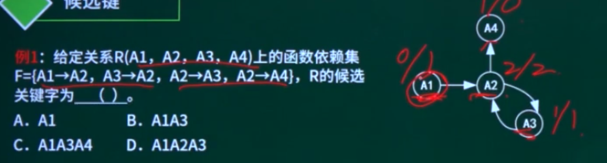

 定义：组成候选码的属性就是主属性，其它的就是非主属性。

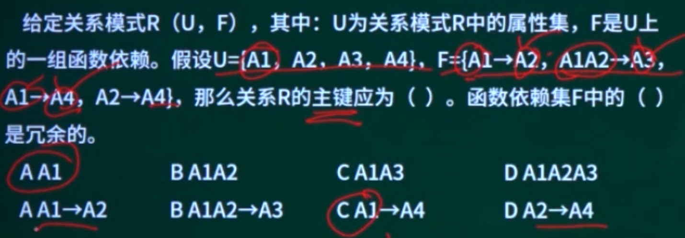

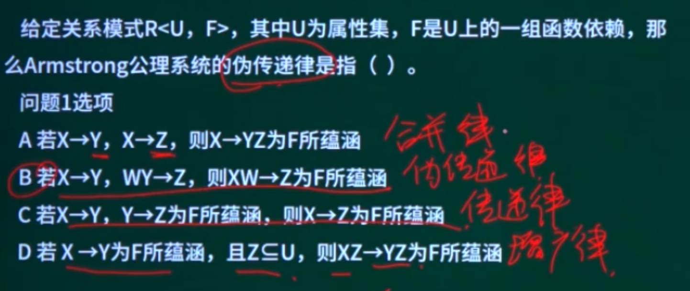

### 3.6.4. 范式判断-01

数据冗余

修改异常

插入异常

删除异常

第一范式（1NF）：在关系模式R中，当且仅当所有域只包含原子值，即每个属性都是**不可再分**的数据项，则称关系模式R是第一范式。

第二范式（2NF）：当且仅当关系模式R是第一范式（1NF），且每一个非主属性完全依赖候选键（没有不**完全依赖**）时，则称关系模式R是第二范式。

第三范式（3NF）：当且仅当关系模式R是第二范式（2NF），且R中没有**非主属性传递依赖于候选键时**，则称关系模式R是第三范式。

BC范式（BCNF）：设R是一个关系模式，F是它的依赖集，R属于BCNF当且仅当其F中**每个依赖的决定因素必定包含R的某个候选码。**

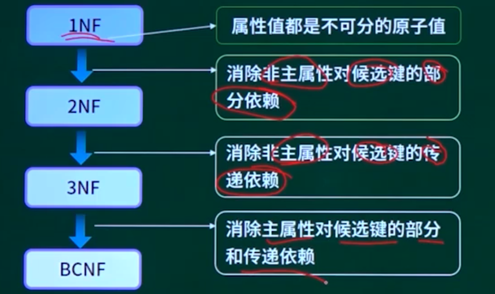


### 3.6.6. 模式分解-01 2~4’


### 3.6.7. 模式分解-02

## 3.7. SQL语言

### 3.7.1. SQL语言概述

### 3.7.2. 普通查询

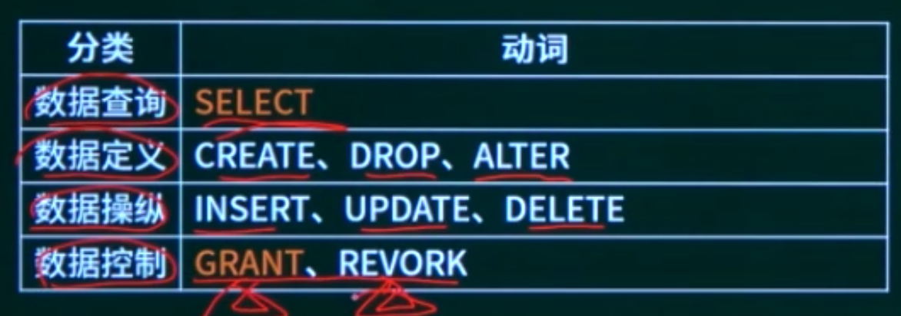

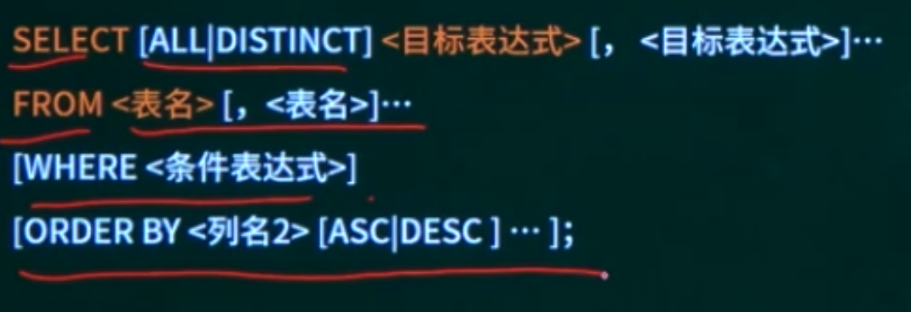


### 3.7.3. 分组查询

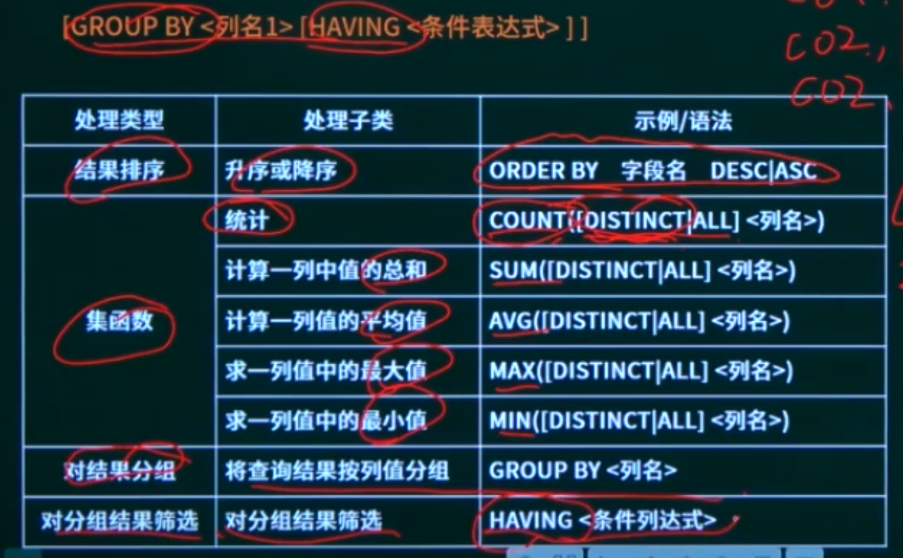

### 3.7.4. 权限控制

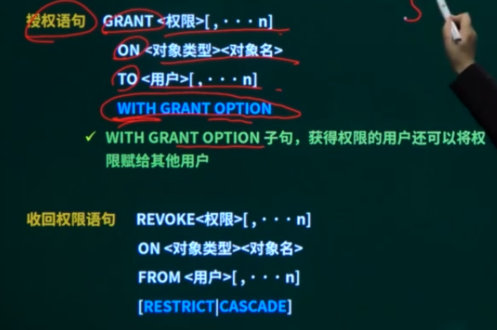

## 3.8. 并发控制

### 3.8.1. 并发控制概述

### 3.8.2. 事务的特性

原子性（Atomicity）：事务是原子的，要么做，要么都不做。

一致性（Consistency）：事务执行的结果必须保证数据库从一个一致性状态变到另一个一致性状态。

隔离性（Isolation）：事务相互隔离。当多个事务并发执行时，任一事务的更新操作直到其成功提交的整个过程，对其他事物都是不可见的。

持久性（Durability）；一旦事务成功提交，即使数据库崩溃，其对数据库的更新操作也永久有效。


### 3.8.3. 并发问题

丢失更新

不可重复读

读脏数据，数据回滚了

### 3.8.4. 封锁协议

共享锁/S锁/读锁：若事务T对数据对象A加上S锁，其他事务只能对A再加S锁，不能再对A添加X锁。

排他锁/独占锁/X锁/写锁：若事务T对数据对象A加上X锁，其他事务不能再对A添加任意锁。


## 3.9. 数据库系统章节概述


## 3.10. 数据库系统章节回顾
