## 5.1. 开放互连参考模型

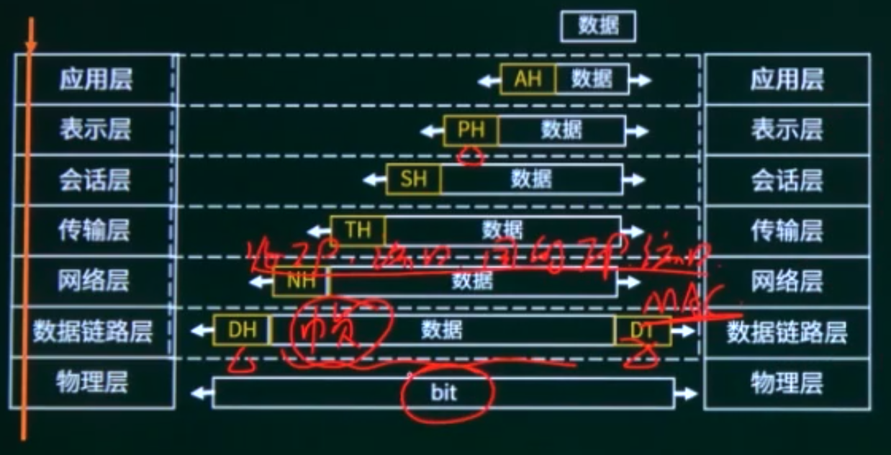

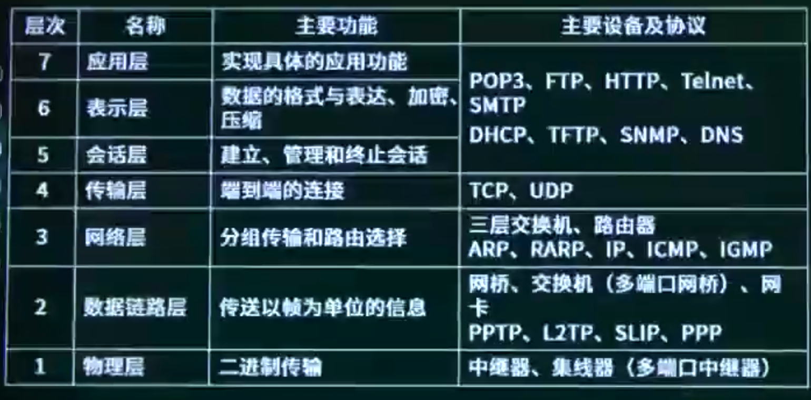

```
集线器与网桥的区别是（）。
A集线器不能检测发送冲突，而网桥可以检测冲突
B集线器是物理层设备，而网桥是数据链路层设备
C网桥只有两个端口，而集线器是一种多端口网桥
D 网桥是物理层设备，而集线器是数据链路层设备
```

```
以下关于网络层次与主要设备对应关系的叙述中，配对正确的是（）。
A网络层—集线器）
B数据链路层一网桥
C传输层—路由器
D会话层—防火墙
```

## 5.2. TCP-IP协议簇

### 5.2.1. TCP-IP协议簇概述

考点1：常见协议寄出

考点2：TCP与UDP

考点3：协议应用提升

### 5.2.2. 常见协议功能基础

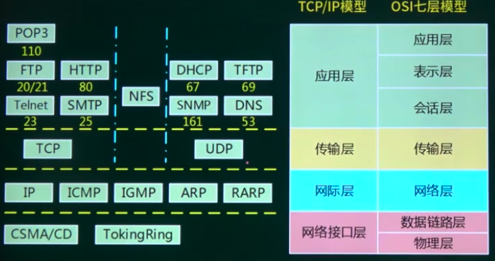

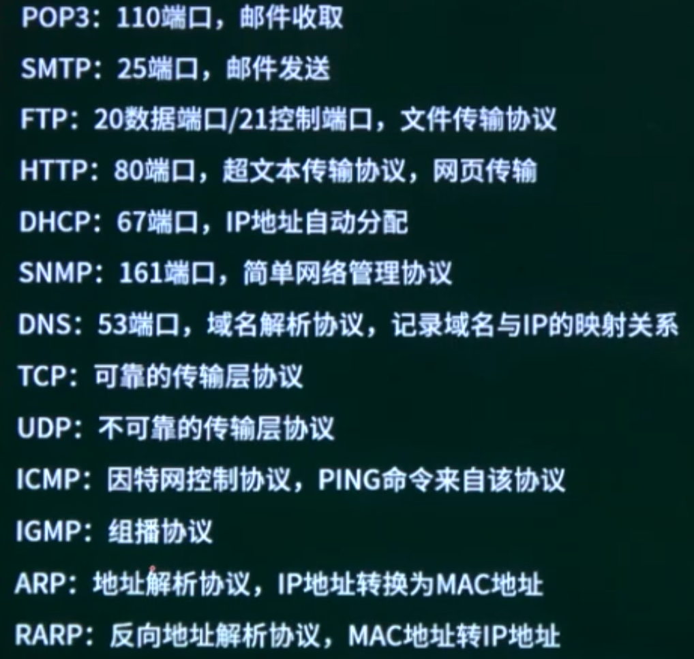

IP：

TCP：可靠

HTTP：超文本传输协议

FTP：文件共享协议，端口20/21

POP3：邮件收取协议，端口110

SMTP：邮件发送协议，端口25。

Telnet：远程协议，端口23，明文传输不安全。


UDP：效率高

DNS：域名解析协议，端口53。

TFTP：简单文件传输协议，端口53.

DHCP：自动生成IP地址，租约，端口67。

SNMP：简单网络管理协议，端口161。


ARP：IP转成MAC

RARP：MAC转成IP

ICMP：ping命令

IGMP：组播协议

```
以下关于TCP/IP协议和层次对应关系的表示中，正确的是（）。
```

```
默认情况下，FTP服务器的控制端口为（D），上传文件时的端口为（B〕。
A大于1024的端口
B 20
C 80
D 21
```

```
若一台服务器只开放了25和110两个端口，那么这台服务器可以提供（A）服务。
A E-Mail
B WEB
C DNS
D FTP
```

### 5.2.3. TCP与UDP

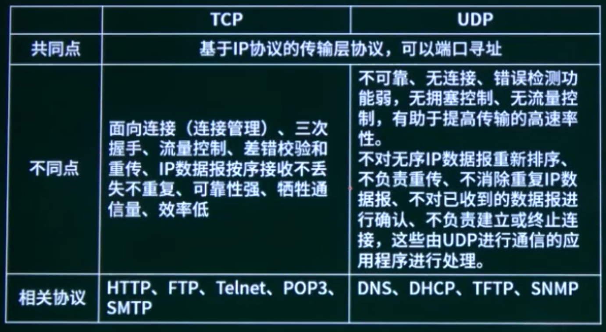

```
TCP和UDP协议均提供了（）能力。
A 连接管理
C 流量控制
B 差错校验和重传
D 端口寻址
```

```
相比于TCP，UDP的优势为（）。
A 可靠传输
B 开销较小
C 拥塞控制
D 流量控制
```

### 5.2.4. 协议应用提升

#### DHCP

1. 客户机/服务器模型
2. 租约默认为8天
3. 当租约过半时，客户机需要向DHCP服务器申请续租；
4. 当租约超过87.5%时，如果仍然没有和当初提供IP的DHCP服务器联系上，则开始联系其他的DHCP服务器。
5. 固定分配、动态分配和自动分配。
6. 169.254.X.X 和0 0.0.0.0（无效）

#### DNS

浏览器输入域名

HOSTS 本地DNS缓存 本地DNS服务器一根域名服务器一顶级域名服务器一权限域名服务器。

主域名服务器接收到域名请求

本地DNS缓存一根域名服务器

```
采用DHCP动态分配IP地址，如果某主机开机后没有得到DHCP服务器的响应。则该主机获取的IP地址属于网络（）。
A 202.117.0.0/24
B 192.168.1.0/24
C 172.16.0.0/16
D 169.254.0.0/16
```

```
在浏览器地址栏输入一个正确的网址后，本地主机将首先在（）该网址对应的IP地址。
A 本地DNS缓存
C 本地DNS服务器
B 本机hosts文件
D 根域名服务器
```

## 5.3. 网络诊断命令

1. ping：用于检查网络是否连通；
2. tracert （linux: traceroute）：用于确定IP数据包访问目标所采取的路径，若网络不通，能定位到具体哪个结点不通；
3. ipconfig ( linux: ifconfig)（显示TCP/IP网络配置值，如：IP地址MAC地址，网关地址等）
4. nslookup（查询DNS记录）
5. Netstat：用于显示网络连接、路由表和网络接口信息；

```
在Windows操作系统下，要获取某个网络开放端口所对应的应用程序信息，可以使用命令（C）。
A ipconfig
B traceroute
C netstat
D nslookup
```

```
测试网络连通性通常采用的命令是（B）。
A Netstat
B Ping
C Msconfig
D Cmd
```

```
使用（C）命令可以释放当前主机自动获取的IP地址。
A ipconfig/all
B ipconfig/reload
C ipconfig/release
D ipconfig/reset
```

## 5.4. IP地址与子网划分

### 5.4.1. IP地址与子网划分概述

考点1：IP地址分类及特殊的IP地址

考点2：子网划分与路由汇聚

考点3：IPv6

### 5.4.2. IP地址分类与特殊的IP地址

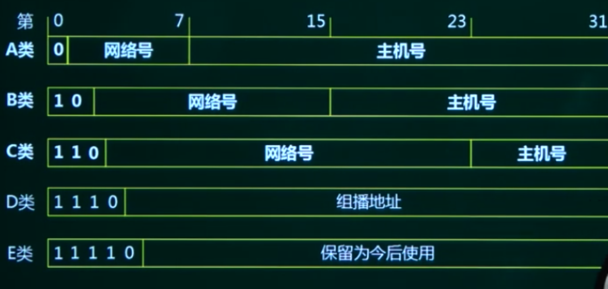

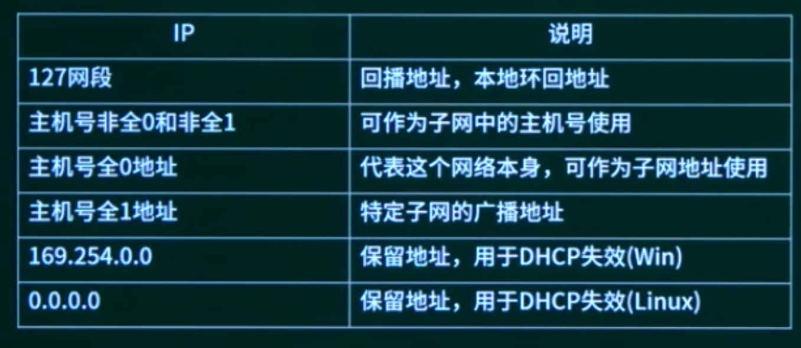

```
在一台安装好TCP/IP协议的计算机上，当网络连接不可用时，为了测试编写好的网络程序，通常使用的目的主机IP地址为（）。
A 0.0.0.0
B 127.0.0.1
C 10.0.0.1
D 210.225.21.255/24
```

### 5.4.3. 子网划分与路由汇聚

#### IP地址

网络号 + 主机号

IP地址/N    N位网络号

子网掩码   网络位置记住1，主机位置记作0.

192.168.0.1   与   255.255.255.0   =  192.168.0.0 网络地址

#### 子网划分

将一个网络划分成多个子网（取部分主机号当子网号）

网络号 + 主机号

网络号 + 子网号 + 主机号

例1，将B类IP地址168.195.0.0划分成27个子网子网掩码为多少？


将一个网络划分成多个子网（取部分主机号当子网号）

例2，将B类IP地址168.195.0.0划分成若干子网，每个子网内有主机700台，则子网掩码为多少？

#### 路由汇聚

将多个网络合并成一个大的网络（取部分网络号当主机号）

例3，设有两个子网202.118.133.0/24和202.118.130.0/24，如果进行路由汇聚，得到的网络地址是？

不同取0.

```
与地址220.112.179.92匹配的路由表的表项是（）。
A 220.112.145.32/22
B 220.112.145.64/22
С 220.112.147.64/22
D 220.112.177.64/22
```

### 5.4.4. IPv6

IPv6是设计用于替代现行版本IP协议（IPv4）的下一代IP协议。2 128位。

（1）IPv6地址长度为128位，地址空间增大了2 96倍；

（2） 灵活的IP报文头部格式。使用一系列固定格式的扩展头部取代了IPv4中可变长度的选项字段。IPv6中选项部分的出现方式也有所变化，使路由器可以简单路过选项而不做任何处理，加快了报文处理速度；

（3） IPv6简化了报文头部格式，字段只有8个，加快报文转发，提高了吞吐量；

（4）提高安全性。身份认证和隐私权是IPv6的关键特性；

（5）支持更多的服务类型；

（6）允许协议继续潢变，增加新的功能，使之适应未来技术的发展；


单播地址（Unicast）：用于单个接口的标识符，传统的点对点通信。

组播地址（Multicast）：多播地址，一点对多点的通信，数据报交付到一组计算机中的每一个。IPv6没有广播的术语，而是将广播看做多播的一个特例。

任播地址（Anycast）：泛播地址，这是IPv6增加的一种类型。任播的目的站是一组计算机，但数据包在交付时只交付给其中一个，通常是举例最近的一个


IPv6地址的8个16进制字段构成。例如：

2001:0db8:85a3:0000:1319:8a2e:0370:7344

IPv6地址的省写，上面的IP地址等价于：

2001:0db8:85a3::1319:8a2e:0370:7344.

遵守这些规则，如果因为省略而出现了两个以上的冒号，则可以压缩为一个，但这种零压缩在地址中只能出现一次。因此：

2001:0DB8:0000:0000:0000:0000:1428:57ab

2001:0DB8:0:0:0:0:1428:57ab

2001:0DB8::1428:57ab

2001:DB8::1428:57ab

以上都是合法的地址，并且它们是等价的。同时前导的零可以省略，因此：

2001:0DB8:02de：：0e13等价于 2001:DB8:2de：：e13。


IPv4/IPv6过渡技术有：

（1）双协议栈技术：双栈技术通过节点对IPV4和IPv6双协议栈的支持，从而支持两种业务的共存。

（2）隧道技术：隧道技术通过在IPv4网络中部署隧道，实现在IPv4网络上对IPv6业务的承载，保证业务的共存和过渡。隧道技术包括：6to4隧道；6over4隧道；ISATAP隧道。

（3） NAT-PT技术：NAT-PT使用网关设备连接IPv6和IPv4网络。当IPv4和IPv6节点互相访问时，NAT-PT网关实现两种协议的转换翻译和地址的映射。

```
IPv6的地址空间是IPv4的（D）倍。
A 4
B 96
C 128
D 2 96
```


## 5.5. 网络规划与设计

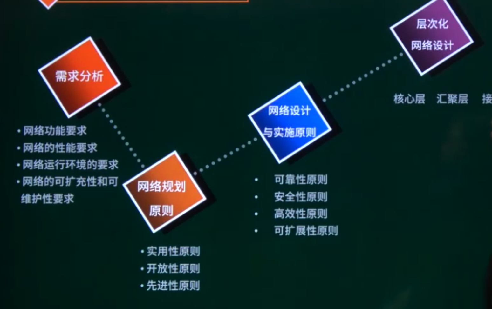

核心层：主要是高速数据交换，实现高速数据传输、出口路由，常用冗余机制。

汇聚层：网络访问策略控制、数据包处理和过滤、策略路由、广播域定义、寻址。

接入层：主要是针对用户端，实现用户接入、计费管理、MAC地址认证、MAC地址过滤、收集用户信息，可以使用集线器代替交换机。

```
以下关于层次化局域网模型中核心层的叙述，正确的是（）。
A 为了保障安全性，对分组要进行有效性检查
B 将分组从一个区域高速地转发到另一个区域
C 由多台二、三层交换机组成
D 提供多条路径来缓解通信瓶颈
```


## 5.6. 网络接入技术

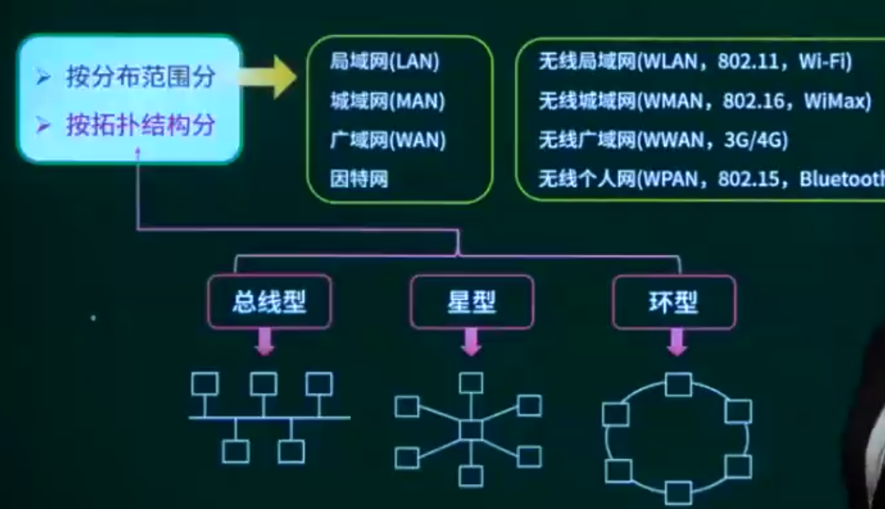

#### 有线接入

- 公用交换电话网络 (PSTN)
- 数字数据网 （DDN）
- 綜合业务数字网（ISDN）
- **非对称数字用户线路**（ADSL）
- 同轴光纤技术（HFC）

#### 无线接入

- IEEE 802.11 (WiFi)
- IEEE 802.15（蓝牙Bluetooth）
- 红外（IrDA）
- WAPI

手机网络

```
使用ADSL接入Internet，用户端需要安装（）协议。
A PPP
B SLIP
С PPTP
D PPPoE
```

```
下列无线网络技术中，覆盖范围最小的是（）
A 802.15.1 蓝牙
B 802.11n  无线局域网
C 802.15.4 ZigBee
D 802.16m  无线城域网
```

## 5.7. WWW服务

### 5.7.1. WWW服务概述

### 5.7.2. URL

Internet地址：域名格式和IP地址格式。

URL：统一资源定位符，是互联网上标准资源的地址。互联网上的每个文件都有一个唯一的URL，它包含的信息指出文件的位置以及浏览器应该怎么处理它。

URL：协议名：//主机名.组名.最高层域名。

例：http://www.baidu.com

URL: protocol://hostname[:port] /path /filename

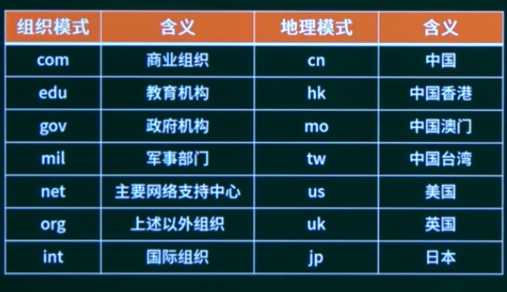

```
tihttp://www.dailynews.com.cn/channel/welcome.htm,www.dailynews.com.cn表示（B），welcome.htm表示（C）。
A 协议类型
B 主机
C 网页文件名
D 路径
```

```
因特网中的域名系统（Domain Name System）是一个分层的域名，在根域下面是顶级域，以下顶级域中，属于国家顶级域。
A NET
B EDU
С СОМ
D UK
```

### 5.7.3. HTML


```
把CSS样式表与HTML网页关联，不正确的方法是（）。
A 在HTML文档的<head>标签内定义CSS样式
B 用@import引入样式表文件
C 在HTML文档的<！->标签内定义CSS样式
D 用<link＞标签链接网上可访问的CSS样式表文件
```


## 5.8. 计算机网络章节概述

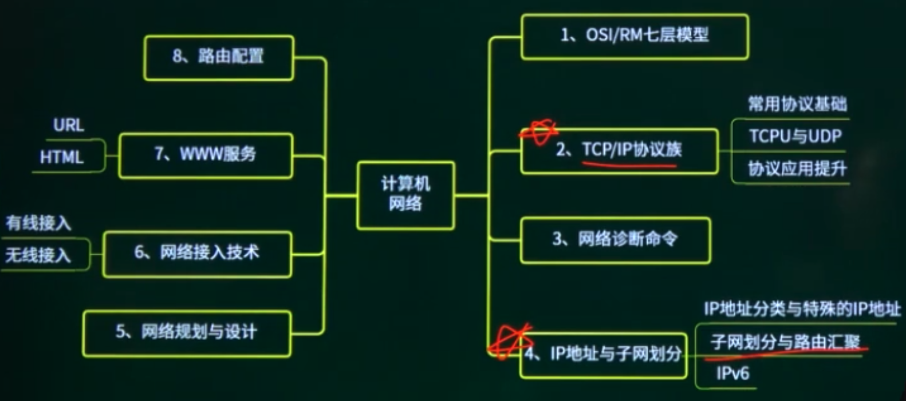

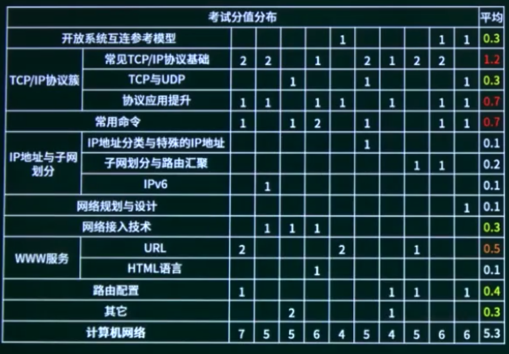

## 5.9. 计算机网络章节回顾