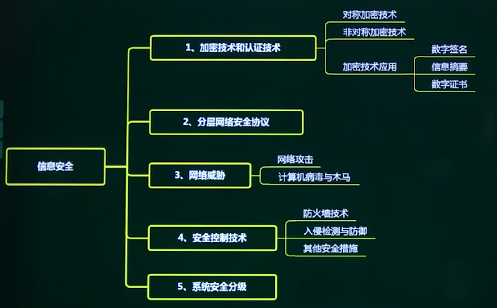
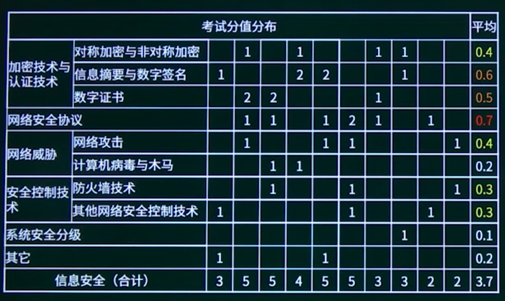

## 6.1. 加密技术与认证技术

6.1.1. 加密技术与认证技术知识点概述

6.1.2. 对称与非对称加密技术

6.1.3. 数字签名与信息摘要

6.1.4. 数字证书应用

## 6.2. 网络安全协议

## 6.3. 网络威胁

6.3.1. 网络安全威胁知识点概述

6.3.2. 网络攻击

6.3.3. 计算机病毒与木马

## 6.4. 网络安全控制技术

6.4.1. 安全控制策略知识点概述

6.4.2. 防火墙技术

6.4.3. 其他安全控制技术

## 6.5. 安全防范体系分级

## 6.6. 信息安全章节概述

## 6.7. 信息安全章节回顾