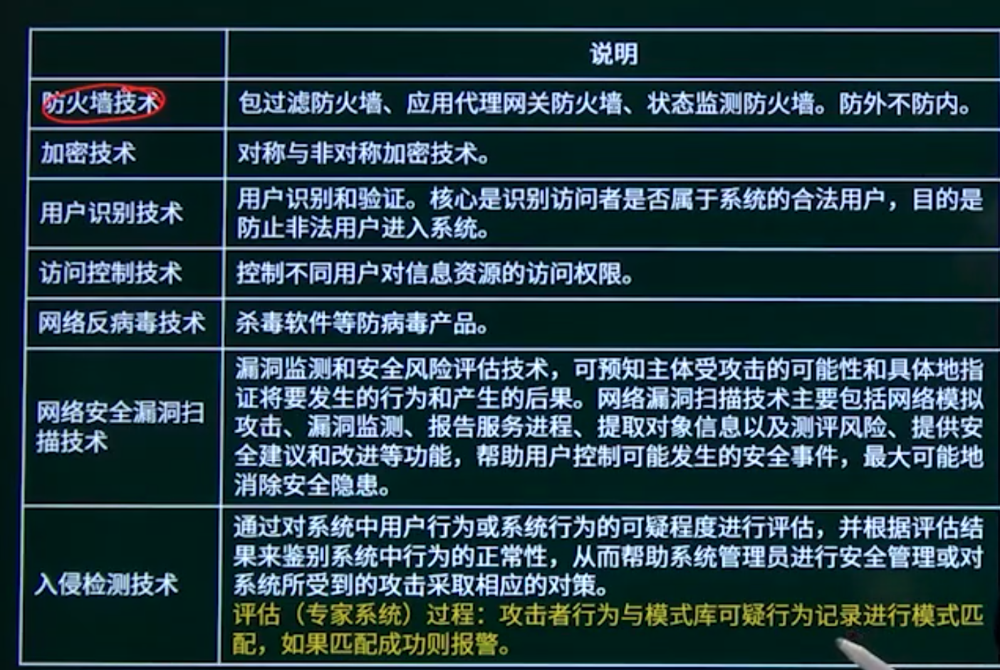

## 6.1. 加密技术与认证技术

### 6.1.1. 加密技术与认证技术知识点概述

### 6.1.2. 对称与非对称加密技术

#### 对称加密技术

加密算法和解密算法相同，设计大量明文

特点：

1、加密强度不高，但效率高；

2、密钥分发困难。

常见对称密钥（共享秘钥）加密算法：

DES、3DES（三重DES）、RC-5、IDEA算法

#### 非对称加密技术

非对称加密：K。K」；密钥必须成对使用（公钥加密，相应的私钥解密）。

特点：加密速度慢，但强度高。

常见非对称密钥（公开密钥）加密算法：RSA、ECC

```
DES是（）算法。
A 公开密钥加密
C 数字签名
B 共享密钥加密
D 认证
```

### 6.1.3. 数字签名与信息摘要

#### 数字签名


数字摘要：

由单向散列函数加密成固定长度的散列值。

常用的消息摘要算法有MD5，SHA等，市场上广泛使用的MD5，SHA算法的散列值分别为128和160位，由于SHA通常采用的密钥长度较长，因此安全性高于MD5。

```
可用于数字签名的算法是（）。
A RSA
B IDEA
C RC4
D MD5
```

```
MD5是（）算法，对任意长度的输入计算得到的结果长度为（B）位。
A 路由选择  B摘要  C共享密钥  D 公开密钥
A 56
B 128
C 140
D 160
```

```
在安全通信中，S将所发送的信息使用（）进行数字签名，
到该消息后可利用（）验证该消息的真实性。
A S的公钥
B S的私钥
C T的公钥
A S的公钥
B S的私钥
C T的公钥
D T的私钥
D T的私钥
```

```
（D）不是数字签名的作用。
A 接收者可验证消息来源的真实性
B 发送者无法否认发送过该消息
C 接收者无法伪造或篡改消息
D 可验证接收者合法性
```


### 6.1.4. 数字证书应用


```
某电子商务网站向CA申请了数字证书，用户可以通过使用（）验证（）的真伪来确定该网站的合法性。
A CA的公钥
B CA的签名
C 网站的公钥
D 网站的私钥
```

```
用户A和B要进行安全通信，通信过程需确认双方身份和消息不可否认。A和B通信时可使用（）来对用户的身份进行认证；使用（）确保消息不可否认。
A数字证书
B消息加密
C用户私钥
D数字签名
```

## 6.2. 网络安全协议


```
与HTTP相比，HTTPS协议对传输的内容进行加密，更加安全。
HTTPS基于（）安全协议，其默认端口是（）。
A RSA  B DES  C SSL  D SSH
A 1023 B 443  C 80   D 8080
```

```
下述协议中与安全电子邮箱服务无关的是（C）。
A SSL
B HTTPS
C MIME   电子邮箱多媒体标准
D PGP
```

## 6.3. 网络威胁

### 6.3.1. 网络安全威胁知识点概述

### 6.3.2. 网络攻击


```
下列攻击行为中，属于典型被动攻击的是（C）。
A 拒绝服务攻击
B 会话拦截
C 系统干涉
D 修改数据命令
```

```
攻击者通过发送一个目的主机已经接收过的报文来达到攻击目的，这种攻击方式属于（）攻击。
A 重放
B 拒绝服务
C 数据截获
D 数据流分析
```

### 6.3.3. 计算机病毒与木马

病毒：编制或者在计算机程序中插入的破坏计算机功能或者破坏数据，影响计算机使用并且能够自我复制的一组计算机指令或者程序代码。

计算机病毒具有隐蔽性、传染性、潜伏性、触发性和破坏性等特点。

木马：计算机木马是一种后门程序，常被黑客用作控制远程计算机的工具。


系统病毒 

(前缀： Win32. PE. W32, 如: KCOM-—Win32.KCOM)

蠕虫病毒（如：恶鹰—-Worm.BBeagle）

木马病毒、黑客病毒（如：QQ消息尾巴木马—-Trojan.Q03344）

脚本病毒（如：红色代码——Script.Redlof）

宏病毒（如：美丽莎——Macro.Melissa）

后门病毒（如：灰鸽子——Backdoor.Win32.Huigezi）

病毒种植程序病毒（冰河播种者— Dropper.BingHe2.2C）

破坏性程序病毒（杀手命令——Harm.Command.Killer）

玩笑病毒（如：女鬼—-Jioke.Grl ghost）

捆绑机病毒（如：捆绑QQ—Binder.QQPass.QQBin)

```
计算机病毒的特征不包括（）。
A 传染性
B 触发性
C 隐蔽性
D 自毁性
```

```
震网漏洞攻击工业控制系统，是一种危害性极大的（）。
（Stuxnet）病毒是一种破坏工业基础设施的恶意代码，利用系统
A 引导区病毒
B 宏病毒
C 木马病毒
D 蠕虫病毒
```

## 6.4. 网络安全控制技术

### 6.4.1. 安全控制策略知识点概述

### 6.4.2. 防火墙技术


```
以下关于防火墙功能特性的叙述中，不正确的是（）。
A 控制进出网络的数据包和数据流向
B 提供流量信息的日志和审计
C 隐藏内部IP以及网络结构细节
D 提供漏洞扫描功能
```

```
（B）防火墙是内部网和外部网的隔离点，它可对应用层的通信数据流进行监控和过滤。
A 包过滤
B 应用级网关
C 数据库
D Web
```

### 6.4.3. 其他安全控制技术



## 6.5. 安全防范体系分级

安全防范体系的层次划分：

（1）物理环境的安全性。包括通信线路、物理设备和机房的安全等。物理层的安全主要体现在通信线路的可靠性（线路备份、网管软件和传输介质）、软硬件设备的安全性（替换设备、拆卸设备、增加设备）、设备的备份、防灾害能力、防干扰能力、设备的运行环境（温度、湿度、烟尘）和不间断电源保障等。

（2） 操作系统的安全性。主要表现在三个方面，一是操作系统本身的缺陷带来的不安全因素，主要包括身份认证、访问控制和系统漏洞等；二是对操作系统的安全配置问题；三是病毒对操作系统的威胁。

（3）网络的安全性。网络层的安全问题主要体现在计算机网络方面的安全性，包括网络层身份认证、网络资源的访问控制、数据传输的保密与完整性、远程接入的安全、域名系统的安全、路由系统的安全、入侵检测的手段和网络设施防病毒等。

（4）应用的安全性。由提供服务所采用的应用软件和数据的安全性产生，包括Web服务、电子邮件系统和DNS等。此外，还包括病毒对系统的威胁。

（5） 管理的安全性。包括安全技术和设备的管理、安全管理制度、部门与人员的组织规则等。管理的制度化极大程度地影响着整个计算机网络的安全，严格的安全管理制度、明确的部门安全职责划分与合理的人员角色配置，都可以在很大程度上降低其他层次的安全漏洞。

```
在网络设计和实施过程中要采取多种安全措施，其中（）是针对系统安全需求的措施。
A 设备防雷击
C 漏洞发现与补丁管理
B 入侵检测
D 流量控制
```


## 6.6. 信息安全章节概述


## 6.7. 信息安全章节回顾