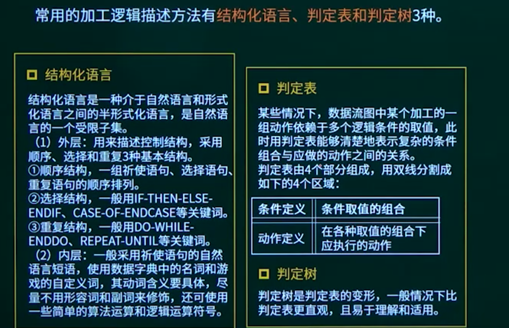

## 7.1. 软件工程概述

### 7.1.1. 软件工程概述

### 7.1.2. 软件的基本生存周期


### 7.1.3. 软件过程

#### 软件过程改进-CMM

初始级：杂乱无章，甚至混乱，几乎没有明确定义的步骤，项目的成功完全依赖个人的努力和英雄式核心人物的作用。

可重复级：建立了**基本的项目管理过程和实践**来跟踪项目费用、进度和功能特性，有必要的过程准则来重复以前在同类项目中成功。某类项目。

已定义级：管理和工程两方面的软件过程已经文档化、标准化，并综合成整个软件开发组织的标准过程。针织组织。

已管理级：制定了软件过程和产品**质量**的**详细度量标准。**

优化级：加强了定量分析，通过来自过程质量反馈和来自新观念、新技术的反馈使过程能**不断持续地改进**。

#### 软件过程改进-CMMI-阶段式模型


#### 软件过程改进-CMMI-连续式模型


```
以下关于CMM的叙述中，不正确的是（C）
A CMM是指软件过程能力成熟度模型
B CMM根据软件过程的不同成熟度划分了5个等级，其中，1级被认为成熟度最高，5级被认为成熟度最低
C CMMI的任务是将已有的几个CMM模型结合在一起，使之构成“集成模型”
D 采用更成熟的CMM模型，一般来说可以提高最终产品的质量
```

```
能力成熟度模型集成（CMMI）是若干过程模型的综合和改进。连续式模型和阶段式模型是CMMI提供的两种表示方法，而连续式模型包括6个过程域能力等级，其中（D）使用量化（统计学）手段改变和优化过程域，以应对客户要求的改变和持续改进计划中的过程域的功效。
A CL2（已管理的）
B CL3（已定义级的）
C CL4（定量管理的）
D CL5（优化的）
```

## 7.2. 软件开发方法

结构化方法（需求明确）

- 用户至上
- 严格区分工作阶段，每阶段有任务和结果
- 强调系统开发过程的整体性和全局性
- 系统开发过程工程化，文档资料标准化
- 自顶向下，逐步分解（求精）

原型法（需求不明确，界面帮助明确需求）

面向对象方法（复杂的大项目）

- 更好的复用性
- 关键在于建立一个全面、合理、统一的模型
- 分析、设计、实现三个阶段，界限不明确

面向服务的方法（更加高级的面向对象方法）

- 抽象级别：操作、服务、业务流程

```
若用户需求不清晰且经常发生变化，但系统规模不太大且不太复杂，则最适宜采用（C）开发方法，对于数据处理领域的问题，若系统规模不太大且不本复杂，需求变化也不大，则最适宜采用（A）开发方法。
A 结构化
B Jackson   面向数据结构
C 原型化
D 面向对象
```

## 7.3. 软件开发模型

### 7.3.1. 软件开发模型知识点概述

必考

### 7.3.2. 瀑布模型与V模型

#### 瀑布模型


#### V模型


```
某开发小组欲为一公司开发一个产品控制软件，监控产品的生产和销售过程，从购买各种材料开始，到产品的加工和销售进行全程跟踪。购买材料的流程、产品的加工过程以及销售过程可能会发生变化。该软件的开发最不适宜采用（A）模型，主要是因为这种模型（C）。
A 瀑布  B 原型  C 增量  D 喷泉
A 不能解決风险
B 不能快速提交软件
C 难以适应变化的需求
D 不能理解用户的需求
```


### 7.3.3. 演化模型（原型模型、螺旋模型）

#### 原型模型


- 抛弃：
- 演化：

- 探索：
- 实验：算法
- 演化：逐步演进的过程

#### 螺旋模型


适合庞大，复杂，高风险的项目

```
以下关于系统原型的叙述中，不正确的是（C）。
A 可以帮助导出系统需求并验证需求的有效性
B 可以用来探索特殊的软件解决方案
C 可以用来指导代码优化
D 可以用来支持用户界面设计
```

```
以下关于螺旋模型的叙述中，不正确的是（）。
A 它是风险驱动的，要求开发人员必须具有丰富的风险评估知识和经验
B 它可以降低过多测试或测试不足带来的风险
C 它包含维护周期，因此维护和开发之间没有本质区别
D 它不适用于大型软件开发
```

```
某企业拟开发一个企业信息管理系统，系统功能与多个部门的业务相关。现希望该系统能够尽快投入使用，系统功能可以在使用过程中不断改善。则最适宜采用的软件过程模型为（）。
A 瀑布模型
B 原型模型
C 演化（迭代）模型
D 螺旋模型
```

### 7.3.4. 增量模型


缺点：核心增量不清晰。

```
以下关于增量开发模型的叙述中，不正确的是（D）。
A 不必等到整个系统开发完成就可以使用
B 可以使用较早的增量构件作原型，从而获得稍后的增量构件需求
C优先级最高的服务先交付，这样最重要的服务接受最多的测试
D 有利于进行好的模块划分
```

### 7.3.5. 喷泉模型


```
喷泉模型是一种适合于面向（）开发方法的软件过程模型。该过程模型的特点不包括（D）。
A 对象
B 数据
C 数据流
D 事件
A 以用户需求为动力
B 支持软件重用
C 具有迭代性
D 开发活动之间存在明显的界限
```

### 7.3.6. 统一过程UP


### 7.3.7. 敏捷方法


```
在敏捷过程的开发方法中，（）使用了选代的方法，其中，把每段时间（30天）一次的选代称为一个“冲刺”，并按需求的优先级别来实现产品，多个自组织和自治的小组并行地递增实现产品。
A 极限编程XP
B 水晶法
C 并列争球法
D 自适应软件开发
```

```
以下关于极限编程（XP）的最佳实践的叙述中，不正确的是（）
A 只处理当前的需求，使设计保持简单
B 编写完程序之后编写测试代码
C 可以按日甚至按小时为客户提供可运行的版本
D 系统最终用户代表应该全程配合XP团队
```

## 7.4. 需求分析

### 7.4.1. 需求分析知识点概述

### 7.4.2. 需求分析的基本概念

需求的任务  what

需求的过程

- 问题识别
- 分析与综合
- 编制需求分析文档 SRS 需求规格说明书
- 需求分析与评审

结构化分析的结果：一套分层的数据流图，一本数据词典，一组小说明（也称加工逻辑说明）、补充材料

```
软件开发过程中，需求分析阶段的输出不包括（D）。
A 数据流图
B 实体联系图
C 数据字典
D 软件体系结构图  概要设计 架构图
```

### 7.4.3. 需求的分类


```
某企业财务系统的需求中，属于功能需求的是（A）。
A 每个月特定的时间发放员工工资
B 系统的响应时间不超过3秒
C 系统的计算精度符合财务规则的要求
D 系统可以允许100个用户同时查询自己的工资
```

### 7.4.4. 需求分析的工具

应用的工具

- 数据流图（DFD）

- 数据字典（DD）名词解释
- 判定表
- 判定树


#### 数据字典





```
数据流图建模应遵循（B）的原则。
A 自顶向下、从具体到抽象
B 自顶向下、从抽象到具体
C 自底向上、从具体到抽象
D 自底向上、从抽象到具体
```

```
在结构化分析中，用数据流图描述（）。当采用数据流图对一个图书馆管理系统进行分析时，（）是一个外部实体。
A 数据对象之间的关系，用于对数据建模
B 数据在系统中如何被传送或变换，以及如何对数据流进行变换的功能或子功能，用于对功能建模
C 系统对外部事件如何响应，如何动作，用于对行为建模
D 数据流图中的各个组成部分
A 读者
B 图书
C 借书证
D 借阅
```

```
数据字典是结构化分析的一个重要输出。数据字典的条目不包括（）。
A 外部实体
B 数据流
C 数据项
D 基本加工
```


## 7.5. 系统设计

7.5.1. 系统设计知识点概述

7.5.2. 系统设计概述

7.5.3. 模块设计

7.5.4. 人机界面设计

7.5.5. 架构设计

## 7.6. 系统测试

7.6.1. 软件测试概述

7.6.2. 软件测试的基本概念及分类

7.6.3. 黑盒测试

7.6.4. 白盒测试

7.6.5. 系统测试阶段

7.6.6. McCabe环路复杂度计算

## 7.7. 软件维护

## 7.8. 软件文档

## 7.9. 软件质量保证模型

## 7.10. 章节概述


## 7.11. 章节回顾
