## 7.1. 软件工程概述

### 7.1.1. 软件工程概述

### 7.1.2. 软件的基本生存周期

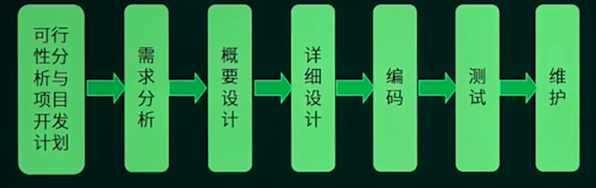

### 7.1.3. 软件过程

#### 软件过程改进-CMM

初始级：杂乱无章，甚至混乱，几乎没有明确定义的步骤，项目的成功完全依赖个人的努力和英雄式核心人物的作用。

可重复级：建立了**基本的项目管理过程和实践**来跟踪项目费用、进度和功能特性，有必要的过程准则来重复以前在同类项目中成功。某类项目。

已定义级：管理和工程两方面的软件过程已经文档化、标准化，并综合成整个软件开发组织的标准过程。针织组织。

已管理级：制定了软件过程和产品**质量**的**详细度量标准。**

优化级：加强了定量分析，通过来自过程质量反馈和来自新观念、新技术的反馈使过程能**不断持续地改进**。

#### 软件过程改进-CMMI-阶段式模型


#### 软件过程改进-CMMI-连续式模型

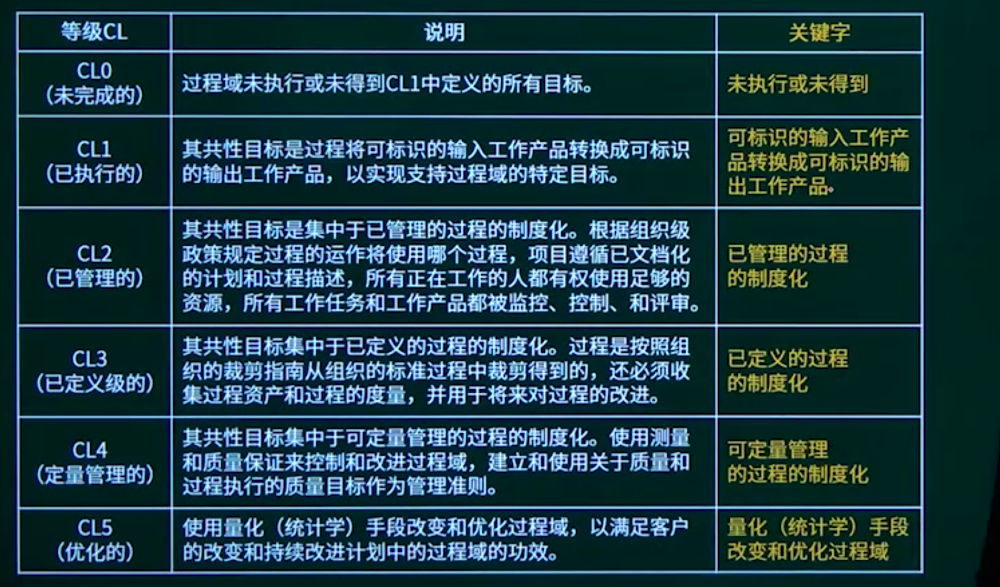

```
以下关于CMM的叙述中，不正确的是（C）
A CMM是指软件过程能力成熟度模型
B CMM根据软件过程的不同成熟度划分了5个等级，其中，1级被认为成熟度最高，5级被认为成熟度最低
C CMMI的任务是将已有的几个CMM模型结合在一起，使之构成“集成模型”
D 采用更成熟的CMM模型，一般来说可以提高最终产品的质量
```

```
能力成熟度模型集成（CMMI）是若干过程模型的综合和改进。连续式模型和阶段式模型是CMMI提供的两种表示方法，而连续式模型包括6个过程域能力等级，其中（D）使用量化（统计学）手段改变和优化过程域，以应对客户要求的改变和持续改进计划中的过程域的功效。
A CL2（已管理的）
B CL3（已定义级的）
C CL4（定量管理的）
D CL5（优化的）
```

## 7.2. 软件开发方法

结构化方法（需求明确）

- 用户至上
- 严格区分工作阶段，每阶段有任务和结果
- 强调系统开发过程的整体性和全局性
- 系统开发过程工程化，文档资料标准化
- 自顶向下，逐步分解（求精）

原型法（需求不明确，界面帮助明确需求）

面向对象方法（复杂的大项目）

- 更好的复用性
- 关键在于建立一个全面、合理、统一的模型
- 分析、设计、实现三个阶段，界限不明确

面向服务的方法（更加高级的面向对象方法）

- 抽象级别：操作、服务、业务流程

```
若用户需求不清晰且经常发生变化，但系统规模不太大且不太复杂，则最适宜采用（C）开发方法，对于数据处理领域的问题，若系统规模不太大且不本复杂，需求变化也不大，则最适宜采用（A）开发方法。
A 结构化
B Jackson   面向数据结构
C 原型化
D 面向对象
```

## 7.3. 软件开发模型

### 7.3.1. 软件开发模型知识点概述

必考

### 7.3.2. 瀑布模型与V模型

#### 瀑布模型


#### V模型


```
某开发小组欲为一公司开发一个产品控制软件，监控产品的生产和销售过程，从购买各种材料开始，到产品的加工和销售进行全程跟踪。购买材料的流程、产品的加工过程以及销售过程可能会发生变化。该软件的开发最不适宜采用（A）模型，主要是因为这种模型（C）。
A 瀑布  B 原型  C 增量  D 喷泉
A 不能解決风险
B 不能快速提交软件
C 难以适应变化的需求
D 不能理解用户的需求
```


### 7.3.3. 演化模型（原型模型、螺旋模型）

#### 原型模型

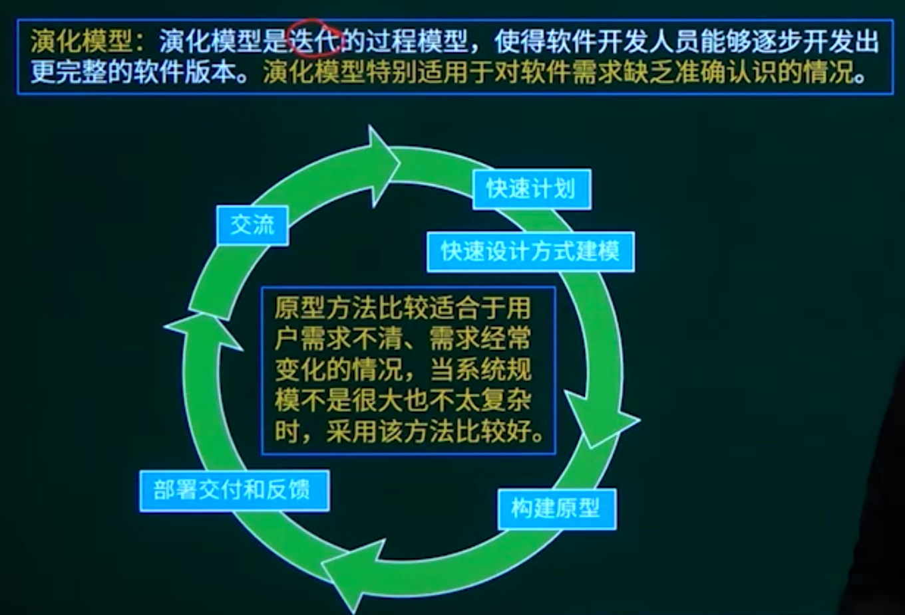

- 抛弃：
- 演化：

- 探索：
- 实验：算法
- 演化：逐步演进的过程

#### 螺旋模型


适合庞大，复杂，高风险的项目

```
以下关于系统原型的叙述中，不正确的是（C）。
A 可以帮助导出系统需求并验证需求的有效性
B 可以用来探索特殊的软件解决方案
C 可以用来指导代码优化
D 可以用来支持用户界面设计
```

```
以下关于螺旋模型的叙述中，不正确的是（）。
A 它是风险驱动的，要求开发人员必须具有丰富的风险评估知识和经验
B 它可以降低过多测试或测试不足带来的风险
C 它包含维护周期，因此维护和开发之间没有本质区别
D 它不适用于大型软件开发
```

```
某企业拟开发一个企业信息管理系统，系统功能与多个部门的业务相关。现希望该系统能够尽快投入使用，系统功能可以在使用过程中不断改善。则最适宜采用的软件过程模型为（）。
A 瀑布模型
B 原型模型
C 演化（迭代）模型
D 螺旋模型
```

### 7.3.4. 增量模型

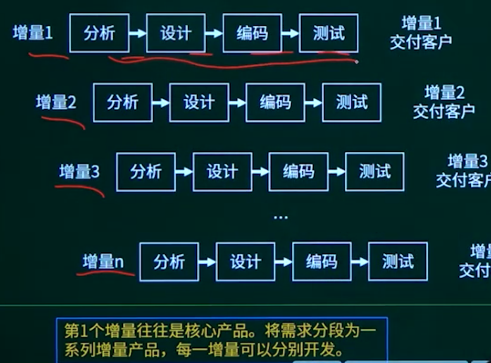

缺点：核心增量不清晰。

```
以下关于增量开发模型的叙述中，不正确的是（D）。
A 不必等到整个系统开发完成就可以使用
B 可以使用较早的增量构件作原型，从而获得稍后的增量构件需求
C优先级最高的服务先交付，这样最重要的服务接受最多的测试
D 有利于进行好的模块划分
```

### 7.3.5. 喷泉模型

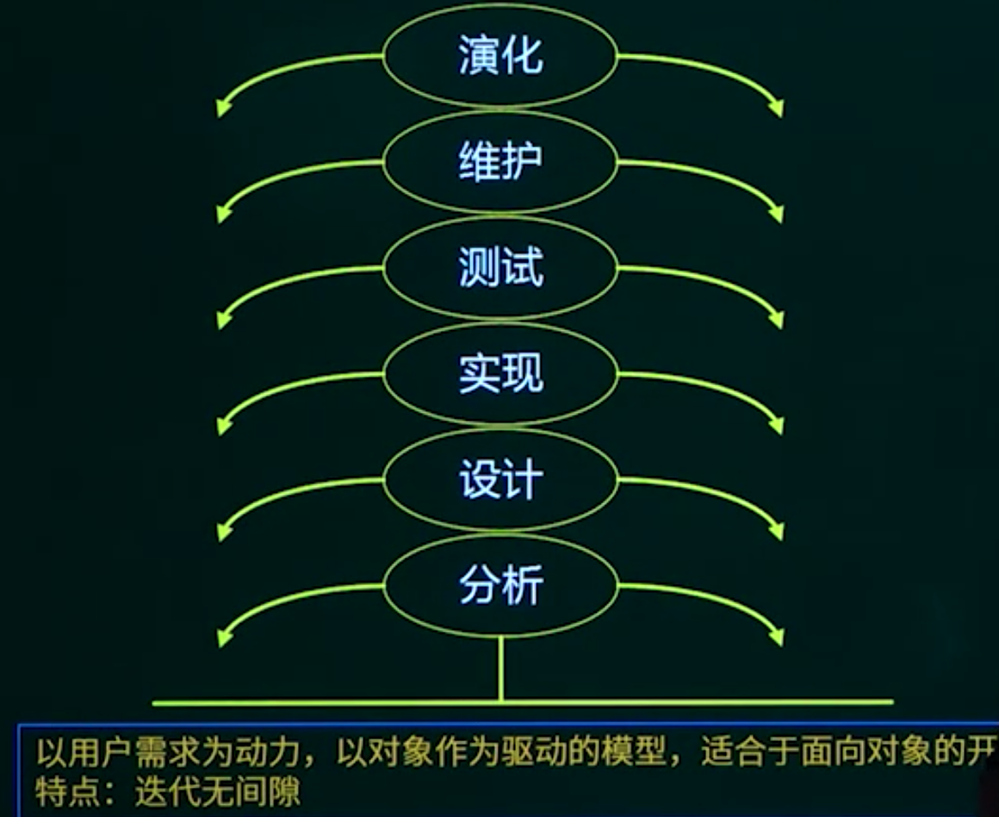

```
喷泉模型是一种适合于面向（）开发方法的软件过程模型。该过程模型的特点不包括（D）。
A 对象
B 数据
C 数据流
D 事件
A 以用户需求为动力
B 支持软件重用
C 具有迭代性
D 开发活动之间存在明显的界限
```

### 7.3.6. 统一过程UP

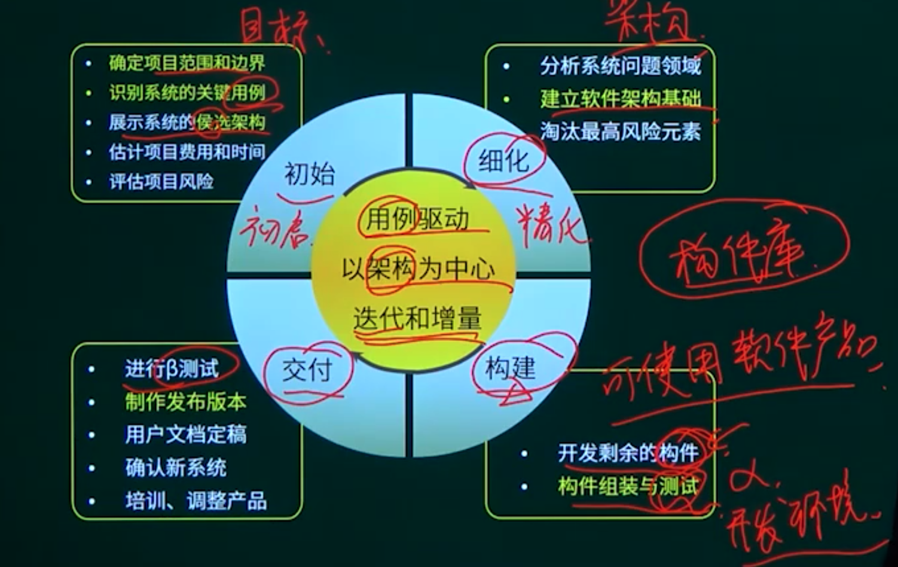


### 7.3.7. 敏捷方法

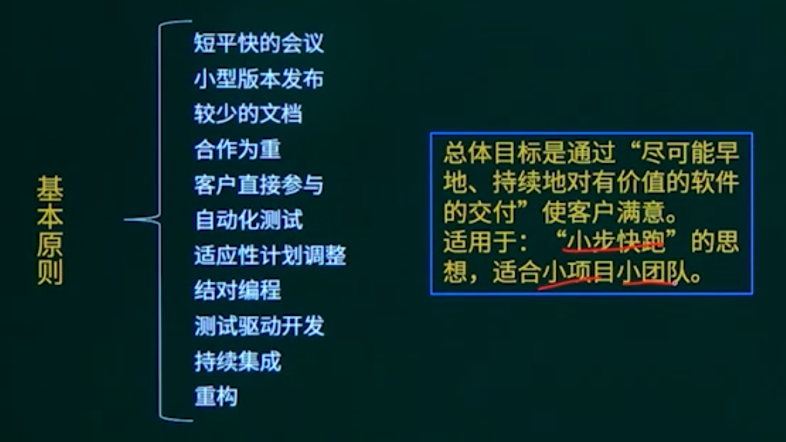


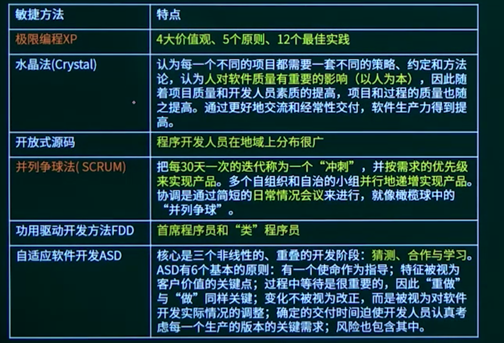

```
在敏捷过程的开发方法中，（）使用了选代的方法，其中，把每段时间（30天）一次的选代称为一个“冲刺”，并按需求的优先级别来实现产品，多个自组织和自治的小组并行地递增实现产品。
A 极限编程XP
B 水晶法
C 并列争球法
D 自适应软件开发
```

```
以下关于极限编程（XP）的最佳实践的叙述中，不正确的是（）
A 只处理当前的需求，使设计保持简单
B 编写完程序之后编写测试代码
C 可以按日甚至按小时为客户提供可运行的版本
D 系统最终用户代表应该全程配合XP团队
```

## 7.4. 需求分析

### 7.4.1. 需求分析知识点概述

### 7.4.2. 需求分析的基本概念

需求的任务  what

需求的过程

- 问题识别
- 分析与综合
- 编制需求分析文档 SRS 需求规格说明书
- 需求分析与评审

结构化分析的结果：一套分层的数据流图，一本数据词典，一组小说明（也称加工逻辑说明）、补充材料

```
软件开发过程中，需求分析阶段的输出不包括（D）。
A 数据流图
B 实体联系图
C 数据字典
D 软件体系结构图  概要设计 架构图
```

### 7.4.3. 需求的分类

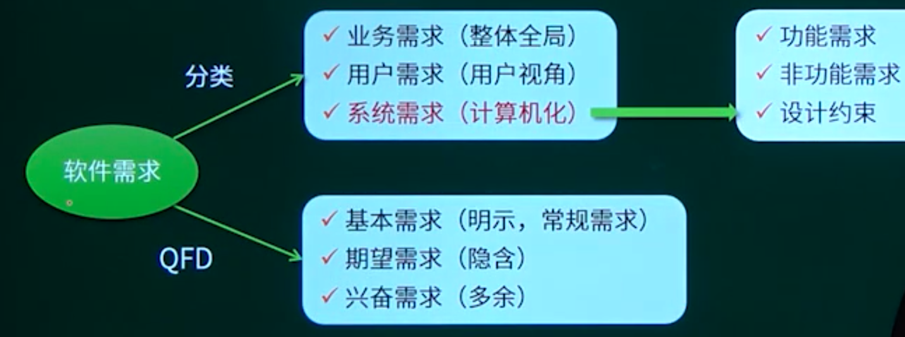

```
某企业财务系统的需求中，属于功能需求的是（A）。
A 每个月特定的时间发放员工工资
B 系统的响应时间不超过3秒
C 系统的计算精度符合财务规则的要求
D 系统可以允许100个用户同时查询自己的工资
```

### 7.4.4. 需求分析的工具

应用的工具

- 数据流图（DFD）

- 数据字典（DD）名词解释
- 判定表
- 判定树


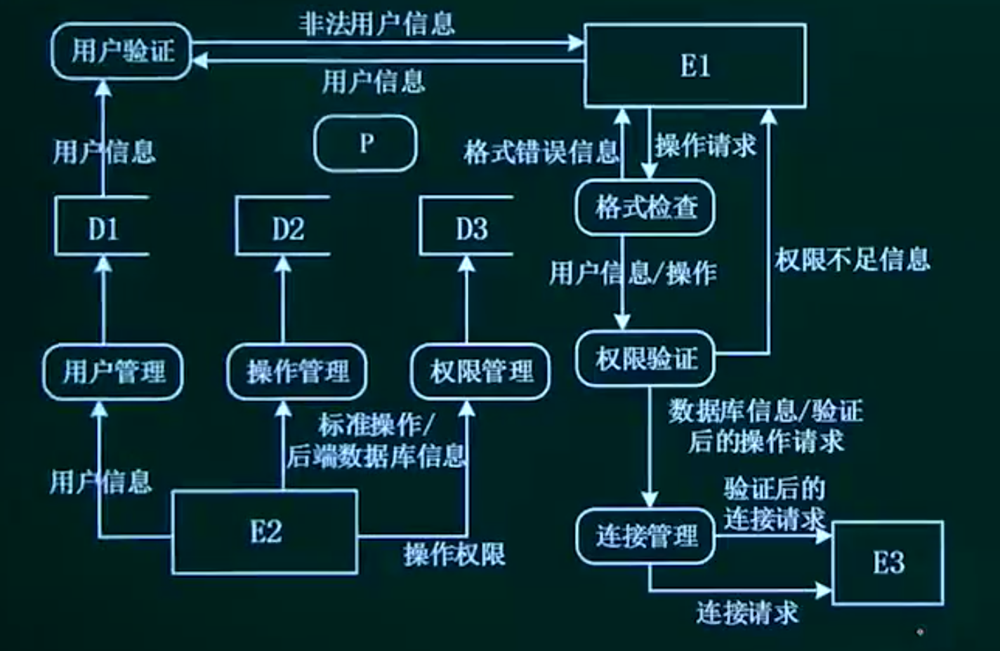

#### 数据字典


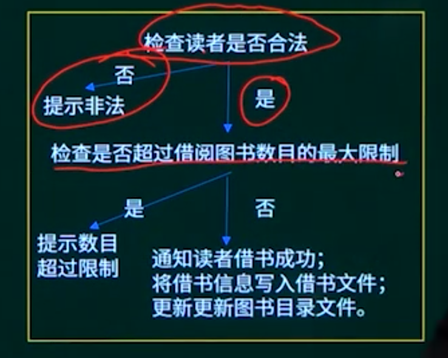

```
数据流图建模应遵循（B）的原则。
A 自顶向下、从具体到抽象
B 自顶向下、从抽象到具体
C 自底向上、从具体到抽象
D 自底向上、从抽象到具体
```

```
在结构化分析中，用数据流图描述（）。当采用数据流图对一个图书馆管理系统进行分析时，（）是一个外部实体。
A 数据对象之间的关系，用于对数据建模
B 数据在系统中如何被传送或变换，以及如何对数据流进行变换的功能或子功能，用于对功能建模
C 系统对外部事件如何响应，如何动作，用于对行为建模
D 数据流图中的各个组成部分
A 读者
B 图书
C 借书证
D 借阅
```

```
数据字典是结构化分析的一个重要输出。数据字典的条目不包括（）。
A 外部实体
B 数据流
C 数据项
D 基本加工
```

## 7.5. 系统设计

### 7.5.1. 系统设计知识点概述

### 7.5.2. 系统设计概述


应用的工具

- IPO图
- PDL
- PAD
- 程序流程图
- N/S盒图

```
概要设计文档的内容不包括（C）。
A 体系结构设计
B 数据库设计
C 模块内算法设计  详细设计
D 逻辑数据结构设计
```

```
结构化开发方法中，（D）主要包含对数据结构和算法的设计。
A 体系结构设计
B 数据设计
C 接口设计
D 过程设计
```

```
在采用结构化开发方法进行软件开发时，设计阶段接口设计主要依据需求分析阶段的（A）。接口设计的任务主要是（）。
A 数据流图     B E-R图
C 状态-迁移图  D 加工规格说明
A 定义软件的主要结构元素及其之间的关系(体系)
B 确定软件涉及的文件系统的结构及数据库的表结构(数据)
C 描述软件与外部环境之间的交互关系，软件内模块之间的调用关系
D 确定软件各个模块内部的算法和数据结构(过程)
```

### 7.5.3. 模块设计

#### **必考**

- 保持模块的大小适中
- 尽可能减少调用的深度
- 多扇入，少扇出
- 单入口，单出口
- 模块的作用域应该在模块之内
- 功能应该是可预测的

模块设计原则（高内聚，低耦合）


模块设计原则（高内聚，低耦合）


```
某模块中各个处理元素都密切相关于同一功能且必须顺序执行，前一处理元素的输出就是下一处理元素的输入，则该模块的内聚类型为（）
内聚
A 过程   特定次顺
B 时间   同时间间隔
C 顺序
D 逻辑   逻辑相关
```

```
模块A将学生信息，即学生姓名、学号、手机号等放到一个结构体中，传递给模块B。模块A和B之间的耦合类型为（B）耦合。
A 数据
B 标记
C 控制
D 内容
```

```
良好的启发式设计原则上不包括（B）。
A 提高模块独立性
B 模块规模越小越好
C 模块作用域在其控制域之内
D 降低模块接口复杂性
```


### 7.5.4. 人机界面设计

置于用户控制之下

- 以不强迫用户进入不必要的或不希望的动作的方式来定义交互
- 方式提供灵活的交互
- 允许用户交互可以被中断和撤消
- 当技能级别增加时可以使交互流水化并允许定制交互
- 使用户隔离内部技术细节
- 设计应允许用户和出现在屏幕上的对象直接交互

减少用户的记忆负担

- 减少对短期记忆的要求
- 建立有意义的缺省
- 定义直觉性的捷径
- 界面的视觉布局应该基于真实世界的隐喻
- 以不断进展的方式揭示信息

保持界面的一致性

- 允许用户将当前任务放入有意义的语境
- 在应用系列内保持一致性
- 如过去的交互模型已建立起了用户期望，除非有迫不得已的理由不要改变它

```
Theo Mandel在其关于界面设计所提出的三条“黄金准则” 中，不包括（D）。
A 用户操纵控制
B 界面美观整洁
C 减轻用户的记忆负担
D 保持界面一致
```

### 7.5.5. 架构设计

- 架构设计的一个核心问题是能否达到架构级的软件复用
- 架构风格反映了领域中众多系统所共有的结构和语义特性，并指导如何将各个构件有效地组织成一个完整的系统
- 架构风格定义了用于描述系统的术语表和一组指导构建系统的规则

数据流风格：批处理序列、管道-过滤器

#### 批处理序列

构件为一系列固定顺序的计算单元，构件之间只通过数据传递交互。每个处理步骤是一个独立的程序，每一步必须在其前一步结束后才能开始，数据必须是完整的，以整体的方式传递。

#### 管道-过滤器

每个构件都有一组输入和输出，构件读输入的数据流，经过内部处理，然后产生输出数据流。这个过程通常是通过对输入数据流的变换或计算来完成的，包括通过计算和增加信息以丰富数据、通过浓缩和删除以精简数据、通过改变记录方式以转化数据和递增地转化数据等。这里的构件称为过滤器，连接件就是数据流传输的管道，将一个过滤器的输出传到另一个过滤器的输入。

早期编译器就是采用的这种架构。要一步一步处理的，均可考虑采用此架构风格。

调用/返回风格：主程序/子程序、面向对象、层次结构（MVC、C/S、B/S）

#### 主程序/子程序

单线程控制，把问题划分为若干个处理步骤，构件即为主程序和子程序，子程序通常可合成为模块。过程调用作为交互机制，即充当连接件的角色。调用关系具有层次性，其语义逻辑表现为主程序的正确性取决于它调用的子程序的正确性

#### 面向对象

构件是对象，对象是抽象数据类型的实例。在抽象数据类型中，数据的表示和它们的相应操作被封装起来，对象的行为体现在其接受和请求的动作。连接件即是对象间交互的方式，对象是通过函数和过程的调用来交互的

#### 层次结构

构件组织成一个层次结构，连接件通过决定层间如何交互的协议来定义。每层为上一层提供服务，使用下一层的服务，只能见到与自己邻接的层。通过层次结构，可以将大的问题分解为若干个渐进的小问题逐步解决，可以隐藏问题的复杂度。修改某一层，最多影响其相邻的两层（通常只能影响上层）

- 优点：

1. 这种风格支持基于可增加抽象层的设计，允许将一个复杂问题分解成一个增量步骤序列的实现。

2. 不同的层次处于不同的抽象级别：
   越靠近底层，抽象级别越高；

   越靠近顶层，抽象级别越低；

3. 由于每一层最多只影响两层，同时只要给相邻层提供相同的接口，允许每层用不同的方法实现，同样为软件复用提供了强大的支持。

- 缺点：

1. 并不是每个系统都可以很容易地划分为分层的模式。
2. 很难找到一个合适的、正确的层次抽象方法。

两层C/S  三层C/S  三层B/S  混合架构

#### MVC架构风格

Model（模型）是应用程序中用于处理应用程序数据罗辑的部分。通常模型对象负责在数据库中存取数据。

View（视图）是应用程序中处理数据显示的部分。通常视图是依据模型数据创建的。

Controller（控制器）是应用程序中处理用户交互的部分，通常控制器负责从视图读取数据，控制用户输入，并向模型发送数据。


独立构件风格：进程通信、事件驱动系统（隐式调用）

#### 进程通信

构件是独立的过程，连接件是消息传递。构件通常是命名过程，消息传递的方式可以是点对点、异步或同步方式，以及远程过程（方法）调用等。

#### 事件驱动系统

构件不直接调用一个过程，而是触发或广播一个或多个事件。构件中的过程在一个或多个事件中注册，当某个事件被触发时，系统自动调用在这个事件中注册的所有过程。一个事件的触发就导致了另一个模块中的过程调用。这种风格中的构件是匿名的过程，它们之间交互的连接件往往是以过程之间的隐式调用来实现的。主要优点是为软件复用提供了强大的支持，为构件的维护和演化带来了方便；其缺点是构件放弃了对系统计算的控制。


虚拟机风格：解释器、基于规则的系统

#### 解释器

解释器通常包括一个完成解释工作的解释引擎、一个包含将被解释的代码的存储区、一个记录解释引擎当前工作状态的数据结构，以及一个记录源代码被解释执行的进度的数据结构。具有解释器风格的软件中含有一个虚拟机，可以仿真硬件的执行过程和一些关键应用，其缺点是执行效率比较低。

#### 基于规则的系统

基于规则的系统包括规则集、规则解释器、规则/数据选择器和工作内存，一般用在人工智能领域和DSS中。


仓库风格：数据库系统、超文本系统、黑板系统

#### 数据库系统

构件主要有两大类，一类是中央共享数据源，保存当前系统的数据状态；另一类是多个独立处理单元，处理单元对数据元素进行操作。

#### 黑板系统

包括知识源、黑板和控制三部分。知识源包括若干独立计算的不同单元，提供解决问题的知识。知识源响应黑板的变化，也只修改黑板；黑板是一个全局数据库，包含问题域解空间的全部状态，是知识源相互作用的唯一媒介；知识源响应是通过黑板状态的变化来控制的。黑板系统通常应用在对于解决问题没有确定性算法的软件中（信号处理、问题规划和编译器优化等）。

#### 超文本系统

构件以网状链接方式相互连接，用户可以在构件之间进行按照人类的联想思维方式任意跳转到相关构件。超文本是一种非线性的网状信息组织方法，它以结点为基本单位，链作为结点之间的联想式关联。超文本系统通常应用在互联网领域。

现代集成编译环境一般采用这种架构风格。

```
数据仓库位于该体系结构的中心，其他构件访问该数据仓库并对其中的数据进行增、删、改等操作。以下关于该风格的叙述中，不正确的是（）。（）不属于仓库风格。
A 支持可更改性和可维护性
B 具有可复用的知识源
C 支持容错性和健壮性
D 测试简单

A 数据库系统
B 超文本系统
C 黑板系统
D 编译器
```

```
以下关于C/S（客户机/服务器）体系结构的优点的叙述中，不正确的是（）
A 允许合理地划分三层的功能，使之在逻辑上保持相对独立性
B 允许各层灵活地选用平台和软件
C 各层可以选择不同的开发语言进行并行开发
D 系统安装、修改和维护均只在服务器端进行
```

## 7.6. 系统测试

### 7.6.1. 软件测试概述

必考2分

### 7.6.2. 软件测试的基本概念及分类

- 尽早、不断的进行测试
- 程序员避免测试自己设计的程序
- 既要选择有效、合理的数据，也要选择无效、不合理的数据
- 修改后应进行回归测试
- 尚未发现的错误数量与该程序已发现错误数成正比


```
以下关于软件测试的叙述中，不正确的是（）。
A 在设计测试用例时应考虑输入数据和预期输出结果
B 软件测试的目的是证明软件的正确性
C 在设计测试用例时，应该包括合理的输入条件
D 在设计测试用例时，应该包括不合理的输入条件
```

```
招聘系统要求求职的人年龄在20岁到60岁之间（含），学历为本科、硕士或者博士，专业为计算机科学与技术、通信工程或者电子工程。其中（C）不是好的测试用例。
A（20，本科，电子工程）
B（18，本科，通信工程）
C（18，大专，电子工程）
D（25，硕士，生物学）
```

### 7.6.3. 黑盒测试

| 等价类划分 | 确定无效与有效等价类 设计用例尽可能多的覆盖有效类设计用例只覆盖一个无效类 |
| ---------- | ------------------------------------------------------------ |
| 边界值分析 | 处理边界情况时最容易出错 选取的测试数据应该恰好等于、稍小于或稍大于边界值 |

### 7.6.4. 白盒测试


### 7.6.5. 系统测试阶段


### 7.6.6. McCabe环路复杂度计算


M：边的个数   N：点的个数

```
采用McCabe度量法计算下图所示程序的环路复杂性为（）。
A. 1
B. 2
C. 3
D. 4
```

## 7.7. 软件维护


适应性维护。指使应用软件适应信息技术变化和管理需求变化而进行的修改。企业的外部市场环境和管理需求的不断变化也使得各级管理人员不断提出新的信息需求。

完善性维护。扩充功能和改善性能而进行的修改。对已有的软件系统增加一些在系统分析和设计阶段中没有规定的功能与性能特征。

```
系统交付用户使用了一段时间后发现，系统的某个功能响应非常慢。修改了某模块的一个算法使其运行速度得到了提升，则该行为属于（）维护。
A 改正性
B 适应性
C 改善性
D 预防性
```

```
软件维护工具不包括（B）工具。
A 版本控制
B 配置管理
C 文档分析
D 逆向工程
```

## 7.8. 软件文档

开发文档

- 可行性研究和项目任务书

- 需求规格说明

- 功能规格说明
- 设计规格说明（包括程序和数据规格说明）

- 开发计划

- 软件集成和测试计划

- 质量保证计划、标准、’进度
- 安全和测试信息

产品文档

- 培训手册
- 参考手册和用户指南
- 软件支持手册
- 产品手册和信息广告

管理文档

- 开发过程的每个阶段的进度和进度变更的记录
- 软件变更情况的记录
- 相对于开发的判定记录
- 职责定义

```
以下关于各类文档撰写阶段的叙述中，不正确的是（C）。
A 软件需求规格说明书在需求分析阶段撰写
B 概要设计规格说明书在设计阶段撰写
C 测试设计必须在测试阶段撰写
D 测试分析报告在测试阶段撰写
```

## 7.9. 软件质量保证模型


```
在ISO/IEC软件质量模型中，易使用性的子特性不包括（D）。
A 易理解性
B 易学性
C 易操作性
D 易分析性
```


## 7.10. 章节概述


## 7.11. 章节回顾
