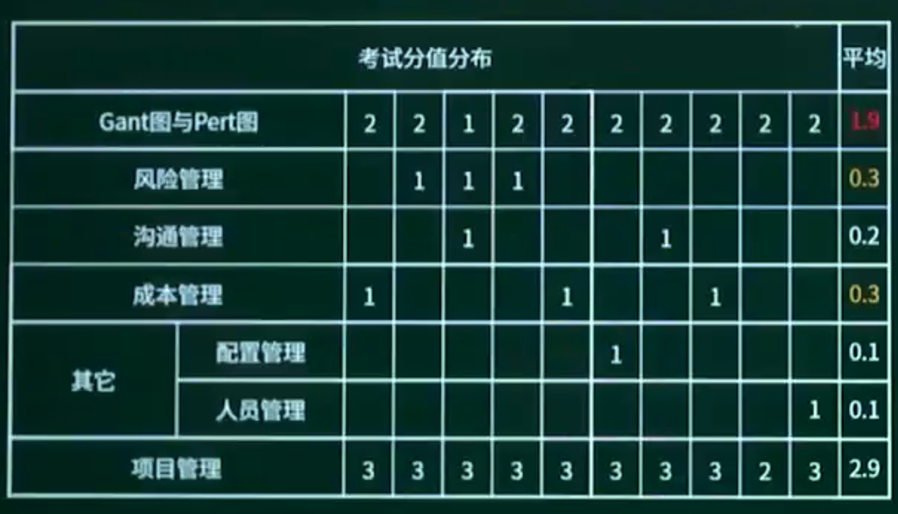

## 8.1. 进度管理

### 8.1.1. 进度管理知识点概述

### 8.1.2. Gantt图


优点：

Gantt图能够清晰地描述每个任务从何时开始，到何时结束，任务的进程情况以及各个任务之间的并行关系。

缺点：

Gantt图不能清晰地反映出个任务之间的依赖关系，难以确定整个项目的关键所在，也不能反映计划中有潜力的部分。

### 8.1.3. PERT图-01


优点：

PERT图不仅给出了每个任务的开始时间、结束时间和完成该任务所需的时间，还给出了任务之间的**关系**，即哪些任务完成之后才能开始另外的一些任务，以及如期完成整个工程的**关键路径**。图中的松弛时间则反映了某些任务是可以推迟其开始时间或延长其所需完成的时间。

缺点：

PERT图不能反映任务之间的并行关系。


赛关键路径法是在制订进度计划时使用的一种进度网络分析技术。

春关键路线法沿着项目进度网络路线进行正向与反向分析，从而计算出所有计划活动理论上：

最早开始与完成日期

最迟开始与完成日期

注：不考虑任何资源限制。


#### 关键路径法

关键路径：从开始到结束，需要时间最长的路径。

项目工期：完成项目的最少时间，注意由关键路径即最长路径决定。

总时差（松弛时间）：在不延误总工期的前提下，该活动的机动时间。活动的总时差等于该活动最迟完成时间与最早完成时间之差，或该活动最迟开始时间与最早开始时间之差。

#### 时间管理-前导图法（单代号网络图，PDM）


总时差为0都是关键路径

#### 活动排序 -箭线图法（双代号网络图，ADM）


### 8.1.4. PERT图-02

```
某项目的活动持续时间及其依赖关系如下表所示，则完成该项目的最少时间为一（）天。
A 43
B 45
C 50
D 55
```


## 8.2. 风险管理

项目风险

技术风险

商业风险

风险是指 “损失或伤害的可能性”。

关心未来

关心变化

关心选择


#### 风险曝光度 （Risk Exposure）：

计算方法是风险出现的概率乘以风险可能造成的损失。

```
以下叙述中，（）不是一个风险。
A由另一个小组开发的子系统可能推迟交付，导致系统不能按时交付客户
B客户不清楚想要开发什么样的软件，因此开发小组开发原型帮助其确定需求
C开发团队可能没有正确理解客户的需求
D 开发团队核心成员可能在系统开发过程中离职
```

```
以下不属于软件项目风险的是（）。
A 团队成员可以进行良好沟通
B 团队成员离职
C 团队成员缺乏某方面培训
D 招不到符合项目技术要求的团队成员
```

## 8.3. 沟通管理

无主程序员：

n(n-1)/2

有主程序员:

n-1

```
在进行软件开发时，采用无主程序员的开发小组，成员之间相互平等；
而主程序员负责制的开发小组，由一个主程序员和若干成员组成，成员之间没有沟通。在一个由8名开发人员构成的小组中，无主程序员组和主程序员组的沟通路径分别是（）。
A 32和8
B 32和7
C 28和8
D 28和7
```

## 8.4. 成本管理


```
工作量估算模型COCOMO I的层次结构中，估算选择不包括（）。
A.对象点
B.功能点
C.用例数
D.源代码行
```


## 8.5. 项目管理章节概述





## 8.6. 章节回顾