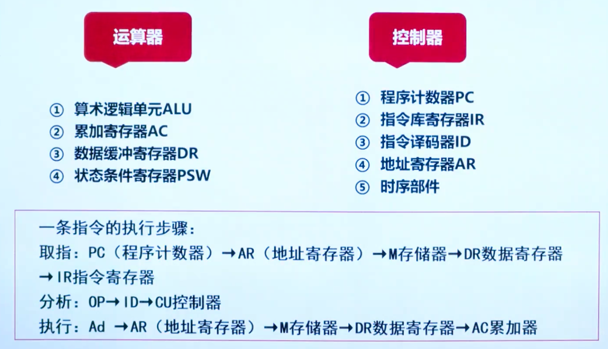
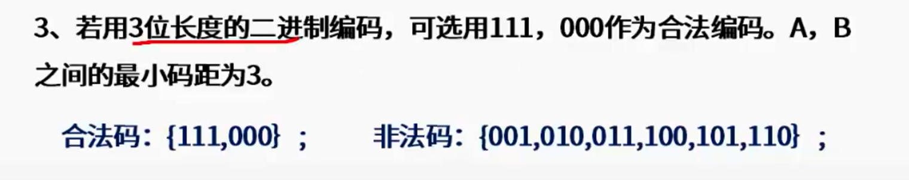
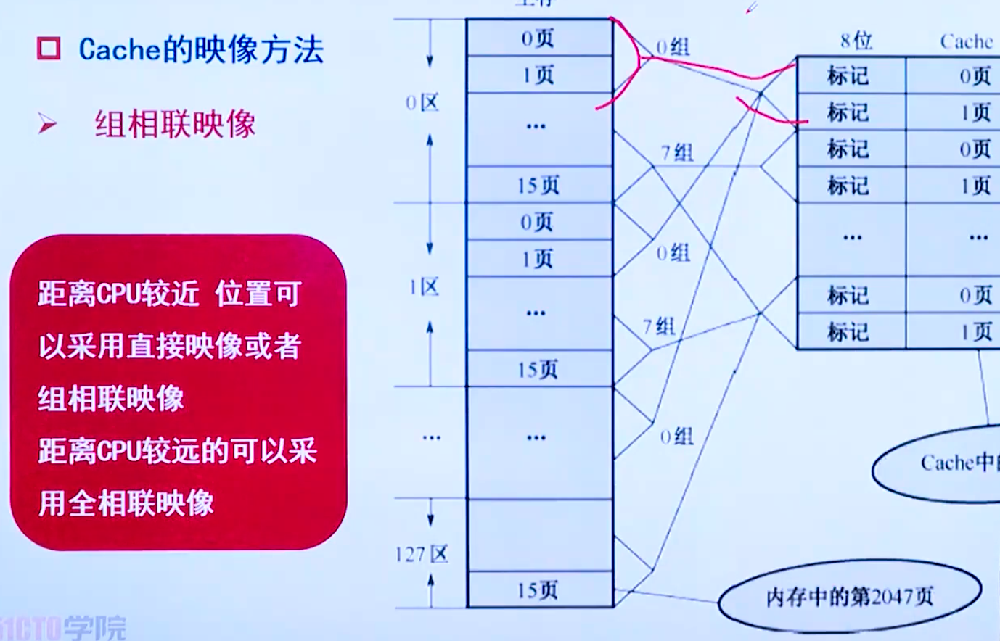
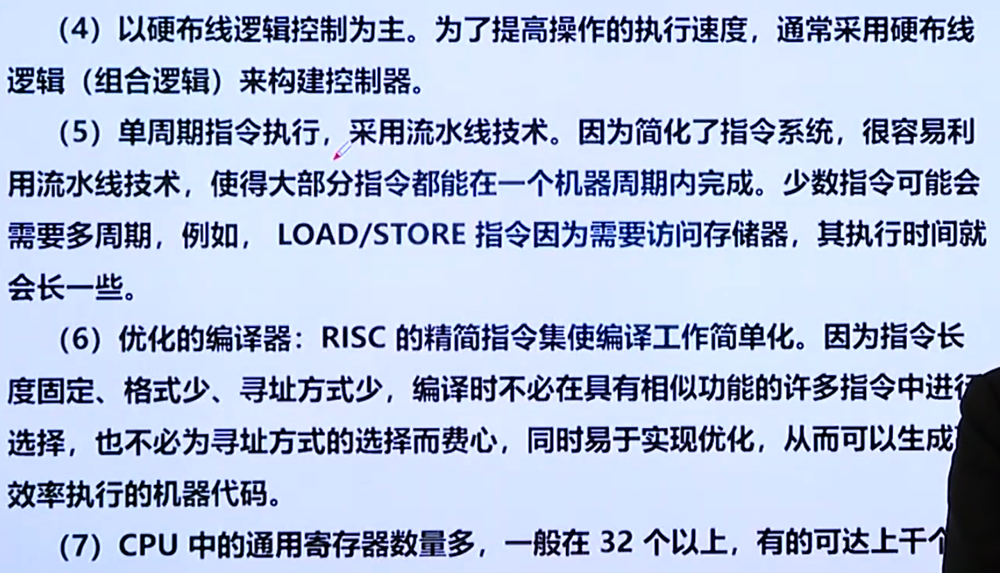
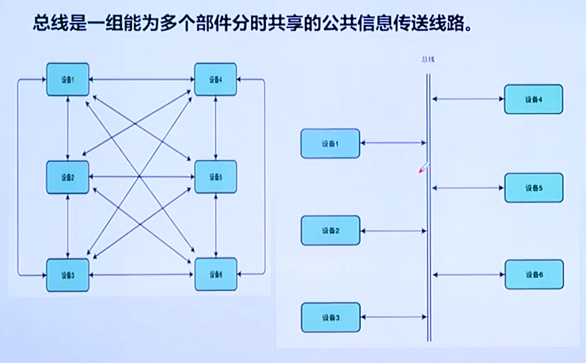

## 计算机基础：冯诺依曼计算机

计算器由五大部件组成

指令和数据以同等地位存于存储器，可按地址寻访

指令和数据用二进制表示

指令由操作码和地址码组成

存储程序

以运算器为中心

缺点就是以运算器作为中心

运算器

算数运算

逻辑运算

储存器

存放程序和数据

控制器

指挥程序运行

输入设备

现实的数据转换为二进制

输出设备

二进制转换为现实的数据

## 现代计算机

### CPU

ALU

算数运算和逻辑运算

ACC

累加器

MQ

X

PSW

状态寄存器

一条指令包含两个部分，指令通过译码器去翻译我们的功能。

一条指令的执行过程

### 控制器

#### 控制单元CU

#### 时序部件

晶振，时钟。

#### PC 计数器

下一条指令所在内存单元的地址

#### IR

即将要执行的指令

#### ID

指令译码器

### 存储体

#### MAR

地址寄存器，这些指令内存中的地址，主要CPU的速度比储存提快的多。现在都集成在CPU中。

#### MDR

数据寄存器，存放内存中取出来的指令或者数据。现在都是集成在CPU中。

考试容易考DR和IR哪个是即将执行的指令。

AC即ACC，被加数被除数都是放在里面。

## 主存

8bit = 1 Byte，每个地址都是一个字节。

地址总线：假如需要n位二进制数来表示所有地址，则地址总线的个数为n。

数据总线：一次处理n位的数据，则数据总线的长度为n。n的位数为一个字的长度。

##  存储器

## 校验码

多增加一位冗余位，增加码距。

偶校验：就是1的个数变为偶数

奇校验：就是1的个数变为奇数

校验位如何设置

分组位如何设置

考点一：海明码奇偶校验码

考点二：公式

多项式的最高次方是几加几个零。

## 指令的流水线

考点：流水线建立时间，就是第一条指令执行完成。

## 高速缓冲储存器

### 不使用的内存替换算法

## 磁盘存储器

## 计算机系统结构的分类

### 指令系统

## 总线

单工：只能只收，广播。

半双工：对讲机

全双工：打电话

## 磁盘阵列

①RAID 0（无冗余和无校验的数据分块）代表了所有RAID级别中最高的存储性能。RAID 0提高存储性能的原理是把连续的数据分散到多个磁盘上存取，这样，系统有数据请求就可以被多个磁盘并行的执行，每个磁盘执行属于它自己的那部分数据请求。这种数据上的并行操作可以充分利用总线的带宽，显著提高磁盘整体存取性能。

③ RAID 2（采用纠错海明码的磁盘阵列）：采用了海明码纠错技术，用户需增加校验盘来提供单纠错和双验错功能。对数据的访问涉及阵列中的每一个盘。大量数据传输时1/0性能较高，但不利于小批量数据传输。实际应用中很少使用

⑤ RAID5（无独立校验盘的奇偶校验码的磁盘阵列）：无独立校验盘，校验信息分布在组内所有盘上，对于大批量和小批量数据的读写性能都很好，适用于1/0需求频繁的应用。当有N块阵列盘时，用户空间为N-1块盘容量。

⑥ RAID6（独立的数据硬盘与两个独立的分布式校验方案）：RAID 6技术是在RAID 5基础上，为了进一步加强数据保护而设计的一种RAID方式，实际上是一种扩展RAID 5等级。当有N块阵列盘时，用户空间为N-2块盘容量。

⑦RAID7（最优化的异步高1/0速率和高数据传输率）：RAID 7完全可以理解为一个独立存储计算机，它自身带有操作系统和管理工具，完全可以独立运行。

⑧RAID10（最可靠与高性能）：RAID 1+0 也被称为RAID 10标准，实际是将RAID 1和RAID 0标准结合的产物。RAID 1是一个冗余的备份阵列，而RAID 0负责数据读写的阵列。由于利用了RAID 0极高的读写效率和RAID 1较高的数据保护和恢复能力，使RAID 10成为了一种性价比较高的等级。