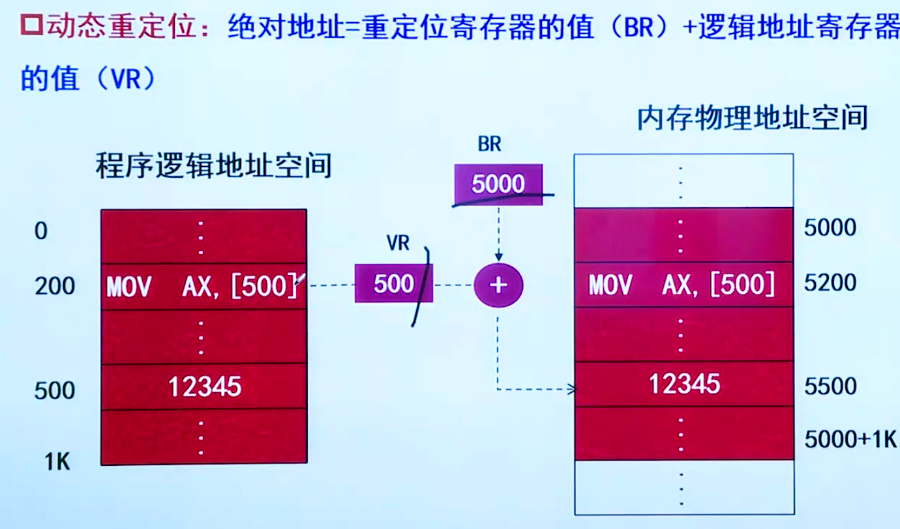
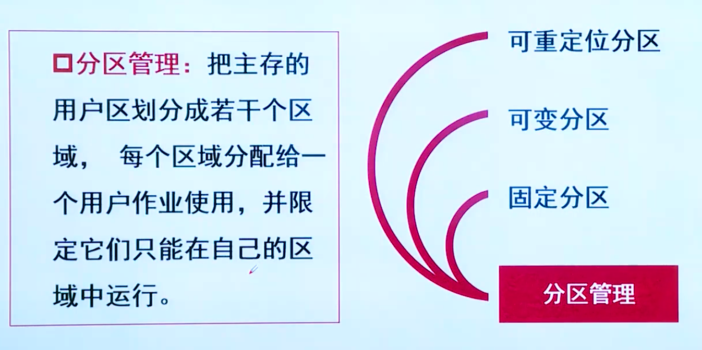

## 操作系统基础

## 进程

链接方式

## PV操作

前驱图无法提现互斥的关系。

有几个临界资源n就设置为几。

试题（1）的正确答案为选项B。根据题意，假设系统中有n个进程共享3台打印机，意味着每次只允许3个进程进入互斥段，那么信号量的初值应为3。可见，根据排除法只有选项B中含有3。

试题（2）的正确答案选项D。信号量S的物理意义为：当S≥0时，表示资源的可用数；当S＜0时，其绝对值表示等待资源的进程数。

设置信号量。

## 储存管理

## 设备管理

## 文件存储管理

## 文件存储设备管理

题考查位示图知识。注意：此题的字号与位号均从0开始。由于物理块从0开始，从O块到255块刚好占用了4个字（64*4=256），256块应该是第五个字（4号字）的0号位置。