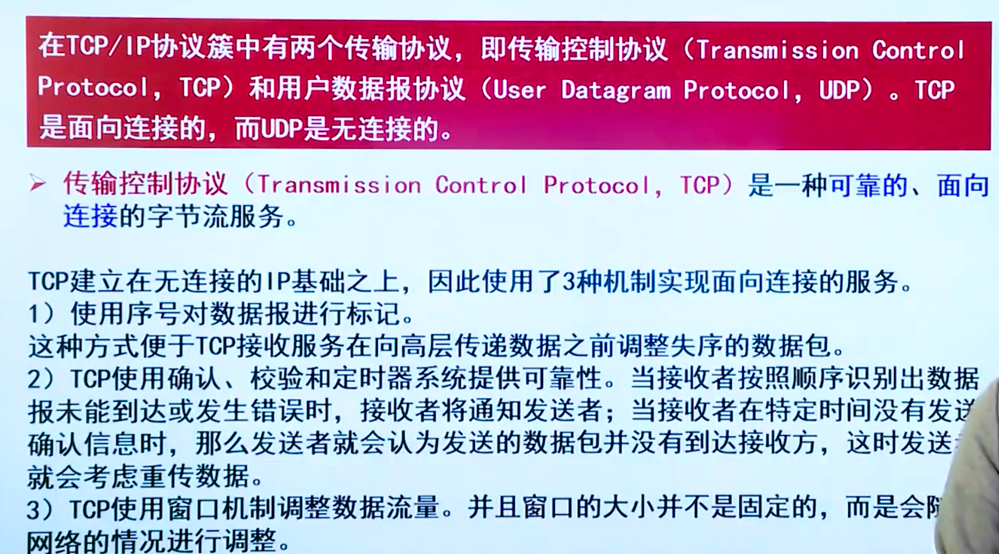
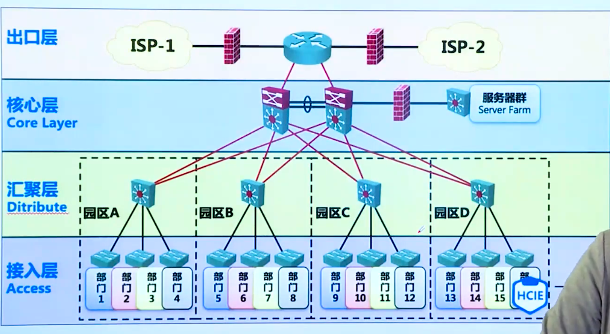
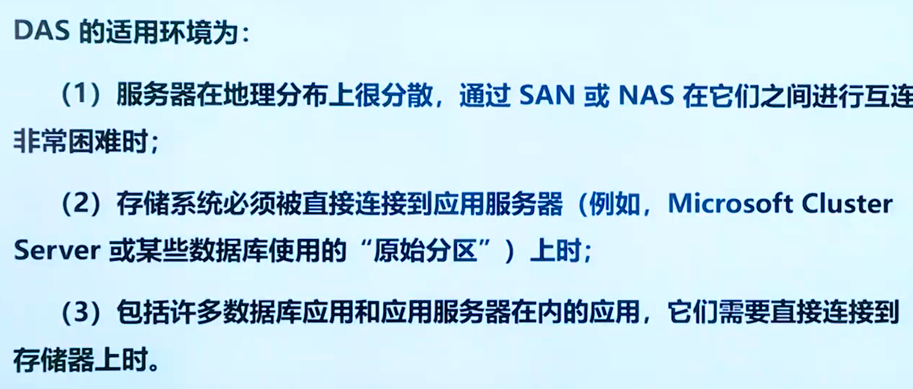

## 计算机网络基础

## IP地址及其表示方法

## 子网和子网掩码

## TCP与UDP

## 网络设计

## 综合布线系统

综合布线系统是一个用于传输语音、数据、影像和其他信息的标准结构化布线系统，是建筑物或建筑群的传输网络，它使语言和数据通信设备、交换设备和其他信息管理系统彼此相连接。综合布线的热物理结构一股采用模块化设计和分层星型拓扑结构。系统结构有6个独立的子系统：

1. 工作区子系统：它是工作区内终端设备连接到信息插座之间的设备组成，包括信息插座、连接软线、适配器、计算机、网络集散器、电话、报警探头、摄像机、监视器、音响等。
2. 水平子系统：水平子系统是布置在同一楼层上，一端接在信息插”另一端接在配线间的跳线架上，它的功能是将干线子系统线路延伸到用户工作区，将用户工作区引至管理子系统，并为用户提供一个符合国际*满足语音及高速数据传输要求的信息点出口。
3. 管理子系统：安装有线路管理器件及各种公用设备，实现整个系统集中管理，它是干线子系统和水平子系统的桥梁，同时又可为同层组网提供条件。其中包括双绞线跳线架、跳线（有快接式跳线和简易跳线之分）。
4. 垂直（干线）子系统：通常它是由主设备间至各层管理间，特别是在位于中央点的公共系统设备处提供多个线路设施，采用大对数的电缆馈线或光缆，两端分别端接在设备间和管理间的跳线架上，目的是实现计算机设备、程控交换机（PBX）、控制中心与各管理子系统间的连接，是建筑物干线电缆的路由。
5. 设备间子系统：该子系统是由设备间中的电缆、连接跳线架及相关支撑硬件、防雷电保护装置等构成。可以说是整个配线系统的中心单元，因此它的布放、造型及环境条件的考虑适当与否，直接影响到将来信息系统的正常运行及维护和使用的灵活性。电话交换机、计算机主机设备及入口设施也可与配线设备安装在一起。
6. 建筑群子系统：它是将多个建筑物的数据通信信号连接成一体的布线系统，它采用架空或地下电缆管道或直埋敷设的室外电缆和光缆互连起来，是结构化布线系统的一部分，支持提供楼群之间通信所需的硬件。

## 域名和地址

1. 根域：根域处于Internet 上域名空间结构树的最高端，是树的根，提供根域名服务。根域用“”来表示。
2. 顶级域名（To p Level Domain, TLD）：顶级域名在根域名之下，分为三大类：国家顶级域名、通用顶级域名和国际顶级域名。
3. 主机：属于最低层域名，处于域名树的叶子端，代表各类主机提供的服务。

#### 网络存储技术

NAS 存储设备类似于一个专用的文件服务器，它去掉了通用服务器的大多数计算功能，而仅仅提供文件系统功能，从而降低了设备的成本。并且为方便存储设备到网络之间能以最有效的方式发送数据，它专门优化了系统硬件与软件架构。NAS 以数据为中心，将存储设备与服务器分离，其存储设备在功能上完全独立于网络中的主服务器，客户机与存储设备之间的数据访问不再需要文件服务器的干预，同时它允许客户机与存储设备之间进行直接的数据访问，所以不仅响应速度快，而且数据传输速率也很高。

NAS 存储支持即插即用，可以在网络的任一位置建立存储。基于 Web 管理，从而使设备的安装、使用和管理更加容易。NAS 可以很经济地解决存储容量不足的问题，但难以获得满意的性能。

#### 网络系统建设

企业内部网络的建设已经成为提升企业核心竞争力的关键因素。企业网已经越来越多地被人们提到，利用网络技术，现代企业可以在供应商、客户、合作伙伴、员工之间实现优化的信息沟通。这直接关系到企业能否获得关键的竞争优势。企业网络要求具有资源共享功能、通信服务功能、多媒体功能、远程VPN拨入访问功能。所以在进行企业网络的需求分析时，对企业的需求、应用范围、基于的技术等，要从企业应用来进行分析。

先期的网络规划对网络建设和使用至关重要。网络规划的任务就是为即将建立的网络系统提出一套完整的设想和方案，对建立一个什么形式、多大规模具备哪些功能的网络系统做出全面科学的论证，并对建立网络系统所需的人力财力和物力投入等做出一个总体的计划。

1.网络设计的原则

在网络设计方面，应着重考虑以下几个要素，它们也是网络设计和网络建设的基本原则。

（1）采用先进，成熟的技术。在规划网络、选择网络技术和网络设备时，应重点考虑当今主流的网络技术和网络设备。只有这样，才能保证建成的网络有良好的性能，从而有效地保护建网投资，保证网络设备之间、网络设备和计算机之间的互联，以及网络的尽快使用、可靠运行。

（2）遵循国际标准，坚持开放性原则。网络的建设应遵循国际标准，采用大多数厂家支持的标准协议及标准接口，从而为异种机、异种操作系统的互连提供极大的便利和可能。

（3）网络的可管理性。具有良好可管理性的网络，网管人员可借助先进的网管软件，方便地完成设备配置、状态监视、信息统计、流量分析、故障报警、诊断和排除等任务。

（4）系统的安全性。一般的网络包括内部的业务网和外部网。对于内部用户，可分别授予不同的访问权限，同时对不同的部门（或工作组）进行不同的访问及连通设置。对于外部的因特网络，要考虑网络“黑客“和其他不法分子的破坏，防止网络病毒的传播。有些网络系统，如金融系统对安全性和保密性有着更加严格的要求。网络系统的安全性包括两个方面的内容：一方面是外部网络与本单位网络之间互联的安全性问题，另一方面是本单位网络系统管理的安全性问题。

（5）灵活性和扩充性。网络的灵活性体现在连接方便，设置和管理简单、灵活，使用和维护方便。网络的可扩充性表现在数量的增加、质量的提高和新功能的扩充。网络的主干设备应采用功能强、扩充性好的设备，如模块化结构、软件可升级，信息传输速度高、吞吐量大。可灵活选择快速以太网、干兆以太网、FDDI、ATM网络模块进行配置，关键元件应具有冗余备份的功能。

（6） 系统的稳定性和可靠性。选择网络产品和服务器时，最重要的一点应考虑它们的稳定性和可靠性，这也是我们强调选择技术先进、成熟产品的重要原因之一。关键网络设备和重要服务器的选择应考虑是否具有良好的电源备份系统链路备份系统，是否具有中心处理模块的备份，系统是否具有快速、良好的自能力等。不应追求那些功能大而全但不可靠或不稳定的产品，也不要选择那些成熟和没有形成规范的产品

（7）经济性。网络的规划不但要保质保量按时完成，而且要减少失误、杜绝浪费。

（8）实用性。网络设计一定要充分保护网络系统现有资源。同时要根据实际情况，采用新技术和新装备，还需要考虑组网过程要与平台建设及开发同步进行，建立一个实用的网络。力求使网络既满足目前需要，又能适应未来发展，同时达到较好的性能/价格比。

