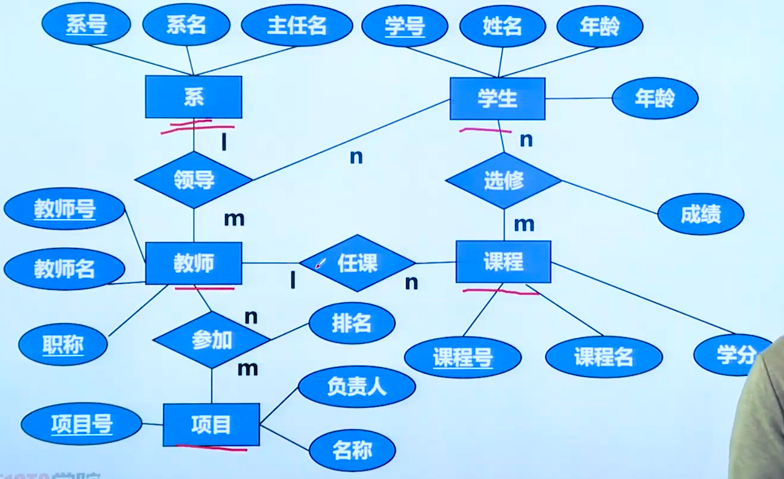
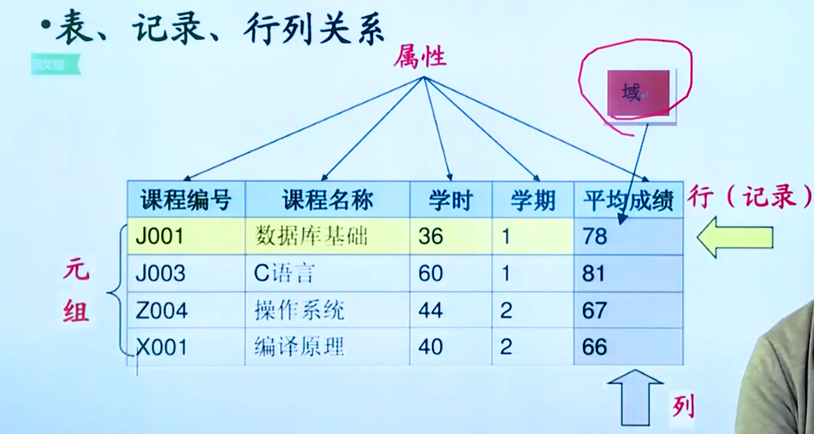
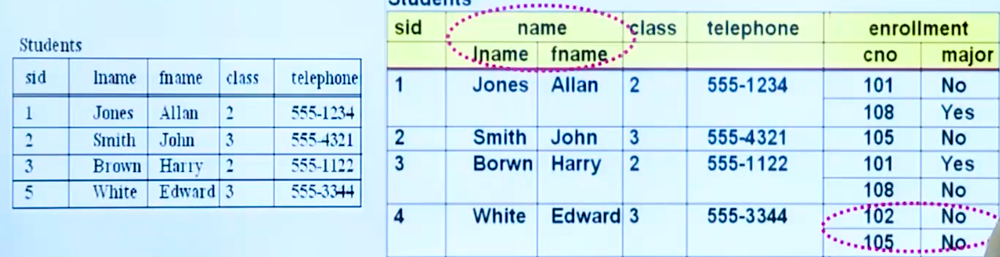
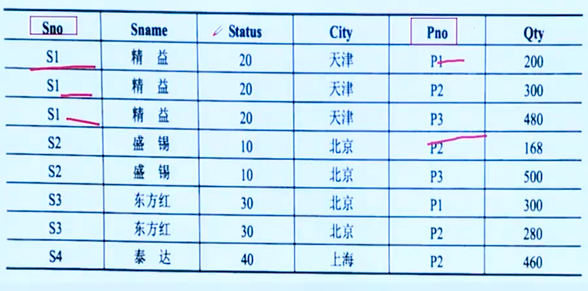
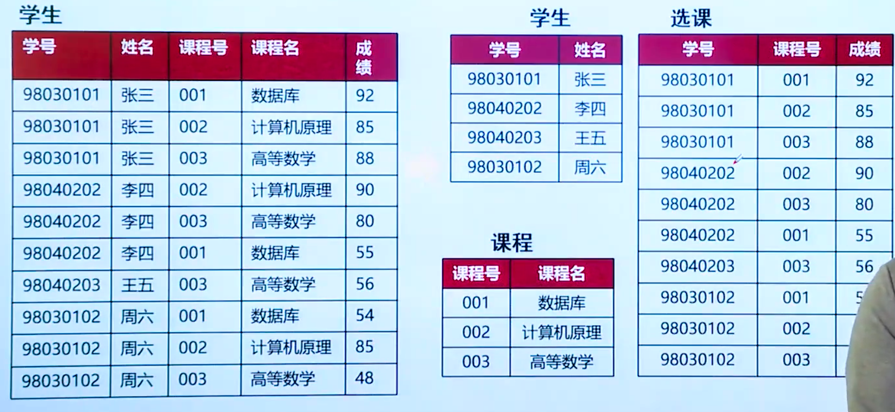
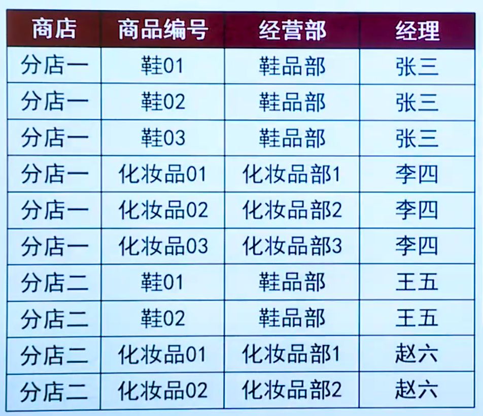
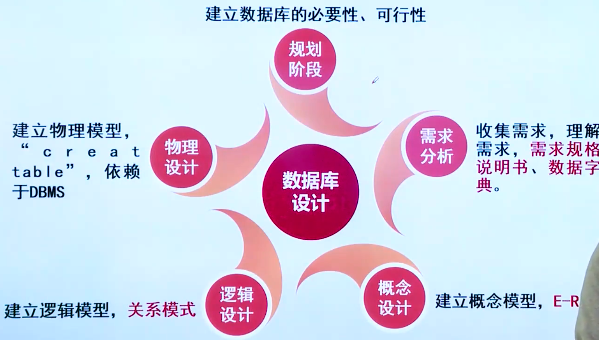
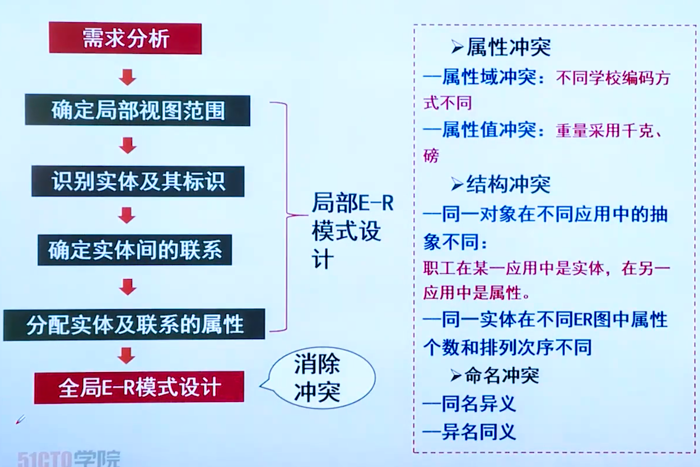
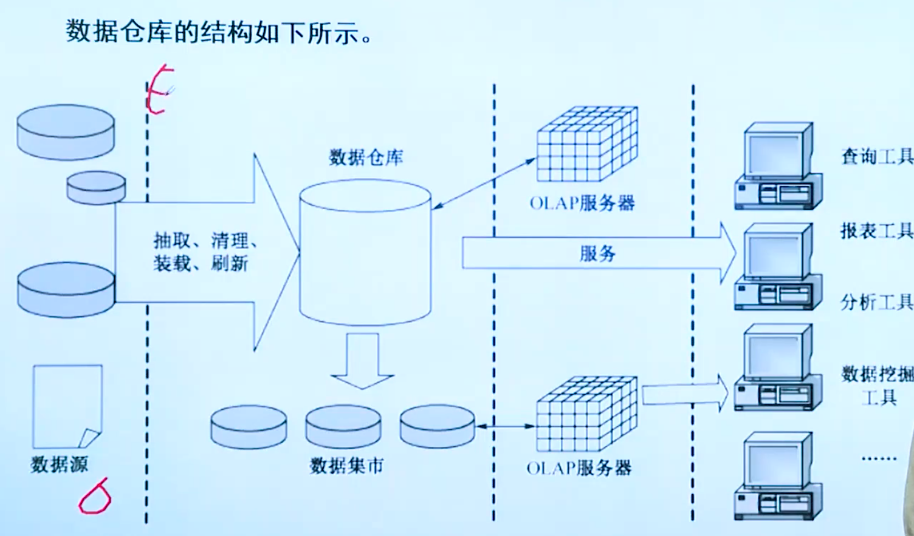

## 数据库系统的结构

- 从数据库应用开发人员的角度看：数据库采用三级模式结构，是数据库系统的内部的系统结构
- 从数据库最终用户角度看

1. 单用户结构
2. 主从结构
3. 分布式结构
4. 客户-服务器结构
5. 浏览器-应用服务器/数据库服务


概念模式

概念模式是数据库中全体数据的逻辑结构和特征的描述，是所有用户的公共数据视图。一个数据库只有一个概念模式。

外模式

外模式（子模式、用户模式）用以描述用户看到或使用的哪部分数据的逻辑结构，用户根据外模式用数据操作语句或应用程序去操作数据库中的数据。 

内模式

内模式定义的是存储记录的类型、存储域的表示以及存储记录的物理顺序，指引元、索引和存储路径等数据的存储组织。一个数据库只有一个内模式。

逻辑独立性

当模式改变时（例如增加新的关系，新的属性，改变属性的数据类型等），由数据库管理员对各个外模式/模式的映像做相应的改变，可以使外模式保持不变。应用程序是依据数据的外模式编写的，从而应用程序不必修改，保证了数据与程序的逻辑独立性，简称数据的逻辑独立性。

物埋独立性

当数据库的存储结构改变了，由数据库管理员对模式/内模式映像做响应的改变，可以使模式保持不变，从而应用程序也不必改变，保证了数据与程序的物理独立性，简称数据的物理独立性。

在数据库系统中，视图是一个（）。

A. 真实存在的表，并保存了待查询的数据 

B. 真实存在的表；只有部分数据来源于基本表

C. 虚拟表，查询时只能从一个基本表中导出

D. 虚拟表，查询时可以从一个或者多个基本表或视图中导出

试题分析

视图是从一个或几个基本表（或视图）导出的虚拟表，其内容由查询定义。

同真实的表一样，视图包含一系列带有名称的列和行数据。但是，视图并不在数据库中以存储的数据值集形式存在。行和列数据来自由定义视图的查询所引用的表，并且在引用视图时动态生成。

参考答案：D


```
在采用三级模式结构的数据库系统中，如果对数据库中的表Emp创建聚簇索引，那么改变的是数据库的（）。

A．模式     B．内模式   
C．外模式   D．用户模式 
```

## 数据模型

数据模型主要有两大类，分别是概念数据模型（实体一联系模型）和基本数据模型（结构数据模型）。

概念数据模型是按照用户的观点来对数据和信息建模，主要用于数据库设计。概念模型主要用实体一联系方法（Entity-RelationshipApproach）表示，所以也称 E-R 模型。



基本数据模型是按照计算机系统的观点来对数据和信息建模，主要用于DBMS 的实现。基本数据模型是数据库系统的核心和基础。常用的基本数据模型有层次模型、网状模型、**关系模型**和面向对象模型。


数据的约束条件：实体完整性。实体完整性是指实体的主属性不能取空值。主键不能取空值。

数据的约束条件：参照完整性。在关系数据库中主要是值得外键参照的完整性。若A关系中的某个或者某些属性参照B或其他几个关系中的属性，那么在关系A中该属性要么为空，要么必须出现B或者其他的关系的对应属性中。就是外键。

数据的约束条件：用户定义完整性。用户定义完整性反映的某一个具体应用所对应的数据必须满足一定的约束条件。

## 关系型数据库

| 关系     | 可以理解为一张二维表，每个关系都具有一个关系名，就是通常说的表名。 |
| -------- | ------------------------------------------------------------ |
| 元组     | 可以理解为二维表中的一行，在数据库中经常被称为记录。         |
| 属性     | 可以理解为二维表中的一列，在数据库中经常被称为字段。         |
| 域       | 属性的取值范围，也就是数据库中某一列的取值限制。             |
| 关键字   | 一组可以唯一标识元组的属性，数据库中常称为主键，由一个或多个列组成。 |
| 关系模式 | 指对关系的描述。其格式为：关系名（属性1，属性2...属性N），在数据库中成为表结构。 |



某学校拟开发一个学校教务的数据库，涉及的对象有：学生的学号（Sno）、所在系（Sdept）、系主任姓名（Mname）、课程号（Cno）和成绩（Grade）。

说明：

1. 一个系有若干学生，但一个学生只属于一个系；
2. 一个系只有一名班主任；
3. 一个学生可以选修多门课程，每门课程有若干学生选修；
4. 每个学生所学的每门课程都有一个成绩。

关系模式：Student （Sno, Sdept, Mname, Cno, Grade）

## 规范化

#### 第一范式（1NF）

若关系模式R的每一个分量是不可再分的数据项，则关系模式R属于第一范式。如下图不属于第一范式。





1. 冗余较大
2. 修改异常
3. 插入异常
4. 删除异常

#### 第二范式（2NF）

若关系模式RE1NF，且每一个非主属性完全依赖主键时，则关系式R是2NF（第二范式）。

```
例如：R（学号，姓名，班级，课程，成绩）

函数依赖：［学号一姓名，学号一班级，（学号，课程号）一成绩｝
主键：（学号，课程号）
这里姓名，班级部分依赖于主键，不属于2NF，需将其分解为：
R1（学号，姓名，班级）
R2（学号，课程，成绩）
```



#### 第三范式（3NF）

即当2NF消除了非主属性对码的传递函数依赖，则称为3NF。



```
例如：Store（商店，商品，经营部，经理）
函数依赖：（商店，商品） ->经营部
        （商店，经营部）-> 经理  传递依赖，可以通过非主属性
由于有传递依赖不满足3NF，将其分解为
R1（商店，商品，经营部）、
R2（商店，经营部，经理）。
```

#### BC范式（BCNF）

R属于BCNF当且仅当其F中每个依赖的**决定因素**必定包含R的某个候选键。

```
例如：关系模式STJ（S，T，J）中，S表示学生，T表示教师，J表示课程假设每一教师只教一门课T J
每门课由若干教师教，但某一学生选定某门课，就确定了一个固定的教师（S,J）→ T
某个学生选修某个教师的课就确定了所选课的名称
• (S, T) →J  ，（S,J） →T，（S，T）→J

候选键：（S,J）和（S,T）STJ都是主属性
不存在非主属性对码的部分函数依赖和传递依赖，STJ 3NF。
```

```
给定关系模式R <U, F>，其中，属性集U=｛A、B、C、D、E｝。函数依赖集
F=｛AC-B, B-DE｝。关系R（A）且分别有（C）。

A. 只有一个候选关键字AC
B. 只有一个候选关键字AB
C. 有两个候选关键字AC、BC
D. 有两个候选关键字AC、AB

A. 一个非主属性和四个主属性
B. 两个非主属性和三个主属性
C. 三个非主属性和两个主属性
D. 四个非主属性和一个主属性
```

```
销售公司数据库中的关系零件为P（Pno, Pname, Sname, City, Qty），Pno表示零件号，Pname表示零件名称，Sname表示供应商，City表示所在地，Qty表示库存量。其函数依赖集F=｛Pno-Pname，（Pno, Sname）-Qty,Sname-Cityl。关系P为（A），存在冗余度大、修改操作不一致、插入异常和删除异常的问题。
若将P分解为（C），则可以解决这一问题。
A. 1NF  B. 2NF  C. 3NF  D. 4NF
A. P1 (Pname, Qty) . P2 (Pno, Sname, City)
B. P1 (Pname, Pname) . P2 (Sname, City, Qty)
C. P1 (Pno, Pname) . P2 (Pno, Sname, Qty) . P3 (Sname, City)
D. P1 (Pno, Pname) , P2 (Pno, Qty) . P3 (Sname, City) . P4 (City, Qty)
```

无损连接的联系题

## 数据库设计



#### 规划阶段

建立数据库的必要性、可行性

#### 需求分析

收集需求，理解需求，需求规格说明书、数据字典。

需求分析的目标是通过调查研究，了解用户的数据和处理要求，并按照一定格式整理成需求规格说明书。

需求分析的结果是否准确地反映了用户的实际要求，将直接影响客户第这样解拜的响目经理果这样理解的果梅酒是这样设计的理序觅學这样藥写的到后面各个阶段的设计，并影响到设计结果是否合理和实用。

调查的重点是“数据”和“处理”

1. 数据库需要哪些数据？如：数据名、属性及其类型、数据量估计等。
2. 数据处理要求？如：更改要求、使用频率和等。
3. 安全性与完整性要求？如：保密要求、完整性约束条件（主键属性）等。

数据字典的内容：数据项、数据流、数据存储、数据加工（处理过程）。

以学生学籍管理系统为例

数据项：学号

含义说明：唯一标识每个学生

数据流：

数据储存：

加工：数据处理

#### 概念设计

建立概念模型，E-R。

其任务是在需求分析阶段产生的需求说明书的基础上，按照特定的方法将它们抽象为一个不依赖于任何DBMS的数据模型，即概念模型。下图为学校教学管理系统E-R图。




#### 逻辑设计

建立逻辑模型，关系模式

逻辑设计也称为逻辑结构设计，其任务是将概念模型转化为某个特定的DBMS上的逻辑模型（层次模型、网状模型、关系模型）。

E-R图向关系模式转换规则：

- E-R图的实体转换关系
- E-R的属性转换为关系的属性
- E-R图的关键字转换为关系的关键字

复合属性的转换：

1、将每个分量属性作为复合属性所在实体的属性或

2、将复合属性本身作所在实体的属性

多值属性的转换：

1. 将多值属性与所在实体的主键一起组成一个新的关系
2. 将多值属性提升为一个实体，通常为弱实体

派生属性：

因为派生属性可由其他属性计算得到，因此，在转化成关系模式时，通常不转换派生属性。例如：“学生”实体中有“生日”和“年龄”等属性，从“生日”可以计算出“年龄”属性的值，“年龄”属性就是派生属性。

BLOB型属性：

典型的BLOB是一张图片或一个声音文件，由于它们的容量比较大，必须使用特殊的方式来处理。处理BLOB的主要思想就是让文件处理器（例如，数据库管理器）不去理会文件是什么，而是关心如何去处理它。因此，从优化的角度考虑，应采用的设计方案是将BL0B属性与关系的主键独立为一个关系模式。

联系的属性，1:1的联系：

1、一个1:1联系可以转换为一个独立的关系模式。

例如：管理（职工号，班级号..）

2、或者也可以与任意一端对应的关系模式合并。

联系的属性，1:n的联系：

1、一个1:n的联系可以转换为一个独立的关系模式。

例如：组成（学号，班级号，•）

2、与n端对应的关系模式合并。

例如：学生（学号，姓名，出生日期，所在系，班级号...）

联系的属性，n:m的联系：

一个n:m的联系可以转换为一个独立的关系模式。

例如：选修（学号，课程号，成绩..），其中学号和课程号关系模式的组合（联合）主键。

联系的属性，多元的联系：

一个多元联系可以转换为一个独立的关系模式。

例如：讲授（职工号，课程号，书号..），其中课程号、职工号、书号为关系模式的组合（联合）主键。

#### 物理设计

建立物理模型，"creattable”，依赖于DBMS

|      | ① 设计存储记录结构，包括记录的组成、数据项的类型和长度，以及逻辑记录到 存储记录的映射。 |
| ---- | ------------------------------------------------------------ |
|      | ② 确定数据存储安排。                                         |
|      | ③ 设计访问方法，为存储在物理设备上的数据提供存储和检索的能力。 |
|      | ④ 进行完整性和安全性的分析与设计。                           |
|      | ⑤ 数据库程序设计。                                           |

```
描述企业应用中的实体及其联系，属于数据库设计的（B）阶段。
A.需求分析
B.概念设计
C.逻辑设计
D.物理设计
```

#### 反规范化

##### 增加冗余列

增加冗余列是指在多个表中具有相同的列，它常用来在查询时避免连接操作。例如：以规范化设计的理念，学生成绩表中不需要字段“姓名”，因为“姓名”字段可以通过学号查询到，但在反规范化设计中，会将“姓名”字段加入表中。这样查询一个学生的成绩时，不需要与学生表进行连接操作，便可得到对应的“姓名”。

##### 增加派生列

增加派生列指增加的列可以通过表中其他数据计算生成。它的作用是在查询时减少计算量，从而加快查询速度。例如：订单表中，有商品号、商品单价、采购数量，我们需要订单总价时，可以通过计算得到总价，所以规范化设计的理念是无须在订单表中设计“订单总价”字段。但反规范化则不这样考虑，由于订单总价在每次查询都需要计算，这样会占用系统大量资源，所以在此表中增加派生列“订单总价”以提高查询效率。

##### 重新组表

重新组表指如果许多用户需要查看两个表连接出来的结果数据，则把这两个表重新组成一个表来减少连接而提高性能。

##### 分割表

有时对表做分割可以提高性能。表分割有两种方式。

水平分割：根据一列或多列数据的值把数据行放到两个独立的表中。

水平分割通常在下面的情况下使用。

情况1：表很大，分割后可以降低在查询时需要读的数据和索引的页数，同时也降低了索引的层数，提高查询效率。

情况 2：表中的数据本来就有独立性，例如表中分别记录各个地区的数据或不同时期的数据，特别是有些数据常用，而另外一些数据不常用。

情况 3：需要把数据存放到多个介质上。

##### 垂直分割

把主码和一些列放到一个表，然后把主码和另外的列放到另一个表中。如果一个表中某些列常用，而另外一些列不常用，则可以采用垂直分割，另外垂直分割可以使得数据行变小，一个数据页就能存放更多的数据，在查询时就会减少1/0次数。其缺点是需要管理冗余列，查询所有数据需要连接操作。

## 事务管理

数据库系统运行的基本工作单位是事务，事务相当于操作系统中的进程，是用户定义的一个数据库操作序列，这些操作序列要么全做要么全不做，是一个不可分割的工作单位。

原子性（Atomicity）操作。操作序列要么全做要么全不做。

一致性（Consistency）数据数据库从一个一致性状态变到另一个一致性状态。

隔离性 （Isolation） 执行不能被其他事务干扰。

持续性（永久性）(Dural）变化一旦提交，改变就是永！

事务通常以BEGIN TRANSACTION（事务开始）语句开始，以COMMIT 或 ROLLBACK 语句结束。COMMIT 称为“事务提交语句”，表示事务执行成功的结束。ROLLBACK 称为“事务回退语句”，表示事务执行不成功的结束。从终端用户来看，事务是一个原子，是不可分割的操作序列。事务中包括的所有操作要么都做，要么都不做（就效果而言）。事务不应该丢失或被分割地完成。


处理并发控制的主要方法是采用封锁技术。它有两种类型：排他型封锁（X封锁）和共享型封锁（S封锁），分别介绍如下：

（1） 排他型封锁（简称X封锁）。如果事务T 对数据A（可以是数据项、记录、数据集，乃至整个数据库）实现了 X 封锁，那么只允许事务T读取和修改数据 A，其他事务要等事务T 解除 X封锁以后，才能对数据A实现任何类型的封锁。可见 ×封锁只允许一个事务独锁某个数据，具有排他性。

（2） 共享型封锁（简称 S封锁），X 封锁只允许一个事务独锁和使用数据，要求太严。需要适当放宽，例如可以允许并发读，但不允许修改，这就产生了s 封锁概念。S 封锁的含义是：如果事务T 对数据A 实现了S 封锁，那么允许事务T 读取数据 A，但不能修改数据A，在所有S封锁解除之前绝不分许任何事务对数据 A 实现X封锁。

| 一级封锁协议 | 事务T在修改数据R之前必须先对其加X锁，直到事务结束才释放。    | 可防止丟失修改                                     |
| ------------ | ------------------------------------------------------------ | -------------------------------------------------- |
| 二级封锁协议 | 一级封锁协议加上事务T在读取数据R之前先对其加S锁，读完后即可释放S锁。 | 可防止丢失修改，还可防止 读“脏”数据                |
| 三级封锁协议 | 一级封锁协议加上事务T在读取数据R之前先对其加S锁，直到事务结束才释放。 | 可防止丢失修改，还可防止读“脏”数据与防止数据重复读 |
| 两段锁协议   | 分为封锁阶段（扩展）和释放阶段（收缩）。 封锁阶段只能加锁、扩展阶段只能解锁。 | 可串行化，可能发生死争                             |


## 分布式数据库

分布式数据库系统有以下几个特点：

（1）数据的分布性。分布式数据库中的数据分布于网络中的各个结点，它既不同于传统的集中式数据库，也不同于通过计算机网络共享的集中式数据库系统。

（2）统一性。主要表现在数据在逻辑上的统一性和数据在管理上的统一性两个方面。分布式数据库系统通过网络技术把局部的、分散的数据库构成一个在逻辑上单一的数据库，从而呈现在用户面前的就如同是一个统一的、集中式的数据库。这就是数据在逻辑上的统一性，因此，它不同于由网络互联的多个独立数据库。分布式数据库是由分布式数据库管理系统统一管理和维护的，这种管理上的统一性又使它不同于一般的分布式文件系统。

（3）透明性。用户在使用分布式数据库时，与使用集中式数据库一样，无须知道其所关心的数据存放在哪里，存储了几次。用户需要关心的仅仅是整个数据库的逻辑结构。

与集中式数据库相比，分布式数据库具有下列优点

（1）坚固性好。由于分布式数据库系统是由多个位置上的多台计算机构成的，在个别结点或个别通信链路发生故障的情况下，它仍然可以降低级别继续工作，如果采用冗余技术，还可以获得一定的容错能力。因此，系统的坚固性好，即系统的可靠性和可用性好。

（2） 可扩充性好。可根据发展的需要增减结点，或对系统重新配置，这比用一个更大的系统代替一个已有的集中式数据库要容易得多。

（3）可改善性能。在分布式数据库中可按就近分布，合理地冗余的原则来分布各结点上的数据，构造分布式数据库，使大部分数据可以就近访问，避免了集中式数据库中的瓶颈问题，减少了系统的响应时间，提高了系统的效率，而且也降低了通信费用。

（4）自治性好。数据可以分散管理，统一协调，即系统中各结点的数据操纵和相互作用是高度自治的，不存在主从控制，因此，分布式数据库较好地满足了一个单位中各部门希望拥有自己的数据，管理自己的数据，同时又想共享其他部门有关数据的要求。

虽然分布式数据库系统与集中式数据库相比有不少优点，但同时也需要解决一些集中式数据库所没有的问题。首先，异构数据库的集成问题是一项比较复杂的技术问题，目前还很难用一个通用的分布式数据库管理系统来解决这一问题。其次，如果数据库设计得不好，数据分布不合理，以致远距离访问过多，尤其是分布连接操作过多，不但不能改善性能，反而会使性能降低。

分布透明性包括：分片透明性、位置透明性和局部数据模型透明性。

（1） 分片透明性是分布透明性的最高层次。所谓分片透明性是指用户或应用程序只对全局关系进行操作而不必考虑数据的分片。

（2）位置透明性是分布透明性的下一层次。所谓位置透明性是指，用户或应用程序应当了解分片情况，但不必了解片段的存储场地。

（3）局部数据模型（逻辑透明）透明性是指用户或应用程序应当了解分片及各片断存储的场地，但不必了解局部场地上使用的是何种数据模型。

数据库的故障可用事务的故障来表示，主要分为四类：

（1）事务故障。事务在运行过程中由于种种原因，如输入数据的错误、运算溢出、违反了某些完整性限制、某些应用程序的错误，以及并发事务发生死锁等，使事务未运行至正常终止点就被撤销，这种情况称为“事务故障”。

（2）系统故障。系统故障是指系统在运行过程中，由于某种原因（如操作系统或数据库管理系统代码错误、操作员操作失误、特定类型的硬件错误（如 CPU 故障）、突然停电等造成系统停止运行），致使事务在执行过程中以非正常方式终止，这时内存中的信息丢失，但存储在外存储设备上的数据不会受影响。

（3）介质故障。系统在运行过程中，由于某种硬件故障，如磁盘损坏、磁头碰撞或由于操作系统的某种潜在的错误、瞬时强磁场干扰，使存储在外存上的数据部分损失或全部损失，称为“介质故障”。这类故障比前两类故障的可能性虽然小得多，但破坏性却最大。

（4） 计算机病毒。计算机病毒是一种人为破坏计算机正常工作的特殊程序。通过读写染有病毒的计算机系统中的程序与数据，这些病毒可以迅速繁殖和传播，危害计算机系统和数据库。目前大多数病毒是在PG 和其兼容机上传播的。有的病毒一侵入系统就马上摧毁系统，有的病毒有较长的潜伏期，有的病毒则只在特定的日期发生破坏作用，有的病毒感染系统所有的程序和数据有的只影响特定的程序和数据。

#### 故障的恢复

（1）事务故障的恢复。事务故障是指事务未运行至正常终止点前被撤销，这时恢复子系统应对此事务做撤销处理。事务故障的恢复是由系统自动完成的，不需要用户干预，步骤如下：

反向扫描文件日志，查找该事务的更新操作。

对该事务的更新操作执行逆操作。

继续反向扫描日志文件，查找该事务的其他更新操作，并做同样处理。

如此处理下去，直至读到此事务的开始标记，事务故障恢复完成。

（2）系统故障的恢复。系统故障发生时，造成数据库不一致状态的原因有两个：一是由于一些未完成事务对数据库的更新已写入数据库；二是由于一些已提交事务对数据库的更新还留在缓冲区没来得及写入数据库。系统故障的恢复是在重新启动时自动完成的，不需要用户干预，步骤如下：

正向扫描日志文件，找出在故障发生前已经提交的事务，将其事务标识记入重做（Redo）队列。同时找出故障发生时尚未完成的事务，将其事务标识记入撤销（Undo）队列。

对撤销队列中的各个事务进行撤销处理：反向扫描日志文件，对每个 Undo事务的更新操作执行逆操作。

对重做队列中的各个事务进行重做处理：正向扫描日志文件，对每个 Redo事务重新执行日志文件登记的操作。

（3）介质故障与病毒破坏的恢复。在发生介质故障和遭病毒破坏时，磁盘上的物理数据库被破坏，这时的恢复操作可分为三步：

装入最新的数据库后备副本，使数据库恢复到最近一次转储时的一致性状态。

从故障点开始反向读日志文件，找出已提交事务标识将其记入重做队列。

从起始点开始正向阅读日志文件，根据重做队列中的记录，重做所有已完成事务，将数据库恢复至故障前某一时刻的一致状态。

（4）具有检查点的恢复技术。检查点记录的内容可包括：

建立检查点时刻所有正在执行的事务清单。

这些事务最近一个日志记录的地址。采用检查点的恢复步骤如下：

从重新开始文件中找到最后一个检查点记录在日志文件中的地址，由该地址在日志文件中找到最后一个检查点记录。

由该检查点记录得到检查点建立时所有正在执行的事务清单队列 （A）。

建立重做队列（R）和撤销队列（U），把A队列放入U 队列中，R队列

#### 备份

数据库备份按照不同方式可分为多种，这里按照备份内容分为物理备份和逻辑备份两类。

物理备份是在操作系统层面上对数据库的数据文件进行备份，物理备份分为冷备份和热备份两种。冷备份是将数据库正常关闭，在停止状态下利用操作系统的1copy、cp、tar、cpio 等命令将数据库的文件全部备份下来，当数据库发生故障时，将数据文件复制回来，进行恢复。热备份也分为两种，一种是不关闭数据库，将数据库中需要备份的数据文件依次置于备份状态，相对保持静止，然后再利用操作系统的 copy、cp、tar、cpio 等命令将数据库的文件备份下来，备份完毕后再将数据文件恢复为正常状态，当数据库发生故障时，恢复方法同冷备份一样。

热备份的另外一种方式是利用备份软件（例如，veritas 公司的netbackup,legato 公司的 network 等）在数据库正常运行的状态下，将数据库中的数据文件备份出来。

为了提高物理备份的效率，通常将完全、增量、差异三种备份方式相组合。完全备份是将数据库的内容全部备份。

不足之处在于，各个全备份磁带中的备份数据存在大量的重复信息；另外，由于每次需要备份的数据量相当大，因此备份所需时间较长。

#### 增量备份是只备份上次完全、增量或差异备份以来修改的数据。

因此备份的数据量不大，备份所需的时间很短。但增量备份的数据恢复是比较麻烦的。必须具有上一次全备份和所有增量备份磁带（一旦丢失或损坏其中的一盘磁带，就会造成恢复的失败），并且它们必须沿着从全量备份到依次增量备份的时间顺序逐个反推恢复，因此这就极大地延长了恢复时间。

#### 差异备份是备份自上次完全备份后发生变化的所有数据。

差异备份在避免了另外两种备份策略缺陷的同时，又具备了它们各自的优点。首先，它具有了增量备份需要时间短、节省磁盘空间的优势；其次，它又具有了全量备份恢复所需磁带少、恢复时间短的特点。系统管理员只需要两盘砂即全备份磁带与灾难发生前一天的差异备份磁带，就可以将系统恢复。

## 数据仓库

著名的数据仓库专家 W.H. Inmon 在《Building the Data Warehouse》—书中将数据仓库定义为：数据仓库（Data Warehouse）是一个面向主题的、集成的、相对稳定的、反映历史变化的数据集合，用于支持管理决策。

| 比较项目         | 传统数据库                     | 数据仓库                                         |
| ---------------- | ------------------------------ | ------------------------------------------------ |
| 数据内容         | 当前值                         | 历史的、归档的、归纳的、计算机的数据（处理过的） |
| 数据目标         | 面向业务操作程序、重复操作     | 面向主体域、分析应用                             |
| 数据特性         | 面向业务操作程序、重复操作     | 静态、不能直接更新，只能定时添加、更新           |
| 数据结构         | 高度结构化、复杂、适合操作计算 | 简单、适合分析                                   |
| 使用频率         | 高                             | 低                                               |
| 数据访问量       | 每个事务一般只访问少量记录     | 每个事务一般访问大量记录                         |
| 对响应时间的要求 | 计时单位小、如秒               | 计时单位相对较大，除了秒，还有分                 |



（1）数据源。是数据仓库系统的基础，是整个系统的数据源泉。通常包括企业内部信息和外部信息。内部信息包括存放于 RDBMS（关系型 DBMS）中的各种业务处理数据和各类文档数据。外部信息包括各类法律法规、市场信息和竞争对手的信息等。

（2）数据的存储与管理。是整个数据仓库系统的核心。数据仓库的真正关键是数据的存储和管理。数据仓库的组织管理方式决定了它有别于传统数据库，同时也决定了其对外部数据的表现形式。要决定采用什么产品和技术来建立数据仓库的核心，则需要从数据仓库的技术特点着手分析。针对现有各业务系统的数据，进行抽取、清理，并有效集成，按照主题进行组织。数据仓库按照数据的覆盖范围可以分为企业级数据仓库和部门级数据仓库（通常称为数据集市）。

（3）OLAP 服务器。对分析需要的数据进行有效集成，按多维模型予以组织，以便进行多角度、多层次的分析，并发现趋势。其具体实现可以分为：ROLAP、MOLAP 和 HOLAP。ROLAP 基本数据和聚合数据均存放在 RDBMS 之中；MOLAP 基本数据和聚合数据均存放于多维数据库中；HOLAP 基本数据存放于 RDBMIS之中，聚合数据存放于多维数据库中。

（4）前端工具。主要包括各种报表工具、查询工具、数据分析工具、数据挖掘工具及各种基于数据仓库或数据集市的应用开发工具。其中数据分析工具主要针对 OLAP服务器，报表工具、数据挖掘工具主要针对数据仓库

#### 数据仓库的实现方法

从整体的角度来看，数据仓库的实现方法主要有自顶向下法、自底向上法和联合方法。

1. 自顶向下法

在该方法中，首先应找出数据仓库解决方案所要满足的商业需求，把商业需求视实现数据仓库的首要任务。数据仓库是一种功能而不是一种特征，数据仓库保存信息，并以外部工具易于显示和操作的方式组织这些信息。因此，如果不借助于可以利用这种功能的外部工具，最终用户就无法将这种功能嵌入数据仓库中。这样，就很难定出该功能的范围，除非用广义上的商业术语，如“数据仓库将包含有关客户、供应商、市场、产品的信息”。

2．自底向上法

自底向上方法一般从实验和基于技术的原形入手。先选择一个特定的、众所周知的商业问题的子集，再为该子集制订方案。实现自底向上一般是比较快的。自底向上可以使一个单位在发展时用尽可能少的经费和时间，就可以在做出有效的投入之前评估技术的收益情况。在数据仓库领域，自底向上方法是快速实现数据集市、部门级数据仓库的有效手段。

3.混合法

拥有以上两种方法的优点。适合数据仓库技术的快速试运行，并且保留了建立长远的决策方案的机会。

## 数据挖掘

数据挖掘（Data Mining）技术是人们长期对数据库技术进行研究和开发的结果。起初各种商业数据是存储在计算机的数据库中的，然后发展到可对数据库进行查询和访问，进而发展到对数据库的即时遍历。数据挖掘使数据库技术进入了一个更高级的阶段，它不仅能对过去的数据进行查询和遍历，并且能够找出过去数据之间的潜在联系，从而促进信息的传递。现在数据挖掘技术在商业应用中已经可以马上投入使用，因为对这种技术进行支持的三种基础技术已经发展成熟，它们是海量数据搜集、强大的多处理器计算机和数据挖掘算法，

数据挖掘与传统的数据分析（如查询、报表、联机应用分析）的本质区别是数据挖掘是在没有明确假设的前提下去挖掘信息、发现知识。数据挖掘所得到的信息应具有先知，有效和可实用三个特征。

数据挖掘的流程

1.问题定义在开始数据挖掘之前，最先的也是最重要的要求就是熟悉背景知识，弄清用户的需求。缺少了背景知识，就不能明确定义要解决的问题，就不能为挖掘准备优质的数据，也很难正确地解释得到的结果。要想充分发挥数据挖掘的价值，必须对目标有一个清晰明确的定义，即决定到底想干什么

2．建立数据挖掘库

要进行数据挖掘必须收集要挖掘的数据资源。一般建议把要挖掘的数据都收集到一个数据库中，而不是采用原有的数据库或数据仓库。这是因为大部分情况下需要修改要挖掘的数据，而且还会遇到采用外部数据的情况；另外，数据挖掘还要对数据进行各种纷繁复杂的统计分析，而数据仓库可能不支持这些数据结构。

3. 分析数据

分析数据就是通常所进行的对数据深入调查的过程。从数据集中找出规律和趋势，用聚类分析区分类别，最终要达到的目的就是搞清楚多因素相互影响的、十分复杂的关系，发现因素之间的相关性。

4．调整数据

通过上述步骤的操作，对数据的状态和趋势有了进一步的了解，这时要尽可能对问题解决的要求能进一步明确化、进一步量化。针对问题的需求对数据进行增删，按照对整个数据挖掘过程的新认识组合或生成一个新的变量，以体现对状态的有效描述。

5. 模型化

在问题进一步明确，数据结构和内容进一步调整的基础上，就可以建立形成知识的模型。这一步是数据挖掘的核心环节，一般运用神经网络、决策树、数理统计、时间序列分析等方法来建立模型。

6．评价和解释

上面得到的模式模型，有可能是没有实际意义或没有实用价值的，也有可能是其不能准确反映数据的真实意义，甚至在某些情况下是与事实相反的，因此需要评估，确定哪些是有效的、有用的模式。评估的一种办法是直接使用原先建立的挖掘数据库中的数据来进行检验，另一种办法是另找一批数据并对其进行检验，再一种办法是在实际运行的环境中取出新鲜数据进行检验。

常用的数据挖掘技术包括关联分析、序列分析、分类、预测、聚类分析及时间序列分析等。

1. 关联分析

关联分析主要用于发现不同事件之间的关联性，即一个事件发生的同时，另一个事件也经常发生。关联分析的重点在于快速发现那些有实用价值的关联发生的事件。其主要依据是事件发生的概率和条件概率应该符合一定的统计意义。

对于结构化的数据，以客户的购买习惯数据为例，利用关联分析，可以发现客户的关联购买需要。例如，一个开设储蓄账户的客户很可能同时进行债券交易和股票交易，购买纸尿裤的男顾客经常同时购买啤酒等。利用这种知识可以采取积极的营销策略，扩展客户购买的产品范围，吸引更多的客户。通过整商品的布局便于顾客买到经常同时购买的商品，或者通过降低一种商品的格来促进另一种商品的销售等。

对于非结构化的数据，以空间数据为例，利用关联分析，可以发现地理位置的关联性。例如，85%的靠近高速公路的大城镇与水相邻，或者发现通常与高尔夫球场相邻的对象等。

2. 序列分析

序列分析技术主要用于发现一定时间间隔内接连发生的事件。这些事件构成一个序列，发现的序列应该具有普遍意义，其依据除了统计上的概率之外，还要加上时间的约束。

3. 分类分析

分类分析通过分析具有类别的样本的特点，得到决定样本属于各种类别的规则或方法。利用这些规则和方法对未知类别的样本分类时应该具有一定的准确度。其主要方法有基于统计学的贝叶斯方法、神经网络方法、决策树方法不支持向量机（support vector machines）等。

利用分类技术，可以根据顾客的消费水平和基本特征对顾客进行分类，找出对商家有较大利益贡献的重要客户的特征，通过对其进行个性化服务，提高他们的忠诚度。

利用分类技术，可以将大量的半结构化的文本数据，如 WEB 页面、电子邮件等进行分类。可以将图片进行分类，例如，根据已有图片的特点和类别，可以判定一幅图片属于何种类型的规则。对于空间数据，也可以进行分类分析，例如，可以根据房屋的地理位置决定房屋的档次。

4．聚类分析

聚类分析是根据物以类聚的原理，将本身没有类别的样本聚集成不同的组并且对每一个这样的组进行描述的过程。其主要依据是聚到同一个组中的样力应该彼此相似，而属于不同组的样本应该足够不相似。

仍以客户关系管理为例，利用聚类技术，根据客户的个人特征及消费数据，可以将客户群体进行细分。例如，可以得到这样的一个消费群体：女性占 91%，全部无子女、年龄在31 岁到40岁占 70%，高消费级别的占 64%，买过针织品的占 91%，买过厨房用品的占89%，买过园艺用品的占 79%。针对不同的客户群，可以实施不同的营销和服务方式，从而提高客户的满意度。

对于空间数据，根据地理位置及障碍物的存在情况可以自动进行区域划分。例如，根据分布在不同地理位置的 ATM 机的情况将居民进行区域划分，根据这一信息，可以有效地进行 ATM 机的设置规划，避免浪费，同时也避免失掉每一个商机。

对于文本数据，利用聚类技术可以根据文档的内容自动划分类别，从而便于文本的检索。

5. 预测

预测与分类类似，但预测是根据样本的已知特征估算某个连续类型的变量的取值的过程，而分类则只是用于判别样本所属的离散类别而已。预测常用的技术是回归分析。

6. 时间序列

分析时间序列分析的是随时间而变化的事件序列，目的是预测未来发展趋势，或者寻找相似发展模式或者是发现周期性发展规律。

```
某集团公司下属有多个超市，假设公司高管需要从时间、地区和商品种类三个维度来分析某电器商品销售数据，那么应采用（）来完成。

A. 数据挖掘
B. OLAP
C. OLTP
D. ETL

试题分析
依据题目说明的情况，该做法是进行多维数据分析，而多维数据分析是OLAP的典型应用。数据挖掘一般用于挖掘数据之间的联系，得到一些人类所未知的数据规律。
数据处理大致可以分成两大类：联机事务处理OLTP （on-line transactionprocessing）、联机分析处理OLAP （On-Line Analytical Processing）。

OLTP是传统的关系型数据库的主要应用，主要是基本的、日常的事务处理，例如银行交易。OLAP是数据仓库系统的主要应用，支持复杂的分析操作，侧重决策支持，并且提供直观易懂的查询结果。
OLTP 系统强调数据库内存效率，强调内存各种指标的命令率，强调绑定变量，强调并发操作；
OLAP 系统则强调数据分析，强调SQL执行市场，强调磁盘1/0，强调分区等。
```

## NoSQL数据库

