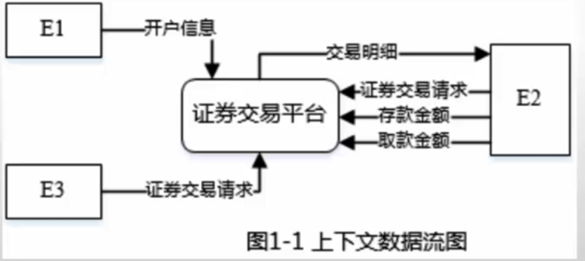
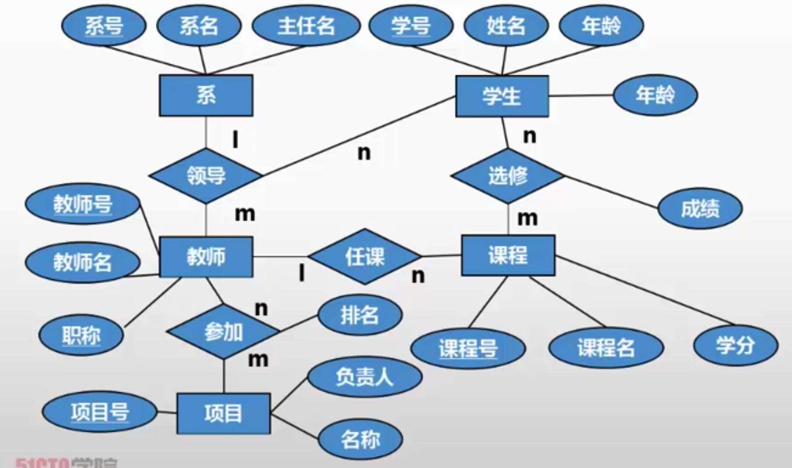
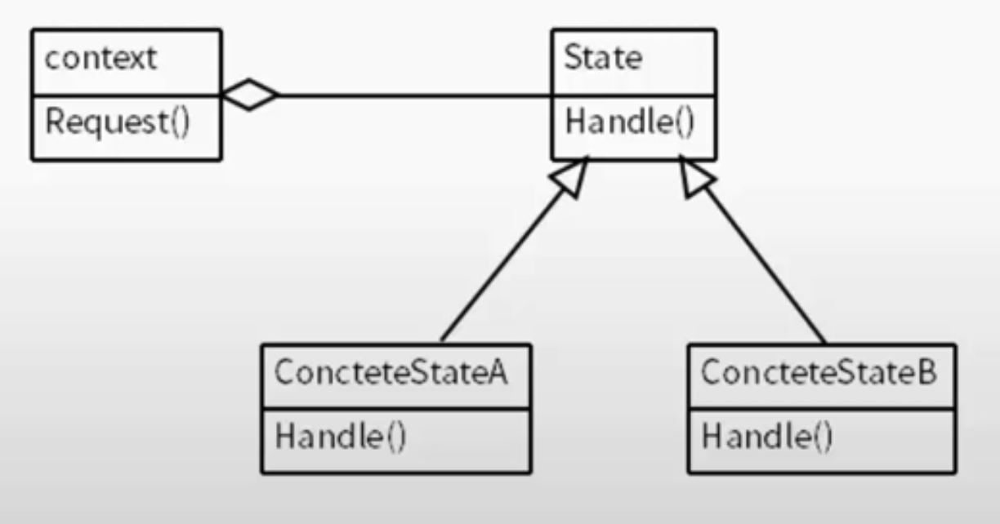

## 考题类型

| 题号  | 考题类型 | 考试内容                                                     |
| ----- | -------- | ------------------------------------------------------------ |
| 试题1 | 必答题   | 数据流图。实体与存储名称、补充缺失数据流、数据流图基本概念。 |
| 试题2 | 必答题   | 数据库E-R图。实体联系、关系模式、主键外键、数据库基础知识。  |
| 试题3 | 必答题   | UML建模。用例图、类图。                                      |
| 试题4 | 必答题   | C语言算法。查找与排序算法、分治法、贪心法、动态规划法、回溯法等。 |
| 试题5 | 选答题   | C++程序语言设计。C++基本语法与设计模式。                     |
| 试题6 | 选答题   | Java程序语言设计。Java基本语法与设计模式。                   |

## 数据流图


### 典型真题

某证券交易所为了方便提供证券交易服务，欲开发一证券交易平台，该平台的主要功能如下：

（1）开户。根据客户服务助理提交的开户信息，进行开户，并将客户信息存入客户记录中，账户信息（余额等）存入账户记录中；

（2）存款。客户可以向其账户中存款，根据存款金额修改账户余额；

（3）取款。客户可以从其账户中取款，根据取款金额修改账户余额；

（4）证券交易。客户和经纪人均可以进行证券交易（客户通过在线方式，经纪人通过电话），将交易信息存入交易记录中；

（5）检查交易。平台从交易记录中读取交易信息，将交易明细返回给客户。

现采用结构化方法对该证券交易平台进行分析与设计，获得如图1-1所示的上下文数据流图和图1-2所示的0层数据流图。




【问题1】（3分）使用说明中的词语，给出图1-1中的实体E1-E3的名称。

客户服务助理    客户    经纪人

【问题2】（3分）使用说明中的词语，给出图1-2中的数据存储D1-D3的名称。

客户记录    账户记录     交易记录

【问题3】（4分）根据说明和图中的术语，补充图1-2中缺失的数据流及其起点和终点。

**1.父子平衡，就是父图有的数据流子图也要有。**

**2.子图中加工一定有输入和输出。**

数据流名称：修改账户余额，起点：存款，终点：D2。

数据流名称：修改账户余额，起点：取款，终点：D2。

数据流名称：交易信息存入交易记录（在线），起点：证券交易（在线），终点：D3。

数据流名称：交易信息存入交易记录（电话），起点：证券交易（电话），终点：D3。

【问题4】（5分）实际的证券交易通常是在证券交易中心完成的，因此，该平台的“证券交易”功能需将交易信息传递给证券交易中心。针对这个功能需求，需要对图1-1和图1-2进行哪些修改，请用200字以内的文字加以说明。

增加一个外部实体，实体之间只能通过加工进行交互。

图1-1增加外部实体“证券交易中心”，增加“证券交易平台”到“证券交易中心”，数据流：交易信息

图1-2增加外部实体“证券交易中心”，增加“证券交易（在线）“到“证券交易中心”，数据流：交易信息

图1-2增加“证券交易（电话）“到“证券交易中心”，数据流：交易信息

## E-R图



菱形：指的实体之间的关系

矩形：指的实体

### 关系模型


### 典型真题

【说明】

M集团拥有多个分公司，为了方便集团公司对各个分公司职员进行有效管理，集团公司决定构建一个信息平台以满足公司各项业务管理需求。

【需求分析】

1、分公司关系模式需要记录的信息包括公司编号、名称、经理号、可联系地址和电话。分公司编号唯一标记分公司关系模式中的每一个元组，每个分公司各有一名经理，负责分公司的管理工作，每个分公司设立仅为本分公司服务的多个业务部，业务部包括：研发部、财务部、采购部、交易部等。

2、业务部关系模式需要记录的信息包括业务部的编号、名称、地址、电话和分公司编号，业务部编号唯一标记分公司关系模式中的每一个元素，每个业务部各有一名主管负责业务部的管理工作，每个业务部有多名职员，每个职员只能来源于一个业务部。

3、职员关系模式需要记录的信息包括职员号、姓名、所属业务部编号、岗位、电话、家庭成员姓名和成员关系。其中职员号唯一标记职员关系，岗位包括：经理、主管、研发员、业务员等。


【问题1】（4分）根据问题描述，补充4个联系，完善图2-1的实体联系图，联系名可用联系1、联系2、联系3和联系4代替，联系的类型为1：1、！：n和m：n（或1：1、1：*和*：*）

【问题2】（3分）根据题意将以上关系模式中的空（a）~～（c）的属性补充完整，并填入对应位置。

分公司（分公司编号、名称、（a）、联系地址）

业务部（业务部编号、名称、（b）、电话）

职员（职员号、姓名、岗位、（c）、电话、家庭成员姓名、关系）


【问题3】（4分）（1）分析分公司关系模式的主建和外键（2）分析业务部关系模式的主建和外键


【问题4】（4分）在职员关系模式中，假设每个职员有多名家庭成员，那么职员关系模式存在什么问题？应如何解决？完整性约束就是主键和外键？

## UML建模

### 用例图

用例图是指由参与者（Actor）、用例（Use Case），**边界**以及它们之间的**关系**构成的用于描述系统功能的视图。

用例图（User Case ）是外部用户（被称为参与者）所能观察到的系统功能的模型图。用例图是系统的蓝图，用于需求分析阶段。


#### **关联关系**

**定义：**参与者与用例之间通常用关联关系来描述。

**表示方法：**带箭头的实线，箭头指向用例。

关联是参与者与业务用例之间的关系。它表明参与者可以使用业务系统的功能。


#### 扩展关系 extend

**定义：**是把新行为插入到已有用例的方法。

人感觉可以叫做特殊情况处理。比如去食堂用饭卡打饭，绝大部分人是刷卡，拿饭，两个步骤就完成了。但是如果某个学生的饭卡里没钱了，假定不用现金或者借钱或者赊账等等其他的方式来打饭，而是必须用自己的饭卡来打饭。那么他就要先去给饭卡充值。“饭卡充值”就是“刷卡”的一个扩展用例。“饭卡充值”与“刷卡”就是扩展关系。

 **表示方法：**虚线箭头+<<extend>>字样，箭头指向**被扩展**的用例（即基础用例）。

#### **包含关系**

 **定义：**其中一个用例（基础用例）的行为包含了另一个用例（包含用例）的行为。基础用例可以看到包含用例，并依赖于包含用例的执行结果。但是二者不能访问对方的属性。

**表示方法：**虚线箭头+<<include>>字样，箭头指向**被包含**的用例。

在 UML 建模中，**包含**关系是一种关系，其中一个用例（基本用例）包含另一个用例（包含用例）的功能。包含关系支持用例模型中功能的重用。

#### 泛化关系

  **定义：**一个用例可以被特别列举为一个或多个子用例，这被称为用例泛化。

**泛化**关系是一个模型元素（子）基于另一个模型元素（父）的关系。泛化关系用于类图、组件图、部署图和用例图中，表示子元素接受父元素中定义的所有属性、操作和关系。

子用例从父用例处继承行为和属性，还可以添加行为或覆盖、改变已继承的行为。

包含与扩展的区别。在扩展关系中，基础用例没有扩展也是完整的，而在包含关系中，基础用例依赖于包含用例的执行结果。

**总结：**

所有的箭头指向都是**“被”**的一端。

找关系，是一件挺复杂的事儿。从不同的角度看会有不同的结果。找到大前提，再理顺特定环境下的关系，会更加顺手。

### 类图

类的分类：

实体类：实体类对应系统需求中的每个实体，它们通常需要保存在永久存储体中，一般使用数据库表或文件来记录，实体类既包括存储和传递数据的类，还包括操作数据的类。实体类来源于需求说明中的名词，如学生、商品等。

控制类：控制类用于体现应用程序的执行逻辑，提供相应的业务操作，将控制类抽象出来可以降低界面和数据库之间的耦合度。控制类用于对一个或几个用例所特有的控制行为进行建模。控制对象（控制类的实例）通常控制其他对象，因此它们的行为具有协调性质。控制类将用例的特有行为进行封装

边界类：边界类用于对外部用户与系统之间的交互对象进行抽象，主要包括界面类，如对话框、窗口、菜单等。


### 典型真题

【说明】

某图书公司欲开发一个基于 Web 的书籍销售系统，为顾客（Customer）提供在线购买书籍（Books）的功能，同时对公司书籍的库存及销售情况进行管理。系统的主要功能描述如下：

1.首次使用系统时，顾客需要在系统中注册（Register detail）。顾客填写注册信息表要求的信息，包括姓名（name）、收货地址（address）、电子邮箱（email）等，系统将为其生成一个注册码。

2.注册成功的顾客可以登录系统在线购买书籍（Buy books）。购买时可以浏览书籍信息，包括书名（title）、作者（author）、内容简介（introduction）等。如果某种书籍的库存量为0，那么顾客无法查询到该书籍的信息。顾客选择所需购买的书籍及购买数量（quantities），若购买数量超过库存量，提示库存不足；若购买数量小于库存量，系统将显示验证界面，要求顾客输入注册码。注册码验证正确后，自动生成订单（Order），否则，提示验证错误。如果顾客需要，可以选择打印订单（Printorder）。

3.派送人员（Dispatcher）每天早晨从系统中获取当日的派送列表信息（Produce picklist），按 照收货地址派送顾客订购的书籍。

4.用于销售的书籍由公司的采购人员（Buyer）进行采购（Reorderbooks）。采购人员每天从 系统中获取库存量低于再次订购量的书籍信息，对这些书籍进行再次购买，以保证充足的库存量。新书籍到货时，采购人员向在线销售目录（Catalog）中添加新的书籍信息（Addbooks）。

5.采购人员裉据书籍的销售情况，对销量较低的书籍设置折扣或促销活动(Promote books).

6.当新书籍到货时，仓库管理员（Warehouseman）接收书籍，更新库存(Update stock).


【问题1】（6分）

根据说明中的描述，给出图 3-1中A1-A3所对应的参与者名称和 U1-U3处所对应的用例名称。

参与者都是名词

U1-U3 都是动宾短语

【问题2】（6分）

根据说明中的描述，给出图3-1中用例U3的用例描述。（用例描述中必须包括基本事 件流和所有的备选事件流）。

参与者：顾客（Customer）

基本事件流：

1. 顾客登录系统
2. 顾客浏览书籍信息
3. 系统检测书籍的库存量
4. 顾客选择购买的书籍及购买数量
5. 系统检测购买数量
6. 系统显示验证界面
7. 顾客输入注册码
8. 系统生成订单

备选事件流：

如果书籍库存量为O，顾客无法查询到该书籍的信息

若购买数量超过库存量，提示库存量不足

如果注册码验证错误，提示验证错误

如果顾客需要，可以选择打印订单

【问题3】（3分）

根据说明中的描述，给出图3-2中C1-C3 所对应的类名。

## 算法设计

四大算法+排序和查找

时间复杂度，什么算法，小例子的结构。

### 典型真题

#### 插入排序

直接插入排序是一种简单的排序方法，具体做法是：在插入第i个关键码时，k1，k2，…，ki-1已经排好序，这时将关键码ki依次与关键码ki-l，ki-2，⋯，进行比较，找到ki应该插入的位置时停下来，将插入位置及其后的关键码依次向后移动，然后插入ki。

例如，对 ｛17，392，68，36｝按升序作直接插入排序时，过程如下：

第1次：将392（i=1）插入有序子序列｛7｝，得到｛7，392｝；

第2次：将68（i=2）插入有序子序列｛7，392｝，得到｛17，68，392｝；

第3次：将36（i=3）插入有序子序列｛7，68，392｝，得到｛17，36，68，392｝，完成排序。

下面函数insertSort用直接插入排序对整数序列进行升序排列，在main函数中调用insertSort并输出排序结果。

```
void insert Sort（int datal,int n）
用直接插入排序法将data［0］~ datafn-11中的n个整数进行升序排列”｛ int i
int tmp;
for（i=1;isn;i++X
if（datalil < datal-11） 〈//将data［插入有序子序列data［0］~datali-1］
tmp=data(i];
1/备份待插入的元素
data[i)= (1);
forlj=i-2j>=0 && data0l>tmp:j-）
/直找插入位置并将元素后移
（2）；
_(3) =tmp;
1插入正确位置
V*if*/
y*for*/
*insertSort*/
```

#### 希尔排序

希尔排序算法又称最小增量排序算法，其基本思想是：

步骤工：枸造一个步长序列deltal、deltaz…、deltak，其中deltaL=N/2，后面的每个delta是前一个的L/2，deltak=1；

步骤2：根据步长序列、进行k趟排序；

步骤3：对第i趟排序，根据对应的步长delta，将等步长位置元素分组，对同一组内元素在原位置上进行直接插入排序。

#### 简单选择

对n个元素进行简单选择排序的基本方法是：第一趟从第1个元素开始，在n个元素中选出最小者，将其交换至第一个位置，第二趟从第2个元素开始，“在剩下的n-1个元素中选出最小者，将其交换至第二个位置，依此类推，第i趟从n-i+1个元素中选出最小元素，将其交换至第i个位置，通过n-1趟选择最终得到非递减排序的有序序列。

```c
#include <stdio.h>
void selectSort(int data[ ],int n)
1/对 duard0）-dardla-J中的』个監数按非逮可有序的方式进行排列｛
intij,k.
int temp;
fon(i=0j<n-1,i++){
fork=ij=i+1： （1）：（2））/k表示 datalil-data［n-1］中最小元素的下标
if（datali］<dab［k）（3）
ifk=）
1将本趟找出的最小元素与data［］交换
temp=data[i): (4) ;
data[k]-temp;
｝
}
}
```

#### 二分查找

当数组中的元素已经排列有序时，可以采用折半查找（二分查挽入法查找一个元素。下面的函数biSearch（int rO，intlow,int high,int key）用非递归方式在数组r中进行二分查找，函数biSearch_rec（int r］，int low,int high,Int key）采用递归方式在数组r中进行二分查找，函数的返回值都为所找到元素的下标；若找不到，则返回-1。

## 设计模式

### 定义类

接口类

抽象类

接口类中的函数定义可以通过代码判断

### 设计类

填写函数体，通常以调用的形式出现。

可通过程序或说明或类图中找到。

- 接口interface用implements实现；抽象类abstract class用extends继承。
- 抽象类中可以有普通方法（有函数体），也可以有抽象方法（无函数体，方法前要加关键字abstract），接口中的方法默认为抽象方法，因此无需加关键标识。
- this用来指代当前对象，一般有两个重名变量的赋值时会使用到，如在构造函数中，局部变量和成员变量名相同都为name，就要使
   \#this name=name
- 调用父类的方法用super。
- 认真看类图，类图中可以看到类之间的关系以及类中的方法。

### 策略模式

定义一系列的算法，把它们一个个封装起来，并且使它们可以相互替换。此模式使得算法可以独立于使用它们的客户而变化。


- Strategy（策略）定义所有支持的算法的公共接口。Context 使用这个接口来调用某 ConcreteStrategy 定义的算法。
- ConcreteStrategy（具体策略）以 Strategy 接口实现某具体算法。
- Context（上下文）用一个 ConcreteStrategy对象来配置；维护一个对Strategy对象的引用；可定义一个接口来让 Strategy访问它的数据。

#### 典型真题

某软件公司欲开发一款汽车竞速类游戏，需要模拟长轮胎和短轮胎急刹车时在路面上留 下的不同痕迹，并考虑后续能模拟更多种轮胎急刹车时的痕迹。现采用策略（Strategy）设计模式来实现该需求，所设计的类图如图5-1所示。


```java
import java.util.*;
interface BrakeBehavior{
	public void stop()abstract class Car{
protected (2)
(2) wheel;
public void brake0{ (3)}
/*其余代码省略*/
}
class Short WheelCar extends Car {
public Short WheelCar (BrakeBehavior behavior){
（4）
}
/*其余代码省略*/
｝；
	/*其余代码省略*/
｝
class LongWheelBrake implements BrakeBehavior{
	public void stop() ｛System.out.printhn（“模拟长轮胎刹车痕迹！”）：｝
	/*其余代码省略*/
}
class ShortWheelBrake implements BrakeBehavior {
	public void stop()｛System.out.printh（"模拟短轮胎刹车痕迹！”）：｝
	/*其余代码省略*/
｝

abstract class Car{
protected (2)
(2) wheel;
public void brake0{ (3)}
/*其余代码省略*/
}
class Short WheelCar extends Car {
public Short WheelCar (BrakeBehavior behavior){
（4）
}
/*其余代码省略*/
｝

class Strategy Test {
public static void main(String[]args){
BrakeBehaviorbrake =new Short WheelBrake;
Short WheelCar car L= new ShortWheelCar(brake);
cạt.(5);
}
```

某大型购物中心欲开发一套收银软件，要求其能够支持购物中心在不同时期推出的各种促销活动，如打折、返利（例如，满300返100）等等。现采用策略（Strategy）模式实现该要求，得到如图6-1所示的类图。


```java
import java. util.*;
enum TYPE {NORMAL, CASH_DISCOUNT, CASH_RETURN};
interface CashSuper {
public(1)_；
}
class CashNormal implements CashSuper{
public double accptCash(double money){
return money;
1 正常收费子类
}
｝
class CashDiscount implements CashSuper {
private double moneyDiscount;
public CashDiscount(double moneyDiscount) {
this moneyDiscount = moneyDiscount;
1/ 折扣率
｝
public double acceptCash(double money) {
return money* moneyDiscount;
}
}
```

### 观察者模式

观察者模式定义了对象间的一种一对多依赖关系，使得每当一个对象改变状态，则所有依赖于它的对象都会得到通知并被自动更新。


观察者模式由抽象主题、具体主题、抽象观察者、具体观察者等组成。

（1）抽象主题（Subject）：将全体观察者对象的引用存入至某一个列表中，提供某一接口用于添加或删除观察者对象。

（2）具体主题（ConcreteSubject）：实现抽象主题中的通知方法，当具体主题的内部状态发生改变时，通知所有注册过的观察者对象。

（3）抽象观察者（Observer）：定义某一类接口帮助全体具体观察者，获取更新通知。

（4）具体观察者（Concrete Observer）：抽象观察者的实现，以便在得到目标的更改通知时更新自身的状态。

#### 典型案例

某实验室欲建立一个实验室环境监测系统，能够显示实验室的温度、湿度以及洁净度等环境数据。当获取到最新的环境测量数据时，显示的环境数据能够更新。现在采用观察者（observer）模式来开发该系统，观察者模式的类图如下图所示。


```java
import java.util.*;
interface Observer {
	public void update(float temp, float humidity, float cleanness);
}
interface Subject {
	public void registerObserver（Observer o);  //注册对主题感兴趣的观察者
	public void removeObserver(Observer 0);  //删除观察者
	public void notify Observers();  //当主题发生变化时通知观察者
｝

class EnvironmentData implements (1){
	private ArrayList observers;
	private float temperature, humidity, cleanness;
	public EnvironmentData { observers = new ArrayListO; }
	public void register Observer(Observer 0) {observers.add(0); } 			public void removeObserver(Observer o) ｛/* 代码省略*/｝
	public void notify Observers0 {
		for (int i = 0; i < observers.size; i++) {
		Observer observer = (Observer)observers.geti);
		(2)
	｝
}

public void measurementsChanged { (3) }
public void setMeasurements(float temperature, float humidity, float cleanness) {
	this.temperature = temperature;
	this.humidity = humidity;
	this.cleanness = cleanness;
 	4 _;
	}
}
  
  
class CurrentConditionsDisplay implements _ {
  private float temperature:
  private float humidity; 
  private float cleanness; 
  private Subject envData:
	public CurrentConditionsDisplay(Subject envData) {
		this.envData = envData;
		envData.registerObserver(this);
	｝
｝
```

### 状态模式

允许一个对象在其内部状态改变时改变它的行为。对象看起来似乎修改了它的类。



- Context（上下文）定义客户感兴趣的接口，维护一个ConcreteState子类的实例，这个实例定义当前状态。
- State（状态）定义一个接口以封装与 Context 的一个特定状态相关的行为。
- ConcreteState（具体状态子类）指每个子类实现与 Context的一个状态相关的行为。

#### 典型案例

某大型商场内安装了多个简易的纸巾售卖机，自动出售2元钱一包的纸巾，且每次仅售出一包纸巾。纸巾售卖机的状态图如图6-1所示。

采用状态（State）模式来实现该纸巾售卖机，得到如图6-2所示的类图。其中类State

为抽象类，定义了投币、退币、出纸巾等方法接口。类SoldState、SoldOutState、NoQuarterState和HasQuarterState分别对应图6-1中纸巾售卖机的4种状态：售出纸巾、纸巾售完、没有投币、有2元钱。


```java
import java. util.*;
interface State {
	public void insertQuarter（）；//投
  public void ejectQuarter（）；//退币
  public void turnCrank（）；//按下“出纸巾“按钮
  public void dispense（）；//出纸巾
}

class TissueMachine {
(1) soldOutState noQuarterState, hasQuarterState, soldState, state;
	state = soldOutState;
	int count = 0；/纸巾数
	public TissueMachine（int numbers） ｛ * 实现代码省略*/｝
	public State getHasQuarterState() { return hasQuarterState; } 
  public State getNoQuarterState() { return noQuarterState; } 
  public State getSoldState() { return soldState; } 
  public State getSoldOutState() { return soldOutState; } 
  public int getCount() { return count; }
｝
  
class NoQuarterState implements State {
	TissueMachine tissueMachine;
	public void insertQuarter（）
	tissueMachine.setState( (2) );
	｝
｝

class HasQuarterState implements State {
	TissueMachine tissueMachine;
	public void ejectQuarter() {
		tissueMachine.setState( (3) );
	｝
｝
    
```

某航空公司的会员积分系统将其会员划分为：普卡（Basic）、银卡（Silver）和金卡（Gold）三个等级。非会员（NonMember）可以申请成为普卡会员。会员的等级根据其一年内累积的里程数进行调整。描述会员等级调整的状态图如图6-1所示。现采用状态（State）模式实现上述场景，得到如图6-2所示的类图。


```java
import java.util.*;
abstract class CState
{
  public int fly Miles; //里程数
	publie ()；   //根据累积里程数调整会员等级
}

class CNoCustomer extends Cstate/非会员｛
	public double travel(int miles, FrequentFlyer context)
	{
	System.out. printin("Your travel will not account for points"); 		return miles;//不累积里程数
	}
}

class FrequentFlyer
{
	CState state; double flyMiles;
	public FrequentFlyer
	{
		state = new CNoCustomer0;
		flyMiles = 0;
		setState(state);
	}
	public void setState(CState state) {this.state = state;}
	public void travel(int miles)
	{
		double bonus Miles = state. travel(miles, this);
		flyMiles = flyMiles + bonusMiles;
	}
}

```

### 建造者模式

将一个复杂的对象的构建与它的表示分离，使得同样的构建过程可以创建不同的表示。


- Builder：抽象建造者。它声明为创建一个Product对象的各个部件指定的抽象接口。
- ConcreteBuilder：具体建造者。实现抽象接口，构建和装配各个部件。
- Director：指挥者。构建一个使用Builder接口的对象。它主要是用于创建一个复杂的对象，它主要有两个作用，一是：隔离了客户与对象的生产过程，二是：负责控制产品对象的生产过程。
- Product：产品角色。一个具体的产品对象。

#### 典型案例

某快餐厅主要制作并出售儿童套餐，一般包括主餐（各类比萨）、饮料和玩具，其餐品种类可能不同，但其制作过程相同。前台服务员（Waiter） 调度厨师制作套餐。现采用生成器（Builder） 模式实现制作过程，得到如图6-1所示的类图。


```java
class Pizza {
	private String parts; 
	public void setParts(String parts) { this. parts = parts;}
	public String toString) {return this. parts;}
｝
abstract class PizzaBuilder {
	protected Pizza pizza;
	public Pizza getPizza() { return pizza;}
	public void createNewPizza() ( pizza = new Pizza(); }
	public ? ;
｝
                                
class HawaiianPizzaBuilder extends PizzaBuilder{
}
public void buildParts) ( pizza.setParts("cross + mildthamkpineapple");}:
                         
class SpicyPizzaBuilder extends PizzaBuilder {
	public void buildParts ( pizza.setParts( "pan baked + hot +" +"peppergni&salami")); 
 }
}     
           
```

### 桥接模式

将抽象部分与它的实现部分分离，使它们都可以独立地变化。


- Abstraction 定义抽象类的接口，维护一个指向Implementor类型对象的指针。
   RefinedAbstraction 扩充由 Abstraction 定义的接口。
- Implementor 定义实现类的接口，该接口不一定要与 Abstraction 的接口完全一致；事实上这两个接口可以完全不同。一般来说，Implementor接口仅提供基本操作，而 Abstraction 定义了基于这些基本操作的较高层次的操作。
- Concretelmplementor 实现 Implementor 接口并定义它的具体实现。

#### 典型案例

某图像预览程序要求能够查看 BMP、JPEG 和GIF 三种格式的文件，且能够在 Windows 和 Linux两种操作系统上运行。程序需具有较好的扩展性以支持新的文件格式和操作系统。为满足上述需求并减少所需生成的子类数目，现采用桥接（Bridge）模式进行设计，得到如图6.1所示的类图。


```java
import java. util. *;
class Matrix｛ //各种格式的文件最终都被转化为像素矩阵
//此处代码省略
};

abstract class Implementor {
	public（1）_;  //显示像素矩阵m
｝；
  
class WinImp extends Implementor{
		public void doPaint （Matrix m） ｛ 
    /*调用 Windows 系统的绘制函数绘制像素矩阵*/
    ｝
};
  
class LinuxImp extends Implementor{
	public void doPaint （Matrix m） ｛
    /*调用 Linux 系统的绘制函数绘制像素矩阵*/
    ｝
};
  
abstract class Image {
	public void setImp (Implementor imp){ this. imp = imp; }
	public abstract void parseFile(String fileName);
	protected Implementor imp;
};
  
class BMPImage extends Image{
//此处代码省略
} ;
  
class GIFImage extends Image{
	public void parseFile(String fileName) {
	//此处解析GIF 文件并获得一个像素矩阵对象 m
	(2)__；//显示像素矩阵 m
	}
};

class JPEGImage extends Image{
//此处代码省略
};
```


### 装饰器模型

动态地给一个对象添加一些额外的职责。就扩展功能而言，Decorator模式比生成子类方式更为灵活.


- Component定义一个对象接口，可以给这些对象动态地添加职费。

- ConcreteComponent 定义一个对象，可以给这个对象添加一些职责。
- Decorator 维持一个指向 Component 对象的指针，并定义一个与 Component 接口一致的接口。
- ConcreteDecorator 向组件添加职责。

#### 典型案例

某发票（Invoice）由抬头：（Head）部分、正文部分和脚注（Foot）部分构成。现采用装饰（Decorator）模式实现打印发票的功能，得到如图6-1所示的类图。


```java
import java.io.*;
class Invoice {
	public void printinvoice01
	System.out printin ("This is the content of the invoice!");
	}
}

class Decorator extends Invoice {
	protected Invoice ticket;
	public Decorator(Invoice t){
		ticket =t;
	}
	public void printinvoice0{
		if(ticket l= null)
			(1);
	}
}

class HeadDecorator extends Decorator{
	public HeadDecorator(Invoice t){
		super(t);
	}
	public void printInvoice O{
		System.out.printIn("This is the header of the invoice! "); 				super.printInvoice(
		}
}
```

